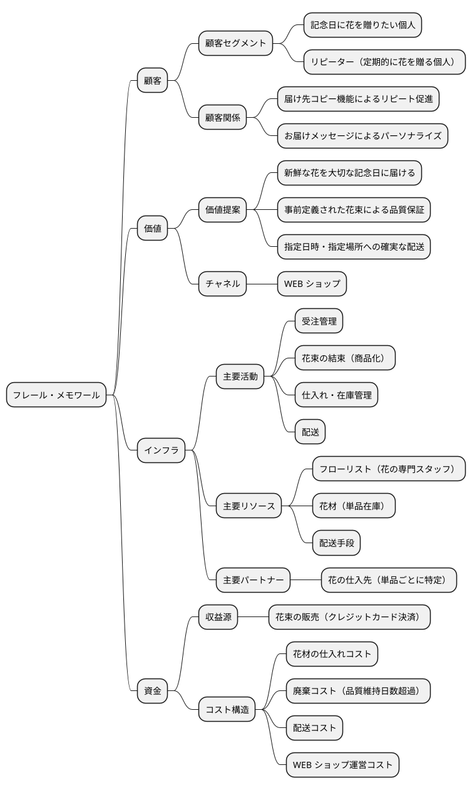
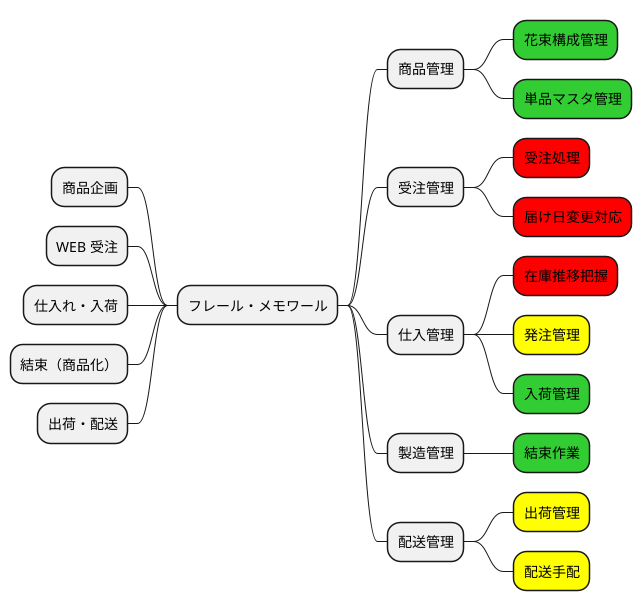
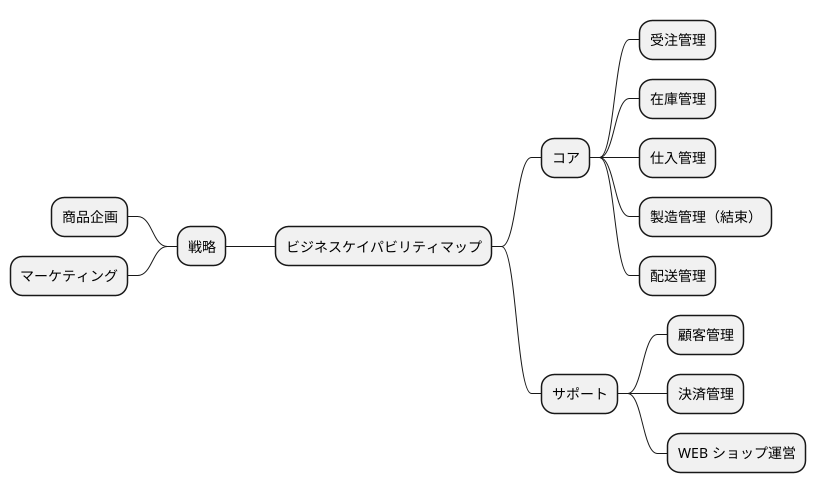
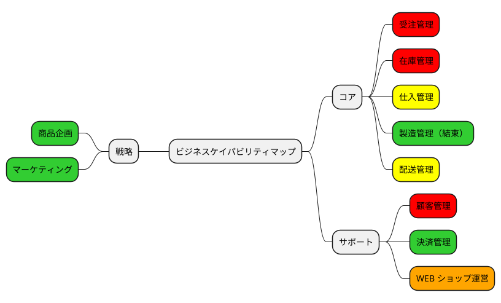
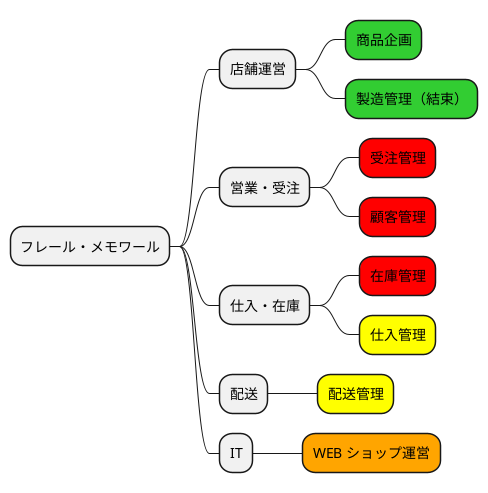
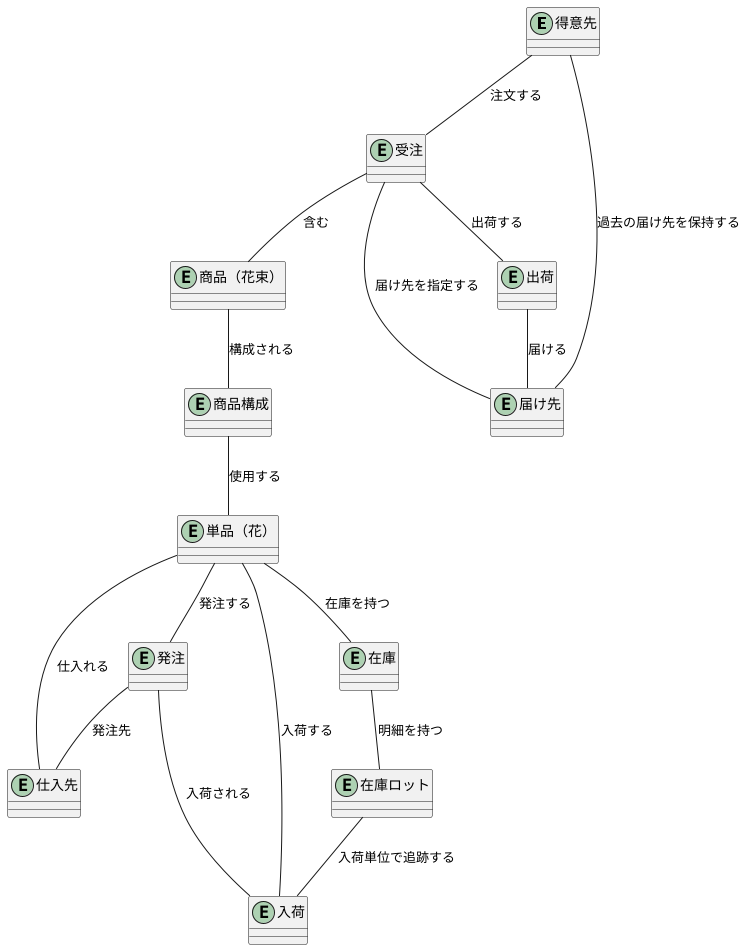
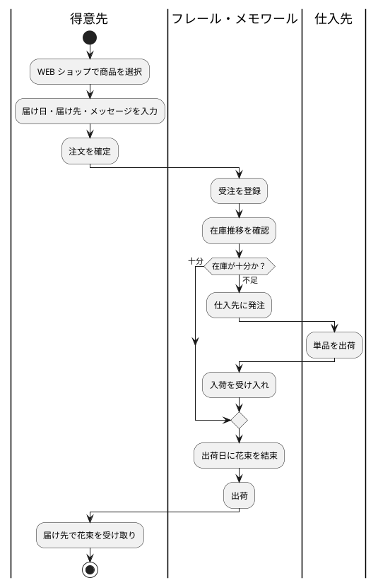
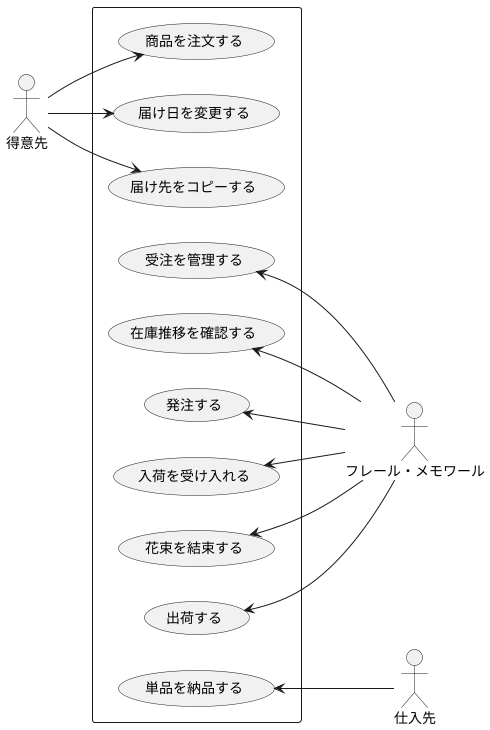

# ビジネスアーキテクチャ - フラワーショップ「フレール・メモワール」

## プリンシプル

### ガイディングプリンシプル

| カテゴリ | プリンシプル | 説明 |
| :--- | :--- | :--- |
| ビジネスアーキテクチャ | 鮮度ファースト | 「新鮮な花を大切な記念日に」をすべてのビジネス判断の基軸とする |
| アプリケーションアーキテクチャ | シンプルな業務フロー | 手作業の限界を解消し、業務を効率化するアプリケーションを構築する |
| データアーキテクチャ | 在庫の可視化 | 品質維持日数を考慮した在庫推移をリアルタイムに把握できるデータ構造を維持する |
| テクノロジーアーキテクチャ | WEB ファースト | 個人顧客が利用しやすい WEB ベースのシステムを基盤とする |

### ビジネスプリンシプル

| # | プリンシプル | 説明 | 根拠 |
| :--- | :--- | :--- | :--- |
| 1 | 廃棄ロス最小化 | 在庫の廃棄を最小限に抑え、利益率を改善する | 過度な在庫廃棄が利益を圧迫している現状の課題 |
| 2 | リピーター重視 | 個人顧客との長期的な関係構築を優先する | 記念日需要はリピート性が高く、顧客生涯価値が大きい |
| 3 | 届け日厳守 | 指定された届け日に確実に届けることを最優先とする | 記念日に届かないことは顧客にとって致命的な体験損失となる |
| 4 | 人間判断の尊重 | 発注判断は人間が行い、システムは判断材料を提供する | 花の品質や季節性など、数値化しにくい要素が発注判断に影響する |

## ビジネスモデル

### ビジネスモデルキャンバス

## バリューストリーム

### バリューストリームマップ

※ 色はヒートマッピングと同一の成熟度基準に基づく（グリーン = 成熟度高、レッド = 成熟度低、イエロー = 成熟度中）

### バリューストリーム詳細

| ステージ | 説明 | 提供価値 | 関連ケイパビリティ |
| :--- | :--- | :--- | :--- |
| 商品企画 | 花束の組合せを事前に商品として定義 | 品質が保証された花束ラインナップ | 花束構成管理、単品マスタ管理 |
| WEB 受注 | 顧客が WEB ショップから花束を注文し、クレジットカードで決済する | 手軽に記念日の花束を注文・決済できる体験 | 受注処理、届け日変更対応、決済管理 |
| 仕入れ・入荷 | 在庫推移を確認し、必要な単品を仕入先に発注 | 必要な花材が必要なタイミングで揃う | 在庫推移把握、発注管理、入荷管理 |
| 結束（商品化） | 出荷日当日に花材から花束を組み立てる | 新鮮な状態で商品化された花束 | 結束作業 |
| 出荷・配送 | 届け日の前日に出荷し、届け先に届ける | 指定日に指定場所へ確実に届く花束 | 出荷管理、配送手配 |

## ビジネスケイパビリティ

### ビジネスケイパビリティマップ

### ヒートマッピング

- グリーン：成熟度高（現状で問題なく機能）
- イエロー：成熟度中（改善の余地あり）
- レッド：成熟度低（手作業の限界に達しており、システム化が急務）
- オレンジ：新規に必要（WEB ショップとして新たに構築が必要）

### ケイパビリティ階層化

| レベル | ケイパビリティ | 分類 | 成熟度 | 説明 |
| :--- | :--- | :--- | :--- | :--- |
| L1 | 商品企画 | 戦略 | 高 | 花束の組合せを商品として定義する能力 |
| L2 | 花束構成管理 | 戦略 | 高 | 商品（花束）を構成する単品と数量を管理 |
| L2 | 単品マスタ管理 | 戦略 | 高 | 単品の品質維持日数・購入単位・リードタイム等を管理 |
| L1 | 受注管理 | コア | 低 | 顧客からの注文を受け付け処理する能力 |
| L2 | 受注処理 | コア | 低 | 注文内容（届け日、届け先、メッセージ）の登録・管理 |
| L2 | 届け日変更対応 | コア | 低 | 届け日変更要望の受付と出荷可否の判断・通知 |
| L1 | 在庫管理 | コア | 低 | 単品の在庫推移を把握し適切な在庫水準を維持する能力 |
| L2 | 在庫推移把握 | コア | 低 | 日別の在庫予定数を可視化 |
| L2 | 品質維持期限管理 | コア | 低 | 品質維持可能日数に基づく廃棄対象の特定 |
| L1 | 仕入管理 | コア | 中 | 仕入先への発注と入荷を管理する能力 |
| L2 | 発注管理 | コア | 中 | 在庫推移に基づく発注判断の支援 |
| L2 | 入荷管理 | コア | 中 | 入荷予定の管理と実績記録 |
| L1 | 製造管理 | コア | 高 | 花材から花束を結束する能力 |
| L1 | 配送管理 | コア | 中 | 出荷・配送を管理する能力 |
| L1 | 顧客管理 | サポート | 低 | 顧客情報と履歴を管理する能力 |
| L2 | 届け先管理 | サポート | 低 | 過去の届け先情報のコピー・再利用 |
| L1 | 決済管理 | サポート | 高 | クレジットカード事前登録による決済処理 |
| L1 | WEB ショップ運営 | サポート | 新規 | WEB 上での商品表示・注文受付の基盤 |

## 組織マップ

## 情報マップ

## ビジネスシナリオ

### シナリオ 1: 花束の注文と配送

#### 問題の定義

| 項目 | 内容 |
| :--- | :--- |
| 問題 | 受注増加に伴い手作業での受注・在庫管理が限界に達している。在庫の過不足により廃棄ロスが発生し利益を圧迫している |
| 環境 | 個人顧客向け花束配送サービス。WEB ショップでの受注。1 受注 = 1 届け先 = 1 商品。出荷日 = 届け日の前日 |
| ゴール | (1) 廃棄率（廃棄数量 / 仕入数量）を現状比 30% 削減する (2) 1 件あたりの受注処理時間を現状の 1/3 以下にする (3) リピーター注文比率を 20% 向上させる |

#### アクティビティ図

#### ユースケース図

#### アクター一覧

| 種別 | アクター | 役割 |
| :--- | :--- | :--- |
| ヒューマン | 得意先 | 花束を注文する個人顧客。届け日・届け先・メッセージを指定し、クレジットカードで決済する |
| ヒューマン | フレール・メモワール | 受注管理、在庫管理、発注判断、結束、出荷を行うショップスタッフ |
| ヒューマン | 仕入先 | 単品（花）を供給するパートナー。単品ごとに特定の仕入先が決まっている |
| コンピュータ | WEB ショップシステム | 受注受付、在庫推移表示、届け先管理、決済処理を行うシステム |
