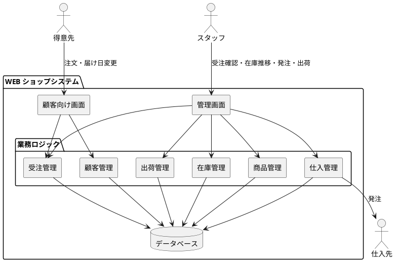
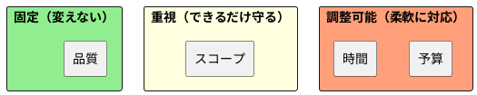
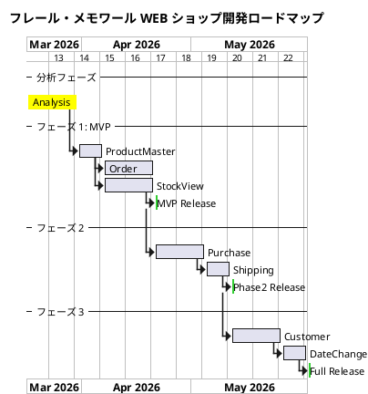

# インセプションデッキ

## 1. なぜやるのか？

フラワーショップ「フレール・メモワール」は、「新鮮な花を大切な記念日に」をコンセプトに、個人顧客向けに花束を配送する WEB ショップ事業を展開している。

現在、以下の問題が事業成長のボトルネックとなっている。

- **受注管理の限界**: 受注増加に伴い、手作業での受注管理が限界に達している。届け日変更への対応も手作業で行っており、ミスや遅延のリスクが高まっている
- **在庫廃棄による利益圧迫**: 品質維持可能日数を超えた花材の廃棄が頻発しており、利益率を大幅に低下させている。日別の在庫推移が可視化されておらず、適切な発注判断ができていない
- **顧客情報の未活用**: リピーター向けの届け先コピー機能がなく、毎回同じ情報を入力させている。リピーター重視のビジネスモデルと実態が乖離している

ケイパビリティ分析の結果、**受注管理・在庫管理・顧客管理**の 3 領域が成熟度「低」と評価され、システム化が急務と判明した。

## 2. どんなビジョンなのか？

**WEB ショップシステムを構築し、受注から出荷までの業務を効率化する。在庫推移の可視化により廃棄ロスを最小化し、リピーターが簡単に注文できる仕組みを提供する。**

このシステムにより、フレール・メモワールは「新鮮な花を大切な記念日に」というコンセプトを、ビジネスの規模に関わらず実現し続けられるようになる。

### ビジョンの柱

| 柱 | 説明 |
| :--- | :--- |
| 業務効率化 | 受注・在庫管理の手作業を WEB システムに移行し、増加する受注に対応可能にする |
| 廃棄ロス削減 | 品質維持日数を考慮した在庫推移の可視化により、最適な発注判断を支援する |
| リピーター体験向上 | 届け先コピー機能等により、リピーターが簡単に再注文できるようにする |
| 人間判断の尊重 | 発注判断は引き続き人間が行い、システムは判断材料を提供する役割に徹する |

## 3. どんな価値をもたらすのか？

### ビジネス目標

| # | 目標 | 測定指標 |
| :--- | :--- | :--- |
| 1 | 廃棄ロスの削減 | 廃棄率（廃棄数量 / 仕入数量）の低減 |
| 2 | 受注処理の効率化 | 1 件あたりの受注処理時間の短縮 |
| 3 | リピート率の向上 | リピーター注文比率の増加 |
| 4 | 届け日変更対応の迅速化 | 変更要望から対応完了までの時間短縮 |
| 5 | 受注キャパシティの拡大 | 手作業の限界を超えた受注件数の処理 |

## 4. スコープの範囲はどこか？

### スコープ内（IN）

| 優先度 | フィーチャ | 理由 |
| :--- | :--- | :--- |
| 必須 | 商品マスタ管理（花束構成・単品） | すべての業務の基盤データ |
| 必須 | WEB 受注（商品選択・届け日・届け先・メッセージ） | コア業務のシステム化 |
| 必須 | 在庫推移表示（日別の在庫予定数） | 廃棄ロス削減の要 |
| 必須 | 仕入先への発注管理 | 在庫管理と連動した仕入れの効率化 |
| 必須 | 入荷管理 | 在庫推移の正確な把握に不可欠 |
| 必須 | 出荷管理（出荷日 = 届け日の前日） | 配送業務の管理 |
| 高 | 届け日変更対応 | 顧客要望への迅速な対応 |
| 高 | 届け先コピー機能 | リピーター体験の向上 |
| 高 | 得意先管理 | リピーターの履歴管理 |

### スコープ外（OUT）

| フィーチャ | 除外理由 |
| :--- | :--- |
| 自動発注 | ビジネスプリンシプル「人間判断の尊重」に基づき、発注判断はスタッフが行う |
| 法人顧客対応 | 対象顧客は個人のみ |
| 決済処理の実装 | クレジットカード事前登録済みのため、請求処理は不要 |
| 配送ルート最適化 | 配送手配は既存の仕組みで十分 |
| マーケティング機能 | 現時点ではケイパビリティ成熟度が高く、優先度低 |

### 未決定（TBD）

| フィーチャ | 検討事項 |
| :--- | :--- |
| 品質維持期限アラート | 廃棄対象の単品を自動通知するか、在庫推移表示で十分か |
| 配送状況トラッキング | 顧客向けの配送状況通知が必要か |

## 5. 主なステークホルダーは？

| ステークホルダー | 関心事 |
| :--- | :--- |
| フレール・メモワール（経営者） | 廃棄ロスの削減、受注キャパシティの拡大、利益率の改善 |
| フレール・メモワール（受注スタッフ） | 受注処理の効率化、届け日変更対応の負荷軽減 |
| フレール・メモワール（仕入スタッフ） | 在庫推移の可視化、発注判断の精度向上 |
| フレール・メモワール（フローリスト） | 結束に必要な花材が確実に揃うこと |
| 得意先（個人顧客） | 簡単な注文体験、確実な届け日の履行、リピート注文の手軽さ |
| 仕入先 | 安定した発注、正確な納品タイミング |

## 6. 基本的な解決策はどのようなものになるか？

### 概念アーキテクチャ

### 解決策のポイント

- **顧客向け画面**: 得意先が WEB から商品を選択し、届け日・届け先・メッセージを入力して注文する
- **管理画面**: スタッフが受注一覧、在庫推移、発注管理、出荷管理を行う
- **在庫推移表示**: 品質維持日数を考慮した日別在庫予定数をグラフ等で可視化し、発注判断を支援する
- **届け先コピー機能**: 過去の注文から届け先情報をコピーし、リピート注文を簡易化する

## 7. 主なリスクは何か？

| # | リスク | 影響度 | 対策 |
| :--- | :--- | :--- | :--- |
| 1 | 在庫推移の予測精度が低く、廃棄ロス削減効果が限定的 | 高 | 品質維持日数・購入単位・リードタイムのマスタデータを正確に整備する |
| 2 | 得意先の WEB リテラシーが低く、WEB 注文が定着しない | 中 | UI をシンプルに設計し、既存の電話注文も並行して受け付ける |
| 3 | 届け日変更時に在庫が確保できず、顧客の期待を裏切る | 高 | 変更可否を在庫推移から即座に判断し、不可の場合は迅速に顧客に通知する |
| 4 | システム移行時の業務混乱 | 中 | 段階的にリリースし、既存業務との並行運用期間を設ける |
| 5 | 花の品質や季節変動など、システムで数値化しにくい要素への対応不足 | 中 | 発注判断は人間が行うことを堅持し、システムは判断材料の提供に徹する |

## 8. どのくらい作業があり、費用はいくらか？

### 作業量の見積もり

| フェーズ | 主な作業 | 規模感 |
| :--- | :--- | :--- |
| フェーズ 1（MVP） | 商品マスタ、受注、在庫推移表示 | 小〜中 |
| フェーズ 2 | 仕入管理、入荷管理、出荷管理 | 中 |
| フェーズ 3 | 届け先コピー、届け日変更、顧客管理 | 小〜中 |

### チーム構成の仮定

| 役割 | 人数 | 備考 |
| :--- | :--- | :--- |
| 開発者 | 1〜2 名 | フルスタック（バックエンド + フロントエンド） |
| プロダクトオーナー | 1 名 | フレール・メモワール経営者またはスタッフ |
| テスター | 開発者が兼任 | XP のプラクティスに従い、TDD で品質を担保 |

## 9. トレードオフにどう向き合うか？

| 要素 | 優先度 | 理由 |
| :--- | :--- | :--- |
| 品質 | 固定 | 記念日に届けるサービスのため、不具合は顧客の信頼を致命的に損なう |
| スコープ | 重視 | 廃棄ロス削減に直結する在庫推移表示は必須。ただし優先度の低い機能は後回しにできる |
| 時間 | 調整可能 | 段階的リリースにより、全機能を一度に提供する必要はない |
| 予算 | 調整可能 | 小規模チームでの XP 開発により、コストを抑制しつつ段階的に投資する |

## 10. 初回リリースが可能になるのはいつか？

### フェーズ分割とマイルストーン

### マイルストーン

| マイルストーン | 内容 | 目標時期 |
| :--- | :--- | :--- |
| MVP リリース | 商品マスタ・受注・在庫推移表示 | 分析完了後 5 週間 |
| フェーズ 2 リリース | 仕入・入荷・出荷管理 | MVP 後 3 週間 |
| 全機能リリース | 顧客管理・届け先コピー・届け日変更 | フェーズ 2 後 3 週間 |

**注記**: 上記のスケジュールは現時点での見込みであり、プロジェクトの進行に伴い調整される。XP のプラクティスに従い、イテレーションごとにフィードバックを反映して計画を更新する。
