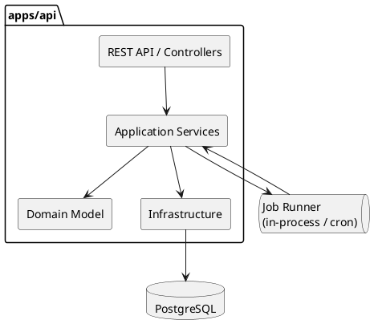
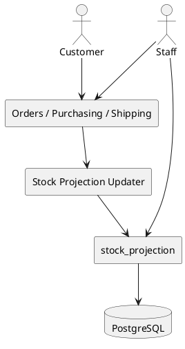

# バックエンドアーキテクチャ設計

## 1. 文書の目的

本書は、フラワーショップ「フレール・メモワール」の WEB ショップシステムにおけるバックエンドアーキテクチャ方針を定義するものです。

対象とする主な業務は以下です。

- 受注
- 在庫推移把握
- 発注
- 入荷
- 出荷準備
- 届け先の再利用
- 届け日変更

本設計では、1 〜 2 名のフルスタック開発者が XP で継続的に変更しやすいことを最優先にします。

## 2. アーキテクチャ方針

### 2.1 採用方針

**モジュラーモノリス + 4 層レイヤードアーキテクチャを基本とし、外部境界に限定してポート / アダプターを導入する構成**を採用します。

- デプロイ単位は 1 つの Node.js API アプリケーションとします
- コードベースは業務モジュール単位に分割します
- 各モジュールの内部は `presentation` / `application` / `domain` / `infrastructure` の 4 層で整理します
- データベース、バッチ、外部通知など変更されやすい境界にはポート / アダプターを置きます
- マイクロサービス分割は現時点では行いません

### 2.2 選定理由

このシステムは単純な CRUD だけではなく、以下の業務判断を含みます。

- 届け日から出荷日を算出する
- 花束構成から必要花材を展開する
- 受注、発注、入荷、出荷に応じて在庫予定を再計算する
- 品質維持日数を考慮して利用可能在庫を判断する
- 届け日変更時に変更可否を即時判定する

一方で、チーム規模は小さく、過剰な抽象化や分散構成は運用負荷を高めます。そのため、以下の判断とします。

| 論点 | 判断 |
| :--- | :--- |
| レイヤード vs ヘキサゴナル / Clean | **レイヤードを基本**にしつつ、外部境界のみヘキサゴナルの考え方を取り入れる |
| モノリス vs マイクロサービス | **モジュラーモノリス**を採用する |
| CQRS | **全面採用しない**。ただし、読み取り最適化のための在庫 projection は導入する |
| API スタイル | **REST + JSON API** を採用する |

## 3. 他案との比較

### 3.1 3 層レイヤードを採用しない理由

3 層レイヤードは実装が速い一方で、業務ロジックが Service に集中しやすく、在庫推移計算や届け日変更判定が肥大化しやすいです。

本件では、業務ルールを `domain` に寄せて保護した方が、変更を楽に安全にできます。

### 3.2 フルヘキサゴナル / Clean を採用しない理由

フルヘキサゴナル / Clean は境界を明確にしやすいですが、1 〜 2 名チームには抽象の数が増えすぎる可能性があります。

現時点では、すべての入出力をポート化するよりも、次の変化が大きい境界だけを抽象化する方が自然です。

- 永続化
- 外部通知
- スケジュール実行
- 将来的な配送連携

### 3.3 フル CQRS を採用しない理由

本システムは読み取り要求と書き込み要求の性質に差はありますが、現時点で別サービス、別データストア、非同期イベント基盤まで分ける必要はありません。

ただし、在庫推移画面は読み取り負荷と計算量が相対的に高くなるため、**コード上の Command / Query 分離**と**読み取り用 projection**は導入します。

## 4. システム構成

### 4.1 論理構成



### 4.2 推奨リポジトリ構成

```text
apps/
  api/
    src/
      modules/
        catalog/
        orders/
        customers/
        stock/
        purchasing/
        shipping/
      shared/
        application/
        domain/
        infrastructure/
      batch/
      api/
```

## 5. 業務モジュール分割

### 5.1 モジュール一覧

| モジュール | 主責務 | 主な変更要因 |
| :--- | :--- | :--- |
| `catalog` | 花束商品、商品構成、単品マスタ | 商品追加、構成変更、品質維持日数変更 |
| `orders` | 注文、届け日変更、注文状態、メッセージ | 注文フロー変更、変更受付ルール変更 |
| `customers` | 顧客、届け先履歴、再利用 | 再注文 UX 改善、顧客管理要件追加 |
| `stock` | 在庫 projection、廃棄リスク判定、引当確認 | 在庫計算ロジック変更、可視化要件追加 |
| `purchasing` | 発注、入荷、仕入先管理 | 発注判断支援、入荷フロー変更、仕入先条件変更 |
| `shipping` | 出荷対象抽出、出荷一覧、出荷状態 | 出荷締め時間、配送手配連携 |

### 5.2 モジュール間の依存

- `orders` は商品構成参照のため `catalog` に依存します
- `orders` と `purchasing` は在庫計算のため `stock` を利用します
- `shipping` は出荷対象抽出のため `orders` と `stock` を利用します
- `customers` は `orders` へ再利用候補となる届け先を提供しますが、注文確定時の届け先正本は `orders` の届け先スナップショットに保持します
- `purchasing` は `supplier` の所有コンテキストであり、`catalog` は必要に応じて仕入先 ID を参照します

**依存方向は業務上自然な流れに合わせますが、循環依存は禁止**します。

## 6. レイヤー設計

### 6.1 レイヤー責務

| レイヤー | 責務 | 例 |
| :--- | :--- | :--- |
| `presentation` | HTTP 入出力、バリデーション、レスポンス整形 | REST Controller、Request DTO |
| `application` | ユースケース実行、トランザクション境界、権限制御 | `PlaceOrderUseCase`、`ChangeOrderDateUseCase` |
| `domain` | エンティティ、値オブジェクト、ドメインサービス、業務ルール | `Order`、`ShipmentDate`、`StockProjectionService` |
| `infrastructure` | ORM / SQL、外部 API、バッチ実装、通知実装 | Repository 実装、Scheduler、Mail Adapter |

### 6.2 依存ルール

- `domain` は他レイヤーに依存しません
- `application` は `domain` のみを参照し、永続化は Repository Interface 経由で扱います
- `presentation` は `application` にのみ依存します
- `infrastructure` は `application` と `domain` の定義を実装します

## 7. API 設計方針

### 7.1 REST を採用する理由

このシステムのクライアントは顧客向け画面とスタッフ向け画面が中心であり、どちらもブラウザベースです。

REST + JSON API を採用することで、以下の利点があります。

- Node / TypeScript で実装しやすい
- 1 〜 2 名チームでも API 契約を理解しやすい
- デバッグしやすい
- 将来の画面追加やテスト自動化に向いている

GraphQL は柔軟ですが、スキーマ管理と N+1 対策の学習コストが増えます。gRPC はブラウザ中心の今回の要件には過剰です。

### 7.2 代表 API

| 区分 | エンドポイント例 | 用途 |
| :--- | :--- | :--- |
| Catalog | `GET /api/products` | 商品一覧取得 |
| Catalog | `GET /api/products/{productId}` | 商品詳細取得 |
| Orders | `POST /api/orders` | 注文確定 |
| Orders | `GET /api/orders/{orderId}` | 注文詳細取得 |
| Orders | `POST /api/orders/{orderId}/date-change-check` | 変更可否の事前判定 |
| Orders | `POST /api/orders/{orderId}/date-change` | 届け日変更確定 |
| Customers | `GET /api/customers/{customerId}/destinations` | 届け先履歴取得 |
| Stock | `GET /api/stock/projections?from=2026-03-01&to=2026-03-31` | 在庫推移取得 |
| Purchasing | `POST /api/purchase-orders` | 発注登録 |
| Purchasing | `POST /api/purchase-orders/{id}/arrivals` | 入荷記録 |
| Shipping | `GET /api/shipments?shipDate=2026-03-20` | 出荷対象一覧 |

### 7.3 API 設計ルール

- Command 系 API は業務動詞を明示します
- Query 系 API は検索条件を query parameter に寄せます
- 変更可否判定のような副作用のない業務判定は `check` / `preview` 系エンドポイントで表現します
- バックエンド内部で使う DTO と API 契約 DTO は分離します

## 8. データ整合性と在庫 projection

### 8.1 基本方針

- 書き込みの正本は 1 つのリレーショナルデータベースに集約します
- 受注、発注、入荷、出荷確定のたびに、在庫 projection を再計算または差分更新します
- トランザクションは 1 DB 内で完結させ、分散トランザクションは持ち込みません

### 8.2 CQRS の適用範囲

全面的な CQRS は採用しませんが、以下の範囲で**限定的な CQRS**を採用します。

- Command モデル
  - 受注登録
  - 届け日変更
  - 発注登録
  - 入荷記録
  - 出荷確定
- Query モデル
  - 日別在庫推移
  - 廃棄リスク一覧
  - 出荷対象一覧
  - スタッフ向け受注一覧

### 8.3 在庫 projection の考え方

在庫 projection は業務上の要となるため、専用テーブルまたは読み取り最適化ビューとして管理します。



初期フェーズでは、以下の順で実装します。

1. 同期更新で正しさを優先する
2. 必要になったら差分更新にする
3. さらに必要になったらジョブ化する

### 8.4 projection 更新整合性

- `stock_projection` の正本は取引系テーブルではなく query model です
- 注文、届け日変更、発注、入荷、出荷確定は、同一 PostgreSQL トランザクション内で影響範囲の projection を更新します
- 更新範囲は `item_id × projection_date` 単位で直列化し、同一範囲の二重更新を避けます
- 更新失敗時はコマンドをロールバックし、再計算ジョブで対象範囲を修復できるようにします

## 9. 主要ユースケースと責務配置

### 9.1 注文確定

- `orders` が注文を作成します
- `catalog` から商品構成を取得します
- `orders` は入力された届け先、または `customers` から選ばれた届け先を注文時点のスナップショットとして保持します
- `stock` が必要花材数量と出荷日ベースの在庫影響を反映します
- `shipping` が出荷準備対象の元データを持ちます

### 9.2 届け日変更

- `orders` が変更要求を受け付けます
- `stock` が旧日付と新日付で在庫影響を比較し、変更可否を返します
- 可なら `orders` が注文と出荷日を更新します
- 更新後に `stock projection` を再計算します

### 9.3 発注と入荷

- `purchasing` が発注情報と入荷予定を管理します
- `stock` は入荷予定を projection に反映します
- 入荷実績登録時に `stock` は実在庫と projection を補正します

### 9.4 出荷対象抽出

- `shipping` が対象日の出荷一覧を作成します
- `orders` の状態と `stock` の確保状況を参照します
- フローリスト向けには花束単位と必要花材内訳の双方を返します

## 10. エラーハンドリングと運用バッチ

### 10.1 エラーハンドリング

- 業務エラーは `application` で捕捉し、業務コード付きで返します
- 在庫不足、変更不可、入荷超過などは 4xx 系で返します
- システム障害は共通例外ハンドラで 5xx に変換します
- ログには `orderId`、`customerId`、`shipDate` などの相関情報を含めます

### 10.2 バッチ / 定時処理

初期段階では、複雑なイベント基盤は導入せず、以下をシンプルな cron / scheduler で運用します。

- 当日 / 翌日出荷対象の集計
- 廃棄リスク再計算
- 通知送信の再試行

## 11. テスト方針

### 11.1 テストピラミッド

- `domain` はユニットテスト中心で保護します
- `application` はユースケース単位の統合テストで保護します
- `presentation` は API 契約テストで保護します
- 在庫 projection はアーキテクチャストレスポイントとしてシナリオテストを置きます

### 11.2 優先的に守るシナリオ

- 注文確定により必要花材が正しく引き当てられること
- 届け日変更で旧日付と新日付の在庫差分が正しく反映されること
- 発注登録と入荷記録で在庫 projection が崩れないこと
- 同日多件注文でも出荷一覧と在庫 projection が矛盾しないこと

## 12. リスクと段階的実施

### 12.1 主なリスク

| リスク | 影響 | 対策 |
| :--- | :--- | :--- |
| 在庫 projection が肥大化する | 変更時の不具合が増える | 最初は同期・単純実装、テストで守りつつ段階的に最適化 |
| モジュール境界が曖昧になる | 変更影響範囲が広がる | `orders`、`stock`、`purchasing`、`shipping` の責務を先に明文化する |
| API が画面都合で崩れる | ドメイン知識が UI に漏れる | Query DTO を用意し、業務ルール判定は必ず `application` に集約する |

### 12.2 段階的実施順序

1. `catalog`、`orders`、`stock` の最小構成で MVP を作る
2. `purchasing`、`arrivals` を追加し、在庫予測精度を上げる
3. `shipping` とスタッフ向け一覧を追加する
4. `customers` と届け先再利用を強化する
5. 必要になった時点で projection 更新の非同期化を検討する

## 13. 関連 ADR

- [ADR-001: バックエンドはモジュラーモノリス + 4 層レイヤードを採用する](../adr/001-backend-modular-monolith.md)
- [ADR-002: 在庫推移は限定的 CQRS と同期 projection 更新で開始する](../adr/002-stock-projection-cqrs-boundary.md)

## 14. TBD

- 顧客認証方式とスタッフ認可方式の詳細
- 在庫 projection をテーブルで持つか、ビュー / materialized view で持つか
- 配送業者連携の有無と連携方式
- 通知チャネル（メール、SMS、管理画面通知）の優先順位
