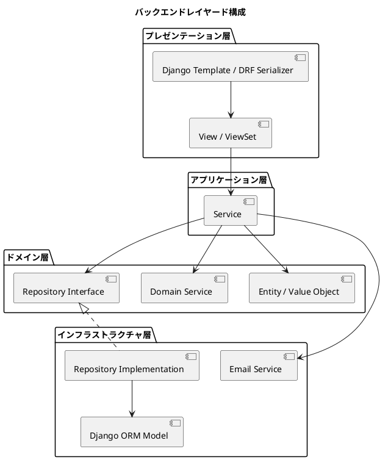
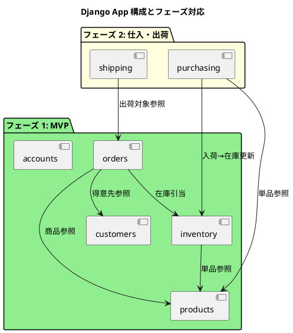
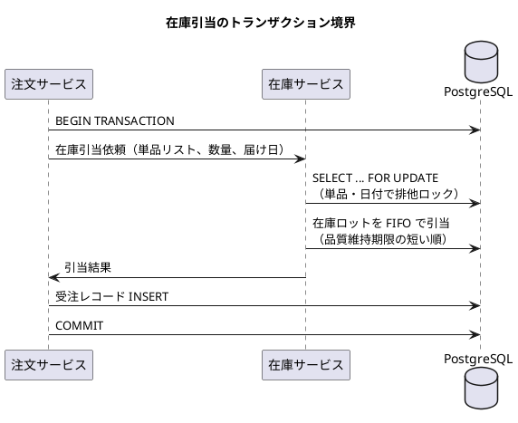
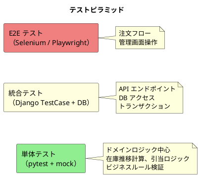

# バックエンドアーキテクチャ - フレール・メモワール WEB ショップシステム

## アーキテクチャ方針

### 選定結果

| 項目 | 選定 |
| :--- | :--- |
| 言語 | Python 3.12+ |
| フレームワーク | Django 5.x |
| アーキテクチャスタイル | モノリシック（Django MTV + ドメインモデル分離） |
| ドメインモデルパターン | ドメインモデル |
| アーキテクチャパターン | レイヤードアーキテクチャ 4 層（ヘキサゴナルの考え方を取り入れ） |
| API 方式 | Django REST Framework（REST API） |
| データベース | PostgreSQL 16 |
| テスト戦略 | ピラミッド形（単体テスト重視） |

### 選定理由

**Django を選定した理由**:

- 管理画面（Django Admin）が標準装備されており、商品マスタ・受注管理等のスタッフ向け管理機能を迅速に構築できる
- ORM が強力でマイグレーション管理が成熟しており、データモデルの段階的な進化に適している
- 認証・セッション管理が標準装備されており、得意先の認証要件をスコープ内で実現できる
- 1〜2 名の小規模チームで開発・運用可能なフルスタックフレームワーク
- テストフレームワーク（pytest-django）が充実しており、TDD で開発しやすい

**モノリシックを選定した理由**:

- 小規模チーム（1〜2 名）での開発・運用に最適
- 在庫引当のトランザクション整合性をデータベースレベルで容易に保証できる
- マイクロサービスの分散トランザクション管理の複雑さを回避
- 段階的リリース（3 フェーズ）をモノリス内の Django App 単位で実現可能

**ドメインモデルパターンの理由（選択フロー）**:

- 業務領域: 中核の業務領域（受注管理・在庫管理・仕入管理）
- 金額・監査: 扱わない（決済はスコープ外）
- → ドメインモデル + ピラミッド形テスト

## レイヤード構成



### 各層の責務

| 層 | 責務 | Django での実現 |
| :--- | :--- | :--- |
| プレゼンテーション | HTTP リクエスト/レスポンスの変換、入力バリデーション | Django Template（スタッフ向け）、DRF Serializer + View（API） |
| アプリケーション | ユースケースの実行、トランザクション管理 | Service クラス（`services.py`） |
| ドメイン | ビジネスルール、エンティティ、値オブジェクト | ドメインモデルクラス（`domain/`） |
| インフラストラクチャ | データ永続化、外部サービス連携 | Django ORM Model（`models.py`）、Repository 実装 |

### ドメイン層とインフラ層の分離

```
apps/
├── products/           # 商品管理 Django App
│   ├── domain/         # ドメイン層
│   │   ├── entities.py       # 商品、単品、商品構成エンティティ
│   │   ├── value_objects.py  # 品質維持日数、購入単位
│   │   └── repositories.py  # Repository インターフェース（ABC）
│   ├── services.py     # アプリケーション層
│   ├── models.py       # インフラ層（Django ORM）
│   ├── repositories.py # インフラ層（Repository 実装）
│   ├── views.py        # プレゼンテーション層
│   ├── serializers.py  # API シリアライザ
│   ├── admin.py        # Django Admin
│   └── tests/
│       ├── test_domain.py
│       ├── test_services.py
│       └── test_views.py
├── orders/             # 受注管理 Django App
│   ├── domain/
│   │   ├── entities.py       # 受注、届け先エンティティ
│   │   ├── value_objects.py  # 受注ステータス、届け日
│   │   └── repositories.py
│   ├── services.py
│   ├── models.py
│   ├── repositories.py
│   ├── views.py
│   ├── serializers.py
│   ├── admin.py
│   └── tests/
├── inventory/          # 在庫管理 Django App
│   ├── domain/
│   │   ├── entities.py       # 在庫、在庫ロットエンティティ
│   │   ├── value_objects.py  # 在庫ステータス、品質維持期限
│   │   ├── services.py       # 在庫推移計算ドメインサービス
│   │   └── repositories.py
│   ├── services.py           # 在庫引当アプリケーションサービス
│   ├── models.py
│   ├── repositories.py
│   ├── views.py
│   ├── serializers.py
│   ├── admin.py
│   └── tests/
├── purchasing/         # 仕入管理 Django App
│   ├── domain/
│   ├── services.py
│   ├── models.py
│   ├── views.py
│   └── tests/
├── shipping/           # 出荷管理 Django App
│   ├── domain/
│   ├── services.py
│   ├── models.py
│   ├── views.py
│   └── tests/
├── customers/          # 得意先管理 Django App
│   ├── domain/
│   ├── services.py
│   ├── models.py
│   ├── views.py
│   └── tests/
└── accounts/           # 認証 Django App
    ├── models.py       # カスタムユーザーモデル
    ├── views.py
    └── tests/
```

## Django App の分割



| Django App | フェーズ | 責務 |
| :--- | :--- | :--- |
| `accounts` | 1 | 得意先・スタッフの認証（カスタムユーザーモデル） |
| `products` | 1 | 商品（花束）、単品（花）、商品構成のマスタ管理 |
| `orders` | 1 | 受注、届け先、届け日変更、キャンセル |
| `inventory` | 1 | 在庫、在庫ロット、在庫推移計算、品質維持期限アラート |
| `customers` | 1 | 得意先情報、届け先履歴、注文履歴 |
| `purchasing` | 2 | 発注、入荷 |
| `shipping` | 2 | 出荷、出荷通知 |

## API 設計

### エンドポイント一覧

| メソッド | パス | 説明 | Django App |
| :--- | :--- | :--- | :--- |
| GET | `/api/products/` | 商品一覧 | products |
| GET | `/api/products/{id}/` | 商品詳細 | products |
| POST | `/api/orders/` | 注文作成 | orders |
| GET | `/api/orders/` | 注文履歴（得意先用） | orders |
| GET | `/api/orders/{id}/` | 注文詳細 | orders |
| PATCH | `/api/orders/{id}/delivery-date/` | 届け日変更 | orders |
| POST | `/api/orders/{id}/cancel/` | 注文キャンセル | orders |
| GET | `/api/delivery-addresses/` | 過去の届け先一覧 | customers |
| GET | `/api/inventory/forecast/` | 在庫推移（スタッフ用） | inventory |
| GET | `/api/inventory/alerts/` | 品質維持期限アラート | inventory |
| POST | `/api/purchases/` | 発注登録 | purchasing |
| POST | `/api/arrivals/` | 入荷登録 | purchasing |
| POST | `/api/shipments/` | 出荷処理 | shipping |
| POST | `/api/auth/login/` | ログイン | accounts |
| POST | `/api/auth/register/` | 新規登録 | accounts |

### 認証方式

- 得意先向け API: セッション認証（Django Session）
- スタッフ向け管理画面: Django Admin のセッション認証
- API トークン認証は将来の拡張として検討

## 在庫引当のトランザクション設計



- `SELECT ... FOR UPDATE` で単品・日付単位の排他制御を実現
- 在庫引当と受注登録を同一トランザクション内で実行し、整合性を保証
- 届け日変更時は既存引当を解除→新引当を同一トランザクション内で実行

## テスト戦略



| テスト種別 | 対象 | ツール | 比率 |
| :--- | :--- | :--- | :--- |
| 単体テスト | ドメインロジック、サービス | pytest, pytest-django | 70% |
| 統合テスト | API エンドポイント、DB | Django TestCase | 20% |
| E2E テスト | 画面フロー | Playwright | 10% |
