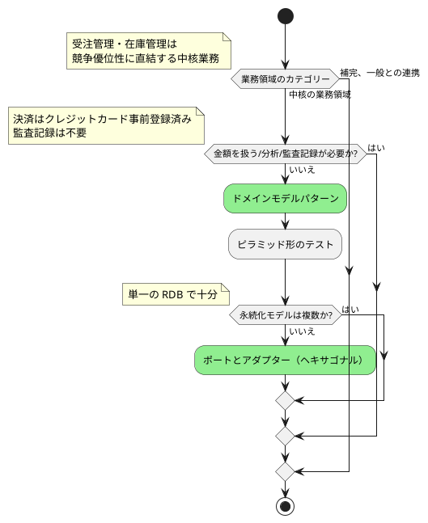
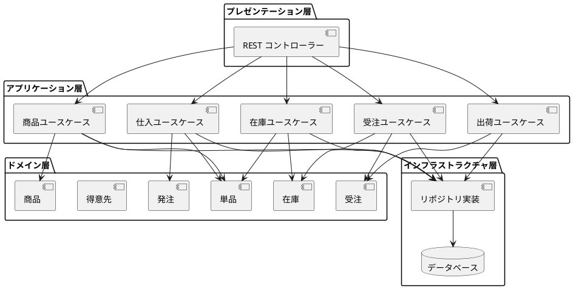
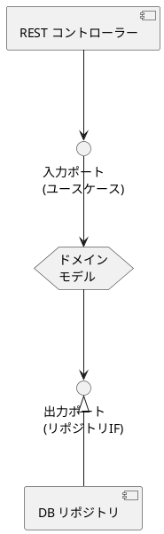

# バックエンドアーキテクチャ - フレール・メモワール WEB ショップ

## アーキテクチャ選定

### 判断フロー

### 選定結果

| 項目 | 選定 | 理由 |
| :--- | :--- | :--- |
| ビジネスロジックパターン | **ドメインモデル** | 在庫推移計算・品質維持日数・購入単位制約などのビジネスルールが中程度に複雑 |
| アーキテクチャスタイル | **ポートとアダプター（ヘキサゴナル）** | 永続化モデルは単一。ドメインロジックを外部依存から分離し、テスト容易性を確保 |
| テスト戦略 | **ピラミッド形** | ドメインモデルのユニットテストを中心に、統合テスト・E2E テストで補完 |
| API 設計 | **REST API** | シンプルな CRUD + 在庫推移照会。GraphQL や gRPC は過剰 |

## アーキテクチャ構造

## レイヤー責務

| レイヤー | 責務 | 主要コンポーネント |
| :--- | :--- | :--- |
| プレゼンテーション | HTTP リクエスト/レスポンス、入力検証 | REST コントローラー |
| アプリケーション | ユースケース制御、トランザクション境界 | 各ユースケースサービス |
| ドメイン | ビジネスルール、不変条件 | エンティティ、値オブジェクト、ドメインサービス |
| インフラストラクチャ | データ永続化、外部連携 | リポジトリ実装 |

## ポートとアダプター

## API 設計方針

| リソース | メソッド | パス | UC |
| :--- | :--- | :--- | :--- |
| 商品 | GET | /api/products | UC10 |
| 商品 | POST | /api/products | UC10 |
| 商品 | PUT | /api/products/{id} | UC10 |
| 単品 | GET | /api/items | UC11 |
| 単品 | POST | /api/items | UC11 |
| 単品 | PUT | /api/items/{id} | UC11 |
| 受注 | GET | /api/orders | UC04 |
| 受注 | POST | /api/orders | UC01 |
| 受注 | PUT | /api/orders/{id}/delivery-date | UC03 |
| 届け先 | GET | /api/customers/{id}/destinations | UC02 |
| 在庫推移 | GET | /api/stock/forecast | UC05 |
| 発注 | POST | /api/purchase-orders | UC06 |
| 入荷 | POST | /api/arrivals | UC07 |
| 出荷 | GET | /api/shipments?date={date} | UC08 |
| 出荷 | POST | /api/shipments | UC09 |
| 得意先 | GET | /api/customers | - |
| 得意先 | POST | /api/customers | - |
