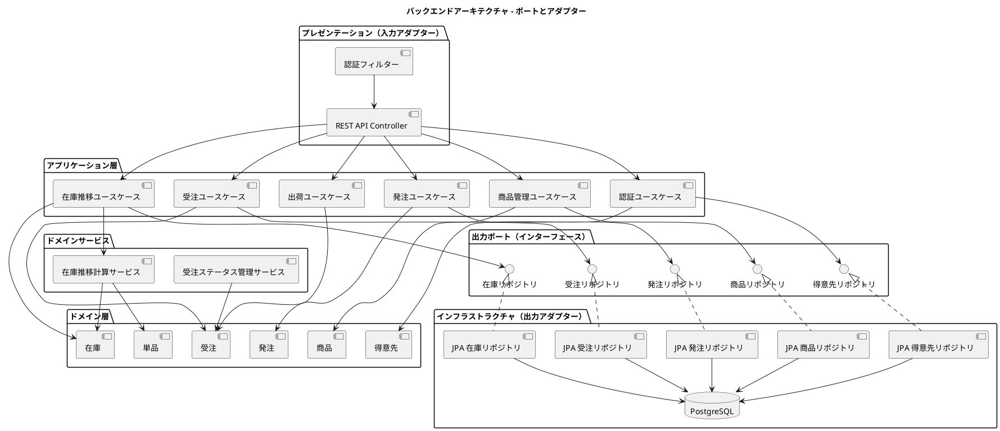
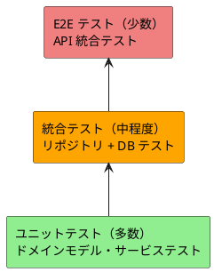

# バックエンドアーキテクチャ設計 - フレール・メモワール WEB ショップシステム

## アーキテクチャパターン選定

### 業務領域の分析

| 分析項目 | 判定 | 根拠 |
|:---|:---|:---|
| 業務領域カテゴリ | 中核の業務領域 | 受注管理・在庫管理は競争優位性に直結する |
| データ構造の複雑さ | 複雑 | 10 以上のエンティティ、品質維持日数を考慮した在庫推移計算、状態遷移管理 |
| 金額を扱うか | いいえ | 決済処理はスコープ外（クレジットカード事前登録済み） |
| 監査記録が必要か | いいえ | コンプライアンス要件なし |

### 選定結果

**ビジネスロジックパターン**: ドメインモデルパターン

**アーキテクチャスタイル**: ポートとアダプター（ヘキサゴナルアーキテクチャ）

**テスト戦略**: ピラミッド形テスト

### 選定理由

1. **ドメインモデルパターン**: 在庫推移計算・品質維持日数管理・受注状態遷移など、複雑なビジネスルールをドメイン層に集約できる
2. **ポートとアダプター**: ドメインロジックを外部技術（DB、Web フレームワーク）から独立させ、テスト容易性と将来の技術変更への柔軟性を確保する
3. **永続化モデルは単一**: RDB 1 つで十分なため、CQRS は不要。過剰な複雑さを避ける

## レイヤー構造

## レイヤー責務

| レイヤー | 責務 | 依存方向 |
|:---|:---|:---|
| プレゼンテーション | HTTP リクエスト/レスポンス変換、入力バリデーション、認証フィルター | → アプリケーション層 |
| アプリケーション | ユースケース制御、トランザクション境界、DTO 変換 | → ドメイン層 |
| ドメイン | ビジネスルール、不変条件、ドメインサービス、エンティティ、値オブジェクト | 依存なし（中心） |
| インフラストラクチャ | DB アクセス、外部 API 連携、技術的関心事 | → ドメイン層（ポート実装） |

**依存関係の方向**: 外側 → 内側（ドメイン層に向かう単方向依存）

## API 設計方針

### REST API

| 項目 | 方針 |
|:---|:---|
| プロトコル | REST over HTTPS |
| データ形式 | JSON |
| 認証方式 | JWT（Bearer Token） |
| バージョニング | URL パスベース（`/api/v1/`） |
| エラーレスポンス | RFC 7807 Problem Details |
| ページネーション | オフセットベース（`?page=1&size=20`） |

### 主要エンドポイント

| メソッド | パス | UC | 説明 |
|:---|:---|:---|:---|
| POST | `/api/v1/auth/login` | UC-013 | ログイン |
| POST | `/api/v1/auth/register` | UC-013 | 新規登録 |
| GET | `/api/v1/products` | UC-001 | 商品一覧 |
| GET | `/api/v1/products/{id}` | UC-001 | 商品詳細 |
| POST | `/api/v1/orders` | UC-001 | 注文作成 |
| GET | `/api/v1/orders` | UC-003 | 受注一覧 |
| PUT | `/api/v1/orders/{id}/accept` | UC-003 | 受注受付 |
| PUT | `/api/v1/orders/{id}/cancel` | UC-003 | 注文キャンセル |
| PUT | `/api/v1/orders/{id}/delivery-date` | UC-002 | 届け日変更 |
| GET | `/api/v1/inventory/transitions` | UC-004 | 在庫推移 |
| POST | `/api/v1/purchase-orders` | UC-005 | 発注作成 |
| POST | `/api/v1/purchase-orders/{id}/arrivals` | UC-006 | 入荷登録 |
| GET | `/api/v1/bundling/targets` | UC-007 | 結束対象一覧 |
| PUT | `/api/v1/orders/{id}/bundle` | UC-007 | 結束完了 |
| PUT | `/api/v1/orders/{id}/ship` | UC-008 | 出荷処理 |
| POST | `/api/v1/products` | UC-009 | 商品登録 |
| POST | `/api/v1/items` | UC-010 | 単品登録 |

## テスト戦略

### ピラミッド形テスト

| テスト種別 | 比率 | 対象 |
|:---|:---|:---|
| ユニットテスト | 70% | ドメインモデル、ドメインサービス、値オブジェクト |
| 統合テスト | 20% | リポジトリ実装、ユースケース + DB |
| E2E テスト | 10% | API エンドポイント統合テスト |

## 横断的関心事

| 関心事 | 方針 |
|:---|:---|
| 認証・認可 | JWT + ロールベースアクセス制御（RBAC） |
| ロギング | 構造化ログ（JSON 形式）、リクエスト ID によるトレーサビリティ |
| エラーハンドリング | ドメイン例外→アプリケーション例外→HTTP レスポンスの変換チェーン |
| トランザクション | アプリケーション層でユースケース単位に管理 |
| バリデーション | プレゼンテーション層で入力バリデーション、ドメイン層で業務バリデーション |

---

## 記入履歴

| 日付 | 更新内容 |
|------|----------|
| 2026-03-20 | 初版作成 |
