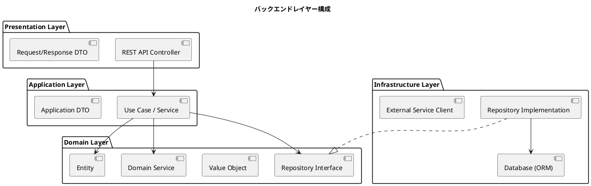
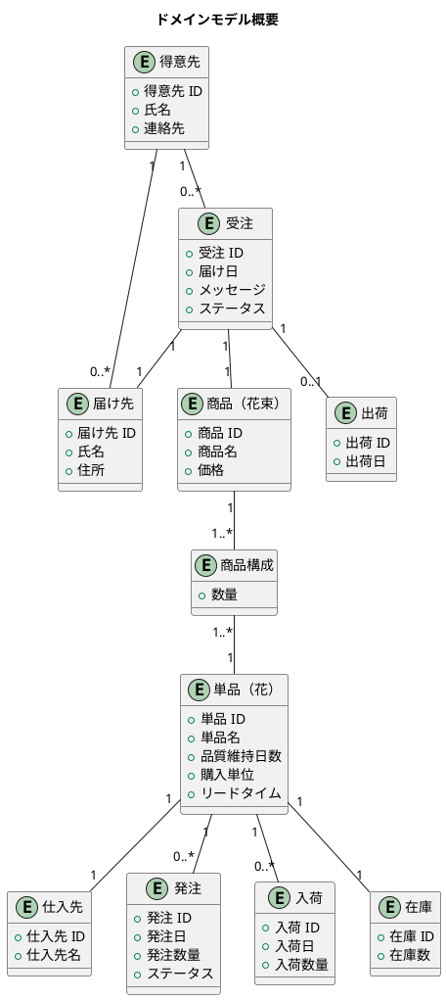

# バックエンドアーキテクチャ - フレール・メモワール WEB ショップシステム

## アーキテクチャパターン選定

### 選定結果: レイヤードアーキテクチャ

**選定理由:**

- 業務ロジックは在庫推移計算・引当処理など一定の複雑さがあるが、ヘキサゴナルやクリーンアーキテクチャを採用するほどではない
- 小規模チーム（1〜2 名）での開発のため、シンプルで理解しやすいパターンが適切
- CRUD 中心の業務（受注・発注・入荷・出荷）にはレイヤードで十分対応できる
- 将来的な複雑化に備え、ドメイン層を明確に分離する

### レイヤー構成



### 各レイヤーの責務

| レイヤー | 責務 | 含まれるもの |
| :--- | :--- | :--- |
| Presentation | HTTP リクエスト/レスポンスの処理 | Controller、DTO（入出力） |
| Application | ユースケースの実行・調整 | Service、Application DTO |
| Domain | ビジネスルールの表現 | Entity、Value Object、Domain Service、Repository Interface |
| Infrastructure | 外部システムとの接続 | Repository 実装、ORM、外部 API クライアント |

## API 設計方針

### REST API

- リソース指向の URL 設計
- HTTP メソッドで操作を表現（GET / POST / PUT / DELETE）
- JSON 形式でリクエスト・レスポンスを統一

### エンドポイント一覧

| メソッド | パス | 説明 | 対応 UC |
| :--- | :--- | :--- | :--- |
| GET | /api/products | 商品一覧取得 | UC-01 |
| POST | /api/orders | 注文登録 | UC-02 |
| GET | /api/orders | 受注一覧取得 | UC-05 |
| GET | /api/orders/:id | 受注詳細取得 | UC-06 |
| PUT | /api/orders/:id/delivery-date | 届け日変更 | UC-04 |
| GET | /api/stock/transitions | 在庫推移取得 | UC-07 |
| POST | /api/purchase-orders | 発注登録 | UC-08 |
| POST | /api/arrivals | 入荷登録 | UC-09 |
| GET | /api/shipments/targets | 出荷対象一覧取得 | UC-10 |
| POST | /api/shipments | 出荷登録 | UC-11 |
| GET /POST /PUT | /api/products/:id | 商品マスタ管理 | UC-12 |
| GET /POST /PUT | /api/items/:id | 単品マスタ管理 | UC-13 |
| GET /POST /PUT | /api/customers/:id | 得意先管理 | UC-14 |

### レスポンス形式

```json
// 成功
{
  "data": { ... },
  "meta": { "total": 10 }
}

// エラー
{
  "error": {
    "code": "STOCK_INSUFFICIENT",
    "message": "在庫が不足しています"
  }
}
```

## ドメインモデル概要

### 主要エンティティ



### 在庫推移計算ロジック

在庫推移は以下の要素から日別に計算する：

```
日別在庫予定数 = 前日在庫 + 入荷予定数 - 受注引当数 - 廃棄予定数
廃棄予定数 = 品質維持日数を超えた在庫数
```

## 技術スタック（暫定）

| 分類 | 技術 | 備考 |
| :--- | :--- | :--- |
| 言語 | TypeScript | 型安全性の確保 |
| フレームワーク | Express.js / Fastify | 軽量・シンプル |
| ORM | Prisma | TypeScript 親和性が高い |
| データベース | PostgreSQL | リレーショナルデータに適合 |
| テスト | Vitest | 単体・統合テスト |

## アーキテクチャ決定記録（ADR）

### ADR-001: バックエンドアーキテクチャにレイヤードアーキテクチャを採用

- **ステータス**: 承認済
- **決定**: レイヤードアーキテクチャを採用する
- **理由**: 小規模チームでの開発効率を優先。業務ロジックの複雑さはレイヤードで対応可能
- **代替案**: ヘキサゴナルアーキテクチャ（複雑さに対して過剰）、クリーンアーキテクチャ（同様）

### ADR-002: API 設計に REST を採用

- **ステータス**: 承認済
- **決定**: REST API を採用する
- **理由**: シンプルで広く普及しており、チームの学習コストが低い。GraphQL は柔軟性が高いが複雑さも増す
- **代替案**: GraphQL（フロントエンドの柔軟性は高いが、小規模では過剰）
