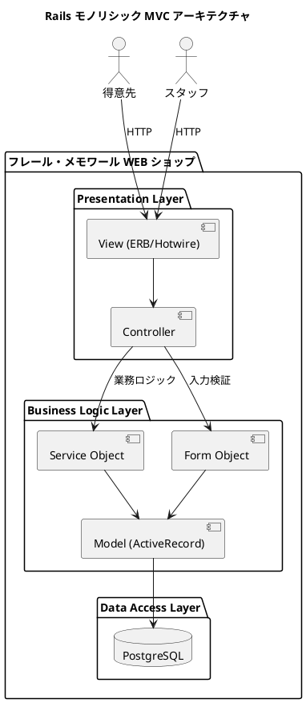
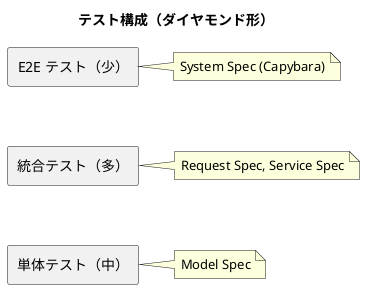

# バックエンドアーキテクチャ設計

## アーキテクチャパターン: Rails モノリシック MVC + アクティブレコード

### 選定理由

| 判断基準 | 判定 | 根拠 |
|---------|------|------|
| 業務領域 | 中核 | 受注管理・在庫管理・仕入管理がビジネスの競争優位性を決定する |
| データ構造の複雑さ | 中程度 | エンティティ間の関係は多いが、複雑なビジネスルール（在庫引当・品質維持日数）は限定的 |
| 金額/分析/監査 | なし | 決済はスコープ外、監査記録は不要 |
| チーム規模 | 小（1-2 名） | フルスタック開発者が少人数で開発 |

**結論**: アクティブレコードパターン + レイヤードアーキテクチャ（MVC 3 層）を採用する。Rails の Convention over Configuration により、少人数チームでも生産性高く開発でき、モノリシック構成でデプロイの複雑さを回避する。

### アーキテクチャ概要図



### レイヤー構成

| レイヤー | 責務 | 主要コンポーネント |
|---------|------|-------------------|
| Presentation | HTTP リクエスト/レスポンス、画面表示 | Controller, View (ERB), Hotwire (Turbo/Stimulus) |
| Business Logic | 業務ルール、バリデーション | Model (ActiveRecord), Service Object, Form Object |
| Data Access | データ永続化 | ActiveRecord ORM, PostgreSQL |

### コンポーネント設計方針

#### Controller

- RESTful なルーティングに従う
- ビジネスロジックは Service Object に委譲する
- 薄い Controller を維持する（Fat Model, Skinny Controller）

#### Model (ActiveRecord)

- テーブルと 1:1 対応する ActiveRecord モデル
- バリデーション、関連（has_many, belongs_to 等）を定義
- 複雑な業務ロジックは Service Object に切り出す
- コールバックは最小限にする

#### Service Object

以下のケースで Service Object を使用する：

- 複数のモデルにまたがる処理（注文確定、出荷処理）
- 在庫引当・在庫推移計算などの複雑な業務ロジック
- 外部システムとの連携

```
app/services/
  order_service.rb          # 注文確定・キャンセル
  stock_allocation_service.rb  # 在庫引当・解除
  stock_forecast_service.rb    # 在庫推移計算
  shipping_service.rb       # 出荷処理
  purchase_order_service.rb # 発注処理
```

#### Form Object

複数のモデルにまたがる入力を受け付ける場合に使用する：

```
app/forms/
  order_form.rb    # 注文入力（受注 + 届け先）
```

### ディレクトリ構成

```
app/
├── controllers/
│   ├── application_controller.rb
│   ├── products_controller.rb      # 商品管理
│   ├── items_controller.rb         # 単品管理
│   ├── compositions_controller.rb  # 花束構成
│   ├── orders_controller.rb        # 受注管理
│   ├── customers_controller.rb     # 得意先管理
│   ├── stock_forecasts_controller.rb  # 在庫推移
│   ├── purchase_orders_controller.rb  # 発注管理
│   ├── arrivals_controller.rb      # 入荷管理
│   ├── shipments_controller.rb     # 出荷管理
│   └── sessions_controller.rb      # 認証
├── models/
│   ├── product.rb       # 商品
│   ├── item.rb          # 単品
│   ├── composition.rb   # 商品構成
│   ├── order.rb         # 受注
│   ├── delivery_address.rb  # 届け先
│   ├── customer.rb      # 得意先
│   ├── supplier.rb      # 仕入先
│   ├── purchase_order.rb  # 発注
│   ├── arrival.rb       # 入荷
│   ├── stock.rb         # 在庫
│   ├── shipment.rb      # 出荷
│   └── user.rb          # ユーザー（認証）
├── services/
│   ├── order_service.rb
│   ├── stock_allocation_service.rb
│   ├── stock_forecast_service.rb
│   ├── shipping_service.rb
│   └── purchase_order_service.rb
├── forms/
│   └── order_form.rb
└── views/
    ├── layouts/
    ├── products/
    ├── items/
    ├── orders/
    ├── stock_forecasts/
    ├── purchase_orders/
    ├── arrivals/
    ├── shipments/
    ├── customers/
    └── sessions/
```

### API 設計方針

Rails の標準的な Server-Side Rendering（SSR）+ Hotwire を採用する。SPA + API 構成は取らない。

| 判断 | 理由 |
|------|------|
| SSR + Hotwire を採用 | 少人数チームで開発速度を最大化するため。フロントエンド/バックエンドの分離はオーバーヘッドが大きい |
| SPA + API を不採用 | チーム規模（1-2 名）に対して複雑さが過剰。SEO 要件もない |

### 認証設計

| 項目 | 方針 |
|------|------|
| 認証 gem | Devise |
| 得意先認証 | メールアドレス + パスワードによる会員登録・ログイン |
| スタッフ認証 | メールアドレス + パスワードによるログイン（管理者が事前登録） |
| ロール管理 | User モデルに role カラム（customer / staff）で区分 |
| 権限制御 | Controller の before_action でロールに応じたアクセス制御 |

### テスト戦略

ダイヤモンド形のテスト構成を採用する（アクティブレコードパターンに適合）。



| テスト種別 | ツール | 対象 |
|-----------|--------|------|
| 単体テスト | RSpec | Model のバリデーション・メソッド |
| 統合テスト | RSpec (Request Spec) | Controller + Service + Model の連携 |
| E2E テスト | RSpec + Capybara | 画面操作を通じた業務フロー |
