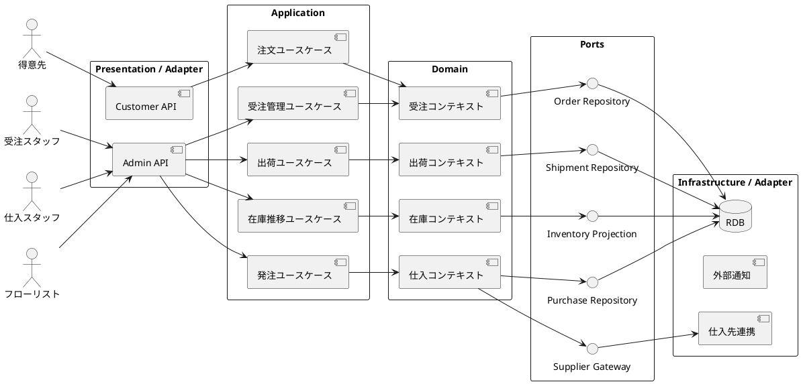

# バックエンドアーキテクチャ

本書は、フラワーショップ「フレール・メモワール」 WEB ショップシステムのバックエンド設計方針を定義します。受注、在庫推移、発注、出荷の整合が業務の中核であるため、業務ルールを中心に据えたポートとアダプターの構成を採用します。

## アーキテクチャ選定

### 採用パターン

- パターン: ポートとアダプター（ヘキサゴナルアーキテクチャ）
- API 方式: REST API
- データ更新方式: 同期更新を基本とし、将来のバッチ集計や通知をイベント連携で拡張可能な構造にする
- CQRS の採否: 現時点では不採用

### 選定理由

- 受注、在庫、発注、出荷の業務ルールを永続化や Web フレームワークから分離したい
- MVP からフェーズ 3 まで機能追加が継続するため、ユースケース単位で拡張しやすい構造が必要
- 在庫推移や届け日変更可否など、単純な CRUD を超える判定ロジックをアプリケーション層とドメイン層で明確に分けたい
- 一方で、現段階では読み取りと書き込みを完全分離するほどの複雑性はまだないため、CQRS は見送る

## 論理構成

## レイヤー責務

| レイヤー | 責務 |
| :--- | :--- |
| Presentation / Adapter | REST API、入力検証、認証認可、レスポンス整形 |
| Application | ユースケースの実行順序制御、トランザクション境界、権限判定の呼び出し |
| Domain | 受注、在庫推移、発注、出荷に関する業務ルールと不変条件の保持 |
| Ports | 永続化や外部連携の抽象化 |
| Infrastructure / Adapter | DB、外部通知、仕入先連携などの具体実装 |

## コンテキスト分割

| コンテキスト | 主な責務 | 対応ユースケース |
| :--- | :--- | :--- |
| 受注コンテキスト | 注文登録、届け先再利用、受注参照、届け日変更 | UC-01、UC-02、UC-03、UC-04 |
| 在庫コンテキスト | 花材在庫、品質維持日数、日別在庫推移の算出 | UC-05 |
| 仕入コンテキスト | 発注、入荷、仕入先別発注管理 | UC-06、UC-07 |
| 出荷コンテキスト | 出荷対象確認、花束構成から必要花材を引当、結束完了登録、出荷確定 | UC-08、UC-08B、UC-09 |

## API 設計方針

- 顧客向け API と管理向け API を論理的に分離する
- リソース単位の REST を基本とし、複雑な判定はユースケース指向のエンドポイントで表現する
- 例:
  - `POST /customer/orders`
  - `GET /admin/orders`
  - `POST /admin/orders/{orderId}/delivery-date-change`
  - `GET /admin/inventory/projections`
  - `POST /admin/purchase-orders`
  - `POST /admin/shipments/{shipmentId}/complete`

## トランザクションと整合性

- 注文確定、届け日変更、発注確定、入荷記録、出荷確定はそれぞれ 1 トランザクションで完結させる
- 在庫推移は基礎データ（受注、入荷予定、品質維持日数）から導出する参照モデルとして扱う
- 出荷確定時は受注状態、引当済み在庫、出荷実績を同時に更新し、業務上の不整合を防ぐ

## 主要な設計判断

- 発注判断は自動化せず、システムは在庫推移と不足見込みを提示するに留める
- 在庫推移は帳票ではなく、日別の投影モデルとして提供する
- 将来の通知や外部配送連携に備えて、ドメインイベントを内部的に発行可能な構成とする

## 後続設計への入力

- `analyzing-data-model` では、受注、届け先履歴、花束構成、単品在庫、発注、入荷、出荷のデータ構造を詳細化する
- `analyzing-domain-model` では、受注、花束商品、単品、在庫投影、発注、出荷を集約候補として検討する
- `creating-adr` では、ヘキサゴナルアーキテクチャ採用と CQRS 非採用を記録する
