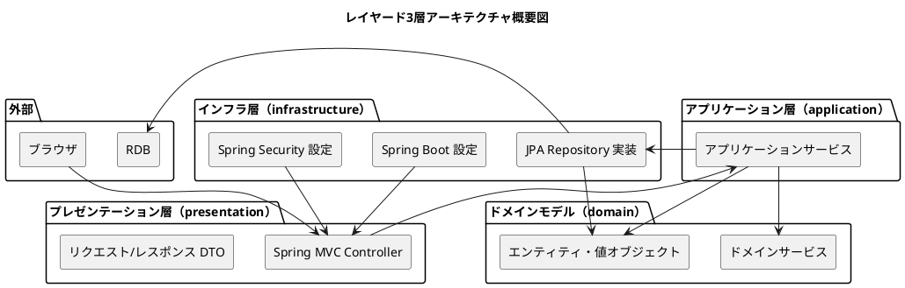
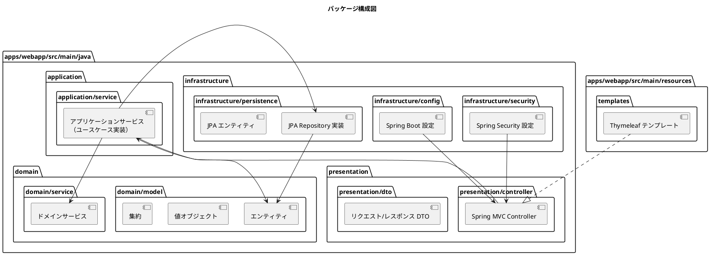
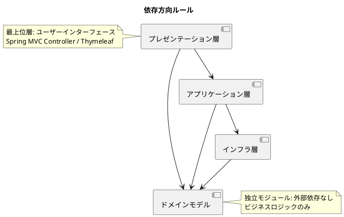

# アーキテクチャ設計 - フレール・メモワール WEB ショップシステム

## 概要

本ドキュメントでは、フレール・メモワール WEB ショップシステムのアーキテクチャ設計を定義する。レイヤード3層アーキテクチャ＋ドメインモデルを採用し、責務の明確な分離と保守性の高い構造を実現する。

### 技術スタック

- **言語**: Java 25
- **フレームワーク**: Spring Boot
- **テンプレートエンジン**: Thymeleaf（SSR）
- **配置先**: `apps/webapp/` 以下

### アーキテクチャパターン選定理由

要件定義で示されたビジネスドメイン（受注管理・在庫推移・発注管理）は中核の業務領域であり、ビジネスルール（BR01-BR07）の正確な実装が求められる。永続化モデルは単一 RDB であり、CQRS は不要。よって、ドメインモデルパターン + レイヤード3層アーキテクチャを採用する。

レイヤード3層アーキテクチャを選定した理由:

- 実装コードが未着手であり、シンプルな構造から開始して段階的に複雑化に対応できる
- Controller → Service → Repository の直接的な依存関係により、コードの追跡が容易
- Spring Boot / Spring MVC の標準的なパッケージ構成と親和性が高い
- ドメインモデルを独立モジュールとして各層から参照することで、ビジネスロジックの集約を維持する

## アーキテクチャ概要図

## レイヤー構成

### プレゼンテーション層

外部からのリクエストを受け付け、レスポンスを返す。

- **責務**: Spring MVC Controller、リクエスト/レスポンス DTO、Thymeleaf テンプレート連携
- **依存方向**: アプリケーション層、ドメインモデル

### アプリケーション層

ユースケースの実行を調整する。

- **責務**: アプリケーションサービスによるユースケース実装、トランザクション境界の管理
- **依存方向**: インフラ層（Repository 実装）、ドメインモデル

### インフラ層

永続化やフレームワーク固有の設定を管理する。

- **責務**: JPA Repository 実装、JPA エンティティ、Spring Boot 設定、Spring Security 設定、Bean 定義、プロファイル管理
- **依存方向**: ドメインモデル

### ドメインモデル（各層から参照）

ビジネスロジックの中核。外部技術への依存を持たない。

- **責務**: エンティティ、値オブジェクト、集約、ドメインサービスの定義
- **依存方向**: なし（他のどのレイヤーにも依存しない）
- **関連ユースケース**: UC001-UC011 の全ビジネスルール（BR01-BR07）を表現

## レイヤー間の依存関係

Controller → Service → Repository の直接的な依存関係とする。ドメインモデルは各層から参照される独立したモジュールである。

| 依存元 | 依存先 | 説明 |
|--------|--------|------|
| Controller（プレゼンテーション層） | Service（アプリケーション層） | Controller が Service を直接呼び出す |
| Service（アプリケーション層） | Repository（インフラ層） | Service が Repository 実装を直接利用する |
| 各層 | ドメインモデル | エンティティ・値オブジェクトを各層から参照する |

## パッケージ構成

`apps/webapp/` 以下のパッケージ構成を以下に示す。

### パッケージ詳細

| パッケージ | 配置するクラス | レイヤー |
|-----------|--------------|---------|
| `domain/model/` | エンティティ、値オブジェクト、集約ルート | ドメインモデル |
| `domain/service/` | ドメインサービス（在庫推移計算、届け日検証、出荷日判定） | ドメインモデル |
| `application/service/` | アプリケーションサービス（ユースケース実装） | アプリケーション層 |
| `presentation/controller/` | Spring MVC Controller | プレゼンテーション層 |
| `presentation/dto/` | リクエスト/レスポンス DTO | プレゼンテーション層 |
| `infrastructure/persistence/` | JPA Repository 実装、JPA エンティティ | インフラ層 |
| `infrastructure/config/` | Spring Boot 設定クラス | インフラ層 |
| `infrastructure/security/` | Spring Security 設定クラス | インフラ層 |

## 依存方向ルール

## トレーサビリティ

| ユースケース | Controller（presentation/controller） | Service（application/service） |
|------------|--------------------------------------|-------------------------------|
| UC001: 商品マスタ管理 | ProductController | ProductService |
| UC002: WEB 受注 | OrderController | OrderService |
| UC003: 在庫推移 | InventoryController | InventoryService |
| UC004: 発注管理 | PurchaseOrderController | PurchaseOrderService |
| UC005: 入荷管理 | ArrivalController | ArrivalService |
| UC006: 出荷管理 | ShipmentController | ShipmentService |
| UC007: 届け日変更 | OrderController | DeliveryDateService |
| UC008: 届け先コピー | DeliveryDestinationController | DeliveryDestinationService |
| UC009: 得意先管理 | CustomerController | CustomerService |
| UC010: 会員登録・ログイン | AuthController | AuthService |
| UC011: 注文キャンセル | OrderController | OrderService |
