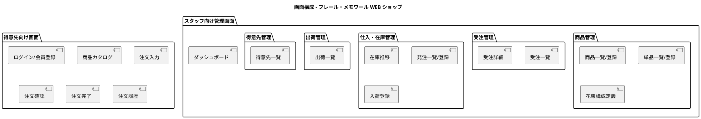
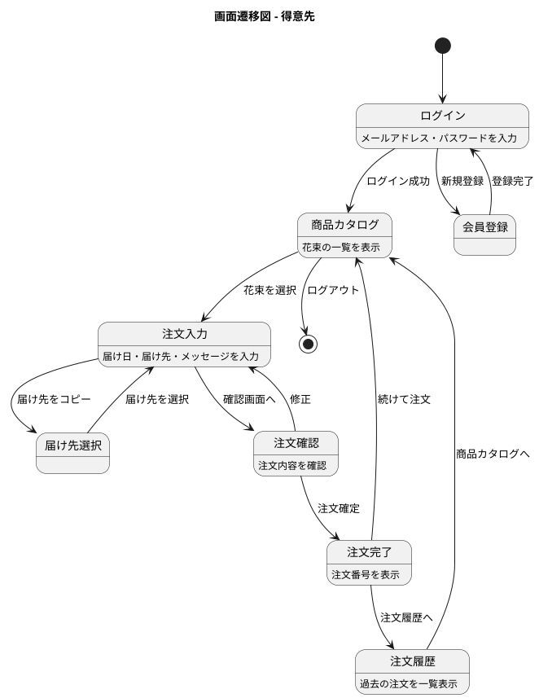
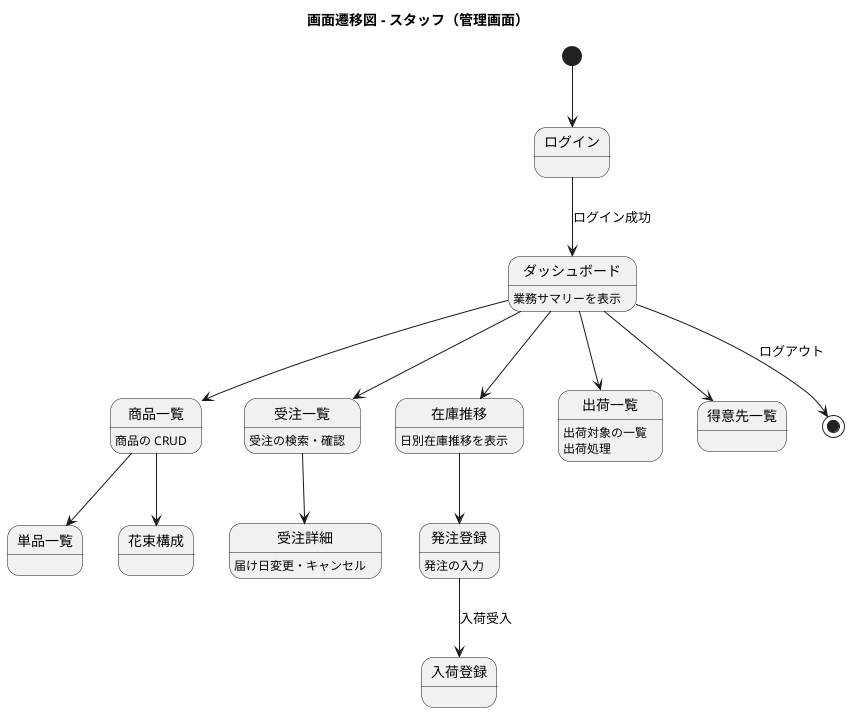

# フロントエンドアーキテクチャ設計

## アーキテクチャパターン: Rails SSR + Hotwire

### 選定理由

| 判断基準 | 判定 | 根拠 |
|---------|------|------|
| チーム規模 | 小（1-2 名） | フロントエンド専任がいない。フルスタックで開発 |
| インタラクティブ性 | 中程度 | リアルタイム更新は不要。フォーム入力と一覧表示が中心 |
| SEO 要件 | なし | 管理画面は不要。顧客向け画面も会員制のためクローリング不要 |
| 初期開発速度 | 重視 | MVP を素早くリリースし、フィードバックを得たい |

**結論**: Rails の ERB テンプレート + Hotwire（Turbo + Stimulus）を採用する。SPA フレームワーク（React, Vue 等）は採用しない。Rails の統合された開発体験により、少人数チームの生産性を最大化する。

### 技術スタック

| カテゴリ | 技術 | 用途 |
|---------|------|------|
| テンプレートエンジン | ERB | HTML レンダリング |
| ページ遷移の高速化 | Turbo Drive | SPA 的なページ遷移をフルページリロードなしで実現 |
| 部分更新 | Turbo Frames | ページの一部を非同期に更新 |
| リアルタイム更新 | Turbo Streams | サーバーからのプッシュ更新（将来用） |
| JavaScript フレームワーク | Stimulus | 控えめな JavaScript の構造化 |
| CSS フレームワーク | Bootstrap 5 | レスポンシブデザイン、UI コンポーネント |
| アイコン | Bootstrap Icons | 一貫したアイコンセット |
| アセット管理 | Propshaft | CSS/JS のアセットパイプライン |
| JavaScript バンドル | importmap-rails | npm なしの JavaScript モジュール管理 |

### 画面構成



### 画面遷移図

#### 得意先向け画面



#### スタッフ向け管理画面



### レイアウト設計

#### 得意先向けレイアウト

```
+------------------------------------------+
| ヘッダー（ロゴ、ナビ、ログイン/ログアウト）|
+------------------------------------------+
|                                          |
|              メインコンテンツ              |
|                                          |
+------------------------------------------+
| フッター（利用規約、問い合わせ等）         |
+------------------------------------------+
```

#### スタッフ向けレイアウト

```
+--------+-------------------------------+
| サイド  | ヘッダー（検索、ユーザー情報） |
| ナビ    +-------------------------------+
|        |                               |
| 商品管理|         メインコンテンツ       |
| 受注管理|                               |
| 在庫管理|                               |
| 出荷管理|                               |
| 得意先  |                               |
+--------+-------------------------------+
```

### Hotwire の活用方針

| 機能 | Hotwire 技術 | 用途 |
|------|-------------|------|
| ページ遷移 | Turbo Drive | フルリロードなしのページ遷移 |
| 一覧の絞り込み | Turbo Frames | 絞り込み条件変更時の一覧部分更新 |
| フォーム送信 | Turbo Frames | フォーム送信後の部分更新 |
| フラッシュメッセージ | Turbo Streams | 操作結果の通知表示 |
| 動的 UI | Stimulus | タブ切り替え、モーダル、日付ピッカー等 |

### テスト戦略

| テスト種別 | ツール | 対象 |
|-----------|--------|------|
| System Spec | RSpec + Capybara | 画面操作を通じた E2E テスト |
| View Spec | RSpec | ERB テンプレートの描画確認 |
| Helper Spec | RSpec | View ヘルパーのテスト |
