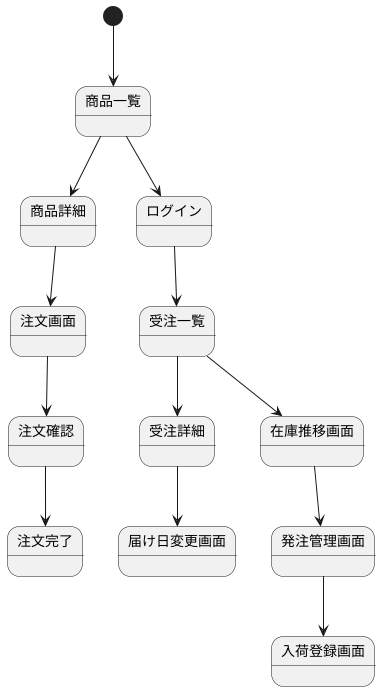

# フロントエンドアーキテクチャ設計

## 1. 文書の目的

本書は、顧客向け注文体験とスタッフ / 管理者向け業務画面を両立するフロントエンドアーキテクチャ方針を定義するものです。

小規模な XP チームが継続的に改善できるよう、**単一の Web アプリケーションの中で顧客向け体験とスタッフ向け業務画面を共存させる**方針を採用します。

## 2. アーキテクチャ方針

### 2.1 採用方針

**Next.js ベースの Hybrid Web アプリケーション**を採用します。

- 顧客向け画面は SSR / SSG を活用して初期表示と SEO を両立します
- スタッフ向け画面は SPA 的な操作性を重視します
- 単一リポジトリ内の `apps/web` に集約します
- API 連携はバックエンドの REST API を前提とします

### 2.2 選定理由

本システムには、性質の異なる 2 種類の画面があります。

- 顧客向け画面
  - 商品を迷わず選んで注文できることが重要です
  - 初回表示の速さと検索流入への対応が価値になります
- スタッフ向け画面
  - 受注一覧、在庫推移、発注、入荷、出荷一覧など高い操作性が必要です
  - フィルタ、一覧更新、差分確認などのインタラクションが多くなります

Next.js はこの両方を 1 つの Node ベース技術スタックで扱いやすく、1 〜 2 名チームにとって実装と運用のバランスがよいです。

## 3. 他案との比較

### 3.1 純粋な SPA を採用しない理由

React SPA のみで構成すると、スタッフ画面との相性はよい一方で、顧客向けの商品一覧 / 商品詳細 / 注文導線の初期表示や SEO 面で追加対策が必要になります。

### 3.2 複数フロントエンドに分割しない理由

顧客用とスタッフ用を別アプリに分けると、チーム規模に対してルーティング、認証、デザインシステム、CI/CD が重くなります。

現時点では、**単一 Web アプリ + ルート分割**の方が自然です。

## 4. 画面構成

### 4.1 ルート構成

```text
apps/
  web/
    src/
      app/
        (shop)/
          products/
          order/
          orders/
        (staff)/
          admin/orders/
          admin/stock/
          admin/purchase-orders/
          admin/arrivals/
          admin/shipments/
      features/
      components/
      lib/
      types/
```

### 4.2 画面責務

| 画面群 | 主利用者 | 主目的 |
| :--- | :--- | :--- |
| 商品一覧 / 商品詳細 | 顧客 | 花束を選びやすくする |
| 注文画面 | 顧客 | 届け日、届け先、メッセージを入力し注文を確定する |
| 届け先再利用画面 | 顧客 | 過去の届け先を再利用する |
| 届け日変更画面 | 顧客、受注スタッフ | 変更可否を確認し、変更を確定する |
| 受注一覧 / 受注詳細 | 受注スタッフ | 注文状況と変更履歴を確認する |
| 在庫推移画面 | 仕入スタッフ、経営者 | 在庫予定数と廃棄リスクを可視化する |
| 発注管理 / 入荷登録 | 仕入スタッフ | 発注と入荷を記録する |
| 出荷一覧 | フローリスト | 当日の結束対象を確認する |

## 5. コンポーネント設計方針

### 5.1 Feature ベースで整理する

コンポーネントは共通化を急がず、**画面 / 業務機能単位の Feature ベース**で整理します。

- `features/order/`
- `features/destination/`
- `features/stock-projection/`
- `features/purchase-order/`
- `features/shipment/`

### 5.2 コンポーネントの種類

| 種類 | 役割 | 例 |
| :--- | :--- | :--- |
| Page | ルーティング単位の画面 | `OrderPage` |
| Feature | 画面内の業務まとまり | `OrderFormFeature` |
| UI Component | 再利用 UI 部品 | `DatePicker`、`Card`、`Table` |
| Data Hook | API 呼び出しと状態管理 | `useStockProjectionQuery` |
| Mapper | API DTO と画面モデルの変換 | `mapOrderResponseToViewModel` |

### 5.3 共通化ルール

- 3 箇所以上で同じ責務が見えたら共通化を検討します
- 業務ルールを含む部品は安易に `shared` 化しません
- `components/` は見た目中心、業務知識は `features/` に置きます

## 6. 状態管理方針

### 6.1 原則

**サーバー状態、フォーム状態、画面局所状態を分離**します。

| 状態種別 | 管理方法 | 対象 |
| :--- | :--- | :--- |
| サーバー状態 | TanStack Query | 商品一覧、受注一覧、在庫推移、出荷一覧 |
| フォーム状態 | React Hook Form | 注文入力、届け日変更、発注登録、入荷登録 |
| 画面局所状態 | React state | モーダル開閉、タブ切替、並び順 |
| URL 状態 | search params | 一覧フィルタ、日付範囲、検索条件 |

### 6.2 グローバルストアの扱い

初期段階では Redux のような大規模グローバルストアは導入しません。

必要最小限のグローバル状態は以下に限定します。

- 認証セッション
- 現在の利用者ロール
- 画面テーマなどの UI 設定

## 7. API 連携方針

### 7.1 バックエンドとの接続方式

- フロントエンドは REST API を利用します
- API Client は `lib/api/` に集約します
- API Response をそのまま画面で使わず、ViewModel に変換します

### 7.2 BFF の扱い

初期フェーズでは専用 BFF は作らず、Next.js の Server Component / Route Handler を必要最小限の中継層として使います。

BFF を本格導入するのは、以下が揃った場合に限ります。

- 認証連携が複雑化する
- 複数 API の集約が頻発する
- 顧客向けとスタッフ向けで API 契約を分けたい

### 7.3 認証連携の最小方針

- ブラウザと Next.js 間は same-origin を前提にします
- 顧客向け / スタッフ向けともに、認証情報をブラウザ JavaScript へ露出させず、HttpOnly Cookie またはサーバー側セッションで扱います
- Route Handler を使う場合は、バックエンド認証情報の付与を中継層で完結させ、画面コンポーネントが資格情報の詳細を持たないようにします

## 8. 画面遷移とレンダリング戦略

### 8.1 レンダリング戦略

| 領域 | 推奨レンダリング | 理由 |
| :--- | :--- | :--- |
| 商品一覧 / 商品詳細 | SSR または ISR | 初期表示と SEO を重視するため |
| 注文画面 | SSR + Client Form | 初期表示と入力体験を両立するため |
| 届け日変更画面 | Client 中心 | 即時バリデーションと結果表示が必要なため |
| スタッフ一覧画面 | Client 中心 | フィルタ、再読込、部分更新が多いため |
| 在庫推移画面 | Client + chart | インタラクティブな可視化が必要なため |

### 8.2 代表的な遷移



## 9. UX 設計方針

### 9.1 顧客向け UX

- 注文完了までの入力ステップを最小化します
- 届け先再利用は検索よりも「最近使った届け先」優先で表示します
- 届け日変更は「変更可否」と「代替日候補」を近い場所に表示します
- メッセージや届け先入力は途中保存ではなく、短時間完了を優先します

### 9.2 スタッフ向け UX

- 一覧画面を起点にして詳細へ掘り下げられる構成にします
- 在庫推移画面は「不足見込み」「廃棄リスク」「入荷予定」を同一視点で比較できるようにします
- 発注登録や入荷登録は一覧からの連続操作を可能にします
- 出荷一覧は日次業務に合わせ、印刷 / CSV 出力の余地を残します

## 10. フロントエンド品質保証

### 10.1 テスト方針

- Feature 単位のコンポーネントテストを主軸にします
- 顧客向け主要導線は Playwright による E2E テストで保護します
- スタッフ画面は重い E2E を増やしすぎず、結合テストを厚くします

### 10.2 重点シナリオ

- 顧客が商品選択から注文完了まで迷わず進めること
- 過去の届け先を使って再注文できること
- 届け日変更時に変更可否が適切に表示されること
- 在庫推移画面で日付変更、絞り込み、再読込が破綻しないこと

## 11. アクセシビリティと運用性

- 顧客向け画面はフォームラベル、エラーメッセージ、キーボード操作を明示します
- スタッフ向け画面はテーブル操作を優先しつつ、色だけに依存しない状態表示にします
- エラー時は業務エラーとシステムエラーを表示上区別します
- 主要操作には Toast だけでなく画面上の永続的な成功 / 失敗メッセージを併用します

## 12. リスクと段階的実施

### 12.1 主なリスク

| リスク | 影響 | 対策 |
| :--- | :--- | :--- |
| 顧客向けとスタッフ向けの要求が混ざる | 設計が複雑になる | ルートと Feature を明確に分ける |
| 共通化を急ぎすぎる | 変更しにくくなる | まず Feature 内で閉じ、後から共通化する |
| 一覧画面の状態が URL とずれる | 再現性が下がる | フィルタ条件を search params に寄せる |

### 12.2 段階的実施順序

1. 顧客向け商品一覧、商品詳細、注文画面を構築する
2. スタッフ向け受注一覧、在庫推移画面を構築する
3. 発注、入荷、出荷一覧を追加する
4. 届け先再利用、届け日変更を強化する
5. 認証と権限制御を利用者別に整理する

## 13. 関連 ADR

- [ADR-003: 顧客向けとスタッフ向けを単一 Next.js アプリで構成する](../adr/003-single-nextjs-application.md)
- [ADR-004: Web / API のコンテナ分離と managed PostgreSQL を採用する](../adr/004-container-platform-and-managed-postgresql.md)

## 14. TBD

- 顧客ログインの有無と注文履歴参照範囲
- スタッフ / 経営者 / フローリストの権限制御粒度
- 画像管理方式と商品画像配信基盤
- モバイル優先度と管理画面レスポンシブ範囲
