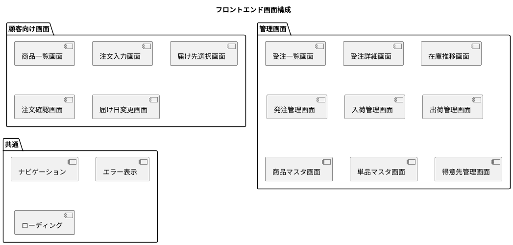
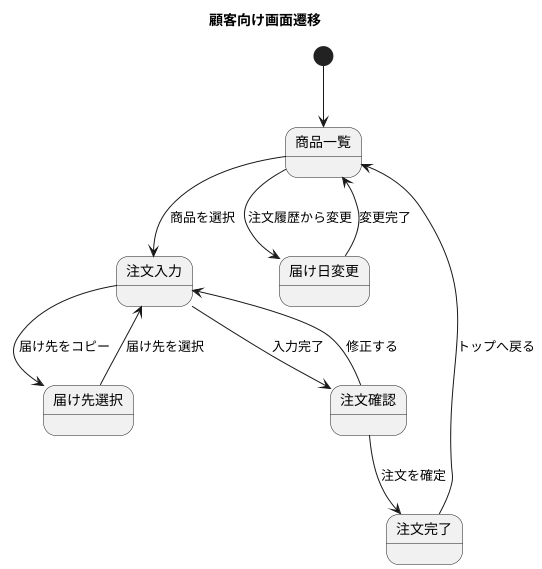
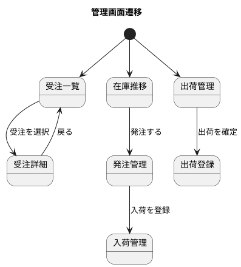

# フロントエンドアーキテクチャ - フレール・メモワール WEB ショップシステム

## アーキテクチャパターン選定

### 選定結果: SPA（Single Page Application）+ コンポーネント指向

**選定理由:**

- 顧客向け画面と管理画面の 2 種類があり、それぞれ独立した操作性が求められる
- 在庫推移表示など動的なデータ更新が必要
- 小規模チームでの開発のため、シンプルなコンポーネント設計を優先
- SSR は不要（SEO 要件なし、認証必須の管理画面が中心）

### 画面構成



## コンポーネント設計方針

### 階層構造

```
pages/          # 画面単位のコンポーネント（ルーティング対応）
  ├── customer/ # 顧客向け画面
  └── admin/    # 管理画面
components/     # 再利用可能なコンポーネント
  ├── ui/       # 汎用 UI（ボタン、フォーム、テーブル等）
  └── domain/   # ドメイン固有（在庫推移グラフ、受注カード等）
hooks/          # カスタムフック（API 呼び出し、状態管理）
api/            # API クライアント
types/          # 型定義
```

### 状態管理方針

- **サーバー状態**: React Query（TanStack Query）でキャッシュ・再取得を管理
- **UI 状態**: useState / useReducer でローカル管理
- **グローバル状態**: 最小限に留める（認証情報のみ Context で管理）

## 画面遷移





## 技術スタック（暫定）

| 分類 | 技術 | 備考 |
| :--- | :--- | :--- |
| 言語 | TypeScript | 型安全性の確保 |
| フレームワーク | React | 広く普及、エコシステムが豊富 |
| ビルドツール | Vite | 高速なビルド・HMR |
| サーバー状態管理 | TanStack Query | API キャッシュ・再取得 |
| スタイリング | Tailwind CSS | ユーティリティファースト、小規模に適合 |
| テスト | Vitest + Testing Library | コンポーネントテスト |

## アーキテクチャ決定記録（ADR）

### ADR-003: フロントエンドに React + Vite を採用

- **ステータス**: 承認済
- **決定**: React + Vite を採用する
- **理由**: 広く普及しており学習コストが低い。Vite により開発体験が良好。小規模チームに適合
- **代替案**: Next.js（SSR 不要のため過剰）、Vue.js（React と同等だが普及度で劣る）

### ADR-004: サーバー状態管理に TanStack Query を採用

- **ステータス**: 承認済
- **決定**: TanStack Query を採用する
- **理由**: API キャッシュ・ローディング・エラー状態の管理を簡潔に実装できる。Redux 等のグローバル状態管理は不要
- **代替案**: Redux Toolkit（過剰）、SWR（機能が限定的）
