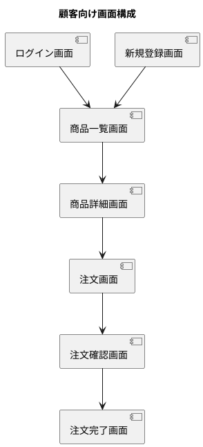
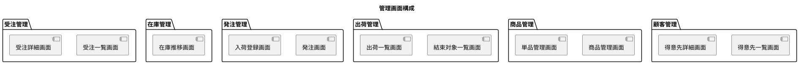
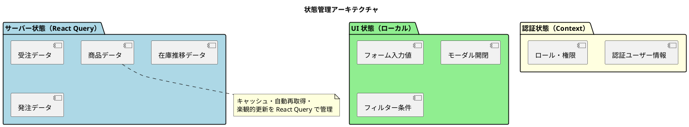

# フロントエンドアーキテクチャ設計 - フレール・メモワール WEB ショップシステム

## アーキテクチャ選定

### プロジェクト分析

| 分析項目 | 判定 | 根拠 |
|:---|:---|:---|
| プロジェクト規模 | 中小規模 | 画面数 15〜20 程度、チーム 1〜2 名 |
| SEO 要件 | 低い | 管理画面は不要、顧客向け画面も限定的 |
| インタラクティビティ | 中程度 | 在庫推移表示、注文フォーム、一覧操作 |
| 状態管理複雑性 | シンプル〜中程度 | サーバー状態が中心、クライアント状態は限定的 |

### 選定結果

| 項目 | 選定 | 理由 |
|:---|:---|:---|
| レンダリング戦略 | SPA | ダッシュボード・管理画面が中心。SEO 重要度は低い |
| フレームワーク | React | エコシステムの充実、コンポーネント指向、TDD との相性 |
| 状態管理 | React Query + Context API | サーバー状態は React Query で管理、UI 状態は Context で十分 |
| スタイリング | CSS Modules / Tailwind CSS | コンポーネントスコープのスタイル管理、パフォーマンス重視 |
| 型システム | TypeScript | 型安全性による品質確保、リファクタリング安全性 |

## プロジェクト構造

```
src/
├── components/       # 共通 UI コンポーネント
│   ├── ui/          # 基本 UI パーツ（Button, Input, Modal, Table 等）
│   └── layout/      # レイアウト（Header, Sidebar, Footer）
├── features/        # フィーチャー単位のモジュール
│   ├── auth/        # 認証（ログイン、新規登録）
│   ├── order/       # 受注管理（注文、受注一覧、届け日変更、キャンセル）
│   ├── product/     # 商品管理（商品一覧、商品登録、花束構成）
│   ├── item/        # 単品管理
│   ├── inventory/   # 在庫管理（在庫推移表示）
│   ├── purchase/    # 発注管理（発注、入荷）
│   ├── shipping/    # 出荷管理（結束、出荷）
│   └── customer/    # 顧客管理（得意先、届け先）
├── hooks/           # 共通カスタムフック
├── lib/             # 外部ライブラリ設定
│   ├── api-client.ts
│   └── auth.ts
├── pages/           # ページコンポーネント（ルーティング）
├── providers/       # Context Provider
├── types/           # 共通型定義
├── utils/           # ユーティリティ関数
└── config/          # アプリケーション設定
```

## 画面構成

### 顧客向け画面



### 管理画面



## コンポーネント設計方針

### Container / Presentational パターン

```
features/order/
├── components/
│   ├── OrderListContainer.tsx      # Container: データ取得・状態管理
│   ├── OrderListView.tsx           # Presentational: UI 表示
│   ├── OrderDetailContainer.tsx
│   └── OrderDetailView.tsx
├── hooks/
│   ├── useOrders.ts                # サーバー状態（React Query）
│   └── useOrderActions.ts          # ミューテーション
└── types/
    └── order.ts                    # 型定義
```

### 設計原則

| 原則 | 説明 |
|:---|:---|
| 単一責任 | 1 コンポーネント = 1 責務。200 行を超えたら分割を検討する |
| Props による制御 | Presentational コンポーネントは Props のみで制御する |
| カスタムフックへの分離 | ビジネスロジック・API 通信はカスタムフックに分離する |
| 型安全性 | すべての Props・State・API レスポンスに TypeScript 型を定義する |

## 状態管理設計



| 状態種別 | 管理方法 | 例 |
|:---|:---|:---|
| サーバー状態 | React Query（TanStack Query） | 商品一覧、受注一覧、在庫推移 |
| 認証状態 | Context API | ログインユーザー、JWT トークン、ロール |
| UI 状態 | useState / useReducer | フォーム入力値、モーダル開閉、フィルター条件 |

## ルーティング設計

### 顧客向けルート

| パス | コンポーネント | アクセス権限 |
|:---|:---|:---|
| `/login` | LoginPage | 未認証 |
| `/register` | RegisterPage | 未認証 |
| `/products` | ProductListPage | 得意先 |
| `/products/:id` | ProductDetailPage | 得意先 |
| `/order` | OrderFormPage | 得意先 |
| `/order/confirm` | OrderConfirmPage | 得意先 |

### 管理画面ルート

| パス | コンポーネント | アクセス権限 |
|:---|:---|:---|
| `/admin/orders` | OrderListPage | 受注スタッフ |
| `/admin/orders/:id` | OrderDetailPage | 受注スタッフ |
| `/admin/inventory` | InventoryPage | 仕入スタッフ |
| `/admin/purchase-orders` | PurchaseOrderPage | 仕入スタッフ |
| `/admin/bundling` | BundlingPage | フローリスト |
| `/admin/shipping` | ShippingPage | 配送スタッフ |
| `/admin/products` | ProductManagementPage | 経営者 |
| `/admin/items` | ItemManagementPage | 経営者 |
| `/admin/customers` | CustomerListPage | 経営者 |

## テスト戦略

| テスト種別 | ツール | 対象 |
|:---|:---|:---|
| ユニットテスト | Vitest | カスタムフック、ユーティリティ関数 |
| コンポーネントテスト | Testing Library | Container/Presentational コンポーネント |
| E2E テスト | Playwright | 主要ユーザーフロー（注文、受注管理） |

---

## 記入履歴

| 日付 | 更新内容 |
|------|----------|
| 2026-03-20 | 初版作成 |
