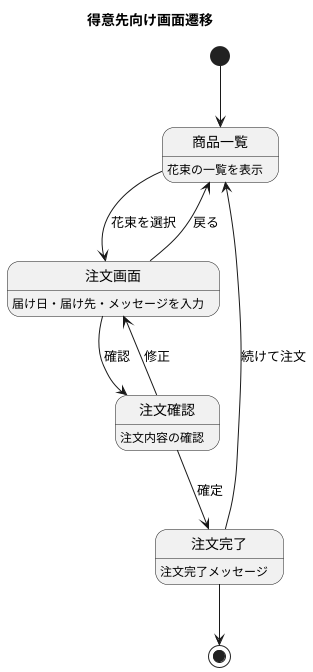
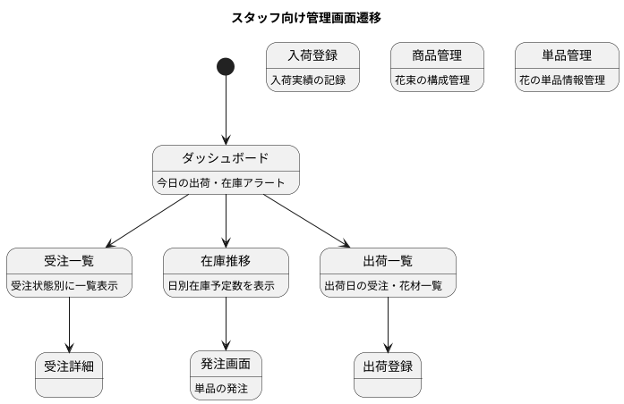
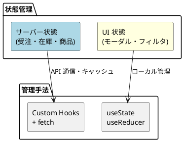

# フロントエンドアーキテクチャ - フレール・メモワール WEB ショップ

## アーキテクチャ選定

### 判断フロー

| 判断ポイント | 選定 | 理由 |
| :--- | :--- | :--- |
| プロジェクト規模 | 中小規模 → **6 フォルダシンプル構造** | UC 11 件、画面 11 件。1-2 名チームで管理可能な規模 |
| レンダリング戦略 | **SPA** | 内部管理画面 + 顧客向け注文画面。SEO 不要（WEB ショップは既存顧客向け） |
| 状態管理 | **Context API + hooks** | 状態がシンプル（受注・在庫のサーバーデータが中心） |
| スタイリング | **CSS/SCSS** | パフォーマンス重視。1-2 名チームで CSS-in-JS のオーバーヘッドは不要 |

## プロジェクト構造

```
src/
├── components/      # 共通 UI コンポーネント
│   ├── ui/          # Button, Input, Modal, Table 等
│   └── layout/      # Header, Sidebar, Footer
├── pages/           # ページコンポーネント（ルーティング）
│   ├── customer/    # 得意先向け画面
│   │   ├── ProductListPage.tsx    # 商品一覧
│   │   ├── OrderPage.tsx          # 注文画面
│   │   └── OrderHistoryPage.tsx   # 注文履歴
│   └── staff/       # スタッフ向け管理画面
│       ├── OrderListPage.tsx      # 受注一覧
│       ├── StockForecastPage.tsx  # 在庫推移
│       ├── PurchaseOrderPage.tsx  # 発注画面
│       ├── ArrivalPage.tsx        # 入荷登録
│       ├── ShipmentListPage.tsx   # 出荷一覧
│       ├── ProductMasterPage.tsx  # 商品管理
│       └── ItemMasterPage.tsx     # 単品管理
├── hooks/           # カスタムフック
│   ├── useOrders.ts
│   ├── useStockForecast.ts
│   ├── useProducts.ts
│   └── useApi.ts
├── utils/           # ユーティリティ
│   ├── api-client.ts
│   ├── date.ts
│   └── format.ts
├── types/           # TypeScript 型定義
│   ├── order.ts
│   ├── product.ts
│   ├── stock.ts
│   └── api.ts
└── config/          # 設定
    ├── constants.ts
    └── env.ts
```

## 画面構成

### 得意先向け画面



### スタッフ向け管理画面



## コンポーネント設計方針

### Container / Presentational パターン

```
pages/staff/StockForecastPage.tsx     # Container: データ取得・ロジック
  └── components/StockForecastChart   # Presentational: 在庫推移グラフ表示
  └── components/StockForecastTable   # Presentational: 在庫推移テーブル表示
```

### 状態管理


