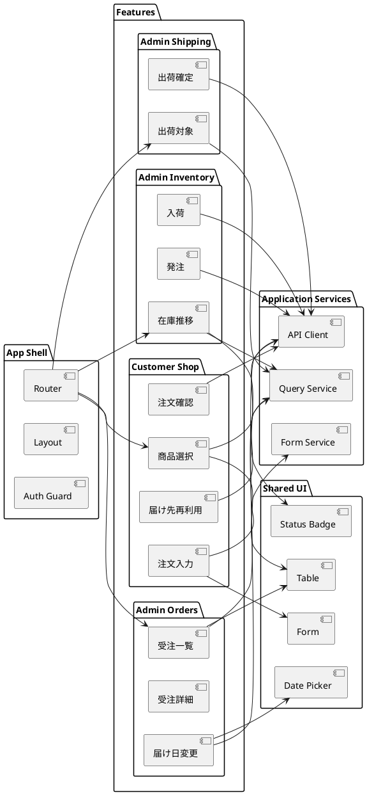

# フロントエンドアーキテクチャ

本書は、得意先向けの注文体験とスタッフ向けの管理体験を両立するフロントエンド設計方針を定義します。顧客画面と管理画面は同一プロダクト内で提供しつつ、機能単位で分離した構成を採用します。

## アーキテクチャ選定

### 採用パターン

- パターン: ルート駆動 + Feature 単位のフロントエンドアーキテクチャ
- UI 構成: 顧客向け画面と管理画面を機能モジュールで分割
- 状態管理: サーバー状態と UI 状態を分離
- 通信方式: バックエンド REST API を利用

### 選定理由

- 顧客向け注文導線とスタッフ向け業務画面では、画面数、操作頻度、求められる一覧性が大きく異なる
- フェーズごとに機能追加されるため、注文、在庫、発注、出荷の単位で分割した方が変更影響を局所化しやすい
- 注文入力やフィルター条件などの一時的な UI 状態と、API から取得するサーバー状態を分離した方がテストしやすい

## 画面領域の分割

| 領域 | 主な利用者 | 主な責務 | 対応ストーリー |
| :--- | :--- | :--- | :--- |
| Customer Shop | 得意先 | 商品選択、注文入力、確認、届け先再利用 | US-01、US-02、US-07 |
| Admin Orders | 受注スタッフ | 受注一覧、受注詳細、届け日変更 | US-03、US-08 |
| Admin Inventory | 仕入スタッフ | 在庫推移確認、発注、入荷 | US-04、US-05、US-06 |
| Admin Shipping | フローリスト、受注スタッフ | 出荷対象確認、結束完了登録、出荷確定 | US-09、US-09B、US-10 |

## 論理構成

## 状態管理方針

- サーバー状態:
  - 受注一覧、在庫推移、出荷対象など、API 由来の状態
  - 取得、再取得、エラーハンドリングを Query 層に集約する
- UI 状態:
  - 注文フォーム入力値、検索条件、モーダル開閉、選択中行
  - 画面ローカルに保持し、必要な場合のみ URL やフォームサービスに反映する
- 認証状態:
  - 顧客とスタッフで責務が異なるため、ルート単位で認可ガードを分ける

## コンポーネント設計方針

- `App Shell`: ルーティング、共通レイアウト、認証ガード
- `Feature`: 画面とユースケースに直結するコンポーネント群
- `Shared UI`: 汎用テーブル、フォーム、ステータス表示などの再利用部品
- `Application Services`: API 呼び出し、レスポンス整形、画面向け DTO 変換

## 画面遷移の基本方針

- 顧客向け注文導線は、商品選択 → 注文入力 → 注文確認 → 完了 の直線的な遷移を維持する
- 管理画面は一覧から詳細へ遷移し、詳細内アクションで変更や確定を行う
- 在庫、発注、入荷、出荷はタスク中心のワークベンチ型 UI とする

## エラーハンドリング方針

- 業務エラーと通信エラーを分けて表示する
- 例:
  - 届け日変更不可
  - 在庫不足
  - 対象データなし
  - 通信失敗
- 顧客向け画面では入力継続を優先し、スタッフ向け画面では原因特定に必要な情報を優先する

## テスト容易性の方針

- Feature 単位で画面振る舞いをテストできる構造にする
- API 依存を Application Services に閉じ込め、画面テストではモックしやすくする
- Shared UI は見た目よりも操作契約を重視してテストする

## 後続設計への入力

- `analyzing-ui-design` では、顧客注文導線と管理画面ワークベンチの画面遷移とワイヤーフレームを詳細化する
- `analyzing-tech-stack` では、ルーティング、状態管理、フォーム、テストの具体技術を選定する
- `creating-adr` では、Feature 単位分割とサーバー状態 / UI 状態分離の方針を記録する
