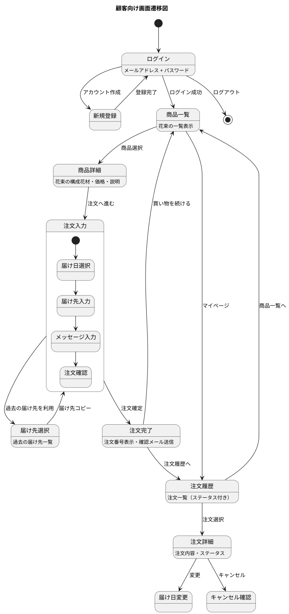
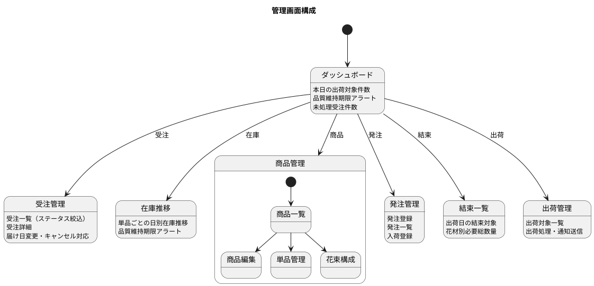

# フロントエンドアーキテクチャ - フレール・メモワール WEB ショップシステム

## アーキテクチャ方針

### 選定結果

| 項目 | 選定 |
| :--- | :--- |
| レンダリング方式 | Django Template（SSR）+ HTMX |
| スタイリング | Tailwind CSS |
| インタラクション | HTMX + Alpine.js |
| 管理画面 | Django Admin（カスタマイズ） |
| テスト | Playwright（E2E）、pytest（テンプレートテスト） |

### 選定理由

**Django Template + HTMX を選定した理由**:

- Django モノリシックアーキテクチャとの親和性が最も高い
- SPA フレームワーク（React/Vue）を導入すると、フロントエンドとバックエンドの分離が必要になり、小規模チームの負担が増大する
- HTMX は HTML 属性ベースでサーバーサイドレンダリングを拡張でき、JavaScript を最小限に抑えられる
- Alpine.js は軽量な JavaScript フレームワークで、カレンダー選択等の局所的なインタラクションに適している
- SEO はフラワーショップの WEB ショップとして重要であり、SSR が有利

**Django Admin を管理画面に選定した理由**:

- モデル定義から自動的に CRUD 画面が生成される
- カスタマイズ性が高く、在庫推移表示等のカスタム画面も追加可能
- 認証・認可が標準装備
- スタッフ向けの管理機能を最小限の工数で実現できる

## 画面構成

### 顧客向け画面（得意先用）



### 管理画面（スタッフ用）



## テンプレート構成

```
templates/
├── base.html                    # 共通レイアウト
├── components/                  # 再利用可能コンポーネント
│   ├── _navbar.html
│   ├── _footer.html
│   ├── _pagination.html
│   └── _alert.html
├── shop/                        # 顧客向け
│   ├── product_list.html
│   ├── product_detail.html
│   ├── order_form.html
│   ├── order_confirm.html
│   ├── order_complete.html
│   ├── order_history.html
│   ├── order_detail.html
│   ├── delivery_address_list.html
│   └── partials/               # HTMX 部分更新用
│       ├── _delivery_date_picker.html
│       ├── _delivery_address_copy.html
│       └── _order_status.html
├── accounts/                    # 認証
│   ├── login.html
│   └── register.html
└── admin/                       # Django Admin カスタマイズ
    └── inventory/
        └── stock_forecast.html  # 在庫推移カスタム画面
```

## HTMX によるインタラクション

### 届け日選択の動的更新

```html
<!-- 商品選択後、届け日カレンダーを動的更新 -->
<select name="product" hx-get="/api/available-dates/" hx-target="#date-picker">
  
  <option value="{{ product.id }}">{{ product.name }}</option>
  
</select>
<div id="date-picker">
  <!-- HTMX でサーバーから届け日候補を取得して差し替え -->
</div>
```

### 届け先コピーの非同期読み込み

```html
<!-- 過去の届け先一覧を HTMX で非同期取得 -->
<button hx-get="/api/delivery-addresses/"
        hx-target="#address-form"
        hx-swap="outerHTML">
  過去の届け先を利用
</button>
```

## レスポンシブ対応

| 画面 | 対応方針 |
| :--- | :--- |
| 顧客向け画面 | モバイルファースト（Tailwind CSS のレスポンシブユーティリティ） |
| 管理画面 | デスクトップ優先（Django Admin のデフォルトレスポンシブ対応） |
| 結束一覧 | タブレット対応（作業場での利用を想定） |

## テスト戦略

| テスト種別 | 対象 | ツール |
| :--- | :--- | :--- |
| テンプレートテスト | HTML 出力の正確性 | pytest-django (assertContains) |
| HTMX テスト | 部分更新の正確性 | pytest-django (hx-target 検証) |
| E2E テスト | 注文フロー全体 | Playwright |
| アクセシビリティ | WCAG 2.1 AA | axe-core (Playwright 連携) |
