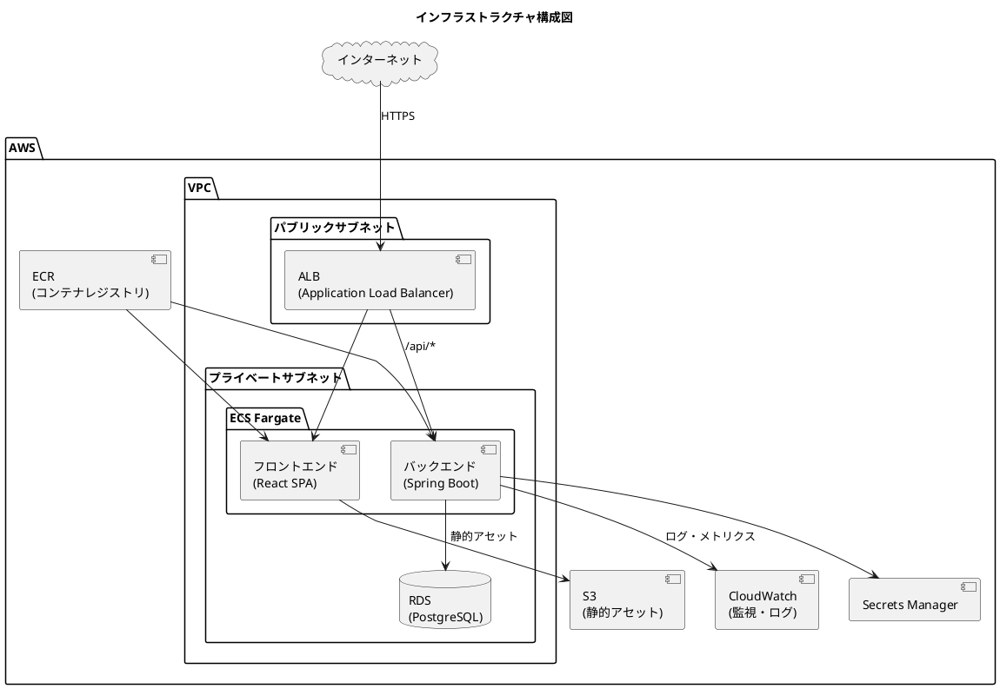
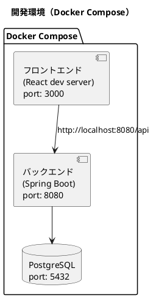
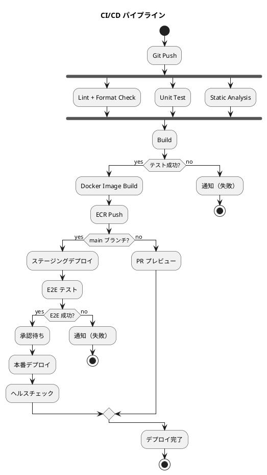

# インフラストラクチャアーキテクチャ設計 - フレール・メモワール WEB ショップシステム

## デプロイメントパターン選定

### プロジェクト分析

| 分析項目 | 判定 | 根拠 |
|:---|:---|:---|
| システム規模 | 小〜中規模 | ユーザー数は限定的（個人顧客 + スタッフ数名） |
| チーム規模 | 1〜2 名 | フルスタック開発者 |
| トラフィック | 低〜中程度 | 花束注文のため急激なスパイクは想定しにくい |
| 可用性要件 | 中程度 | 注文を逃さない程度の可用性は必要 |

### 選定結果

**デプロイメントパターン**: コンテナベースのモノリシックデプロイメント

**クラウドプロバイダ**: AWS

### 選定理由

1. **モノリシック**: マイクロサービスは運用複雑性が高すぎる。1〜2 名のチームで運用可能な構成を優先する
2. **コンテナ化**: Docker による環境の一貫性確保。将来的なスケールアウトへの備え
3. **AWS**: エコシステムの充実、ECS Fargate によるコンテナ管理の簡素化

## 全体構成

## 環境構成

| 環境 | 用途 | 構成 |
|:---|:---|:---|
| 開発環境 | ローカル開発 | Docker Compose（フロント + バック + PostgreSQL） |
| ステージング環境 | 結合テスト・受入テスト | AWS ECS Fargate（最小構成） |
| 本番環境 | サービス提供 | AWS ECS Fargate（冗長構成） |

### 開発環境構成

## ネットワーク設計

| 項目 | 設定 |
|:---|:---|
| VPC CIDR | 10.0.0.0/16 |
| パブリックサブネット | 10.0.1.0/24, 10.0.2.0/24（2 AZ） |
| プライベートサブネット | 10.0.10.0/24, 10.0.20.0/24（2 AZ） |
| ALB | パブリックサブネットに配置、HTTPS 終端 |
| ECS タスク | プライベートサブネットに配置 |
| RDS | プライベートサブネットに配置、マルチ AZ |

## セキュリティ設計

| 領域 | 対策 |
|:---|:---|
| 通信暗号化 | ALB で HTTPS 終端（ACM 証明書） |
| 認証 | JWT トークンベース認証 |
| シークレット管理 | AWS Secrets Manager でDB 接続情報・JWT シークレットを管理 |
| ネットワーク分離 | パブリック/プライベートサブネットの分離 |
| セキュリティグループ | ALB→ECS→RDS の最小限ポート開放 |
| WAF | AWS WAF で OWASP Top 10 対策 |

## CI/CD パイプライン

| フェーズ | ツール | 内容 |
|:---|:---|:---|
| CI | GitHub Actions | Lint、テスト、ビルド、コンテナイメージ作成 |
| コンテナレジストリ | AWS ECR | Docker イメージの保管 |
| CD | GitHub Actions + ECS | ECS サービスのローリングアップデート |
| IaC | Terraform | インフラリソースのコード管理 |

## デプロイメント戦略

**本番デプロイ**: ローリングアップデート

- ECS サービスのローリングアップデートにより、ゼロダウンタイムデプロイを実現する
- ブルーグリーンデプロイは将来的にトラフィック増加時に検討する

## 監視設計

| 監視対象 | ツール | メトリクス |
|:---|:---|:---|
| アプリケーションログ | CloudWatch Logs | エラーログ、アクセスログ |
| メトリクス | CloudWatch Metrics | CPU、メモリ、リクエスト数、レイテンシ |
| アラート | CloudWatch Alarms + SNS | エラー率閾値超過、CPU 使用率 |
| ヘルスチェック | ALB ヘルスチェック | `/actuator/health` エンドポイント |

## バックアップ・災害復旧

| 項目 | 設定 |
|:---|:---|
| RDS バックアップ | 自動バックアップ（7 日間保持） |
| RDS スナップショット | 週次手動スナップショット |
| RPO | 1 時間以内 |
| RTO | 4 時間以内 |
| DR 戦略 | バックアップ & リストア（コスト優先） |

## コスト最適化

| リソース | 最適化方針 |
|:---|:---|
| ECS Fargate | 最小タスクサイズ（0.25 vCPU / 0.5 GB）で開始し、負荷に応じて調整 |
| RDS | db.t3.micro で開始、必要に応じてスケールアップ |
| ALB | 常時稼働（固定費最小化のため Application Load Balancer） |
| S3 | 静的アセットのみ、ライフサイクルポリシーで不要ファイルを自動削除 |

---

## 記入履歴

| 日付 | 更新内容 |
|------|----------|
| 2026-03-20 | 初版作成 |
