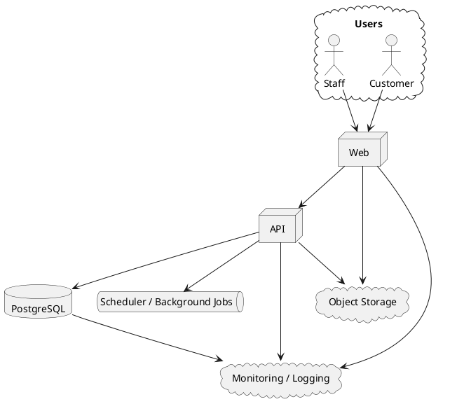
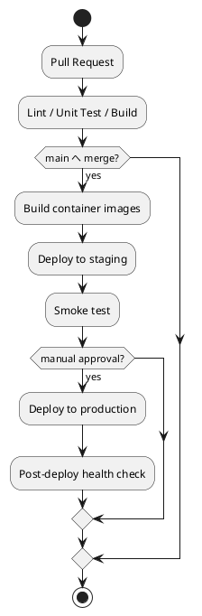

# インフラストラクチャアーキテクチャ設計

## 1. 文書の目的

本書は、フレール・メモワール WEB ショップシステムを小規模な XP チームで継続運用するための、実用的なインフラ方針を定義するものです。

対象範囲は以下です。

- ローカル / 開発環境
- CI/CD の高レベル戦略
- コンテナ化方針
- デプロイ方式
- 監視、ログ、メトリクス

## 2. インフラ方針

### 2.1 採用方針

**コンテナ化した Web / API を、マネージドなコンテナ実行基盤とマネージド PostgreSQL へ配置する構成**を推奨します。

- 1 〜 2 名チームのため、Kubernetes は採用しません
- 環境は `local`、`staging`、`production` の 3 段階を基本とします
- Web と API は別コンテナですが、同一リポジトリ / 同一 CI で管理します
- データベースは 1 系統の PostgreSQL を利用します
- バッチは API アプリ内の scheduler から開始し、必要時に分離します

### 2.2 選定理由

- コンテナによりローカルと本番の差分を減らせます
- マネージド DB によりバックアップ、フェイルオーバー、運用負荷を抑えられます
- コンテナ基盤を使えば、将来 Web / API のスケール条件がずれても分離しやすいです
- 小規模チームに対して、Kubernetes やサービスメッシュは過剰です

## 3. 環境構成

### 3.1 環境一覧

| 環境 | 目的 | 特徴 |
| :--- | :--- | :--- |
| `local` | 開発、TDD、画面確認 | Docker Compose、ホットリロード、テスト DB |
| `staging` | 受け入れ確認、結合確認 | 本番相当設定、縮小データ、手動承認付きデプロイ |
| `production` | 本番運用 | 高可用 DB、バックアップ、監視、アラート |

### 3.2 推奨構成図

## 4. ローカル / 開発環境

### 4.1 基本方針

現在のリポジトリには `Dockerfile` と `docker-compose.yml` があり、Node ベースの開発環境を整えやすい状態です。この方針を発展させ、アプリ実装フェーズでは以下を追加する構成を推奨します。

- `web`
- `api`
- `postgres`
- `mkdocs`
- `plantuml`

### 4.2 ローカル構成の考え方

| 要素 | 方針 |
| :--- | :--- |
| Node 実行環境 | 既存の Dockerfile を活用する |
| ドキュメント確認 | 既存の `mkdocs` サービスを継続利用する |
| データベース | PostgreSQL を Compose に追加する |
| テストデータ | seed で再生成可能にする |
| バックグラウンド処理 | 初期は API コンテナ内で実行する |

### 4.3 開発者体験の優先事項

- `docker compose up` で主要依存が起動できること
- Web / API と DB の接続先が環境変数で明確であること
- スキーマ変更時にローカル再現が容易であること
- テスト用 DB を分離し、並列テストで衝突しないこと

## 5. コンテナ化方針

### 5.1 コンテナ単位

| コンテナ | 役割 |
| :--- | :--- |
| `web` | 顧客向け / スタッフ向けフロントエンド |
| `api` | 業務ロジック、REST API、scheduler |
| `postgres` | トランザクションデータと projection |
| `mkdocs` | 設計 / 分析ドキュメントのプレビュー |

### 5.2 イメージ戦略

- 既存の GHCR 公開フローを継続活用します
- 将来的には `web` と `api` のイメージを分けて publish できるようにします
- マルチステージビルドでランタイムイメージを小さく保ちます
- Node のバージョンはリポジトリ全体で統一します

## 6. CI/CD 戦略

### 6.1 現状

現リポジトリには以下の GitHub Actions が存在します。

- `mkdocs.yml`
  - ドキュメントビルドと GitHub Pages デプロイ
- `docker-publish.yml`
  - タグ契機の Docker イメージ publish

この既存資産を活かしつつ、アプリケーション実装後は CI/CD を段階拡張します。

### 6.2 推奨パイプライン

### 6.3 最小構成の CI

- format / lint
- unit test
- integration test
- frontend build
- backend build
- docs build

### 6.4 デプロイ戦略

- `staging` は `main` マージで自動デプロイ
- `production` はタグまたは手動承認でデプロイ
- まずは Rolling Update で十分です
- Blue/Green や Canary は負荷や変更頻度が高まった段階で検討します

## 7. デプロイ方針

### 7.1 推奨方式

**マネージドコンテナサービス + マネージド PostgreSQL** を推奨します。

候補例は以下です。

- AWS ECS Fargate + RDS PostgreSQL
- Render / Railway / Fly.io + Managed PostgreSQL

### 7.2 採用基準

| 観点 | 判断 |
| :--- | :--- |
| チーム規模 | 小さいため、運用自動化よりサービス運用負荷の低さを優先する |
| 初期コスト | 過剰な冗長化よりも段階的拡張を優先する |
| 将来拡張性 | Web / API 別スケールが可能な構成にする |
| 運用しやすさ | GitHub Actions から自動デプロイしやすいものを優先する |

### 7.3 ネットワークの考え方

- `web` は公開
- `api` は `web` と運用者ネットワークからのみ到達可能にする
- `db` は private 配置にし、直接公開しない
- 管理画面アクセスを VPN や IP 制限で絞るかは規模拡大時の検討事項とします

## 8. データ管理とバックアップ

### 8.1 データベース方針

- PostgreSQL を正本とします
- 受注、在庫 projection、発注、入荷、出荷を同一 DB に置きます
- スキーマ変更は migration 管理下に置きます

### 8.2 バックアップ方針

| 項目 | 方針 |
| :--- | :--- |
| 自動バックアップ | 日次 |
| 保持期間 | 7 〜 30 日を初期目安 |
| リストア確認 | 月次またはリリース単位で手順確認 |
| オブジェクトストレージ | 商品画像を置く場合は versioning を有効化 |

## 9. 監視、ログ、オブザーバビリティ

### 9.1 方針

小規模チームでは、**まず壊れたことが分かること、次に原因を追えること**を重視します。分散トレースを最初から作り込みすぎる必要はありません。

### 9.2 最低限の監視対象

| 対象 | 指標 |
| :--- | :--- |
| Web | 応答時間、5xx 率、主要ページの availability |
| API | レイテンシ、エラー率、注文 / 変更 / 発注 API の成功率 |
| DB | CPU、接続数、遅いクエリ、ストレージ使用量 |
| 業務指標 | 受注件数、変更失敗件数、在庫不足判定件数、廃棄リスク件数 |
| Job | 実行回数、失敗回数、遅延 |

### 9.3 ログ方針

- 構造化ログを採用します
- `requestId`、`orderId`、`customerId`、`shipDate` をログ相関キーにします
- 個人情報はマスキング方針を定めます
- 監査上重要な操作は業務イベントログとして残します

### 9.4 アラート方針

- 注文 API の継続失敗
- 届け日変更判定 API の異常増加
- バッチ失敗の連続発生
- DB 接続逼迫

## 10. セキュリティ方針

### 10.1 基本方針

- 環境変数は Secrets 管理に置き、リポジトリへ置かない
- `web` と `api` の通信は TLS を前提とする
- スタッフ画面には認証 / 認可を必須とする
- 監査対象操作を記録する
- 依存パッケージの脆弱性チェックを CI に組み込む

### 10.2 認証 / 認可の観点

- 顧客向けは将来的な再注文体験に備え、セッション管理を追加できる構成にする
- スタッフ向けはロールベースアクセス制御を前提にする
- 認証基盤の詳細実装は別設計で詰めます

## 11. 段階的実施

### 11.1 フェーズ 1

- `web` と `api` のコンテナ分離
- PostgreSQL 導入
- GitHub Actions で build / test / docs build
- `staging` への自動デプロイ

### 11.2 フェーズ 2

- production デプロイ自動化
- ログ集約とアラート導入
- DB バックアップ / リストア手順整備

### 11.3 フェーズ 3

- 画像ストレージ導入
- scheduler の安定化と失敗時再実行
- 業務メトリクスの可視化ダッシュボード整備

## 12. リスク

| リスク | 影響 | 対策 |
| :--- | :--- | :--- |
| 小規模チームに対して基盤が重くなる | 実装が遅れる | Kubernetes を避け、マネージドサービス優先にする |
| ローカルと本番の差分が大きい | 障害再現が難しい | Compose とコンテナイメージを共通化する |
| 監視が不足して障害検知が遅れる | 信頼低下 | API / DB / Job の最低限メトリクスを先に揃える |
| DB が単一障害点になる | 受注停止 | マネージド DB、定期バックアップ、復旧手順を整備する |

## 13. 関連 ADR

- [ADR-004: Web / API のコンテナ分離と managed PostgreSQL を採用する](../adr/004-container-platform-and-managed-postgresql.md)

## 14. TBD

- クラウドベンダーの最終選定
- Secret 管理方式の具体化
- 画像配信基盤の有無
- 本番監視基盤の具体サービス選定
