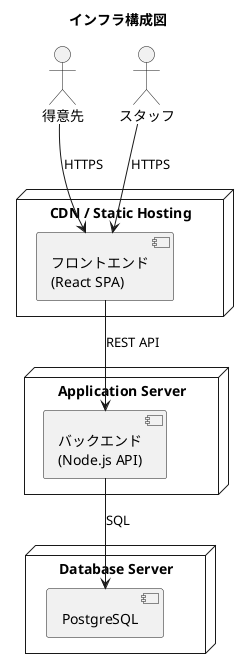
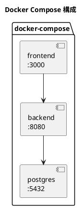
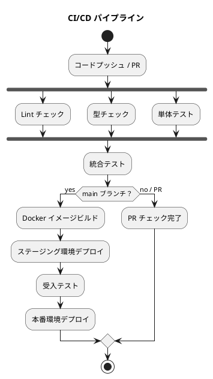

# インフラストラクチャアーキテクチャ - フレール・メモワール WEB ショップシステム

## インフラ構成選定

### 選定結果: クラウド（シンプル構成）

**選定理由:**

- 小規模チームでの運用のため、管理コストを最小化する
- 初期フェーズはシンプルな構成から始め、スケールアウトは需要に応じて対応
- コンテナ化により環境差異を排除し、デプロイを安定化する

## システム構成図

## 環境構成

| 環境 | 用途 | 構成 |
| :--- | :--- | :--- |
| ローカル | 開発・テスト | Docker Compose |
| ステージング | 結合テスト・受入テスト | クラウド（本番同等） |
| 本番 | 運用 | クラウド |

## コンテナ化戦略

### Docker Compose（ローカル開発）

### コンテナ構成

| サービス | イメージ | ポート |
| :--- | :--- | :--- |
| frontend | node:22-alpine | 3000 |
| backend | node:22-alpine | 8080 |
| postgres | postgres:16-alpine | 5432 |

## CI/CD パイプライン

### パイプライン設定

| ステップ | ツール | トリガー |
| :--- | :--- | :--- |
| Lint | ESLint | PR / push |
| 型チェック | tsc | PR / push |
| 単体テスト | Vitest | PR / push |
| 統合テスト | Vitest | PR / push |
| ビルド | Docker | main push |
| デプロイ | GitHub Actions | main push |

## デプロイ方針

- **フロントエンド**: 静的ファイルを CDN / Static Hosting にデプロイ（GitHub Pages 等）
- **バックエンド**: Docker コンテナをアプリケーションサーバーにデプロイ
- **データベース**: マネージドサービスを利用（運用負荷を最小化）
- **マイグレーション**: Prisma Migrate でスキーマ変更を管理

## アーキテクチャ決定記録（ADR）

### ADR-005: ローカル開発環境に Docker Compose を採用

- **ステータス**: 承認済
- **決定**: Docker Compose を採用する
- **理由**: 環境差異を排除し、チームメンバー間で同一の開発環境を共有できる。セットアップコストが低い
- **代替案**: ローカル直接インストール（環境差異が発生しやすい）

### ADR-006: CI/CD に GitHub Actions を採用

- **ステータス**: 承認済
- **決定**: GitHub Actions を採用する
- **理由**: GitHub リポジトリと統合されており、追加コストなしで利用できる。設定がシンプル
- **代替案**: CircleCI / Jenkins（追加コスト・管理コストが発生）
