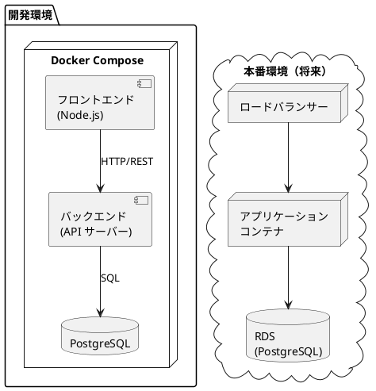
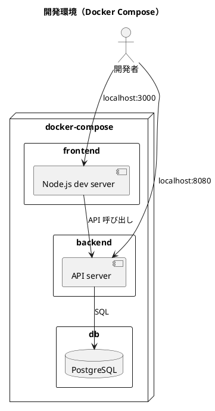
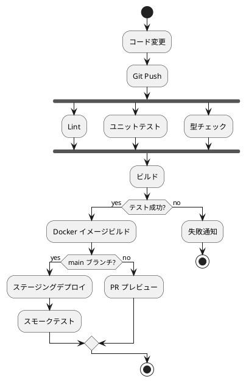

# インフラストラクチャアーキテクチャ - フレール・メモワール WEB ショップ

## アーキテクチャ選定

| 判断ポイント | 選定 | 理由 |
| :--- | :--- | :--- |
| デプロイメント | **モノリシック** | 小規模チーム（1-2 名）、UC 11 件。マイクロサービスは過剰 |
| ホスティング | **コンテナ（Docker）** | ローカル開発と本番の環境差異を最小化。将来の拡張性も確保 |
| データベース | **PostgreSQL** | リレーショナルデータ中心。在庫推移計算にSQL の集計機能が有効 |
| IaC | **Docker Compose（開発）** | 小規模のため。本番は AWS ECS 等を検討 |
| CI/CD | **GitHub Actions** | リポジトリと統合。自動テスト・ビルド・デプロイ |

## 全体構成

## 開発環境構成

## CI/CD パイプライン

## デプロイメント戦略

- **開発環境**: Docker Compose でローカル起動
- **ステージング**: GitHub Actions → Docker イメージ → デプロイ
- **本番**: ローリングデプロイ（将来的に Blue/Green を検討）

## モニタリング

| カテゴリ | 対象 | ツール |
| :--- | :--- | :--- |
| アプリケーション | レスポンスタイム、エラー率 | アプリケーションログ |
| インフラ | CPU、メモリ、ディスク | Docker stats / CloudWatch（将来） |
| ビジネス | 受注件数、廃棄率 | アプリケーション内ダッシュボード |
