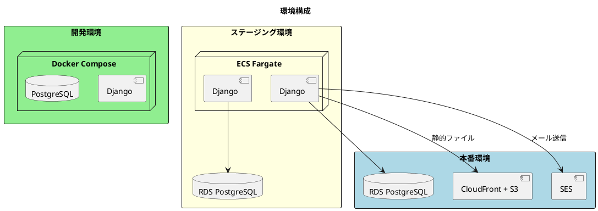
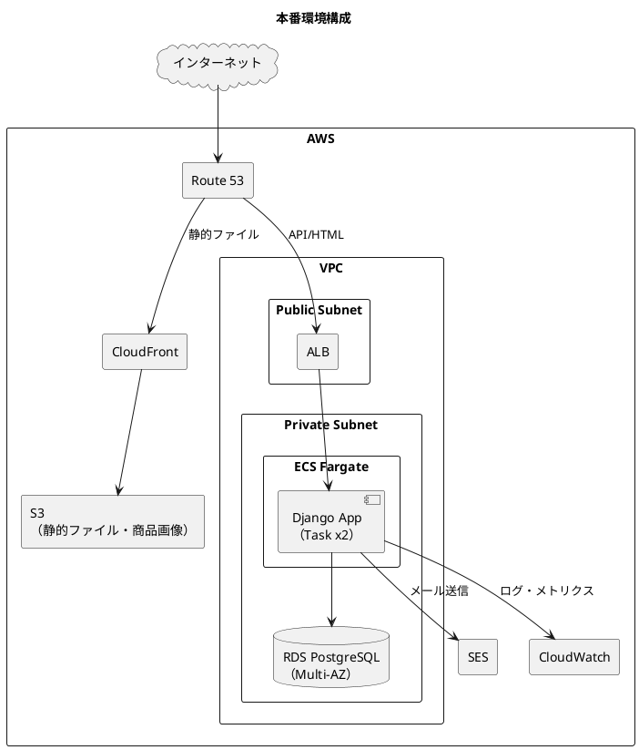
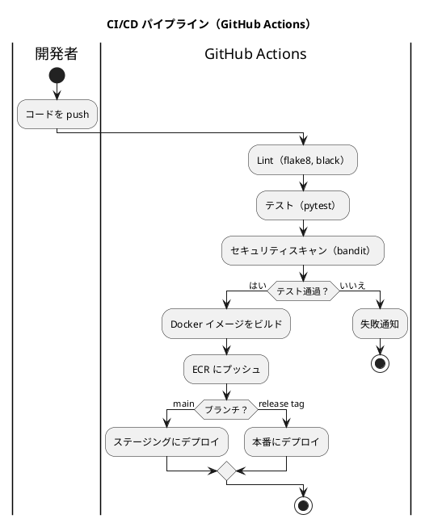

# インフラストラクチャアーキテクチャ - フレール・メモワール WEB ショップシステム

## アーキテクチャ方針

### 選定結果

| 項目 | 選定 |
| :--- | :--- |
| クラウド | AWS |
| コンテナ化 | Docker + Docker Compose（開発）、ECS Fargate（本番） |
| データベース | Amazon RDS PostgreSQL 16 |
| CI/CD | GitHub Actions |
| 静的ファイル | Amazon S3 + CloudFront |
| メール送信 | Amazon SES |
| ドメイン/DNS | Amazon Route 53 |
| 監視 | Amazon CloudWatch |

### 選定理由

- **AWS**: 段階的なスケールに対応可能。ECS Fargate によりサーバー管理不要のコンテナ運用が可能
- **ECS Fargate**: EC2 のサーバー管理が不要で、小規模チームの運用負荷を最小化
- **RDS PostgreSQL**: マネージドサービスによりバックアップ・パッチ適用が自動化

## 環境構成



| 環境 | 用途 | 構成 |
| :--- | :--- | :--- |
| 開発 | ローカル開発 | Docker Compose（Django + PostgreSQL） |
| ステージング | テスト・検証 | ECS Fargate + RDS |
| 本番 | 商用運用 | ECS Fargate + RDS + CloudFront + SES |

## 本番環境アーキテクチャ



## CI/CD パイプライン



## Docker 構成（開発環境）

```yaml
# docker-compose.yml（開発環境）
services:
  web:
    build: .
    command: python manage.py runserver 0.0.0.0:8000
    volumes:
      - .:/app
    ports:
      - "8000:8000"
    depends_on:
      - db
    environment:
      - DATABASE_URL=postgres://user:pass@db:5432/fleur_memoire

  db:
    image: postgres:16
    environment:
      POSTGRES_DB: fleur_memoire
      POSTGRES_USER: user
      POSTGRES_PASSWORD: pass
    ports:
      - "5432:5432"
    volumes:
      - pgdata:/var/lib/postgresql/data

volumes:
  pgdata:
```

## 非機能要件との対応

| 非機能要件 | 実現方法 |
| :--- | :--- |
| 可用性 | ECS Fargate Task x2 + ALB、RDS Multi-AZ |
| スケーラビリティ | ECS Auto Scaling（CPU/メモリベース） |
| セキュリティ | VPC Private Subnet、Security Group、HTTPS（ACM） |
| バックアップ | RDS 自動バックアップ（7 日間保持） |
| 監視 | CloudWatch Logs + Alarms |
| 静的ファイル配信 | S3 + CloudFront（低レイテンシ） |
| メール送信 | SES（注文確認・出荷通知） |

## コスト見積もり（月額概算）

| サービス | 構成 | 月額概算 |
| :--- | :--- | :--- |
| ECS Fargate | 0.25 vCPU x 0.5 GB x 2 タスク | $15 |
| RDS PostgreSQL | db.t4g.micro、Multi-AZ | $30 |
| S3 | 10 GB | $1 |
| CloudFront | 10 GB 転送量 | $1 |
| SES | 1,000 通/月 | $1 |
| Route 53 | 1 ホストゾーン | $1 |
| ALB | 1 台 | $20 |
| **合計** | | **約 $70/月** |

※ 小規模運用を想定した最小構成。受注量の増加に応じて ECS タスク数と RDS インスタンスクラスをスケールアップ
