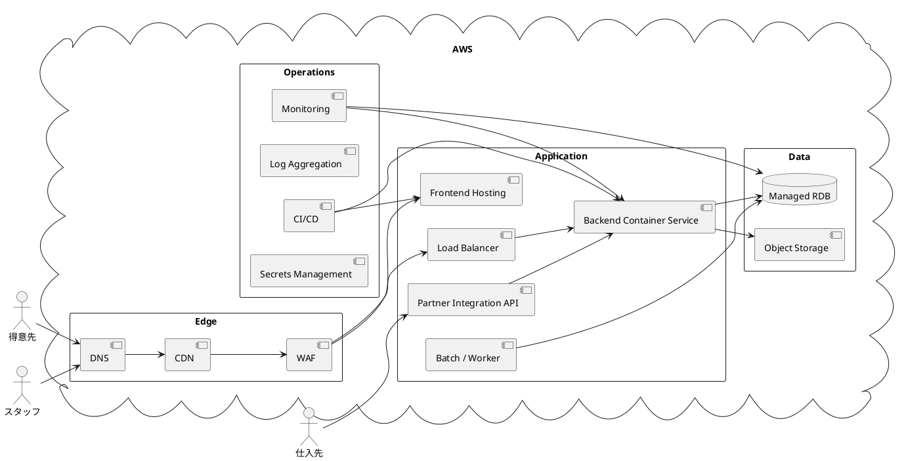

# インフラストラクチャアーキテクチャ

本書は、WEB ショップシステムを運用するためのインフラ構成方針を定義します。小規模から開始しつつ、受注増加と運用自動化に対応できるよう、マネージドサービス中心の構成を採用します。

## アーキテクチャ選定

### 採用方針

- クラウド前提の Web 3 層構成
- アプリケーション実行基盤はコンテナを前提とする
- データストアは運用負荷を抑えるためマネージド RDB を採用する
- 静的アセット配信とアプリケーション API を分離する

### 選定理由

- 顧客向け画面は継続的に公開されるため、静的配信と API 提供を分離した方が配信効率と運用性が高い
- 管理画面と API を同一バックエンド配下で管理しつつ、将来のスケールに備えてコンテナ化しておきたい
- 現段階では少人数運用が前提のため、サーバー管理や DB 運用をできる限りサービス側に委譲したい

## 全体構成

## 環境構成方針

| 環境 | 目的 | 方針 |
| :--- | :--- | :--- |
| Local | 開発者の実装、単体テスト、結合確認 | コンテナベースで再現性を確保する |
| Development | 日常開発の共有確認 | 低コスト構成でよいが、本番に近いデプロイ方式を使う |
| Staging | リリース前検証 | 本番相当構成でリハーサルを行う |
| Production | 顧客提供 | 可用性、監視、バックアップを最優先する |

## 配置方針

- フロントエンド:
  - 静的資産またはサーバーサイドレンダリング成果物をホスティング基盤へ配置する
- バックエンド:
  - コンテナイメージとしてビルドし、コンテナサービスへデプロイする
- バッチ / Worker:
  - 在庫投影再計算、通知、定期保守処理を分離可能な構成にする

## セキュリティ方針

- 顧客向けと管理向けの認証境界を分離する
- 外部公開面は CDN / WAF / Load Balancer 配下に限定する
- 仕入先連携は顧客 / 管理画面とは別の partner API 境界で受け、認証と監査を分離する
- アプリケーションと DB はプライベートネットワーク内で接続する
- シークレットは環境変数直書きではなく、専用の Secrets 管理サービスで扱う
- 監査対象となる操作ログを保持できる構成にする

## Partner API 最低契約

- 認証:
  - 仕入先ごとの API credential または署名鍵で認証する
- 冪等性:
  - 書き込み系リクエストは `Idempotency-Key` を必須とする
- 再送:
  - タイムアウト時は同一 `Idempotency-Key` で再送可能とする
- エラーモデル:
  - `4xx` は入力 / 認証エラー、`5xx` は再試行候補として扱う
- 監査:
  - 仕入先 ID、相関 ID、受付時刻、結果コードを必ず記録する

## 可用性と運用性

- アプリケーションはコンテナの水平入れ替えで無停止に近い更新を行う
- DB は自動バックアップ、スナップショット、ポイントインタイムリカバリを前提とする
- 監視対象は API 応答、エラー率、DB 接続、ジョブ失敗、インフラメトリクスとする
- ログはアプリケーションログ、アクセスログ、監査ログを分離して収集する

## CI/CD 方針

- Pull Request 時に Lint、テスト、ビルドを実行する
- メインブランチ反映後に Development へ自動デプロイできる構成を目指す
- Staging / Production は承認付きデプロイを前提とする
- インフラ定義は IaC で管理し、手動変更を避ける

## 後続設計への入力

- `analyzing-tech-stack` で、クラウドサービス、コンテナ基盤、監視、CI/CD の具体サービスを確定する
- `analyzing-non-functional` で、性能、可用性、RTO / RPO、セキュリティ要件を定量化する
- `analyzing-operation` で、監視項目、障害対応手順、バックアップ運用を詳細化する
