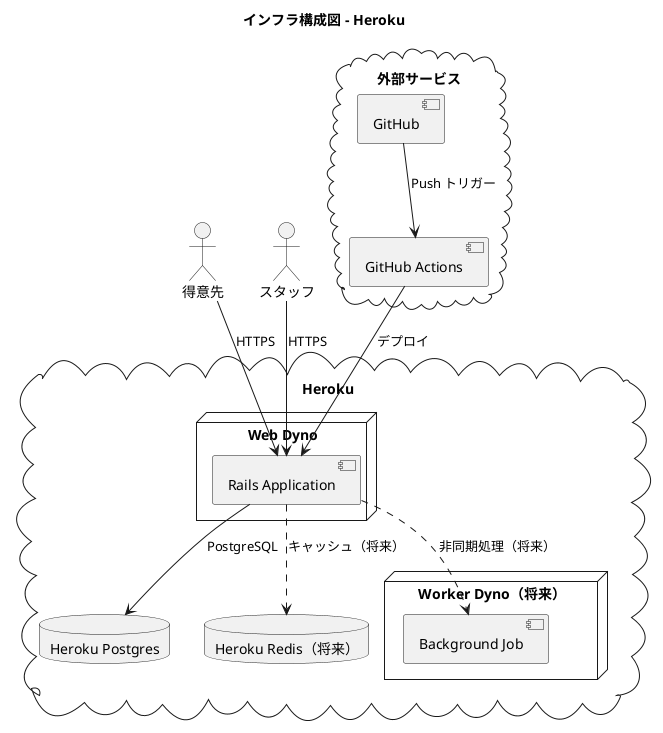
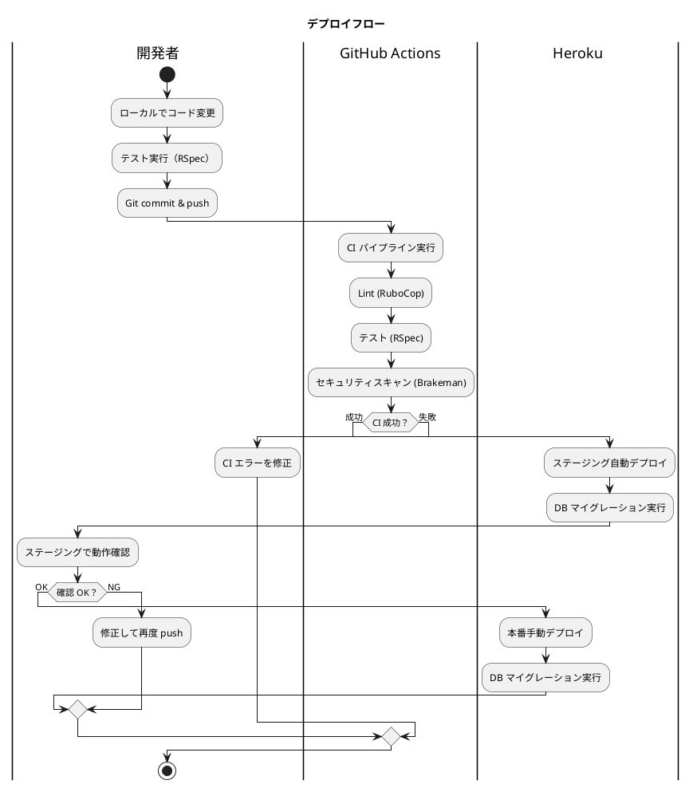

# インフラストラクチャアーキテクチャ設計

## インフラ方針: Heroku PaaS

### 選定理由

| 判断基準 | 判定 | 根拠 |
|---------|------|------|
| チーム規模 | 小（1-2 名） | インフラ専任がいない。運用負荷を最小化したい |
| トラフィック | 低〜中 | 個人顧客向け花束配送。大規模トラフィックは想定しない |
| 予算 | 小 | スモールスタートで段階的に投資 |
| デプロイ頻度 | 高 | XP のプラクティスに従い小さなリリースを頻繁に行う |

**結論**: Heroku を採用する。git push によるデプロイ、マネージドの PostgreSQL・Redis により、インフラ管理の負荷を最小限に抑える。将来のスケールアウト時に AWS 等への移行も可能。

### インフラ構成図

### 環境構成

| 環境 | 用途 | Heroku App 名 | データベース |
|------|------|--------------|-------------|
| 開発 | ローカル開発 | - | SQLite3（開発）/ PostgreSQL（Docker） |
| ステージング | 検証・受入テスト | frere-memoire-staging | Heroku Postgres (Mini) |
| 本番 | サービス提供 | frere-memoire-production | Heroku Postgres (Basic) |

### デプロイ戦略

### CI/CD パイプライン

| ステージ | ツール | 内容 |
|---------|--------|------|
| コード品質 | RuboCop | Ruby コードの静的解析 |
| テスト | RSpec | 単体・統合・E2E テストの実行 |
| セキュリティ | Brakeman | Rails セキュリティスキャン |
| セキュリティ | bundler-audit | gem の既知の脆弱性チェック |
| デプロイ（staging） | GitHub Actions + Heroku CLI | main ブランチへのマージで自動デプロイ |
| デプロイ（production） | Heroku CLI | 手動プロモート |

### スケーリング方針

| フェーズ | 構成 | 想定負荷 |
|---------|------|---------|
| 初期（MVP） | Web Dyno x1, Postgres Mini | 同時接続 10 以下 |
| 成長期 | Web Dyno x2, Postgres Basic | 同時接続 50 以下 |
| 将来 | AWS ECS 移行を検討 | 同時接続 50 超 |

### バックアップ方針

| 対象 | 方法 | 頻度 | 保持期間 |
|------|------|------|---------|
| データベース | Heroku PGBackups | 日次自動 | 直近 5 世代 |
| コード | GitHub リポジトリ | Push ごと | 無期限 |
| 環境変数 | .env ファイル（暗号化）| 変更時 | Git 管理外 |

### セキュリティ方針

| 項目 | 方針 |
|------|------|
| HTTPS | Heroku の自動 SSL（Let's Encrypt） |
| 環境変数 | Heroku Config Vars で管理。コードに含めない |
| 認証 | Devise による認証。セッション管理は Rails 標準 |
| CSRF 対策 | Rails 標準の authenticity_token |
| SQL インジェクション | ActiveRecord の Parameterized Query |
| XSS 対策 | Rails の自動エスケープ |
| セキュリティスキャン | Brakeman を CI で実行 |

### 監視・ログ

| 項目 | ツール | 内容 |
|------|--------|------|
| アプリケーションログ | Heroku Logs | `heroku logs --tail` |
| エラー監視 | Heroku の無料アドオン（将来: Sentry） | エラー通知 |
| パフォーマンス | Heroku Metrics | レスポンスタイム、メモリ使用量 |
