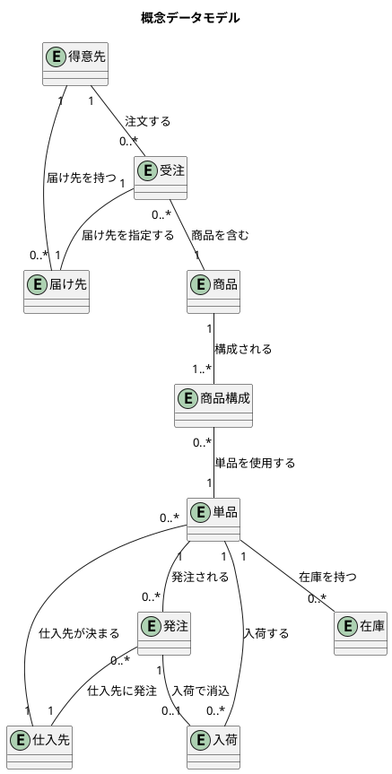
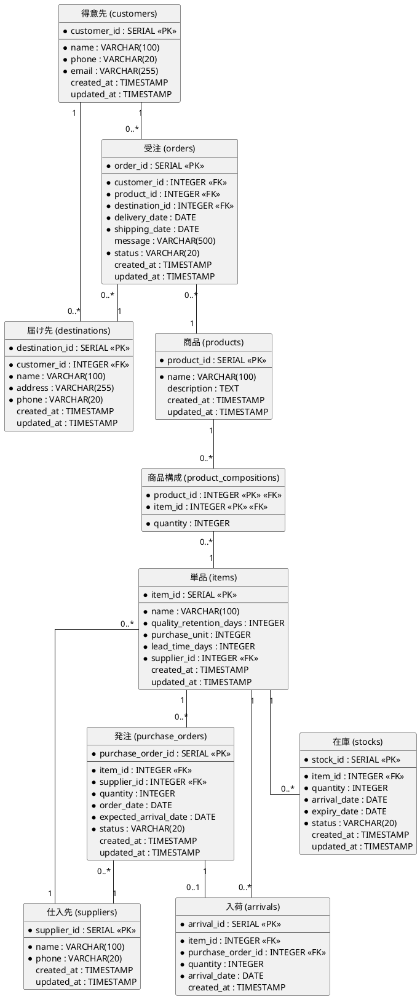

# データモデル設計 - フレール・メモワール WEB ショップ

## 概念データモデル



## 論理データモデル（ER 図）



## テーブル定義

### 得意先 (customers)

| カラム | 型 | 制約 | 説明 |
| :--- | :--- | :--- | :--- |
| customer_id | SERIAL | PK | 得意先 ID |
| name | VARCHAR(100) | NOT NULL | 得意先名 |
| phone | VARCHAR(20) | NOT NULL | 電話番号 |
| email | VARCHAR(255) | NOT NULL, UNIQUE | メールアドレス |
| created_at | TIMESTAMP | DEFAULT NOW() | 作成日時 |
| updated_at | TIMESTAMP | DEFAULT NOW() | 更新日時 |

### 届け先 (destinations)

| カラム | 型 | 制約 | 説明 |
| :--- | :--- | :--- | :--- |
| destination_id | SERIAL | PK | 届け先 ID |
| customer_id | INTEGER | FK → customers, NOT NULL | 得意先 ID |
| name | VARCHAR(100) | NOT NULL | 届け先名 |
| address | VARCHAR(255) | NOT NULL | 届け先住所 |
| phone | VARCHAR(20) | NOT NULL | 届け先電話番号 |
| created_at | TIMESTAMP | DEFAULT NOW() | 作成日時 |
| updated_at | TIMESTAMP | DEFAULT NOW() | 更新日時 |

### 受注 (orders)

| カラム | 型 | 制約 | 説明 |
| :--- | :--- | :--- | :--- |
| order_id | SERIAL | PK | 受注 ID |
| customer_id | INTEGER | FK → customers, NOT NULL | 得意先 ID |
| product_id | INTEGER | FK → products, NOT NULL | 商品 ID |
| destination_id | INTEGER | FK → destinations, NOT NULL | 届け先 ID |
| delivery_date | DATE | NOT NULL | 届け日 |
| shipping_date | DATE | NOT NULL | 出荷日（= 届け日の前日） |
| message | VARCHAR(500) | | お届けメッセージ |
| status | VARCHAR(20) | NOT NULL, DEFAULT '注文済み' | 受注状態 |
| created_at | TIMESTAMP | DEFAULT NOW() | 作成日時 |
| updated_at | TIMESTAMP | DEFAULT NOW() | 更新日時 |

**ビジネスルール**: `shipping_date = delivery_date - 1 day`

**status 値**: 注文済み / 出荷準備中 / 出荷済み / キャンセル

### 商品 (products)

| カラム | 型 | 制約 | 説明 |
| :--- | :--- | :--- | :--- |
| product_id | SERIAL | PK | 商品 ID |
| name | VARCHAR(100) | NOT NULL | 商品名（花束名） |
| description | TEXT | | 商品説明 |
| created_at | TIMESTAMP | DEFAULT NOW() | 作成日時 |
| updated_at | TIMESTAMP | DEFAULT NOW() | 更新日時 |

### 商品構成 (product_compositions)

| カラム | 型 | 制約 | 説明 |
| :--- | :--- | :--- | :--- |
| product_id | INTEGER | PK, FK → products | 商品 ID |
| item_id | INTEGER | PK, FK → items | 単品 ID |
| quantity | INTEGER | NOT NULL, CHECK > 0 | 必要数量 |

### 単品 (items)

| カラム | 型 | 制約 | 説明 |
| :--- | :--- | :--- | :--- |
| item_id | SERIAL | PK | 単品 ID |
| name | VARCHAR(100) | NOT NULL | 単品名（花の名前） |
| quality_retention_days | INTEGER | NOT NULL, CHECK > 0 | 品質維持可能日数 |
| purchase_unit | INTEGER | NOT NULL, CHECK > 0 | 購入単位数 |
| lead_time_days | INTEGER | NOT NULL, CHECK >= 0 | 発注リードタイム（日数） |
| supplier_id | INTEGER | FK → suppliers, NOT NULL | 仕入先 ID |
| created_at | TIMESTAMP | DEFAULT NOW() | 作成日時 |
| updated_at | TIMESTAMP | DEFAULT NOW() | 更新日時 |

### 仕入先 (suppliers)

| カラム | 型 | 制約 | 説明 |
| :--- | :--- | :--- | :--- |
| supplier_id | SERIAL | PK | 仕入先 ID |
| name | VARCHAR(100) | NOT NULL | 仕入先名 |
| phone | VARCHAR(20) | NOT NULL | 電話番号 |
| created_at | TIMESTAMP | DEFAULT NOW() | 作成日時 |
| updated_at | TIMESTAMP | DEFAULT NOW() | 更新日時 |

### 発注 (purchase_orders)

| カラム | 型 | 制約 | 説明 |
| :--- | :--- | :--- | :--- |
| purchase_order_id | SERIAL | PK | 発注 ID |
| item_id | INTEGER | FK → items, NOT NULL | 単品 ID |
| supplier_id | INTEGER | FK → suppliers, NOT NULL | 仕入先 ID |
| quantity | INTEGER | NOT NULL, CHECK > 0 | 発注数量（購入単位の倍数） |
| order_date | DATE | NOT NULL | 発注日 |
| expected_arrival_date | DATE | NOT NULL | 入荷予定日 |
| status | VARCHAR(20) | NOT NULL, DEFAULT '発注済み' | 発注状態 |
| created_at | TIMESTAMP | DEFAULT NOW() | 作成日時 |
| updated_at | TIMESTAMP | DEFAULT NOW() | 更新日時 |

**ビジネスルール**: `expected_arrival_date = order_date + lead_time_days`

**status 値**: 発注済み / 入荷済み

### 入荷 (arrivals)

| カラム | 型 | 制約 | 説明 |
| :--- | :--- | :--- | :--- |
| arrival_id | SERIAL | PK | 入荷 ID |
| item_id | INTEGER | FK → items, NOT NULL | 単品 ID |
| purchase_order_id | INTEGER | FK → purchase_orders, NOT NULL | 発注 ID |
| quantity | INTEGER | NOT NULL, CHECK > 0 | 入荷数量 |
| arrival_date | DATE | NOT NULL | 入荷日 |
| created_at | TIMESTAMP | DEFAULT NOW() | 作成日時 |

### 在庫 (stocks)

| カラム | 型 | 制約 | 説明 |
| :--- | :--- | :--- | :--- |
| stock_id | SERIAL | PK | 在庫 ID |
| item_id | INTEGER | FK → items, NOT NULL | 単品 ID |
| quantity | INTEGER | NOT NULL, CHECK > 0 | 数量 |
| arrival_date | DATE | NOT NULL | 入荷日（品質維持期限の起算日） |
| expiry_date | DATE | NOT NULL | 品質維持期限日 |
| status | VARCHAR(20) | NOT NULL, DEFAULT '有効' | 在庫状態 |
| created_at | TIMESTAMP | DEFAULT NOW() | 作成日時 |
| updated_at | TIMESTAMP | DEFAULT NOW() | 更新日時 |

**ビジネスルール**: `expiry_date = arrival_date + quality_retention_days`

**status 値**: 有効 / 引当済み / 消費済み / 廃棄対象

## 在庫推移計算

在庫推移はテーブルに持たず、以下のクエリで動的に算出する。

```
日別在庫予定数 = 現在の有効在庫
              + 入荷予定（発注済みの expected_arrival_date ≤ 対象日）
              - 受注引当（注文済みの shipping_date ≤ 対象日）
              - 品質維持日数超過（expiry_date ≤ 対象日）
```

## インデックス設計

| テーブル | インデックス | 理由 |
| :--- | :--- | :--- |
| orders | (customer_id) | 得意先別の受注検索 |
| orders | (delivery_date) | 届け日による検索・出荷一覧 |
| orders | (shipping_date, status) | 出荷日別の出荷対象検索 |
| orders | (status) | 状態別フィルタリング |
| stocks | (item_id, status) | 単品別の有効在庫検索 |
| stocks | (expiry_date) | 品質維持期限による廃棄対象検索 |
| purchase_orders | (status, expected_arrival_date) | 入荷予定の検索 |
| destinations | (customer_id) | 届け先コピー機能 |
