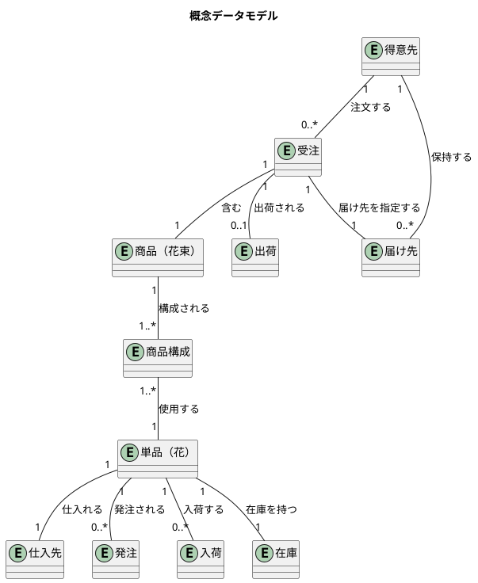
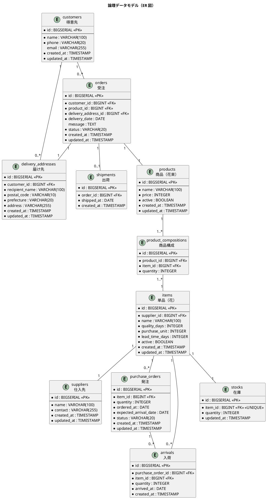

# データモデル設計 - フレール・メモワール WEB ショップシステム

## 概念データモデル

ユースケースの名詞から識別したエンティティとリレーションシップを定義する。



### エンティティ一覧

| エンティティ | 説明 | 対応 UC |
| :--- | :--- | :--- |
| 得意先 | 花束を注文する個人顧客 | UC-02, UC-14 |
| 受注 | 得意先からの注文 | UC-02, UC-05, UC-06 |
| 届け先 | 花束の配送先情報 | UC-02, UC-03 |
| 商品（花束） | 販売する花束の定義 | UC-01, UC-12 |
| 商品構成 | 花束を構成する単品と数量 | UC-12 |
| 単品（花） | 花束を構成する個々の花材 | UC-13 |
| 仕入先 | 単品を供給するパートナー | UC-08, UC-13 |
| 発注 | 仕入先への発注情報 | UC-08 |
| 入荷 | 仕入先からの入荷情報 | UC-09 |
| 在庫 | 単品の在庫数 | UC-07 |
| 出荷 | 受注の出荷情報 | UC-11 |

## 論理データモデル（ER 図）



## テーブル定義

### customers（得意先）

| カラム | 型 | 制約 | 説明 |
| :--- | :--- | :--- | :--- |
| id | BIGSERIAL | PK | 得意先 ID |
| name | VARCHAR(100) | NOT NULL | 氏名 |
| phone | VARCHAR(20) | NOT NULL | 電話番号 |
| email | VARCHAR(255) | | メールアドレス |
| created_at | TIMESTAMP | NOT NULL DEFAULT NOW() | 作成日時 |
| updated_at | TIMESTAMP | NOT NULL DEFAULT NOW() | 更新日時 |

### delivery_addresses（届け先）

| カラム | 型 | 制約 | 説明 |
| :--- | :--- | :--- | :--- |
| id | BIGSERIAL | PK | 届け先 ID |
| customer_id | BIGINT | FK → customers.id, NOT NULL | 得意先 ID |
| recipient_name | VARCHAR(100) | NOT NULL | 届け先氏名 |
| postal_code | VARCHAR(10) | NOT NULL | 郵便番号 |
| prefecture | VARCHAR(20) | NOT NULL | 都道府県 |
| address | VARCHAR(255) | NOT NULL | 住所 |
| created_at | TIMESTAMP | NOT NULL DEFAULT NOW() | 作成日時 |
| updated_at | TIMESTAMP | NOT NULL DEFAULT NOW() | 更新日時 |

### orders（受注）

| カラム | 型 | 制約 | 説明 |
| :--- | :--- | :--- | :--- |
| id | BIGSERIAL | PK | 受注 ID |
| customer_id | BIGINT | FK → customers.id, NOT NULL | 得意先 ID |
| product_id | BIGINT | FK → products.id, NOT NULL | 商品 ID |
| delivery_address_id | BIGINT | FK → delivery_addresses.id, NOT NULL | 届け先 ID |
| delivery_date | DATE | NOT NULL | 届け日 |
| message | TEXT | | メッセージ |
| status | VARCHAR(20) | NOT NULL DEFAULT 'ordered' | ステータス（ordered / shipped / cancelled） |
| created_at | TIMESTAMP | NOT NULL DEFAULT NOW() | 作成日時 |
| updated_at | TIMESTAMP | NOT NULL DEFAULT NOW() | 更新日時 |

### shipments（出荷）

| カラム | 型 | 制約 | 説明 |
| :--- | :--- | :--- | :--- |
| id | BIGSERIAL | PK | 出荷 ID |
| order_id | BIGINT | FK → orders.id, NOT NULL, UNIQUE | 受注 ID |
| shipped_at | DATE | NOT NULL | 出荷日 |
| created_at | TIMESTAMP | NOT NULL DEFAULT NOW() | 作成日時 |

### products（商品）

| カラム | 型 | 制約 | 説明 |
| :--- | :--- | :--- | :--- |
| id | BIGSERIAL | PK | 商品 ID |
| name | VARCHAR(100) | NOT NULL | 商品名 |
| price | INTEGER | NOT NULL | 価格（円） |
| active | BOOLEAN | NOT NULL DEFAULT TRUE | 有効フラグ |
| created_at | TIMESTAMP | NOT NULL DEFAULT NOW() | 作成日時 |
| updated_at | TIMESTAMP | NOT NULL DEFAULT NOW() | 更新日時 |

### product_compositions（商品構成）

| カラム | 型 | 制約 | 説明 |
| :--- | :--- | :--- | :--- |
| id | BIGSERIAL | PK | 商品構成 ID |
| product_id | BIGINT | FK → products.id, NOT NULL | 商品 ID |
| item_id | BIGINT | FK → items.id, NOT NULL | 単品 ID |
| quantity | INTEGER | NOT NULL | 数量 |

UNIQUE(product_id, item_id)

### items（単品）

| カラム | 型 | 制約 | 説明 |
| :--- | :--- | :--- | :--- |
| id | BIGSERIAL | PK | 単品 ID |
| supplier_id | BIGINT | FK → suppliers.id, NOT NULL | 仕入先 ID |
| name | VARCHAR(100) | NOT NULL | 単品名 |
| quality_days | INTEGER | NOT NULL | 品質維持日数 |
| purchase_unit | INTEGER | NOT NULL | 購入単位 |
| lead_time_days | INTEGER | NOT NULL | リードタイム（日） |
| active | BOOLEAN | NOT NULL DEFAULT TRUE | 有効フラグ |
| created_at | TIMESTAMP | NOT NULL DEFAULT NOW() | 作成日時 |
| updated_at | TIMESTAMP | NOT NULL DEFAULT NOW() | 更新日時 |

### suppliers（仕入先）

| カラム | 型 | 制約 | 説明 |
| :--- | :--- | :--- | :--- |
| id | BIGSERIAL | PK | 仕入先 ID |
| name | VARCHAR(100) | NOT NULL | 仕入先名 |
| contact | VARCHAR(255) | | 連絡先 |
| created_at | TIMESTAMP | NOT NULL DEFAULT NOW() | 作成日時 |
| updated_at | TIMESTAMP | NOT NULL DEFAULT NOW() | 更新日時 |

### purchase_orders（発注）

| カラム | 型 | 制約 | 説明 |
| :--- | :--- | :--- | :--- |
| id | BIGSERIAL | PK | 発注 ID |
| item_id | BIGINT | FK → items.id, NOT NULL | 単品 ID |
| quantity | INTEGER | NOT NULL | 発注数量 |
| ordered_at | DATE | NOT NULL | 発注日 |
| expected_arrival_date | DATE | NOT NULL | 入荷予定日 |
| status | VARCHAR(20) | NOT NULL DEFAULT 'ordered' | ステータス（ordered / arrived / cancelled） |
| created_at | TIMESTAMP | NOT NULL DEFAULT NOW() | 作成日時 |
| updated_at | TIMESTAMP | NOT NULL DEFAULT NOW() | 更新日時 |

### arrivals（入荷）

| カラム | 型 | 制約 | 説明 |
| :--- | :--- | :--- | :--- |
| id | BIGSERIAL | PK | 入荷 ID |
| purchase_order_id | BIGINT | FK → purchase_orders.id, NOT NULL | 発注 ID |
| item_id | BIGINT | FK → items.id, NOT NULL | 単品 ID |
| quantity | INTEGER | NOT NULL | 入荷数量 |
| arrived_at | DATE | NOT NULL | 入荷日（品質維持日数の起算日） |
| created_at | TIMESTAMP | NOT NULL DEFAULT NOW() | 作成日時 |

### stocks（在庫）

| カラム | 型 | 制約 | 説明 |
| :--- | :--- | :--- | :--- |
| id | BIGSERIAL | PK | 在庫 ID |
| item_id | BIGINT | FK → items.id, NOT NULL, UNIQUE | 単品 ID |
| quantity | INTEGER | NOT NULL DEFAULT 0 | 現在庫数 |
| updated_at | TIMESTAMP | NOT NULL DEFAULT NOW() | 更新日時 |

## 在庫推移計算の設計

在庫推移は stocks テーブルの現在庫を起点に、arrivals・orders・shipments から日別に計算する。

```
日別在庫予定数[日付D] =
  現在庫数
  + SUM(arrivals.quantity WHERE arrived_at <= D AND 入荷日 + quality_days >= D)
  - SUM(orders.quantity WHERE delivery_date = D AND status = 'ordered')
  - 廃棄予定数（arrived_at + quality_days < D の入荷分）
```

この計算はアプリケーション層（Domain Service）で実行し、DB には現在庫のみを保持する。

## 正規化の判断

| テーブル | 正規形 | 備考 |
| :--- | :--- | :--- |
| 全テーブル | 第 3 正規形 | 推移的関数従属なし |
| stocks | 非正規化なし | 現在庫は入荷・出荷から都度計算可能だが、パフォーマンスのため保持 |
