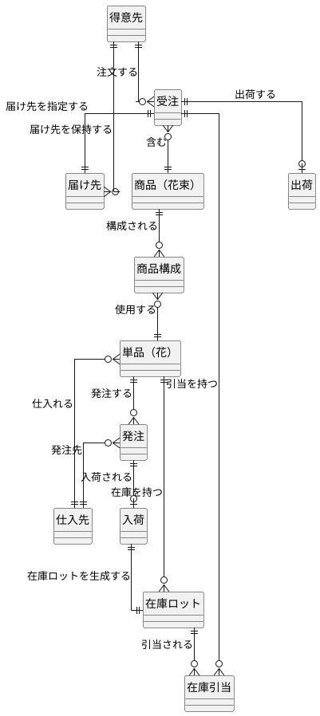
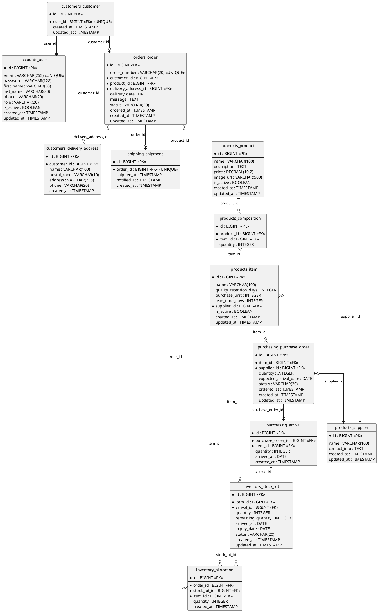

# データモデル設計 - フレール・メモワール WEB ショップシステム

## 概念データモデル

要件定義の情報モデルをベースに、エンティティとリレーションシップを整理する。

### ER 図（概念モデル）



### エンティティ一覧

| エンティティ | 分類 | 説明 |
| :--- | :--- | :--- |
| 得意先 | マスタ | 花束を注文する個人顧客 |
| 商品（花束） | マスタ | 販売する花束の商品情報 |
| 単品（花） | マスタ | 花束を構成する個々の花材 |
| 商品構成 | マスタ | 花束を構成する単品と数量の組み合わせ |
| 仕入先 | マスタ | 単品の仕入先パートナー |
| 受注 | トランザクション | 得意先からの注文 |
| 届け先 | マスタ | 花束の届け先情報（得意先ごとに複数保持） |
| 発注 | トランザクション | 仕入先への発注 |
| 入荷 | トランザクション | 仕入先からの入荷実績 |
| 在庫ロット | トランザクション | 入荷単位の在庫追跡（品質維持期限管理） |
| 在庫引当 | トランザクション | 受注に対する在庫ロットの引当記録 |
| 出荷 | トランザクション | 受注に対する出荷記録 |

## 論理データモデル

Django ORM + PostgreSQL を前提としたテーブル定義。サロゲートキー（`id`: BigAutoField）を主キーとする。

### ER 図（論理モデル）



## テーブル定義詳細

### accounts_user（ユーザー）

Django のカスタムユーザーモデル。得意先とスタッフの両方を管理する。

| カラム | 型 | 制約 | 説明 |
| :--- | :--- | :--- | :--- |
| id | BIGINT | PK, AUTO | サロゲートキー |
| email | VARCHAR(255) | UNIQUE, NOT NULL | メールアドレス（ログイン ID） |
| password | VARCHAR(128) | NOT NULL | ハッシュ化パスワード |
| first_name | VARCHAR(30) | | 名 |
| last_name | VARCHAR(30) | | 姓 |
| phone | VARCHAR(20) | | 電話番号 |
| role | VARCHAR(20) | NOT NULL | 役割（customer / staff / admin） |
| is_active | BOOLEAN | DEFAULT TRUE | 有効フラグ |
| created_at | TIMESTAMP | NOT NULL | 作成日時 |
| updated_at | TIMESTAMP | NOT NULL | 更新日時 |

### customers_customer（得意先）

| カラム | 型 | 制約 | 説明 |
| :--- | :--- | :--- | :--- |
| id | BIGINT | PK, AUTO | サロゲートキー |
| user_id | BIGINT | FK(accounts_user), UNIQUE | ユーザー |
| created_at | TIMESTAMP | NOT NULL | 作成日時 |
| updated_at | TIMESTAMP | NOT NULL | 更新日時 |

### customers_delivery_address（届け先）

| カラム | 型 | 制約 | 説明 |
| :--- | :--- | :--- | :--- |
| id | BIGINT | PK, AUTO | サロゲートキー |
| customer_id | BIGINT | FK(customers_customer), NOT NULL | 得意先 |
| name | VARCHAR(100) | NOT NULL | 届け先氏名 |
| postal_code | VARCHAR(10) | NOT NULL | 郵便番号 |
| address | VARCHAR(255) | NOT NULL | 住所 |
| phone | VARCHAR(20) | NOT NULL | 電話番号 |
| created_at | TIMESTAMP | NOT NULL | 作成日時 |

### products_product（商品・花束）

| カラム | 型 | 制約 | 説明 |
| :--- | :--- | :--- | :--- |
| id | BIGINT | PK, AUTO | サロゲートキー |
| name | VARCHAR(100) | NOT NULL | 商品名 |
| description | TEXT | | 説明 |
| price | DECIMAL(10,2) | NOT NULL | 価格（税込） |
| image_url | VARCHAR(500) | | 商品画像 URL（S3） |
| is_active | BOOLEAN | DEFAULT TRUE | 販売中フラグ |
| created_at | TIMESTAMP | NOT NULL | 作成日時 |
| updated_at | TIMESTAMP | NOT NULL | 更新日時 |

### products_item（単品・花）

| カラム | 型 | 制約 | 説明 |
| :--- | :--- | :--- | :--- |
| id | BIGINT | PK, AUTO | サロゲートキー |
| name | VARCHAR(100) | NOT NULL | 単品名 |
| quality_retention_days | INTEGER | NOT NULL | 品質維持日数 |
| purchase_unit | INTEGER | NOT NULL | 購入単位（本） |
| lead_time_days | INTEGER | NOT NULL | リードタイム（日） |
| supplier_id | BIGINT | FK(products_supplier), NOT NULL | 仕入先 |
| is_active | BOOLEAN | DEFAULT TRUE | 有効フラグ |
| created_at | TIMESTAMP | NOT NULL | 作成日時 |
| updated_at | TIMESTAMP | NOT NULL | 更新日時 |

### products_composition（商品構成）

| カラム | 型 | 制約 | 説明 |
| :--- | :--- | :--- | :--- |
| id | BIGINT | PK, AUTO | サロゲートキー |
| product_id | BIGINT | FK(products_product), NOT NULL | 商品 |
| item_id | BIGINT | FK(products_item), NOT NULL | 単品 |
| quantity | INTEGER | NOT NULL | 数量（本） |

UNIQUE 制約: (product_id, item_id)

### products_supplier（仕入先）

| カラム | 型 | 制約 | 説明 |
| :--- | :--- | :--- | :--- |
| id | BIGINT | PK, AUTO | サロゲートキー |
| name | VARCHAR(100) | NOT NULL | 仕入先名 |
| contact_info | TEXT | | 連絡先情報 |
| created_at | TIMESTAMP | NOT NULL | 作成日時 |
| updated_at | TIMESTAMP | NOT NULL | 更新日時 |

### orders_order（受注）

| カラム | 型 | 制約 | 説明 |
| :--- | :--- | :--- | :--- |
| id | BIGINT | PK, AUTO | サロゲートキー |
| order_number | VARCHAR(20) | UNIQUE, NOT NULL | 受注番号 |
| customer_id | BIGINT | FK(customers_customer), NOT NULL | 得意先 |
| product_id | BIGINT | FK(products_product), NOT NULL | 商品 |
| delivery_address_id | BIGINT | FK(customers_delivery_address), NOT NULL | 届け先 |
| delivery_date | DATE | NOT NULL | 届け日 |
| message | TEXT | | メッセージカード内容 |
| status | VARCHAR(20) | NOT NULL | ステータス |
| ordered_at | TIMESTAMP | NOT NULL | 注文日時 |
| created_at | TIMESTAMP | NOT NULL | 作成日時 |
| updated_at | TIMESTAMP | NOT NULL | 更新日時 |

ステータス値: `accepted`（受付済み）、`preparing`（出荷準備中）、`shipped`（出荷済み）、`cancelled`（キャンセル済み）

インデックス: (customer_id), (delivery_date), (status)

### inventory_stock_lot（在庫ロット）

| カラム | 型 | 制約 | 説明 |
| :--- | :--- | :--- | :--- |
| id | BIGINT | PK, AUTO | サロゲートキー |
| item_id | BIGINT | FK(products_item), NOT NULL | 単品 |
| arrival_id | BIGINT | FK(purchasing_arrival), NOT NULL | 入荷 |
| quantity | INTEGER | NOT NULL | 入荷数量 |
| remaining_quantity | INTEGER | NOT NULL | 残数量 |
| arrived_at | DATE | NOT NULL | 入荷日（品質維持日数の起算日） |
| expiry_date | DATE | NOT NULL | 品質維持期限日（arrived_at + quality_retention_days - 1） |
| status | VARCHAR(20) | NOT NULL | ステータス |
| created_at | TIMESTAMP | NOT NULL | 作成日時 |
| updated_at | TIMESTAMP | NOT NULL | 更新日時 |

ステータス値: `available`（在庫あり）、`near_expiry`（品質期限間近）、`expired`（廃棄対象）、`depleted`（出庫済み）

インデックス: (item_id, status), (expiry_date)

### inventory_allocation（在庫引当）

| カラム | 型 | 制約 | 説明 |
| :--- | :--- | :--- | :--- |
| id | BIGINT | PK, AUTO | サロゲートキー |
| order_id | BIGINT | FK(orders_order), NOT NULL | 受注 |
| stock_lot_id | BIGINT | FK(inventory_stock_lot), NOT NULL | 在庫ロット |
| item_id | BIGINT | FK(products_item), NOT NULL | 単品 |
| quantity | INTEGER | NOT NULL | 引当数量 |
| created_at | TIMESTAMP | NOT NULL | 作成日時 |

UNIQUE 制約: (order_id, stock_lot_id, item_id)

### purchasing_purchase_order（発注）

| カラム | 型 | 制約 | 説明 |
| :--- | :--- | :--- | :--- |
| id | BIGINT | PK, AUTO | サロゲートキー |
| item_id | BIGINT | FK(products_item), NOT NULL | 単品 |
| supplier_id | BIGINT | FK(products_supplier), NOT NULL | 仕入先 |
| quantity | INTEGER | NOT NULL | 発注数量 |
| expected_arrival_date | DATE | NOT NULL | 入荷予定日 |
| status | VARCHAR(20) | NOT NULL | ステータス |
| ordered_at | TIMESTAMP | NOT NULL | 発注日時 |
| created_at | TIMESTAMP | NOT NULL | 作成日時 |
| updated_at | TIMESTAMP | NOT NULL | 更新日時 |

ステータス値: `ordered`（発注済み）、`arrived`（入荷済み）、`cancelled`（キャンセル）

### purchasing_arrival（入荷）

| カラム | 型 | 制約 | 説明 |
| :--- | :--- | :--- | :--- |
| id | BIGINT | PK, AUTO | サロゲートキー |
| purchase_order_id | BIGINT | FK(purchasing_purchase_order), NOT NULL | 発注 |
| item_id | BIGINT | FK(products_item), NOT NULL | 単品 |
| quantity | INTEGER | NOT NULL | 入荷数量 |
| arrived_at | DATE | NOT NULL | 入荷日 |
| created_at | TIMESTAMP | NOT NULL | 作成日時 |

### shipping_shipment（出荷）

| カラム | 型 | 制約 | 説明 |
| :--- | :--- | :--- | :--- |
| id | BIGINT | PK, AUTO | サロゲートキー |
| order_id | BIGINT | FK(orders_order), UNIQUE, NOT NULL | 受注 |
| shipped_at | TIMESTAMP | NOT NULL | 出荷日時 |
| notified_at | TIMESTAMP | | 通知日時 |
| created_at | TIMESTAMP | NOT NULL | 作成日時 |

## Django App とテーブルの対応

| Django App | テーブル |
| :--- | :--- |
| accounts | accounts_user |
| customers | customers_customer, customers_delivery_address |
| products | products_product, products_item, products_composition, products_supplier |
| orders | orders_order |
| inventory | inventory_stock_lot, inventory_allocation |
| purchasing | purchasing_purchase_order, purchasing_arrival |
| shipping | shipping_shipment |

## 在庫推移計算の SQL イメージ

```sql
-- 単品ごとの日別在庫推移（当日〜14日先）
WITH date_series AS (
    SELECT generate_series(
        CURRENT_DATE,
        CURRENT_DATE + INTERVAL '14 days',
        '1 day'
    )::DATE AS target_date
),
-- 出庫予定: 受注の花束構成を単品レベルに展開し、出荷日（= 届け日 - 1日）で集計
outbound AS (
    SELECT
        pc.item_id,
        (o.delivery_date - INTERVAL '1 day')::DATE AS shipping_date,
        SUM(pc.quantity) AS outbound_qty
    FROM orders_order o
    JOIN products_composition pc ON pc.product_id = o.product_id
    WHERE o.status IN ('accepted', 'preparing')
    GROUP BY pc.item_id, o.delivery_date
),
-- 入荷予定
inbound AS (
    SELECT
        po.item_id,
        po.expected_arrival_date AS arrival_date,
        SUM(po.quantity) AS inbound_qty
    FROM purchasing_purchase_order po
    WHERE po.status = 'ordered'
    GROUP BY po.item_id, po.expected_arrival_date
),
-- 廃棄予定: 品質維持期限超過
expiry AS (
    SELECT
        sl.item_id,
        sl.expiry_date,
        SUM(sl.remaining_quantity) AS expiry_qty
    FROM inventory_stock_lot sl
    WHERE sl.status IN ('available', 'near_expiry')
    GROUP BY sl.item_id, sl.expiry_date
)
SELECT
    i.id AS item_id,
    i.name AS item_name,
    ds.target_date,
    COALESCE(ib.inbound_qty, 0) AS inbound,
    COALESCE(ob.outbound_qty, 0) AS outbound,
    COALESCE(ex.expiry_qty, 0) AS expiry
FROM products_item i
CROSS JOIN date_series ds
LEFT JOIN inbound ib ON ib.item_id = i.id AND ib.arrival_date = ds.target_date
LEFT JOIN outbound ob ON ob.item_id = i.id AND ob.shipping_date = ds.target_date
LEFT JOIN expiry ex ON ex.item_id = i.id AND ex.expiry_date = ds.target_date
WHERE i.is_active = TRUE
ORDER BY i.id, ds.target_date;
```
