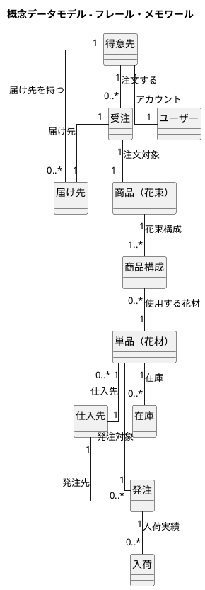
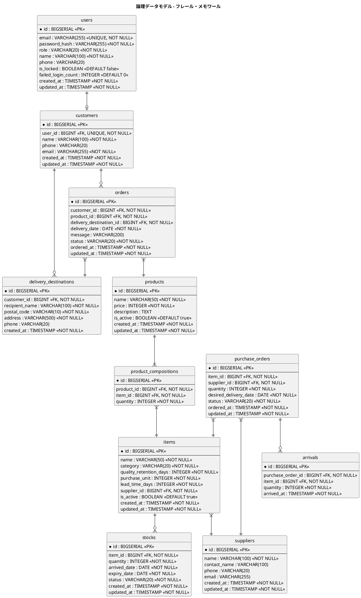

# データモデル設計 - フレール・メモワール WEB ショップシステム

## 概念データモデル

## 論理データモデル

### ER 図

## テーブル定義

### users（ユーザー）

| カラム名 | データ型 | NULL | デフォルト | 説明 |
|:---|:---|:---|:---|:---|
| id | BIGSERIAL | NO | 自動採番 | 主キー |
| email | VARCHAR(255) | NO | - | メールアドレス（ログイン ID） |
| password_hash | VARCHAR(255) | NO | - | パスワードハッシュ |
| role | VARCHAR(20) | NO | - | ロール（customer/order_staff/purchase_staff/florist/delivery_staff/owner） |
| name | VARCHAR(100) | NO | - | 表示名 |
| phone | VARCHAR(20) | YES | - | 電話番号 |
| is_locked | BOOLEAN | NO | false | アカウントロック状態 |
| failed_login_count | INTEGER | NO | 0 | 連続ログイン失敗回数 |
| created_at | TIMESTAMP | NO | CURRENT_TIMESTAMP | 作成日時 |
| updated_at | TIMESTAMP | NO | CURRENT_TIMESTAMP | 更新日時 |

### customers（得意先）

| カラム名 | データ型 | NULL | デフォルト | 説明 |
|:---|:---|:---|:---|:---|
| id | BIGSERIAL | NO | 自動採番 | 主キー |
| user_id | BIGINT | NO | - | ユーザー ID（FK: users.id） |
| name | VARCHAR(100) | NO | - | 氏名 |
| phone | VARCHAR(20) | YES | - | 電話番号 |
| email | VARCHAR(255) | NO | - | メールアドレス |
| created_at | TIMESTAMP | NO | CURRENT_TIMESTAMP | 作成日時 |
| updated_at | TIMESTAMP | NO | CURRENT_TIMESTAMP | 更新日時 |

### delivery_destinations（届け先）

| カラム名 | データ型 | NULL | デフォルト | 説明 |
|:---|:---|:---|:---|:---|
| id | BIGSERIAL | NO | 自動採番 | 主キー |
| customer_id | BIGINT | NO | - | 得意先 ID（FK: customers.id） |
| recipient_name | VARCHAR(100) | NO | - | 届け先氏名 |
| postal_code | VARCHAR(10) | NO | - | 郵便番号 |
| address | VARCHAR(500) | NO | - | 住所 |
| phone | VARCHAR(20) | YES | - | 電話番号 |
| created_at | TIMESTAMP | NO | CURRENT_TIMESTAMP | 作成日時 |

### products（商品・花束）

| カラム名 | データ型 | NULL | デフォルト | 説明 |
|:---|:---|:---|:---|:---|
| id | BIGSERIAL | NO | 自動採番 | 主キー |
| name | VARCHAR(50) | NO | - | 商品名 |
| price | INTEGER | NO | - | 価格（円）。1〜999,999 |
| description | TEXT | YES | - | 説明 |
| is_active | BOOLEAN | NO | true | 販売中フラグ |
| created_at | TIMESTAMP | NO | CURRENT_TIMESTAMP | 作成日時 |
| updated_at | TIMESTAMP | NO | CURRENT_TIMESTAMP | 更新日時 |

### product_compositions（商品構成）

| カラム名 | データ型 | NULL | デフォルト | 説明 |
|:---|:---|:---|:---|:---|
| id | BIGSERIAL | NO | 自動採番 | 主キー |
| product_id | BIGINT | NO | - | 商品 ID（FK: products.id） |
| item_id | BIGINT | NO | - | 単品 ID（FK: items.id） |
| quantity | INTEGER | NO | - | 使用数量 |

**ユニーク制約**: (product_id, item_id)

### items（単品・花材）

| カラム名 | データ型 | NULL | デフォルト | 説明 |
|:---|:---|:---|:---|:---|
| id | BIGSERIAL | NO | 自動採番 | 主キー |
| name | VARCHAR(50) | NO | - | 単品名 |
| category | VARCHAR(20) | NO | - | カテゴリ（main/sub/green/material） |
| quality_retention_days | INTEGER | NO | - | 品質維持日数（1〜30） |
| purchase_unit | INTEGER | NO | - | 購入単位 |
| lead_time_days | INTEGER | NO | - | リードタイム（1〜14 日） |
| supplier_id | BIGINT | NO | - | 仕入先 ID（FK: suppliers.id） |
| is_active | BOOLEAN | NO | true | 有効フラグ |
| created_at | TIMESTAMP | NO | CURRENT_TIMESTAMP | 作成日時 |
| updated_at | TIMESTAMP | NO | CURRENT_TIMESTAMP | 更新日時 |

### suppliers（仕入先）

| カラム名 | データ型 | NULL | デフォルト | 説明 |
|:---|:---|:---|:---|:---|
| id | BIGSERIAL | NO | 自動採番 | 主キー |
| name | VARCHAR(100) | NO | - | 仕入先名 |
| contact_name | VARCHAR(100) | YES | - | 担当者名 |
| phone | VARCHAR(20) | YES | - | 電話番号 |
| email | VARCHAR(255) | YES | - | メールアドレス |
| created_at | TIMESTAMP | NO | CURRENT_TIMESTAMP | 作成日時 |
| updated_at | TIMESTAMP | NO | CURRENT_TIMESTAMP | 更新日時 |

### orders（受注）

| カラム名 | データ型 | NULL | デフォルト | 説明 |
|:---|:---|:---|:---|:---|
| id | BIGSERIAL | NO | 自動採番 | 主キー |
| customer_id | BIGINT | NO | - | 得意先 ID（FK: customers.id） |
| product_id | BIGINT | NO | - | 商品 ID（FK: products.id） |
| delivery_destination_id | BIGINT | NO | - | 届け先 ID（FK: delivery_destinations.id） |
| delivery_date | DATE | NO | - | 届け日 |
| message | VARCHAR(200) | YES | - | お届けメッセージ |
| status | VARCHAR(20) | NO | - | ステータス（ordered/accepted/preparing/shipped/delivered/cancelled） |
| ordered_at | TIMESTAMP | NO | CURRENT_TIMESTAMP | 注文日時 |
| updated_at | TIMESTAMP | NO | CURRENT_TIMESTAMP | 更新日時 |

**ステータス値**:

| 値 | 表示名 |
|:---|:---|
| ordered | 注文受付 |
| accepted | 受付済み |
| preparing | 出荷準備中 |
| shipped | 出荷済み |
| delivered | 届け完了 |
| cancelled | キャンセル |

### purchase_orders（発注）

| カラム名 | データ型 | NULL | デフォルト | 説明 |
|:---|:---|:---|:---|:---|
| id | BIGSERIAL | NO | 自動採番 | 主キー |
| item_id | BIGINT | NO | - | 単品 ID（FK: items.id） |
| supplier_id | BIGINT | NO | - | 仕入先 ID（FK: suppliers.id） |
| quantity | INTEGER | NO | - | 発注数量 |
| desired_delivery_date | DATE | NO | - | 希望納品日 |
| status | VARCHAR(20) | NO | - | ステータス（ordered/partial/received） |
| ordered_at | TIMESTAMP | NO | CURRENT_TIMESTAMP | 発注日時 |
| updated_at | TIMESTAMP | NO | CURRENT_TIMESTAMP | 更新日時 |

### arrivals（入荷）

| カラム名 | データ型 | NULL | デフォルト | 説明 |
|:---|:---|:---|:---|:---|
| id | BIGSERIAL | NO | 自動採番 | 主キー |
| purchase_order_id | BIGINT | NO | - | 発注 ID（FK: purchase_orders.id） |
| item_id | BIGINT | NO | - | 単品 ID（FK: items.id） |
| quantity | INTEGER | NO | - | 入荷数量 |
| arrived_at | TIMESTAMP | NO | CURRENT_TIMESTAMP | 入荷日時 |

### stocks（在庫）

| カラム名 | データ型 | NULL | デフォルト | 説明 |
|:---|:---|:---|:---|:---|
| id | BIGSERIAL | NO | 自動採番 | 主キー |
| item_id | BIGINT | NO | - | 単品 ID（FK: items.id） |
| quantity | INTEGER | NO | - | 数量 |
| arrived_date | DATE | NO | - | 入荷日（品質維持起算日） |
| expiry_date | DATE | NO | - | 品質維持期限（入荷日 + 品質維持日数） |
| status | VARCHAR(20) | NO | - | 状態（available/degraded/expired） |
| created_at | TIMESTAMP | NO | CURRENT_TIMESTAMP | 作成日時 |
| updated_at | TIMESTAMP | NO | CURRENT_TIMESTAMP | 更新日時 |

## インデックス設計

| テーブル | インデックス | カラム | 目的 |
|:---|:---|:---|:---|
| users | idx_users_email | email | ログイン時の検索 |
| orders | idx_orders_status | status | ステータス別一覧表示 |
| orders | idx_orders_delivery_date | delivery_date | 届け日による検索 |
| orders | idx_orders_customer_id | customer_id | 得意先別注文履歴 |
| stocks | idx_stocks_item_id | item_id | 単品別在庫検索 |
| stocks | idx_stocks_expiry_date | expiry_date | 品質維持期限による検索 |
| purchase_orders | idx_po_status | status | ステータス別一覧 |

## 設計方針

| 項目 | 方針 |
|:---|:---|
| 主キー | サロゲートキー（BIGSERIAL）を採用 |
| 正規化 | 第 3 正規形を基本とする |
| タイムスタンプ | 全テーブルに created_at/updated_at を設置 |
| 論理削除 | is_active フラグによる論理削除（マスタ系テーブル） |
| ステータス管理 | VARCHAR による文字列値で管理（enum 型は避ける） |

---

## 記入履歴

| 日付 | 更新内容 |
|------|----------|
| 2026-03-20 | 初版作成 |
