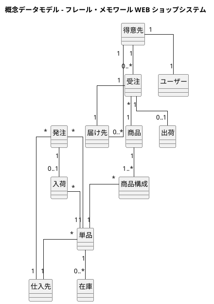
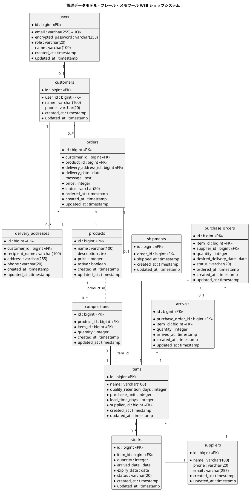

# データモデル設計

## 概念データモデル

要件定義の情報モデルに基づき、システムが管理するエンティティとリレーションシップを定義する。

## 論理データモデル（ER 図）

## テーブル定義

### users（ユーザー）

認証と権限管理のためのテーブル。Devise で管理する。

| カラム名 | データ型 | NULL | 制約 | 説明 |
|---------|---------|------|------|------|
| id | bigint | NO | PK | サロゲートキー |
| email | varchar(255) | NO | UQ | メールアドレス |
| encrypted_password | varchar(255) | NO | | 暗号化パスワード |
| role | varchar(20) | NO | | 役割（customer / staff） |
| name | varchar(100) | YES | | 表示名 |
| created_at | timestamp | NO | | 作成日時 |
| updated_at | timestamp | NO | | 更新日時 |

### products（商品）

花束の商品マスタ。

| カラム名 | データ型 | NULL | 制約 | 説明 |
|---------|---------|------|------|------|
| id | bigint | NO | PK | サロゲートキー |
| name | varchar(100) | NO | | 商品名 |
| description | text | YES | | 商品説明 |
| price | integer | NO | CHECK > 0 | 価格（円） |
| active | boolean | NO | DEFAULT true | 掲載フラグ |
| created_at | timestamp | NO | | 作成日時 |
| updated_at | timestamp | NO | | 更新日時 |

### items（単品）

花のマスタ。品質維持日数・購入単位・リードタイムは在庫推移計算に使用する。

| カラム名 | データ型 | NULL | 制約 | 説明 |
|---------|---------|------|------|------|
| id | bigint | NO | PK | サロゲートキー |
| name | varchar(100) | NO | | 単品名 |
| quality_retention_days | integer | NO | CHECK > 0 | 品質維持日数 |
| purchase_unit | integer | NO | CHECK > 0 | 購入単位 |
| lead_time_days | integer | NO | CHECK > 0 | リードタイム（日） |
| supplier_id | bigint | NO | FK(suppliers) | 仕入先 |
| created_at | timestamp | NO | | 作成日時 |
| updated_at | timestamp | NO | | 更新日時 |

### compositions（商品構成）

花束を構成する単品と数量。product_id + item_id はユニーク。

| カラム名 | データ型 | NULL | 制約 | 説明 |
|---------|---------|------|------|------|
| id | bigint | NO | PK | サロゲートキー |
| product_id | bigint | NO | FK(products), UQ(product_id, item_id) | 商品 |
| item_id | bigint | NO | FK(items), UQ(product_id, item_id) | 単品 |
| quantity | integer | NO | CHECK > 0 | 数量 |
| created_at | timestamp | NO | | 作成日時 |
| updated_at | timestamp | NO | | 更新日時 |

### customers（得意先）

得意先（個人顧客）の情報。ユーザーと 1:1 で紐づく。

| カラム名 | データ型 | NULL | 制約 | 説明 |
|---------|---------|------|------|------|
| id | bigint | NO | PK | サロゲートキー |
| user_id | bigint | NO | FK(users), UQ | ユーザー |
| name | varchar(100) | NO | | 氏名 |
| phone | varchar(20) | YES | | 電話番号 |
| created_at | timestamp | NO | | 作成日時 |
| updated_at | timestamp | NO | | 更新日時 |

### delivery_addresses（届け先）

得意先が過去に使用した届け先の情報。コピー機能で再利用される。

| カラム名 | データ型 | NULL | 制約 | 説明 |
|---------|---------|------|------|------|
| id | bigint | NO | PK | サロゲートキー |
| customer_id | bigint | NO | FK(customers) | 得意先 |
| recipient_name | varchar(100) | NO | | 届け先氏名 |
| address | varchar(255) | NO | | 届け先住所 |
| phone | varchar(20) | NO | | 届け先電話番号 |
| created_at | timestamp | NO | | 作成日時 |
| updated_at | timestamp | NO | | 更新日時 |

### orders（受注）

注文データ。1 受注 = 1 商品 = 1 届け先。

| カラム名 | データ型 | NULL | 制約 | 説明 |
|---------|---------|------|------|------|
| id | bigint | NO | PK | サロゲートキー |
| customer_id | bigint | NO | FK(customers) | 得意先 |
| product_id | bigint | NO | FK(products) | 商品 |
| delivery_address_id | bigint | NO | FK(delivery_addresses) | 届け先 |
| delivery_date | date | NO | | 届け日 |
| message | text | YES | | お届けメッセージ |
| price | integer | NO | CHECK > 0 | 注文時価格（円）。注文確定時の商品価格をスナップショット |
| status | varchar(20) | NO | DEFAULT 'ordered' | 状態（ordered / shipped / cancelled） |
| ordered_at | timestamp | NO | | 注文日時 |
| created_at | timestamp | NO | | 作成日時 |
| updated_at | timestamp | NO | | 更新日時 |

### suppliers（仕入先）

仕入先マスタ。単品ごとに 1 つの仕入先が紐づく。

| カラム名 | データ型 | NULL | 制約 | 説明 |
|---------|---------|------|------|------|
| id | bigint | NO | PK | サロゲートキー |
| name | varchar(100) | NO | | 仕入先名 |
| phone | varchar(20) | YES | | 電話番号 |
| email | varchar(255) | YES | | メールアドレス |
| created_at | timestamp | NO | | 作成日時 |
| updated_at | timestamp | NO | | 更新日時 |

### purchase_orders（発注）

仕入先への発注データ。

| カラム名 | データ型 | NULL | 制約 | 説明 |
|---------|---------|------|------|------|
| id | bigint | NO | PK | サロゲートキー |
| item_id | bigint | NO | FK(items) | 単品 |
| supplier_id | bigint | NO | FK(suppliers) | 仕入先 |
| quantity | integer | NO | CHECK > 0 | 発注数量 |
| desired_delivery_date | date | NO | | 希望納品日 |
| status | varchar(20) | NO | DEFAULT 'ordered' | 状態（ordered / arrived / cancelled） |
| ordered_at | timestamp | NO | | 発注日時 |
| created_at | timestamp | NO | | 作成日時 |
| updated_at | timestamp | NO | | 更新日時 |

### arrivals（入荷）

入荷データ。発注と 1:1 で紐づく（初回は全量入荷を前提）。

| カラム名 | データ型 | NULL | 制約 | 説明 |
|---------|---------|------|------|------|
| id | bigint | NO | PK | サロゲートキー |
| purchase_order_id | bigint | NO | FK(purchase_orders), UQ | 発注 |
| item_id | bigint | NO | FK(items) | 単品 |
| quantity | integer | NO | CHECK > 0 | 入荷数量 |
| arrived_at | timestamp | NO | | 入荷日時 |
| created_at | timestamp | NO | | 作成日時 |
| updated_at | timestamp | NO | | 更新日時 |

### stocks（在庫）

単品ロット単位の在庫データ。入荷日と品質維持日数から廃棄日を算出する。

| カラム名 | データ型 | NULL | 制約 | 説明 |
|---------|---------|------|------|------|
| id | bigint | NO | PK | サロゲートキー |
| item_id | bigint | NO | FK(items) | 単品 |
| quantity | integer | NO | CHECK >= 0 | 在庫数量 |
| arrived_date | date | NO | | 入荷日 |
| expiry_date | date | NO | | 品質維持期限（入荷日 + 品質維持日数） |
| status | varchar(20) | NO | DEFAULT 'available' | 状態（available / allocated / expired） |
| created_at | timestamp | NO | | 作成日時 |
| updated_at | timestamp | NO | | 更新日時 |

### shipments（出荷）

出荷データ。受注と 1:1 で紐づく。

| カラム名 | データ型 | NULL | 制約 | 説明 |
|---------|---------|------|------|------|
| id | bigint | NO | PK | サロゲートキー |
| order_id | bigint | NO | FK(orders), UQ | 受注 |
| shipped_at | timestamp | NO | | 出荷日時 |
| created_at | timestamp | NO | | 作成日時 |
| updated_at | timestamp | NO | | 更新日時 |

## インデックス設計

| テーブル | インデックス | カラム | 用途 |
|---------|------------|--------|------|
| orders | idx_orders_delivery_date | delivery_date | 届け日での検索・出荷一覧 |
| orders | idx_orders_status | status | 状態での絞り込み |
| orders | idx_orders_customer_id | customer_id | 得意先の注文履歴 |
| stocks | idx_stocks_item_id_status | item_id, status | 在庫推移計算 |
| stocks | idx_stocks_expiry_date | expiry_date | 廃棄対象の検索 |
| purchase_orders | idx_purchase_orders_status | status | 発注状態の絞り込み |
| compositions | idx_compositions_product_id | product_id | 商品の構成取得 |

## 状態値の定義

### orders.status

| 値 | 表示名 | 説明 |
|----|--------|------|
| ordered | 受注済み | 注文確定、出荷待ち |
| shipped | 出荷済み | 出荷完了 |
| cancelled | キャンセル | 注文取消 |

### purchase_orders.status

| 値 | 表示名 | 説明 |
|----|--------|------|
| ordered | 発注済み | 仕入先に発注済み |
| arrived | 入荷済み | 入荷完了 |
| cancelled | キャンセル | 発注取消 |

### stocks.status

| 値 | 表示名 | 説明 |
|----|--------|------|
| available | 良品在庫 | 使用可能 |
| allocated | 引当済み | 受注に紐づいて確保 |
| expired | 廃棄対象 | 品質維持期限超過 |
