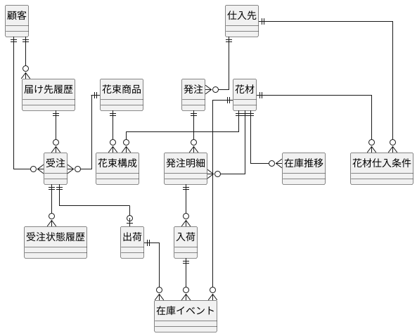
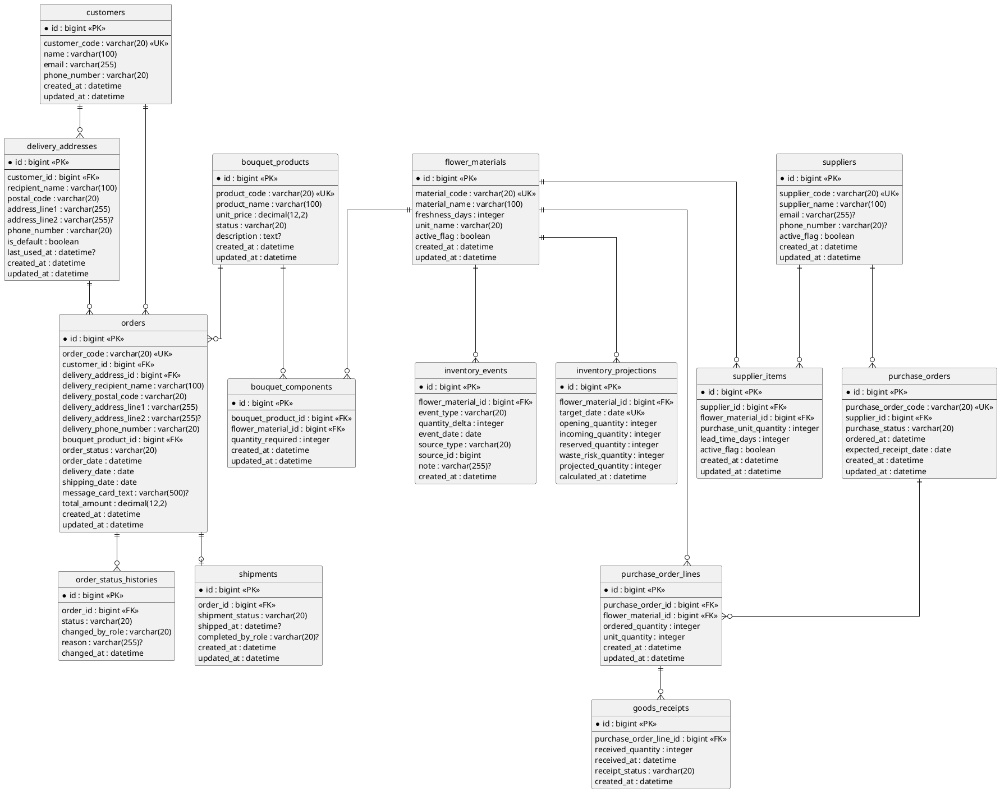

# データモデル設計

本書は、フラワーショップ「フレール・メモワール」 WEB ショップシステムの概念データモデルと論理データモデルを定義します。受注、在庫推移、発注、出荷の業務整合を保つため、基本マスタとトランザクションを分離し、在庫推移は導出可能な投影モデルとして扱います。

## 設計方針

- 第 3 正規形を基本とする
- 集計や一覧表示に必要な値は、原則として基礎データから再導出できるようにする
- 在庫推移は恒久的な真実の元ではなく、受注、入荷予定、品質維持期限から導出する参照モデルとする
- 受注、発注、出荷は監査可能性のため状態と日時を保持する
- 主キーはサロゲートキーを基本とし、業務識別子は一意制約で管理する

## 概念データモデル

### エンティティ一覧

| エンティティ | 説明 |
| :--- | :--- |
| 顧客 | 注文者。個人顧客を想定する |
| 届け先履歴 | 顧客が再利用する届け先情報 |
| 花束商品 | 販売する花束 |
| 花材 | 花束を構成する単品 |
| 花束構成 | 花束商品と花材の対応 |
| 仕入先 | 花材を供給する取引先 |
| 花材仕入条件 | 花材ごとの仕入先、購入単位、リードタイム |
| 受注 | 顧客の注文 |
| 受注状態履歴 | 受注状態や届け日変更の追跡 |
| 発注 | 仕入スタッフが行う発注 |
| 発注明細 | 発注対象の花材 |
| 入荷 | 発注に対する入荷実績 |
| 出荷 | 受注に対する出荷実績 |
| 在庫イベント | 入荷、出荷、廃棄など在庫増減の事実 |
| 在庫推移 | 日別在庫予定数の参照モデル |

### 概念 ER 図

## 論理データモデル

### 論理 ER 図

## テーブル定義

### customers

| カラム | 型 | 制約 | 説明 |
| :--- | :--- | :--- | :--- |
| id | bigint | PK | 顧客 ID |
| customer_code | varchar(20) | UK, NOT NULL | 業務用顧客コード |
| name | varchar(100) | NOT NULL | 顧客名 |
| email | varchar(255) | NOT NULL | メールアドレス |
| phone_number | varchar(20) | NOT NULL | 電話番号 |
| created_at | datetime | NOT NULL | 作成日時 |
| updated_at | datetime | NOT NULL | 更新日時 |

### delivery_addresses

| カラム | 型 | 制約 | 説明 |
| :--- | :--- | :--- | :--- |
| id | bigint | PK | 届け先 ID |
| customer_id | bigint | FK, NOT NULL | 顧客 ID |
| recipient_name | varchar(100) | NOT NULL | 受取人名 |
| postal_code | varchar(20) | NOT NULL | 郵便番号 |
| address_line1 | varchar(255) | NOT NULL | 住所 1 |
| address_line2 | varchar(255) | NULL | 住所 2 |
| phone_number | varchar(20) | NOT NULL | 受取先電話番号 |
| is_default | boolean | NOT NULL | 既定届け先フラグ |
| last_used_at | datetime | NULL | 最終利用日時 |
| created_at | datetime | NOT NULL | 作成日時 |
| updated_at | datetime | NOT NULL | 更新日時 |

### bouquet_products

| カラム | 型 | 制約 | 説明 |
| :--- | :--- | :--- | :--- |
| id | bigint | PK | 花束商品 ID |
| product_code | varchar(20) | UK, NOT NULL | 商品コード |
| product_name | varchar(100) | NOT NULL | 商品名 |
| unit_price | decimal(12,2) | NOT NULL | 販売価格 |
| status | varchar(20) | NOT NULL | 販売状態 |
| description | text | NULL | 商品説明 |
| created_at | datetime | NOT NULL | 作成日時 |
| updated_at | datetime | NOT NULL | 更新日時 |

### flower_materials

| カラム | 型 | 制約 | 説明 |
| :--- | :--- | :--- | :--- |
| id | bigint | PK | 花材 ID |
| material_code | varchar(20) | UK, NOT NULL | 花材コード |
| material_name | varchar(100) | NOT NULL | 花材名 |
| freshness_days | integer | NOT NULL | 品質維持日数 |
| unit_name | varchar(20) | NOT NULL | 管理単位 |
| active_flag | boolean | NOT NULL | 有効フラグ |
| created_at | datetime | NOT NULL | 作成日時 |
| updated_at | datetime | NOT NULL | 更新日時 |

### bouquet_components

| カラム | 型 | 制約 | 説明 |
| :--- | :--- | :--- | :--- |
| id | bigint | PK | 花束構成 ID |
| bouquet_product_id | bigint | FK, NOT NULL | 花束商品 ID |
| flower_material_id | bigint | FK, NOT NULL | 花材 ID |
| quantity_required | integer | NOT NULL | 必要数量 |
| created_at | datetime | NOT NULL | 作成日時 |
| updated_at | datetime | NOT NULL | 更新日時 |

### suppliers

| カラム | 型 | 制約 | 説明 |
| :--- | :--- | :--- | :--- |
| id | bigint | PK | 仕入先 ID |
| supplier_code | varchar(20) | UK, NOT NULL | 仕入先コード |
| supplier_name | varchar(100) | NOT NULL | 仕入先名 |
| email | varchar(255) | NULL | メールアドレス |
| phone_number | varchar(20) | NULL | 電話番号 |
| active_flag | boolean | NOT NULL | 有効フラグ |
| created_at | datetime | NOT NULL | 作成日時 |
| updated_at | datetime | NOT NULL | 更新日時 |

### supplier_items

| カラム | 型 | 制約 | 説明 |
| :--- | :--- | :--- | :--- |
| id | bigint | PK | 花材仕入条件 ID |
| supplier_id | bigint | FK, NOT NULL | 仕入先 ID |
| flower_material_id | bigint | FK, NOT NULL | 花材 ID |
| purchase_unit_quantity | integer | NOT NULL | 購入単位数量 |
| lead_time_days | integer | NOT NULL | リードタイム日数 |
| active_flag | boolean | NOT NULL | 有効フラグ |
| created_at | datetime | NOT NULL | 作成日時 |
| updated_at | datetime | NOT NULL | 更新日時 |

### orders

| カラム | 型 | 制約 | 説明 |
| :--- | :--- | :--- | :--- |
| id | bigint | PK | 受注 ID |
| order_code | varchar(20) | UK, NOT NULL | 受注番号 |
| customer_id | bigint | FK, NOT NULL | 顧客 ID |
| delivery_address_id | bigint | FK, NOT NULL | 届け先 ID |
| delivery_recipient_name | varchar(100) | NOT NULL | 受注時点の受取人名スナップショット |
| delivery_postal_code | varchar(20) | NOT NULL | 受注時点の郵便番号スナップショット |
| delivery_address_line1 | varchar(255) | NOT NULL | 受注時点の住所 1 スナップショット |
| delivery_address_line2 | varchar(255) | NULL | 受注時点の住所 2 スナップショット |
| delivery_phone_number | varchar(20) | NOT NULL | 受注時点の電話番号スナップショット |
| bouquet_product_id | bigint | FK, NOT NULL | 花束商品 ID |
| order_status | varchar(20) | NOT NULL | 受注状態。`受付` `変更待ち` `出荷準備中` `出荷済み` |
| order_date | datetime | NOT NULL | 受注日時 |
| delivery_date | date | NOT NULL | 届け日 |
| shipping_date | date | NOT NULL | 出荷日 |
| message_card_text | varchar(500) | NULL | メッセージカード文面 |
| total_amount | decimal(12,2) | NOT NULL | 注文金額 |
| created_at | datetime | NOT NULL | 作成日時 |
| updated_at | datetime | NOT NULL | 更新日時 |

### order_status_histories

| カラム | 型 | 制約 | 説明 |
| :--- | :--- | :--- | :--- |
| id | bigint | PK | 受注状態履歴 ID |
| order_id | bigint | FK, NOT NULL | 受注 ID |
| status | varchar(20) | NOT NULL | 状態 |
| changed_by_role | varchar(20) | NOT NULL | 変更者ロール |
| reason | varchar(255) | NULL | 変更理由 |
| changed_at | datetime | NOT NULL | 変更日時 |

### purchase_orders

| カラム | 型 | 制約 | 説明 |
| :--- | :--- | :--- | :--- |
| id | bigint | PK | 発注 ID |
| purchase_order_code | varchar(20) | UK, NOT NULL | 発注番号 |
| supplier_id | bigint | FK, NOT NULL | 仕入先 ID |
| purchase_status | varchar(20) | NOT NULL | 発注状態。`下書き` `送信待ち` `送信済み` `一部入荷` `完了` `取消` |
| ordered_at | datetime | NOT NULL | 発注日時 |
| expected_receipt_date | date | NOT NULL | 入荷予定日 |
| created_at | datetime | NOT NULL | 作成日時 |
| updated_at | datetime | NOT NULL | 更新日時 |

### purchase_order_lines

| カラム | 型 | 制約 | 説明 |
| :--- | :--- | :--- | :--- |
| id | bigint | PK | 発注明細 ID |
| purchase_order_id | bigint | FK, NOT NULL | 発注 ID |
| flower_material_id | bigint | FK, NOT NULL | 花材 ID |
| ordered_quantity | integer | NOT NULL | 発注数量 |
| unit_quantity | integer | NOT NULL | 購入単位数量 |
| created_at | datetime | NOT NULL | 作成日時 |
| updated_at | datetime | NOT NULL | 更新日時 |

### goods_receipts

| カラム | 型 | 制約 | 説明 |
| :--- | :--- | :--- | :--- |
| id | bigint | PK | 入荷 ID |
| purchase_order_line_id | bigint | FK, NOT NULL | 発注明細 ID |
| received_quantity | integer | NOT NULL | 入荷数量 |
| received_at | datetime | NOT NULL | 入荷日時 |
| receipt_status | varchar(20) | NOT NULL | 入荷状態。`一部入荷` `入荷完了` |
| created_at | datetime | NOT NULL | 作成日時 |

### shipments

| カラム | 型 | 制約 | 説明 |
| :--- | :--- | :--- | :--- |
| id | bigint | PK | 出荷 ID |
| order_id | bigint | FK, NOT NULL, UNIQUE | 受注 ID |
| shipment_status | varchar(20) | NOT NULL | 出荷状態。`未準備` `出荷準備中` `保留` `出荷準備完了` `出荷済み` |
| prepared_at | datetime | NULL | 結束完了日時 |
| prepared_by_role | varchar(20) | NULL | 結束完了登録者ロール |
| shipped_at | datetime | NULL | 出荷確定日時 |
| completed_by_role | varchar(20) | NULL | 確定者ロール |
| created_at | datetime | NOT NULL | 作成日時 |
| updated_at | datetime | NOT NULL | 更新日時 |

### inventory_events

| カラム | 型 | 制約 | 説明 |
| :--- | :--- | :--- | :--- |
| id | bigint | PK | 在庫イベント ID |
| flower_material_id | bigint | FK, NOT NULL | 花材 ID |
| event_type | varchar(20) | NOT NULL | `receipt` `shipment` `waste` など |
| quantity_delta | integer | NOT NULL | 増減数量 |
| event_date | date | NOT NULL | 反映日 |
| source_type | varchar(20) | NOT NULL | 発生元種別 |
| source_id | bigint | NOT NULL | 発生元 ID |
| note | varchar(255) | NULL | 備考 |
| created_at | datetime | NOT NULL | 作成日時 |

### inventory_projections

| カラム | 型 | 制約 | 説明 |
| :--- | :--- | :--- | :--- |
| id | bigint | PK | 在庫推移 ID |
| flower_material_id | bigint | FK, NOT NULL | 花材 ID |
| target_date | date | UK, NOT NULL | 対象日 |
| opening_quantity | integer | NOT NULL | 期首数量 |
| incoming_quantity | integer | NOT NULL | 入荷予定数量 |
| reserved_quantity | integer | NOT NULL | 引当予定数量 |
| waste_risk_quantity | integer | NOT NULL | 廃棄リスク数量 |
| projected_quantity | integer | NOT NULL | 期末予定数量 |
| calculated_at | datetime | NOT NULL | 算出日時 |

## 制約と設計判断

- `orders.shipping_date` は原則として `delivery_date - 1 日` で算出する
- `orders` は、履歴保全のために受注時点の届け先スナップショットを保持する
- `customers` はメールアドレスと電話番号の組み合わせを履歴照合キー候補として扱い、完全一致しない場合は新規入力と問い合わせ導線で救済する
- `shipments` は 1 受注につき 0 または 1 件とする
- `shipments.shipment_status` は `未準備 -> 出荷準備中 -> 出荷準備完了 -> 出荷済み` を基本遷移とし、在庫不足時のみ `保留` を許可する
- `shipments.prepared_at` と `prepared_by_role` により、フローリストから受注スタッフへの引き継ぎを監査可能にする
- `purchase_orders.purchase_status` は `下書き -> 送信待ち -> 送信済み -> 一部入荷 -> 完了` を基本とし、`下書き` と `送信済み` から `取消` を許可する
- `supplier_items` により、花材と仕入先の多対多関係を解消し、購入単位とリードタイムを保持する
- `inventory_events` は在庫増減の事実を保持し、`inventory_projections` は再生成可能な参照テーブルとする
- `inventory_projections` は `flower_material_id + target_date` を一意とし、同一日の重複投影を許容しない

## 正規化と今後の見直しポイント

- 顧客、届け先、商品、花材、仕入先は独立マスタとして分離している
- 発注はヘッダ / 明細に分け、仕入先別の管理に対応している
- 在庫推移画面の性能要件次第では、`inventory_projections` をマテリアライズドに保持する方針へ寄せる可能性がある
- ドメインモデル設計で集約境界が明確になった段階で、履歴テーブルやスナップショット設計を再調整する

## 後続設計への入力

- `analyzing-domain-model` で、受注、花束商品、花材在庫、発注、出荷の集約境界と不変条件を具体化する
- `analyzing-tech-stack` で、採用 DB、マイグレーション、ORM、在庫推移再計算方式を具体化する
- `creating-adr` で、在庫イベント + 在庫推移の二層構造を記録候補とする
