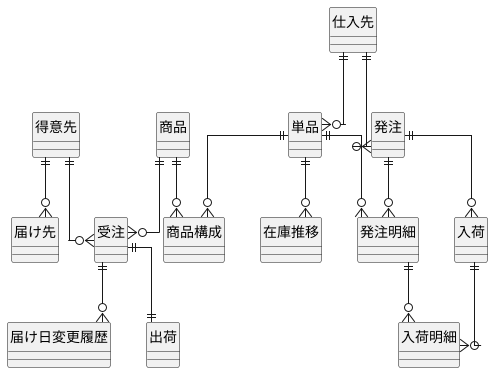
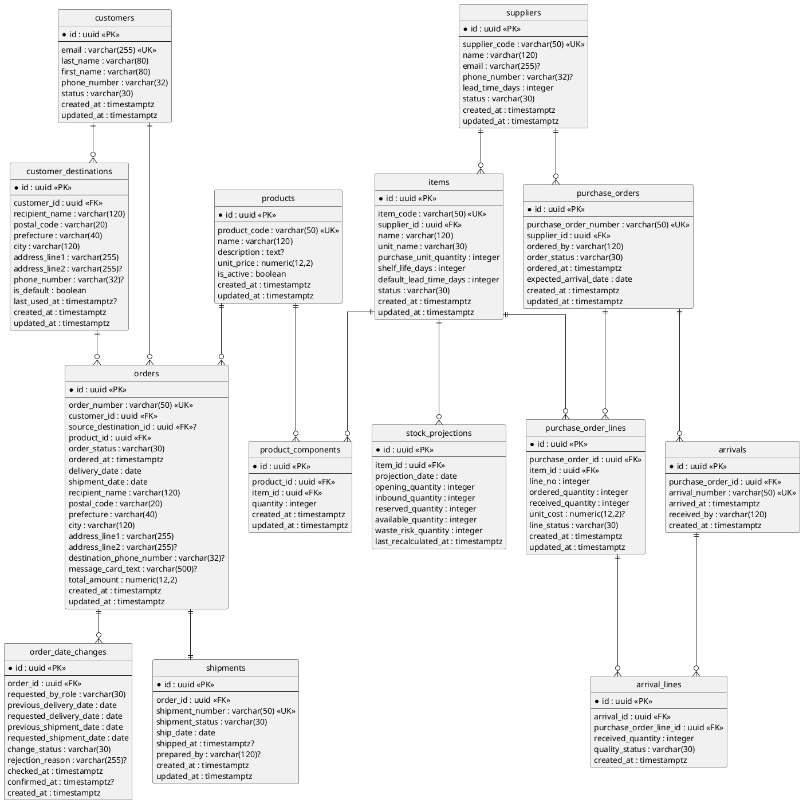

# データモデル設計

## 1. 文書の目的

本書は、フラワーショップ「フレール・メモワール」の WEB ショップシステムにおける永続化構造を定義するものです。

バックエンドアーキテクチャで定義した `catalog`、`orders`、`customers`、`stock`、`purchasing`、`shipping` の各モジュールを、リレーショナルデータベース上でどのように表現するかを整理します。

## 2. 設計方針

### 2.1 基本方針

- 正本データは PostgreSQL に集約します
- 業務トランザクション系テーブルは第 3 正規形を基本とします
- 在庫推移のような読み取り最適化データは projection として分離します
- 主キーは UUID などのサロゲートキーを基本とし、業務上の識別子は unique 制約で保護します
- 変更履歴が重要な業務は履歴テーブルを持ち、現在値だけで上書きしません

### 2.2 データモデルで重視すること

- 注文、届け日変更、発注、入荷、出荷の整合性を保てること
- 花束構成から必要花材を展開できること
- 顧客の届け先再利用を支援できること
- 在庫 projection を日別・単品別に保持できること

## 3. 概念データモデル

### 3.1 エンティティ一覧

| エンティティ | 説明 |
| :--- | :--- |
| 得意先 | 個人顧客。注文主体 |
| 届け先 | 顧客が再利用する配送先テンプレート |
| 商品 | 事前定義された花束商品 |
| 商品構成 | 商品に含まれる単品と必要数量 |
| 単品 | 花材の管理単位 |
| 仕入先 | 単品を供給する取引先 |
| 受注 | 顧客の注文 |
| 届け日変更履歴 | 届け日変更の判定・確定履歴 |
| 発注 | 仕入先への発注 |
| 発注明細 | 発注内の単品別明細 |
| 入荷 | 納品受け入れ |
| 入荷明細 | 入荷内の単品別実績 |
| 出荷 | 出荷日ごとの受注出荷情報 |
| 在庫推移 | 単品・日付単位の予定在庫 |

### 3.2 概念 ER 図

## 4. 論理データモデル

### 4.1 論理 ER 図

## 5. テーブル定義

### 5.1 マスタ系

| テーブル | 用途 | 主な制約 |
| :--- | :--- | :--- |
| `customers` | 顧客の基本情報 | `email` unique |
| `customer_destinations` | 顧客ごとの届け先履歴 | `customer_id` FK |
| `suppliers` | 仕入先マスタ | `supplier_code` unique |
| `items` | 花材の単品マスタ | `item_code` unique、`supplier_id` FK |
| `products` | 花束商品マスタ | `product_code` unique |
| `product_components` | 商品と単品の構成表 | `product_id + item_id` unique 推奨 |

### 5.2 取引系

| テーブル | 用途 | 主な制約 |
| :--- | :--- | :--- |
| `orders` | 注文の正本 | `order_number` unique、`customer_id` / `product_id` FK、`source_destination_id` optional FK |
| `order_date_changes` | 届け日変更の判定履歴と確定履歴 | `order_id` FK |
| `purchase_orders` | 発注ヘッダ | `purchase_order_number` unique、`supplier_id` FK |
| `purchase_order_lines` | 発注明細 | `purchase_order_id + line_no` unique 推奨 |
| `arrivals` | 入荷ヘッダ | `arrival_number` unique、`purchase_order_id` FK |
| `arrival_lines` | 入荷明細 | `arrival_id` / `purchase_order_line_id` FK |
| `shipments` | 出荷情報 | `order_id` unique、`shipment_number` unique |

### 5.3 読み取り最適化系

| テーブル | 用途 | 主な制約 |
| :--- | :--- | :--- |
| `stock_projections` | 単品・日付単位の予定在庫と廃棄リスク | `item_id + projection_date` unique |

## 6. 主なリレーションシップの意図

### 6.1 顧客と届け先

- 顧客は複数の届け先を持てます
- 注文は配送事故防止のため届け先スナップショットを保持します
- `source_destination_id` は再利用元の履歴参照であり、配送先の正本ではありません
- 届け先の再利用は `customer_destinations` から行います

### 6.2 商品と単品

- 商品は花束、単品は花材です
- `product_components` により、1 商品が複数単品で構成される関係を表現します
- 1 受注 1 商品の制約は `orders.product_id` により表現します

### 6.3 発注と入荷

- 発注はヘッダ / 明細に分けます
- 入荷もヘッダ / 明細に分け、部分入荷に対応します
- `purchase_order_lines.received_quantity` は集計しやすさのために保持します
- `suppliers` は `purchasing` コンテキストが所有し、`items` は仕入判断に必要な仕入先参照を持ちます

### 6.4 出荷

- 本システムでは 1 受注 1 出荷を前提とするため、`shipments.order_id` は unique とします
- 出荷一覧は `shipments` と `orders`、必要に応じて `products` を結合して作成します

### 6.5 在庫 projection

- `stock_projections` は正本ではなく query 用 projection です
- 注文、届け日変更、発注、入荷、出荷確定をトリガーに再計算します
- 初期段階では同期更新を前提とし、`item_id + projection_date` の一意キー単位で更新競合を直列化します
- 性能課題が出た段階で非同期化を検討します

## 7. 正規化と非正規化の判断

### 7.1 第 3 正規形を適用する対象

- 顧客、届け先、商品、単品、仕入先
- 受注、発注、入荷、出荷の正本データ

### 7.2 意図的に非正規化する対象

- `stock_projections`
  - 日別在庫推移を高速に参照するための projection です
  - `opening_quantity`、`inbound_quantity`、`reserved_quantity`、`available_quantity` を保持します
- `purchase_order_lines.received_quantity`
  - 入荷明細から導出可能ですが、状態判定と一覧表示を簡潔にするため保持します

## 8. 代表的な整合ルール

- `orders.shipment_date` は必ず `delivery_date` の前日とします
- `product_components.quantity` は 1 以上とします
- `items.purchase_unit_quantity` は 1 以上とします
- `purchase_order_lines.ordered_quantity`、`arrival_lines.received_quantity` は 0 より大きい整数とします
- `stock_projections.available_quantity` は `opening_quantity + inbound_quantity - reserved_quantity` を基本式とします

## 9. 段階的実装方針

1. `products`、`product_components`、`items`、`orders`、`stock_projections` を先に作成する
2. 次に `purchase_orders`、`purchase_order_lines`、`arrivals`、`arrival_lines` を追加する
3. その後 `shipments`、`customer_destinations`、`order_date_changes` を強化する
4. 性能要件が明確になった段階で `stock_projections` の更新方式を見直す

## 10. ドメインモデルとの整合ポイント

- `Order` 集約は `orders` を中心に、届け日変更履歴を `order_date_changes` で支えます
- `orders` は `customer_destinations` の再利用元を参照できる一方、配送先の正本はスナップショット列に保持します
- `Product` 集約は `products` と `product_components` に対応します
- `PurchaseOrder` 集約は `purchase_orders` と `purchase_order_lines` に対応します
- `StockProjection` は集約というより query model として扱います

## 11. TBD

- 顧客認証を導入する場合の認証情報テーブル分離
- 在庫 projection をテーブルで持つか materialized view で持つか
- 花材のロット管理を行うかどうか
- 仕入単価履歴を別テーブルで持つかどうか
