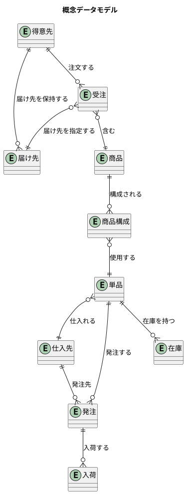
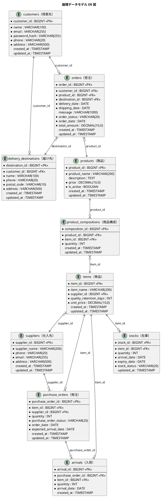

# データモデル設計 - フレール・メモワール WEB ショップシステム

## 概要

要件定義の情報モデル（10 エンティティ）および状態モデルに基づき、概念データモデルから論理データモデルを導出する。第 3 正規形を基本とするが、参照効率のため以下を意図的に非正規化する。

### 意図的な非正規化

| テーブル | カラム | 導出元 | 非正規化理由 |
|---------|--------|--------|-------------|
| `purchase_orders` | `supplier_id` | `purchase_orders→items→suppliers` で導出可能（BR04: 単品ごとに特定の仕入先） | 発注一覧で仕入先名を表示する際に items テーブルへの JOIN を回避するため。仕入先変更時は items.supplier_id と同時更新する |
| `arrivals` | `item_id` | `arrivals→purchase_orders→items` で導出可能 | 入荷管理画面で単品名を表示する際に purchase_orders テーブルへの JOIN を回避するため。入荷と単品の直接的な関連を保持し在庫生成時の参照効率を確保する |

## 概念データモデル

要件定義の情報モデルに定義された 10 エンティティの関連を示す。

- 得意先
- 届け先
- 受注
- 商品（花束）
- 商品構成
- 単品（花）
- 仕入先
- 発注
- 入荷
- 在庫

## 論理データモデル

### ER 図

## テーブル定義

### customers（得意先テーブル）

| カラム名 | 型 | 制約 | 説明 |
|---------|-----|------|------|
| customer_id | BIGINT | PK, AUTO_INCREMENT | 得意先 ID |
| name | VARCHAR(100) | NOT NULL | 氏名 |
| email | VARCHAR(255) | NOT NULL, UNIQUE | メールアドレス |
| password_hash | VARCHAR(255) | NOT NULL | パスワードハッシュ |
| phone | VARCHAR(20) | NOT NULL | 電話番号 |
| address | VARCHAR(500) | NOT NULL | 住所 |
| created_at | TIMESTAMP | DEFAULT CURRENT_TIMESTAMP | 作成日時 |
| updated_at | TIMESTAMP | DEFAULT CURRENT_TIMESTAMP | 更新日時 |

### delivery_destinations（届け先テーブル）

| カラム名 | 型 | 制約 | 説明 |
|---------|-----|------|------|
| destination_id | BIGINT | PK, AUTO_INCREMENT | 届け先 ID |
| customer_id | BIGINT | FK (customers) | 得意先 ID |
| name | VARCHAR(100) | NOT NULL | 届け先名 |
| phone | VARCHAR(20) | NOT NULL | 電話番号 |
| postal_code | VARCHAR(10) | NOT NULL | 郵便番号 |
| address | VARCHAR(500) | NOT NULL | 住所 |
| created_at | TIMESTAMP | DEFAULT CURRENT_TIMESTAMP | 作成日時 |
| updated_at | TIMESTAMP | DEFAULT CURRENT_TIMESTAMP | 更新日時 |

### orders（受注テーブル）

| カラム名 | 型 | 制約 | 説明 |
|---------|-----|------|------|
| order_id | BIGINT | PK, AUTO_INCREMENT | 受注 ID |
| customer_id | BIGINT | FK (customers) | 得意先 ID |
| product_id | BIGINT | FK (products) | 商品 ID（BR01: 1受注=1商品。数量の概念なし） |
| destination_id | BIGINT | FK (delivery_destinations) | 届け先 ID |
| delivery_date | DATE | NOT NULL | 届け日 |
| shipping_date | DATE | NOT NULL | 出荷日（= 届け日 - 1日、BR02） |
| message | VARCHAR(1000) | | メッセージ |
| order_status | VARCHAR(20) | NOT NULL | 受注ステータス |
| order_date | DATE | NOT NULL | 注文日 |
| total_amount | DECIMAL(10,0) | NOT NULL | 合計金額（= products.price。BR01: 1受注=1商品のため商品価格と同値） |
| created_at | TIMESTAMP | DEFAULT CURRENT_TIMESTAMP | 作成日時 |
| updated_at | TIMESTAMP | DEFAULT CURRENT_TIMESTAMP | 更新日時 |

### products（商品テーブル）

| カラム名 | 型 | 制約 | 説明 |
|---------|-----|------|------|
| product_id | BIGINT | PK, AUTO_INCREMENT | 商品 ID |
| product_name | VARCHAR(200) | NOT NULL | 商品名 |
| description | TEXT | | 説明 |
| price | DECIMAL(10,0) | NOT NULL | 価格 |
| is_active | BOOLEAN | NOT NULL, DEFAULT TRUE | 有効フラグ |
| created_at | TIMESTAMP | DEFAULT CURRENT_TIMESTAMP | 作成日時 |
| updated_at | TIMESTAMP | DEFAULT CURRENT_TIMESTAMP | 更新日時 |

### product_compositions（商品構成テーブル）

| カラム名 | 型 | 制約 | 説明 |
|---------|-----|------|------|
| composition_id | BIGINT | PK, AUTO_INCREMENT | 構成 ID |
| product_id | BIGINT | FK (products) | 商品 ID |
| item_id | BIGINT | FK (items) | 単品 ID |
| quantity | INT | NOT NULL | 数量 |
| created_at | TIMESTAMP | DEFAULT CURRENT_TIMESTAMP | 作成日時 |
| updated_at | TIMESTAMP | DEFAULT CURRENT_TIMESTAMP | 更新日時 |

### items（単品テーブル）

| カラム名 | 型 | 制約 | 説明 |
|---------|-----|------|------|
| item_id | BIGINT | PK, AUTO_INCREMENT | 単品 ID |
| item_name | VARCHAR(200) | NOT NULL | 単品名 |
| supplier_id | BIGINT | FK (suppliers) | 仕入先 ID（BR04: 単品ごとに特定の仕入先） |
| quality_retention_days | INT | NOT NULL | 品質維持日数（BR05） |
| unit_price | DECIMAL(10,0) | NOT NULL | 仕入単価 |
| created_at | TIMESTAMP | DEFAULT CURRENT_TIMESTAMP | 作成日時 |
| updated_at | TIMESTAMP | DEFAULT CURRENT_TIMESTAMP | 更新日時 |

### suppliers（仕入先テーブル）

| カラム名 | 型 | 制約 | 説明 |
|---------|-----|------|------|
| supplier_id | BIGINT | PK, AUTO_INCREMENT | 仕入先 ID |
| supplier_name | VARCHAR(200) | NOT NULL | 仕入先名 |
| phone | VARCHAR(20) | NOT NULL | 電話番号 |
| email | VARCHAR(255) | NOT NULL | メールアドレス |
| address | VARCHAR(500) | NOT NULL | 住所 |
| created_at | TIMESTAMP | DEFAULT CURRENT_TIMESTAMP | 作成日時 |
| updated_at | TIMESTAMP | DEFAULT CURRENT_TIMESTAMP | 更新日時 |

### purchase_orders（発注テーブル）

| カラム名 | 型 | 制約 | 説明 |
|---------|-----|------|------|
| purchase_order_id | BIGINT | PK, AUTO_INCREMENT | 発注 ID |
| item_id | BIGINT | FK (items) | 単品 ID |
| supplier_id | BIGINT | FK (suppliers) | 仕入先 ID（意図的非正規化: items.supplier_id から導出可能だが参照効率のため保持） |
| quantity | INT | NOT NULL | 発注数量 |
| purchase_order_status | VARCHAR(20) | NOT NULL | 発注ステータス |
| order_date | DATE | NOT NULL | 発注日 |
| expected_arrival_date | DATE | NOT NULL | 入荷予定日 |
| created_at | TIMESTAMP | DEFAULT CURRENT_TIMESTAMP | 作成日時 |
| updated_at | TIMESTAMP | DEFAULT CURRENT_TIMESTAMP | 更新日時 |

### arrivals（入荷テーブル）

| カラム名 | 型 | 制約 | 説明 |
|---------|-----|------|------|
| arrival_id | BIGINT | PK, AUTO_INCREMENT | 入荷 ID |
| purchase_order_id | BIGINT | FK (purchase_orders) | 発注 ID |
| item_id | BIGINT | FK (items) | 単品 ID（意図的非正規化: purchase_orders.item_id から導出可能だが参照効率のため保持） |
| quantity | INT | NOT NULL | 入荷数量 |
| arrival_date | DATE | NOT NULL | 入荷日 |
| created_at | TIMESTAMP | DEFAULT CURRENT_TIMESTAMP | 作成日時 |

### stocks（在庫テーブル）

| カラム名 | 型 | 制約 | 説明 |
|---------|-----|------|------|
| stock_id | BIGINT | PK, AUTO_INCREMENT | 在庫 ID |
| item_id | BIGINT | FK (items) | 単品 ID |
| quantity | INT | NOT NULL | 在庫数量 |
| arrival_date | DATE | NOT NULL | 入荷日（品質維持日数の起算日、BR06） |
| expiry_date | DATE | NOT NULL | 品質期限日 |
| stock_status | VARCHAR(20) | NOT NULL | 在庫ステータス |
| updated_at | TIMESTAMP | DEFAULT CURRENT_TIMESTAMP | 更新日時 |

## ステータス定義

### 受注ステータス（order_status）

受注の状態遷移に基づく 6 値。

| 値 | 日本語名 | 説明 |
|----|---------|------|
| ORDERED | 受注済み | WEB 受注で注文が確定した状態 |
| DELIVERY_DATE_CHANGED | 届け日変更済み | 届け日が変更された状態 |
| PREPARING | 出荷準備中 | 出荷準備が開始された状態 |
| SHIPPED | 出荷済み | 出荷処理が完了した状態 |
| DELIVERED | 配送完了 | 届け先に配送が完了した状態 |
| CANCELLED | キャンセル | 注文がキャンセルされた状態 |

### 在庫ステータス（stock_status）

在庫の状態遷移に基づく 3 値。

| 値 | 日本語名 | 説明 |
|----|---------|------|
| ARRIVED | 入荷済み | 入荷により在庫に追加された状態 |
| USED | 使用済み | 結束（商品化）で使用された状態 |
| DISPOSED | 廃棄 | 品質維持日数超過により廃棄された状態 |

### 発注ステータス（purchase_order_status）

発注の状態遷移に基づく 2 値。

| 値 | 日本語名 | 説明 |
|----|---------|------|
| ORDERED | 発注済み | 仕入先に発注した状態 |
| ARRIVED | 入荷済み | 入荷が完了した状態 |
