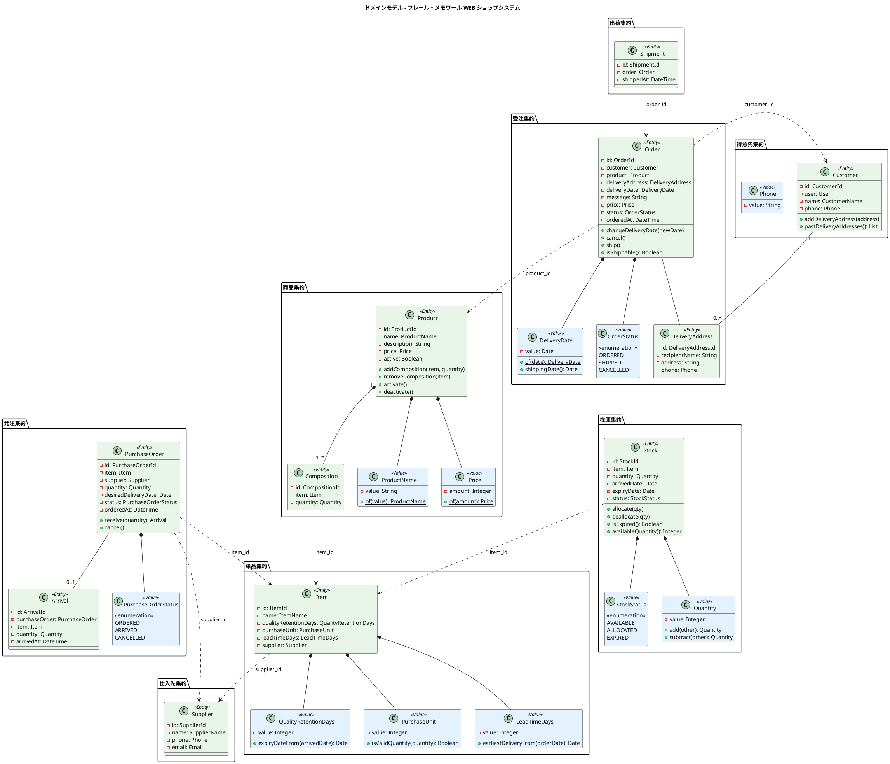

# ドメインモデル設計

## ユビキタス言語

| 日本語 | 英語（コード） | 説明 |
|--------|---------------|------|
| 商品 | Product | 花束。単品の組合せとして事前定義された販売単位 |
| 単品 | Item | 花。品質維持日数・購入単位・リードタイムを持つ |
| 商品構成 | Composition | 商品を構成する単品と数量の組合せ |
| 得意先 | Customer | 花束を注文する個人顧客 |
| 届け先 | DeliveryAddress | 花束の届け先（氏名・住所・電話番号） |
| 受注 | Order | 得意先からの注文。1 受注 = 1 商品 = 1 届け先 |
| 届け日 | DeliveryDate | 花束を届ける日。注文日の翌日以降 |
| お届けメッセージ | Message | 花束に添えるメッセージ |
| 仕入先 | Supplier | 単品を供給するパートナー |
| 発注 | PurchaseOrder | 仕入先への単品の発注 |
| 入荷 | Arrival | 仕入先からの単品の受け入れ |
| 在庫 | Stock | 単品ロット単位の在庫。入荷日と品質維持期限を持つ |
| 在庫推移 | StockForecast | 日別の在庫予定数。品質維持日数を考慮した推移 |
| 出荷 | Shipment | 受注に基づく花束の出荷 |
| 出荷日 | ShippingDate | 届け日の前日。花束を結束・出荷する日 |
| 品質維持日数 | QualityRetentionDays | 入荷から使用可能な日数 |
| 購入単位 | PurchaseUnit | 仕入先への発注の最小単位 |
| リードタイム | LeadTimeDays | 発注から入荷までの日数 |
| 引当 | Allocation | 受注に対して在庫を確保すること |

## ドメインモデル図



## 集約の設計

### 集約一覧

| 集約 | 集約ルート | 含まれるエンティティ/値オブジェクト | 不変条件 |
|------|----------|----------------------------------|---------|
| 商品集約 | Product | Composition, ProductName, Price | 構成は 1 つ以上の単品を含む。価格は正の値 |
| 単品集約 | Item | QualityRetentionDays, PurchaseUnit, LeadTimeDays | 品質維持日数・購入単位・リードタイムは正の値 |
| 受注集約 | Order | DeliveryDate, OrderStatus | 届け日は未来日。出荷済み/キャンセル済みは変更不可 |
| 得意先集約 | Customer | Phone | 氏名は必須 |
| 仕入先集約 | Supplier | Phone, Email | 名前は必須 |
| 発注集約 | PurchaseOrder | Arrival, PurchaseOrderStatus | 発注数量は購入単位の整数倍 |
| 在庫集約 | Stock | Quantity, StockStatus | 数量は 0 以上。品質維持期限は入荷日 + 品質維持日数 |
| 出荷集約 | Shipment | - | 受注と 1:1 |

### 集約間の参照ルール

集約間は ID で参照する。直接のオブジェクト参照は行わない。

```
Order → Product（product_id で参照）
Order → Customer（customer_id で参照）
Order → DeliveryAddress（delivery_address_id で参照）
Composition → Item（item_id で参照）
Item → Supplier（supplier_id で参照）
PurchaseOrder → Item（item_id で参照）
Stock → Item（item_id で参照）
Shipment → Order（order_id で参照）
```

## ドメインサービス

| サービス | 責務 | 関連する集約 |
|---------|------|-------------|
| OrderService | 注文確定（受注作成 + 在庫引当）、キャンセル（受注更新 + 引当解除） | Order, Stock |
| StockAllocationService | 在庫引当、引当解除 | Stock, Order |
| StockForecastService | 日別在庫推移の計算（品質維持日数考慮） | Stock, Item, Order, PurchaseOrder |
| ShippingService | 出荷処理（受注状態更新 + 在庫消費 + 出荷作成） | Order, Stock, Shipment |
| PurchaseOrderService | 発注確定（購入単位の検証）、入荷処理（在庫作成） | PurchaseOrder, Arrival, Stock |

### StockForecastService の計算ロジック概要

```
日別在庫推移(単品, 開始日, 終了日):
  各日について:
    良品在庫 = 入荷済みで品質維持期限内の在庫の合計
    入荷予定 = 発注済みで希望納品日が当日以前の未入荷分
    引当済み = 当日が出荷日（届け日の前日）の受注に紐づく引当分
    廃棄対象 = 品質維持期限を超過した在庫の合計
```

## Service Object の依存注入方針

Service Object は日付や外部依存をコンストラクタで注入可能にする。テスト時に日付を固定して「脆いテスト」を防ぐ。

```ruby
class StockForecastService
  def initialize(current_date: Date.current)
    @current_date = current_date
  end

  def forecast(item, start_date, end_date)
    # @current_date を基準に計算
  end
end

# テストでの利用
service = StockForecastService.new(current_date: Date.new(2026, 4, 1))
```

| Service | 注入可能な依存 |
|---------|--------------|
| StockForecastService | current_date |
| OrderService | current_date |
| ShippingService | current_date |
| StockAllocationService | なし（純粋なロジック） |
| PurchaseOrderService | current_date |

## Rails ActiveRecord との対応

Rails の ActiveRecord パターンでは、ドメインモデルとデータモデルが密結合する。値オブジェクトはモデル内のメソッドやカスタムバリデーションで表現する。

| ドメインモデル | Rails での実装 |
|---------------|---------------|
| エンティティ | ActiveRecord モデル（app/models/） |
| 値オブジェクト | composed_of マクロ、またはカスタムバリデーション |
| 集約ルート | ActiveRecord モデル + accepts_nested_attributes_for |
| ドメインサービス | Service Object（app/services/） |
| 不変条件 | validates / before_save コールバック |

### 例: Order モデル

```ruby
class Order < ApplicationRecord
  belongs_to :customer
  belongs_to :product
  belongs_to :delivery_address

  has_one :shipment

  enum :status, {
    ordered: "ordered",
    shipped: "shipped",
    cancelled: "cancelled"
  }

  validates :delivery_date, presence: true
  validate :delivery_date_must_be_future, on: :create

  def change_delivery_date(new_date)
    raise "出荷済みの注文は変更できません" if shipped?
    update!(delivery_date: new_date, status: :ordered)
  end

  def cancel!
    raise "出荷済みの注文はキャンセルできません" if shipped?
    update!(status: :cancelled)
  end

  def shipping_date
    delivery_date - 1.day
  end

  def shippable?
    ordered? && shipping_date <= Date.current
  end

  private

  def delivery_date_must_be_future
    if delivery_date.present? && delivery_date <= Date.current
      errors.add(:delivery_date, "は未来日を指定してください")
    end
  end
end
```

## データモデルとの整合性

| ドメインモデル | データモデル（テーブル） | 備考 |
|---------------|----------------------|------|
| Product | products | 1:1 対応 |
| Item | items | 1:1 対応 |
| Composition | compositions | 1:1 対応 |
| Customer | customers | 1:1 対応。User とは user_id で関連 |
| DeliveryAddress | delivery_addresses | 1:1 対応 |
| Order | orders | 1:1 対応 |
| Supplier | suppliers | 1:1 対応 |
| PurchaseOrder | purchase_orders | 1:1 対応 |
| Arrival | arrivals | 1:1 対応 |
| Stock | stocks | 1:1 対応 |
| Shipment | shipments | 1:1 対応 |
