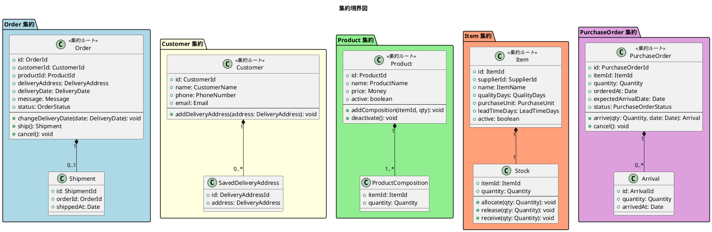
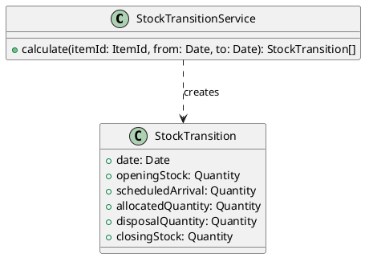
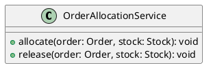
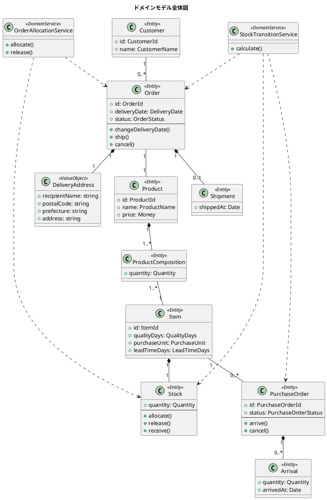

# ドメインモデル設計 - フレール・メモワール WEB ショップシステム

## ユビキタス言語

| 用語（日本語） | 用語（英語） | 説明 |
| :--- | :--- | :--- |
| 得意先 | Customer | 花束を注文する個人顧客 |
| 受注 | Order | 得意先からの花束注文。届け日・届け先・メッセージを含む |
| 届け先 | DeliveryAddress | 花束の配送先。氏名・住所を含む |
| 商品 | Product | 販売する花束の定義。複数の単品で構成される |
| 商品構成 | ProductComposition | 商品を構成する単品と数量の組合せ |
| 単品 | Item | 花束を構成する個々の花材。品質維持日数・購入単位・リードタイムを持つ |
| 仕入先 | Supplier | 単品を供給するパートナー |
| 発注 | PurchaseOrder | 仕入先への単品発注 |
| 入荷 | Arrival | 仕入先からの単品入荷。入荷日が品質維持日数の起算日 |
| 在庫 | Stock | 単品の現在庫数 |
| 在庫推移 | StockTransition | 日別の在庫予定数。受注引当・入荷予定・廃棄予定を考慮して計算 |
| 出荷 | Shipment | 受注に対する出荷。出荷日 = 届け日の前日 |
| 届け日 | DeliveryDate | 花束を届ける日付。翌々日以降を指定可能 |
| 品質維持日数 | QualityDays | 入荷日から品質を維持できる日数 |
| 廃棄 | Disposal | 品質維持日数を超えた在庫の廃棄 |

## エンティティ定義

### Order（受注）

受注はライフサイクル（受注済→出荷済 / キャンセル）を持つ中心的なエンティティ。

| 属性 | 型 | 説明 |
| :--- | :--- | :--- |
| id | OrderId | 受注 ID（サロゲートキー） |
| customerId | CustomerId | 得意先 ID |
| productId | ProductId | 商品 ID |
| deliveryAddress | DeliveryAddress | 届け先（値オブジェクト） |
| deliveryDate | DeliveryDate | 届け日（値オブジェクト） |
| message | Message | メッセージ（値オブジェクト、省略可） |
| status | OrderStatus | ステータス（値オブジェクト） |

**不変条件:**

- 届け日は注文日の翌々日以降であること
- 出荷済みの受注は届け日を変更できない

### Customer（得意先）

| 属性 | 型 | 説明 |
| :--- | :--- | :--- |
| id | CustomerId | 得意先 ID |
| name | CustomerName | 氏名（値オブジェクト） |
| phone | PhoneNumber | 電話番号（値オブジェクト） |
| email | Email | メールアドレス（値オブジェクト、省略可） |
| deliveryAddresses | DeliveryAddress[] | 過去の届け先一覧 |

### Product（商品）

| 属性 | 型 | 説明 |
| :--- | :--- | :--- |
| id | ProductId | 商品 ID |
| name | ProductName | 商品名（値オブジェクト） |
| price | Money | 価格（値オブジェクト） |
| compositions | ProductComposition[] | 商品構成 |
| active | boolean | 有効フラグ |

### Item（単品）

| 属性 | 型 | 説明 |
| :--- | :--- | :--- |
| id | ItemId | 単品 ID |
| supplierId | SupplierId | 仕入先 ID |
| name | ItemName | 単品名（値オブジェクト） |
| qualityDays | QualityDays | 品質維持日数（値オブジェクト） |
| purchaseUnit | PurchaseUnit | 購入単位（値オブジェクト） |
| leadTimeDays | LeadTimeDays | リードタイム（値オブジェクト） |
| active | boolean | 有効フラグ |

### PurchaseOrder（発注）

| 属性 | 型 | 説明 |
| :--- | :--- | :--- |
| id | PurchaseOrderId | 発注 ID |
| itemId | ItemId | 単品 ID |
| quantity | Quantity | 発注数量（値オブジェクト） |
| orderedAt | Date | 発注日 |
| expectedArrivalDate | Date | 入荷予定日 |
| status | PurchaseOrderStatus | ステータス（値オブジェクト） |

### Arrival（入荷）

| 属性 | 型 | 説明 |
| :--- | :--- | :--- |
| id | ArrivalId | 入荷 ID |
| purchaseOrderId | PurchaseOrderId | 発注 ID |
| itemId | ItemId | 単品 ID |
| quantity | Quantity | 入荷数量（値オブジェクト） |
| arrivedAt | Date | 入荷日（品質維持日数の起算日） |

### Shipment（出荷）

| 属性 | 型 | 説明 |
| :--- | :--- | :--- |
| id | ShipmentId | 出荷 ID |
| orderId | OrderId | 受注 ID |
| shippedAt | Date | 出荷日 |

## 値オブジェクト定義

| 値オブジェクト | バリデーションルール |
| :--- | :--- |
| DeliveryDate | 翌々日以降の日付であること |
| OrderStatus | ordered / shipped / cancelled のいずれか |
| PurchaseOrderStatus | ordered / arrived / cancelled のいずれか |
| Money | 0 以上の整数（円） |
| Quantity | 1 以上の整数 |
| QualityDays | 1 以上の整数 |
| PurchaseUnit | 1 以上の整数 |
| LeadTimeDays | 0 以上の整数 |
| CustomerName | 1〜100 文字 |
| PhoneNumber | 電話番号形式 |
| Email | メールアドレス形式（省略可） |
| DeliveryAddress | 氏名・郵便番号・都道府県・住所すべて必須 |
| Message | 0〜500 文字 |

## 集約設計

### 集約一覧



### 集約の不変条件

| 集約 | 不変条件 |
| :--- | :--- |
| Order | 届け日は注文日の翌々日以降。出荷済みは変更・キャンセル不可 |
| Product | 商品構成は 1 件以上必要。同一単品の重複不可 |
| Item | 在庫数は 0 以上 |
| PurchaseOrder | 入荷数量は発注数量以下。到着済みはキャンセル不可 |

## ドメインサービス定義

### StockTransitionService（在庫推移計算サービス）

複数の集約（Item / Order / PurchaseOrder）にまたがる計算のため、ドメインサービスとして定義する。



**計算ロジック:**

```
closingStock[D] =
  openingStock[D]
  + scheduledArrival[D]       // 入荷予定数（expected_arrival_date = D）
  - allocatedQuantity[D]      // 受注引当数（delivery_date = D, status = ordered）
  - disposalQuantity[D]       // 廃棄予定数（arrived_at + quality_days < D）
```

### OrderAllocationService（受注引当サービス）

注文登録時に在庫を引き当てる。在庫不足の場合は例外をスローする。



## ドメインモデル全体図


