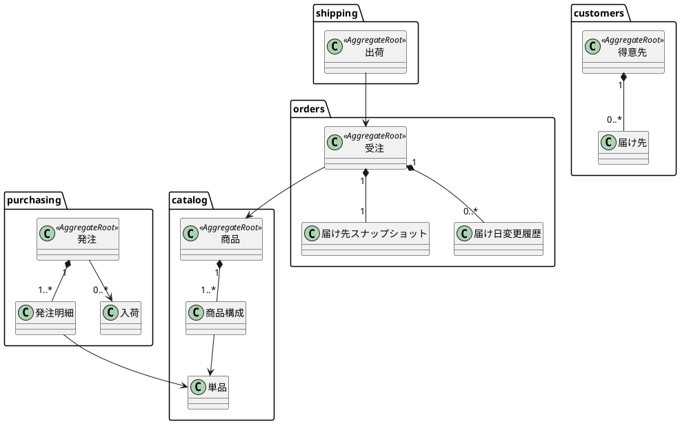
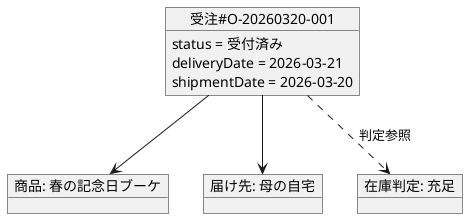

# ドメインモデル設計

## 1. 文書の目的

本書は、フラワーショップ「フレール・メモワール」の WEB ショップシステムにおけるドメインモデルを定義するものです。

要件定義で明らかになった業務ルールと、バックエンドアーキテクチャで定義したモジュール境界を踏まえ、ユビキタス言語、エンティティ、値オブジェクト、集約、ドメインサービスを整理します。

## 2. モデリング方針

### 2.1 基本方針

- ビジネスルールは `domain` に集約します
- 集約はトランザクション整合性が必要な最小単位に保ちます
- プリミティブ型で業務知識を表現せず、重要な概念は値オブジェクト化します
- 在庫推移は正本ではなく query model としつつ、在庫判定ロジック自体はドメインで保護します

### 2.2 重点的に守る業務ルール

- 1 受注 1 商品、1 受注 1 届け先を守ること
- 出荷日は届け日の前日であること
- 発注判断は人間が行い、システムは判断材料を提供すること
- 届け日変更時は旧日付と新日付の在庫影響を比較して可否を判定すること
- 品質維持日数を超える花材は利用可能在庫として扱わないこと

## 3. ユビキタス言語

| 用語 | 意味 |
| :--- | :--- |
| 得意先 | 花束を注文する個人顧客 |
| 届け先 | 花束の配送先。顧客が再利用できる |
| 商品 | 事前定義された花束 |
| 単品 | 花束を構成する花材の最小管理単位 |
| 商品構成 | 商品に含まれる単品と必要数量の定義 |
| 受注 | 顧客から受け付けた注文 |
| 届け日 | 顧客が指定する配達日 |
| 出荷日 | 届け日の前日。結束と出荷の基準日 |
| 届け日変更 | 既存受注の届け日を変更する業務 |
| 在庫推移 | 単品ごとの日別予定在庫の見通し |
| 廃棄リスク | 品質維持期限超過により利用できない在庫の見込み |
| 発注 | 仕入スタッフが仕入先へ登録する注文 |
| 入荷 | 発注に対する納品受け入れ |
| 出荷 | 出荷日に対象受注を出荷可能状態へ進める業務 |

## 4. 境界づけられたコンテキスト

| コンテキスト | 主責務 | 主なモデル |
| :--- | :--- | :--- |
| `catalog` | 商品と花材の定義管理 | 商品、商品構成、単品 |
| `customers` | 顧客と届け先履歴の管理 | 得意先、届け先 |
| `orders` | 注文受付、届け日変更、注文状態管理 | 受注、届け日変更履歴 |
| `stock` | 在庫判定と在庫推移の算出 | 在庫推移、在庫判定 |
| `purchasing` | 発注、入荷、仕入先の管理 | 発注、発注明細、入荷、仕入先 |
| `shipping` | 出荷対象抽出と出荷状態管理 | 出荷 |

## 5. エンティティ

### 5.1 エンティティ一覧

| エンティティ | 識別子 | 理由 |
| :--- | :--- | :--- |
| 得意先 | `CustomerId` | 顧客は属性変更後も同一性を保つ |
| 届け先 | `DestinationId` | 住所変更や再利用履歴がある |
| 商品 | `ProductId` | 商品名や価格が変わっても同一商品として扱う |
| 単品 | `ItemId` | 花材コードで管理され、仕入判断に使う |
| 仕入先 | `SupplierId` | 取引条件変更後も同一取引先として扱う |
| 受注 | `OrderId` | 状態遷移と届け日変更を持つライフサイクルがある |
| 届け日変更履歴 | `OrderDateChangeId` | 判定と確定の履歴として追跡する |
| 発注 | `PurchaseOrderId` | 状態遷移と入荷進捗を持つ |
| 発注明細 | `PurchaseOrderLineId` | 部分入荷管理の単位となる |
| 入荷 | `ArrivalId` | 発注に対する納品受け入れのイベントを表す |
| 出荷 | `ShipmentId` | 出荷対象確認から出荷済みまで遷移する |

### 5.2 主要エンティティの責務

#### 得意先

- 自身に紐づく届け先の再利用可能性を持つ
- 注文主体として受注作成に関与する

#### 受注

- 商品、届け先スナップショット、届け日、出荷日、メッセージを保持する
- 注文状態を管理する
- 届け日変更要求を受け付ける

#### 発注

- 仕入先、期待入荷日、明細、状態を保持する
- 一部入荷と入荷完了の状態遷移を管理する

#### 出荷

- 出荷日と出荷状態を保持する
- 受注と整合した 1 対 1 の出荷管理単位となる

## 6. 値オブジェクト

### 6.1 値オブジェクト一覧

| 値オブジェクト | 役割 |
| :--- | :--- |
| `CustomerId` / `DestinationId` / `ProductId` / `ItemId` / `OrderId` など | 識別子の型安全性を高める |
| `CustomerName` | 顧客名を表す |
| `RecipientName` | 届け先受取人名を表す |
| `DestinationSnapshot` | 注文時点の届け先情報を保持する |
| `EmailAddress` | メール形式を検証する |
| `PhoneNumber` | 連絡先形式を検証する |
| `Address` | 郵便番号、都道府県、市区町村、住所を束ねる |
| `MessageCardText` | 文字数制約付きメッセージを表す |
| `Money` | 商品価格や金額を表す |
| `DeliveryDate` | 顧客指定の届け日 |
| `ShipmentDate` | 出荷日。届け日から導出される |
| `Quantity` | 正の整数数量を表す |
| `PurchaseUnitQuantity` | 購入単位数量を表す |
| `ShelfLifeDays` | 品質維持日数を表す |
| `LeadTimeDays` | 仕入リードタイム日数を表す |
| `OrderStatus` | 受注状態の列挙 |
| `PurchaseOrderStatus` | 発注状態の列挙 |
| `ShipmentStatus` | 出荷状態の列挙 |
| `StockAvailability` | 充足 / 不足見込み / 廃棄リスクの判定結果 |

### 6.2 重要な値オブジェクトの振る舞い

#### `ShipmentDate`

- `DeliveryDate` から 1 日前を導出します
- 届け日との整合性を常に保証します

#### `Quantity`

- 0 以下の値を許容しません
- 加算、減算、比較の振る舞いを持てます

#### `Address`

- 配送先として必要な構成要素が欠けた状態を許容しません
- 表示用の整形文字列を返せます

#### `StockAvailability`

- 在庫充足 / 不足見込み / 廃棄リスクを型として扱います
- UI や API が文字列の直書きに依存しないようにします

## 7. 集約

### 7.1 集約一覧

| 集約 | 集約ルート | 含まれる要素 | 主な不変条件 |
| :--- | :--- | :--- | :--- |
| 商品集約 | 商品 | 商品構成 | 商品構成数量は正、構成単品は重複しない |
| 得意先集約 | 得意先 | 届け先 | 届け先は得意先配下でのみ再利用される |
| 受注集約 | 受注 | 届け先スナップショット、届け日変更履歴 | 1 受注 1 商品、1 受注 1 届け先スナップショット、出荷日は届け日の前日 |
| 発注集約 | 発注 | 発注明細 | 明細数量は正、一部入荷量は発注量を超えない |
| 出荷集約 | 出荷 | なし | 1 受注に対応する出荷は高々 1 つ |

### 7.2 集約境界の考え方

#### 商品集約

- 商品と商品構成は同時に整合性を保つ必要があります
- 商品を公開停止しても単品マスタそのものは独立して生存するため、単品は別集約です

#### 得意先集約

- 届け先は得意先の文脈で再利用されます
- 届け先を独立集約にせず、得意先配下の管理対象とすることで「他顧客の届け先を再利用しない」を保ちます

#### 受注集約

- 注文受付、届け日変更、状態遷移は同一トランザクション境界に置きます
- 注文確定時の届け先は `customers` の届け先を参照して選べますが、配送事故を防ぐため注文時点のスナップショットを受注内に保持します
- 在庫推移は参照するが、受注集約の内部には持ち込みません

#### 発注集約

- 発注明細と状態遷移は密結合です
- 入荷そのものは別イベントであり、発注集約に結果を反映します

#### 出荷集約

- 出荷対象確認と出荷済み遷移を管理します
- 花材引当の正本は `stock` にあり、出荷集約はその結果を利用します

### 7.3 集約図

## 8. ドメインサービス

### 8.1 ドメインサービス一覧

| ドメインサービス | 役割 |
| :--- | :--- |
| `ShipmentDateCalculator` | 届け日から出荷日を導出する |
| `OrderDateChangePolicy` | 届け日変更可否を判定する |
| `RequiredItemExpander` | 商品構成から必要花材数量を展開する |
| `StockProjectionService` | 在庫推移を再計算する |
| `StockAvailabilityPolicy` | 在庫充足 / 不足 / 廃棄リスクを判定する |
| `PurchaseOrderReceivingService` | 入荷実績を発注明細へ反映する |
| `ShipmentPlanningService` | 出荷対象を抽出し一覧化する |

### 8.2 サービスを使う理由

- `ShipmentDateCalculator` は `DeliveryDate` と `ShipmentDate` の変換に特化した計算ロジックです
- `OrderDateChangePolicy` は受注と在庫判定を横断するため、単一エンティティに閉じません
- `StockProjectionService` は受注、発注、入荷、出荷の複数イベントを横断して projection を更新します

## 9. ファクトリ

| ファクトリ | 用途 |
| :--- | :--- |
| `OrderFactory` | 注文確定時に受注、出荷日、初期状態をまとめて生成する |
| `PurchaseOrderFactory` | 発注ヘッダと明細を一括生成する |
| `ShipmentFactory` | 出荷対象抽出時に出荷エンティティを生成する |

## 10. 主要な不変条件

### 10.1 受注集約

- 1 回の注文で指定できる商品は 1 つだけです
- 1 回の注文で指定できる届け先は 1 つだけです
- `shipmentDate` は `deliveryDate` の前日でなければなりません
- `受付済み` 以降の受注のみ届け日変更対象になります

### 10.2 発注集約

- 発注明細数量はすべて正の整数です
- 入荷累計は発注数量を超えてはいけません
- 全明細の残数が 0 になったときのみ `入荷完了` に遷移できます

### 10.3 商品集約

- 商品構成内の単品は重複登録できません
- 構成数量は 1 以上です

## 11. オブジェクト図

## 12. 実装マッピング

| モジュール | 集約 / サービス | 想定クラス例 |
| :--- | :--- | :--- |
| `catalog` | 商品集約 | `Product`, `ProductComponent`, `RequiredItemExpander` |
| `customers` | 得意先集約 | `Customer`, `Destination` |
| `orders` | 受注集約 | `Order`, `OrderDateChange`, `OrderFactory`, `OrderDateChangePolicy` |
| `stock` | 在庫判定サービス | `StockProjectionService`, `StockAvailabilityPolicy` |
| `purchasing` | 発注集約 | `PurchaseOrder`, `PurchaseOrderLine`, `Supplier`, `PurchaseOrderReceivingService` |
| `shipping` | 出荷集約 | `Shipment`, `ShipmentPlanningService` |

## 13. データモデルとの対応

| ドメインモデル | データモデル |
| :--- | :--- |
| 得意先集約 | `customers`, `customer_destinations` |
| 商品集約 | `products`, `product_components`, `items` |
| 受注集約 | `orders`, `order_date_changes` |
| 発注集約 | `purchase_orders`, `purchase_order_lines`, `arrivals`, `arrival_lines` |
| 出荷集約 | `shipments` |
| 在庫 projection | `stock_projections` |

## 14. リスクと見直しポイント

- 在庫判定ロジックが `orders` と `stock` の境界をまたいで肥大化しやすいです
- 顧客認証を導入する場合、得意先集約とは別にアカウント集約が必要になる可能性があります
- 仕入単価や花材ロット管理が必要になれば、発注集約の再分割を検討します

## 15. TBD

- 顧客アカウントを持たせるか、ゲスト注文中心で進めるか
- 経営者、受注スタッフ、仕入スタッフ、フローリストの認可モデル詳細
- 在庫判定結果を履歴として永続化するか、都度計算とするか
