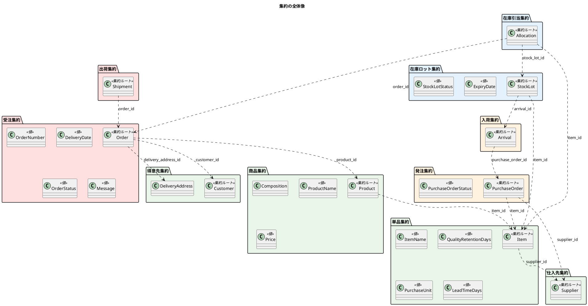
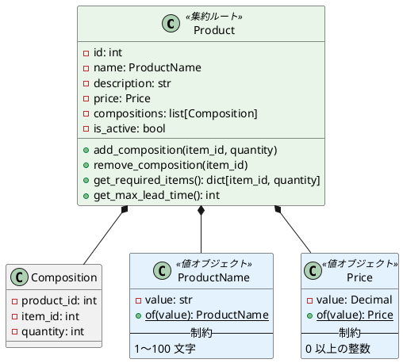
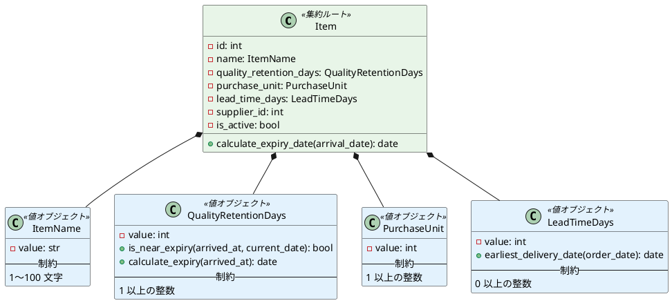
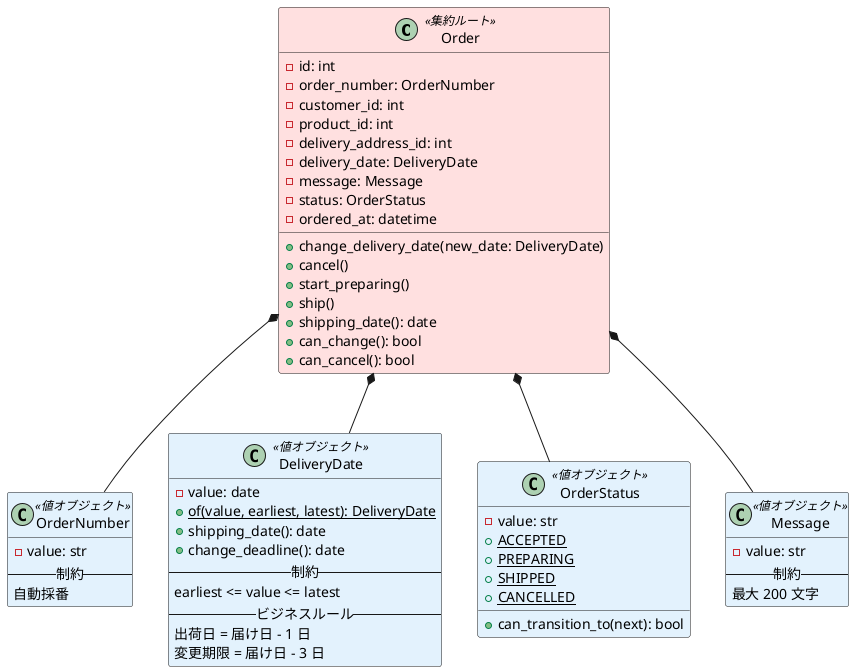
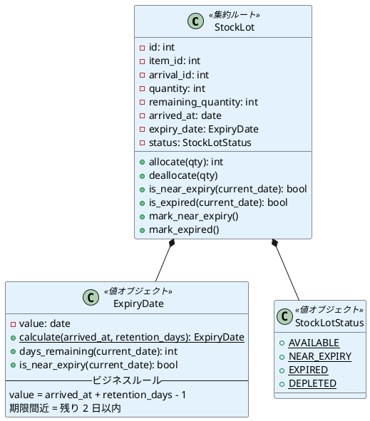
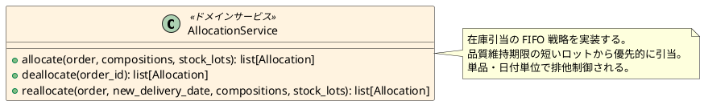
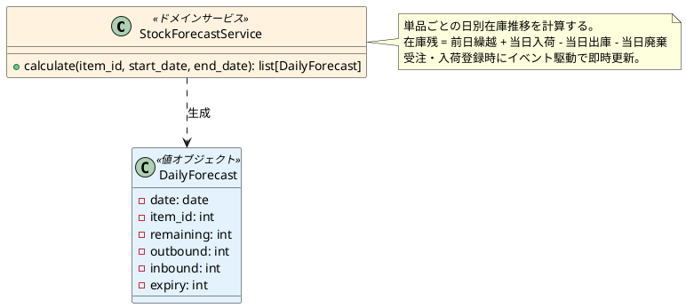
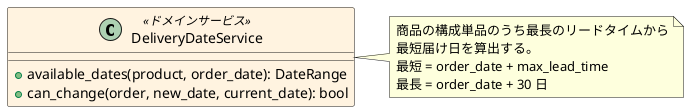
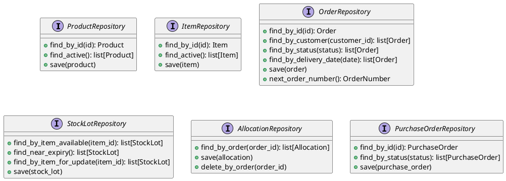
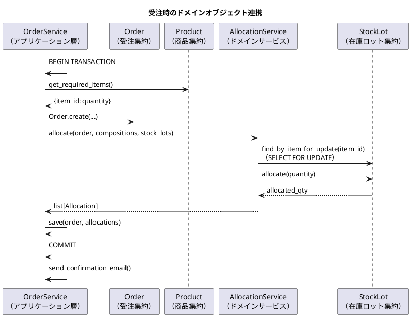

# ドメインモデル設計 - フレール・メモワール WEB ショップシステム

## ユビキタス言語

| 日本語 | 英語（コード） | 定義 |
| :--- | :--- | :--- |
| 得意先 | Customer | 花束を注文する個人顧客 |
| 商品（花束） | Product | 販売する花束。単品の組み合わせで構成される |
| 単品（花） | Item | 花束を構成する個々の花材 |
| 商品構成 | Composition | 花束を構成する単品と数量の組み合わせ |
| 仕入先 | Supplier | 単品の供給パートナー。単品ごとに特定 |
| 受注 | Order | 得意先からの花束の注文 |
| 届け先 | DeliveryAddress | 花束の届け先（氏名・住所・電話番号） |
| 届け日 | DeliveryDate | 花束を届ける日。選択範囲はリードタイムに依存 |
| 発注 | PurchaseOrder | 仕入先への花材の発注 |
| 入荷 | Arrival | 仕入先からの花材の入荷実績 |
| 在庫ロット | StockLot | 入荷単位で管理される在庫。品質維持期限を持つ |
| 在庫引当 | Allocation | 受注に対する在庫ロットの確保記録 |
| 出荷 | Shipment | 受注に対する出荷記録 |
| 品質維持日数 | QualityRetentionDays | 入荷日から花材の品質を維持できる日数 |
| 品質維持期限 | ExpiryDate | 入荷日 + 品質維持日数 - 1 で算出される期限日 |
| 在庫推移 | StockForecast | 単品ごとの日別在庫予測（在庫残・出庫予定・入荷予定・廃棄予定） |
| リードタイム | LeadTimeDays | 発注から入荷までの所要日数 |
| 購入単位 | PurchaseUnit | 仕入先への最小発注単位（本） |
| 出荷日 | ShippingDate | 届け日の前日 |

## 集約とクラス図

### 集約の全体像

### 商品集約

**不変条件**:

- 商品は 1 つ以上の商品構成を持つ
- 同じ単品を重複して構成に含められない
- 価格は 0 以上

### 単品集約

### 受注集約

**不変条件**:

- ステータス遷移は定義された順序のみ許可（accepted → preparing → shipped、accepted → cancelled）
- 届け日変更は変更期限（届け日の 3 日前）内のみ可能
- キャンセルは変更期限内かつ accepted 状態のみ可能

### 在庫ロット集約

**不変条件**:

- remaining_quantity >= 0
- remaining_quantity <= quantity
- expired 状態のロットからは引当不可

## ドメインサービス

### 在庫引当サービス（AllocationService）

**責務**:

- 受注時: 花束構成を単品レベルに展開し、品質維持期限の短いロットから順に引当
- キャンセル時: 受注に紐づく全引当を解除し、ロットの remaining_quantity を復元
- 届け日変更時: 既存引当を解除→新しい届け日で再引当（同一トランザクション内）

### 在庫推移計算サービス（StockForecastService）

### 届け日計算サービス（DeliveryDateService）

## リポジトリインターフェース

## 集約間の連携とトランザクション境界

## Django App とドメインモデルの対応

| Django App | 集約 | ドメインサービス |
| :--- | :--- | :--- |
| products | Product, Item, Supplier | - |
| orders | Order | DeliveryDateService |
| inventory | StockLot, Allocation | AllocationService, StockForecastService |
| purchasing | PurchaseOrder, Arrival | - |
| shipping | Shipment | - |
| customers | Customer, DeliveryAddress | - |
