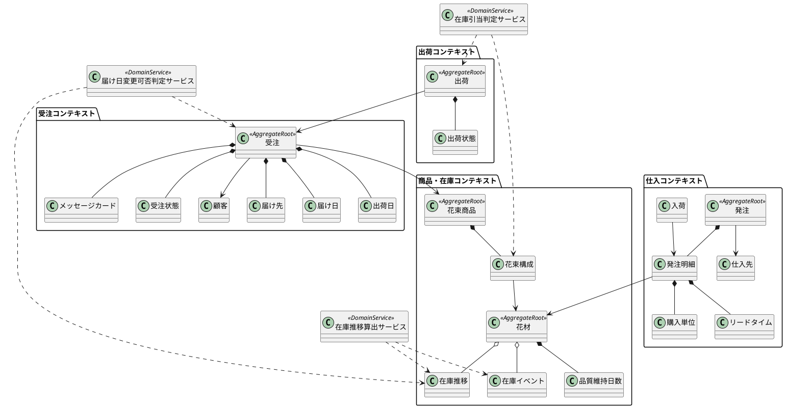

# ドメインモデル設計

本書は、フラワーショップ「フレール・メモワール」 WEB ショップシステムのドメインモデルを DDD の戦術的設計パターンに基づいて整理したものです。受注、在庫、仕入、出荷のユビキタス言語を明確にし、集約境界と不変条件を定義します。

## ユビキタス言語

| 用語 | 意味 |
| :--- | :--- |
| 花束商品 | 顧客が注文する販売単位の花束 |
| 花材 | 花束を構成する単品在庫の管理単位 |
| 花束構成 | 花束商品を構成する花材と必要数量の定義 |
| 受注 | 顧客が確定した注文 |
| 届け先 | 顧客が指定する配送先情報 |
| 届け日 | 顧客に届ける日 |
| 出荷日 | 店舗が発送処理を行う日。原則として届け日の前日 |
| 在庫推移 | 日別の花材在庫予定数 |
| 発注 | 仕入スタッフが仕入先へ依頼する花材調達 |
| 入荷 | 発注に対して実際に納品された結果 |
| 出荷 | 受注に対して花束を発送済みにすること |
| 廃棄リスク | 品質維持日数を超過する可能性が高い花材量 |

## モデル全体像

## エンティティ

| エンティティ | 理由 | 主な責務 |
| :--- | :--- | :--- |
| 受注 | 状態遷移と届け日変更の履歴を持つ | 注文確定、届け日変更、出荷可否の前提保持 |
| 顧客 | 注文主体として識別が必要 | 顧客属性と届け先履歴の参照起点 |
| 花束商品 | 販売状態と構成を管理する | 商品提供可否、構成参照 |
| 花材 | 在庫管理の識別対象 | 品質維持日数、在庫イベント管理 |
| 発注 | 発注状態を持ち仕入先単位で管理される | 発注確定、入荷待ち管理 |
| 発注明細 | 発注内の花材別行として継続性を持つ | 数量、購入単位、入荷対象の保持 |
| 仕入先 | 取引先として継続管理が必要 | 花材供給元の識別 |
| 入荷 | 発注に対する実績の事実 | 数量受領、部分入荷の記録 |
| 出荷 | 受注に対する発送実績 | 出荷確定、状態更新 |
| 在庫イベント | 在庫増減の事実を識別して追跡する | 入荷、出荷、廃棄による増減記録 |

## 値オブジェクト

| 値オブジェクト | 役割 | ルール |
| :--- | :--- | :--- |
| 届け先 | 受取人名、住所、電話番号のまとまり | 必須項目を満たすこと |
| 届け日 | 顧客に届ける日 | 受付可能日であること |
| 出荷日 | 店舗が発送する日 | 原則として届け日の前日 |
| メッセージカード | 注文に添える文言 | 長さ上限を守ること |
| 受注状態 | `受付` `変更待ち` `出荷準備中` `出荷済み` など | 許可された遷移のみ可能 |
| 出荷状態 | `未準備` `出荷準備中` `保留` `出荷準備完了` `出荷済み` | 許可された遷移のみ可能 |
| 品質維持日数 | 花材の鮮度保持期間 | 1 日以上であること |
| 購入単位 | 仕入先からの最小購入単位 | 1 以上の整数であること |
| リードタイム | 発注から入荷までの日数 | 0 日以上であること |
| 数量 | 花材や発注明細の数量表現 | 負数を許可しない |

## 集約設計

### 受注集約

- 集約ルート: `受注`
- 内包要素: `届け先` `届け日` `出荷日` `メッセージカード` `受注状態`
- 外部参照: `顧客` `花束商品`

不変条件:

- 注文確定時に `届け日` と `届け先` と `花束商品` が必須である
- `出荷日` は `届け日` から導出される
- `出荷済み` の受注は届け日変更できない
- 変更可否判定を通過しない限り届け日は更新できない

### 花束商品集約

- 集約ルート: `花束商品`
- 内包要素: `花束構成`
- 外部参照: `花材`

不変条件:

- 花束商品には 1 件以上の花束構成が必要である
- 花束構成の必要数量は正の整数である
- 販売停止の商品は新規受注できない

### 花材集約

- 集約ルート: `花材`
- 内包要素: `品質維持日数`
- 関連事実: `在庫イベント`

不変条件:

- 品質維持日数は必ず設定される
- 在庫イベントの結果として理論在庫が追跡可能である
- 花材は有効状態でなければ発注対象にできない

### 発注集約

- 集約ルート: `発注`
- 内包要素: `発注明細`
- 外部参照: `仕入先`

不変条件:

- 発注は 1 仕入先単位で作成される
- 発注明細は 1 行以上必要である
- 発注明細の数量は購入単位の倍数でなければならない
- 発注確定後は削除ではなく状態遷移で管理する

### 出荷集約

- 集約ルート: `出荷`
- 内包要素: `出荷状態`
- 外部参照: `受注`

不変条件:

- 出荷対象の受注が存在しなければ出荷を作成できない
- 出荷確定時には対象受注の状態更新と在庫減算が同時に必要である
- すでに確定済みの出荷は再確定できない

## ドメインサービス

| サービス | 役割 |
| :--- | :--- |
| 届け日変更可否判定サービス | 受注状態、在庫推移、品質維持期限、出荷準備状況を見て変更可否を判定する |
| 在庫引当判定サービス | 出荷対象受注に必要な花材数量を算出し、出荷可能か判定する |
| 在庫推移算出サービス | 在庫イベント、入荷予定、受注予定から日別在庫推移を算出する |

## ファクトリ候補

| ファクトリ | 用途 |
| :--- | :--- |
| 受注ファクトリ | 注文確定時に `受注` `出荷日` 初期 `受注状態` をまとめて生成する |
| 発注ファクトリ | 在庫推移上の不足候補から仕入先別に `発注` を生成する |
| 出荷ファクトリ | 出荷対象受注から `出荷` を生成する |

## リポジトリ境界

| リポジトリ | 対象 |
| :--- | :--- |
| OrderRepository | 受注集約 |
| BouquetProductRepository | 花束商品集約 |
| FlowerMaterialRepository | 花材集約 |
| PurchaseOrderRepository | 発注集約 |
| ShipmentRepository | 出荷集約 |
| InventoryProjectionQuery | 在庫推移の参照モデル |

## 集約間の協調

- `受注` は `花束商品` を参照して注文可能性を判断する
- `届け日変更可否判定サービス` は `受注` と `在庫推移` を組み合わせて判定する
- `出荷` は `受注` と `花束商品の花束構成` から必要花材を導出する
- `発注` は `在庫推移` と `花材仕入条件` をもとに作成される
- `在庫推移算出サービス` は `在庫イベント` と予定情報をまとめて日別予測を作る

## 実装上の示唆

- ヘキサゴナルアーキテクチャでは、集約操作をアプリケーションサービスから呼び出し、永続化はリポジトリへ委譲する
- `在庫推移` は集約ではなく参照モデルとして扱い、更新の真実は `在庫イベント` 側へ寄せる
- 変更頻度の高い判定ロジックは値オブジェクトとドメインサービスに閉じ込める

## 後続設計への入力

- `analyzing-ui-design` で、受注変更、在庫推移確認、出荷確定の画面操作をこの集約境界に対応づける
- `analyzing-tech-stack` で、ORM とリポジトリ実装方針、在庫推移再計算ジョブ方式を選定する
- `creating-adr` で、集約境界と在庫推移を参照モデルにする判断を記録する
