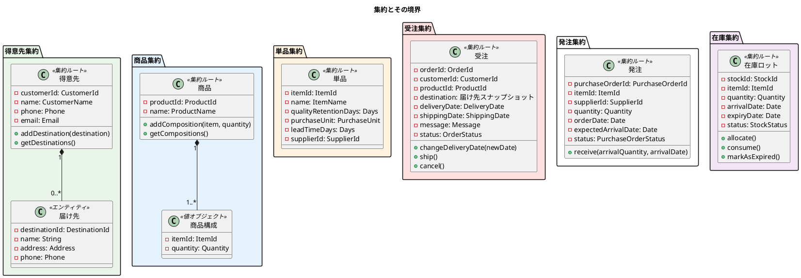
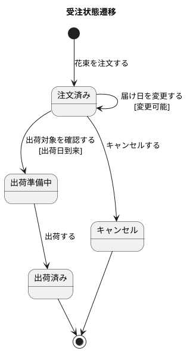
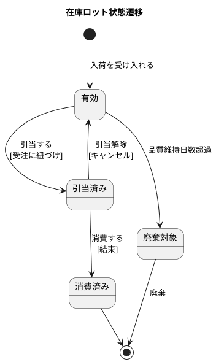
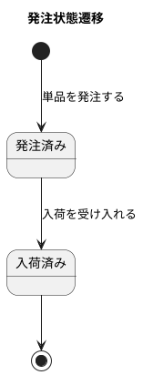
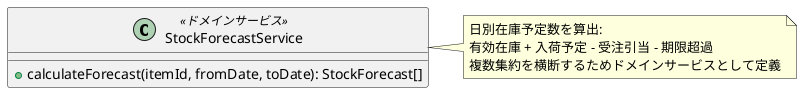
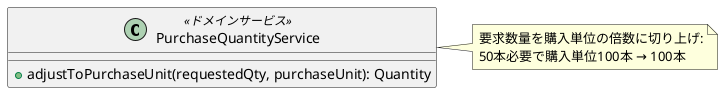

# ドメインモデル設計 - フレール・メモワール WEB ショップ

## ユビキタス言語

| 用語 | 定義 |
| :--- | :--- |
| 得意先 | 花束を注文する個人顧客 |
| 届け先 | 花束の届け先（住所・電話番号） |
| 受注 | 得意先からの注文。1 受注 = 1 届け先 = 1 商品 |
| 届け日 | 花束を届ける日 |
| 出荷日 | 花束を出荷する日（= 届け日の前日） |
| 商品 | 事前定義された花束の組合せ |
| 商品構成 | 商品を構成する単品と数量 |
| 単品 | 個別の花。品質維持可能日数・購入単位・リードタイムを持つ |
| 品質維持可能日数 | 入荷日から花が使用可能な日数 |
| 購入単位 | 仕入先への発注時の最小単位 |
| 発注リードタイム | 発注から入荷までの日数 |
| 仕入先 | 単品を供給するパートナー。単品ごとに特定 |
| 発注 | 仕入先への単品の発注 |
| 入荷 | 仕入先から届いた単品の受け入れ |
| 在庫 | 入荷した単品のロット。品質維持期限を持つ |
| 在庫推移 | 日別の在庫予定数（動的算出） |
| 結束 | 花材から花束を組み立てる作業 |
| 引当 | 受注に対して在庫を確保すること |

## 集約設計

## 集約一覧

| 集約 | ルート | 含むエンティティ/VO | 不変条件 |
| :--- | :--- | :--- | :--- |
| 得意先 | 得意先 | 届け先 | 得意先は 1 つ以上の連絡先を持つ |
| 商品 | 商品 | 商品構成（VO） | 商品は 1 つ以上の商品構成を持つ |
| 単品 | 単品 | - | 品質維持日数 > 0、購入単位 > 0、リードタイム >= 0 |
| 受注 | 受注 | 届け先スナップショット（VO） | 出荷日 = 届け日 - 1。1 受注 = 1 商品 |
| 発注 | 発注 | - | 数量は購入単位の倍数。入荷予定日 = 発注日 + リードタイム |
| 在庫ロット | 在庫ロット | - | 品質維持期限 = 入荷日 + 品質維持日数 |

## 値オブジェクト

| 値オブジェクト | 属性 | バリデーション |
| :--- | :--- | :--- |
| CustomerId | value: int | > 0 |
| ProductId | value: int | > 0 |
| ItemId | value: int | > 0 |
| OrderId | value: int | > 0 |
| CustomerName | value: string | 空でない、100 文字以内 |
| ProductName | value: string | 空でない、100 文字以内 |
| ItemName | value: string | 空でない、100 文字以内 |
| Email | value: string | メール形式 |
| Phone | value: string | 電話番号形式 |
| Address | value: string | 空でない、255 文字以内 |
| DeliveryDate | value: date | 未来の日付 |
| ShippingDate | value: date | deliveryDate - 1 day |
| Message | value: string | 500 文字以内 |
| Quantity | value: int | > 0 |
| PurchaseUnit | value: int | > 0 |
| Days | value: int | >= 0 |
| OrderStatus | value: enum | 注文済み/出荷準備中/出荷済み/キャンセル |
| PurchaseOrderStatus | value: enum | 発注済み/入荷済み |
| StockStatus | value: enum | 有効/引当済み/消費済み/廃棄対象 |
| 届け先スナップショット | name, address, phone | 受注時点の届け先情報のコピー |

## 状態遷移

### 受注状態

### 在庫状態

### 発注状態

## ドメインサービス

### 在庫推移計算サービス

### 発注数量計算サービス

## リポジトリ（インターフェース）

| リポジトリ | 主な操作 |
| :--- | :--- |
| CustomerRepository | findById, findAll, save |
| ProductRepository | findById, findAll, save |
| ItemRepository | findById, findAll, save |
| OrderRepository | findById, findByCustomerId, findByShippingDate, findByStatus, save |
| PurchaseOrderRepository | findById, findByStatus, findByExpectedArrivalDate, save |
| StockRepository | findByItemId, findByStatus, findByExpiryDate, save |

## データモデルとの対応

| ドメインモデル | データモデル | 備考 |
| :--- | :--- | :--- |
| 得意先（集約） | customers + destinations | 届け先は得意先集約の子エンティティ |
| 商品（集約） | products + product_compositions | 商品構成は値オブジェクトとして商品に含む |
| 単品 | items | 1:1 対応 |
| 受注（集約） | orders | 届け先はスナップショットとして受注に埋め込み |
| 発注 | purchase_orders + arrivals | 入荷は発注の receive() で処理 |
| 在庫ロット | stocks | ロット単位で管理 |
| 仕入先 | suppliers | 単品から SupplierId で参照 |
