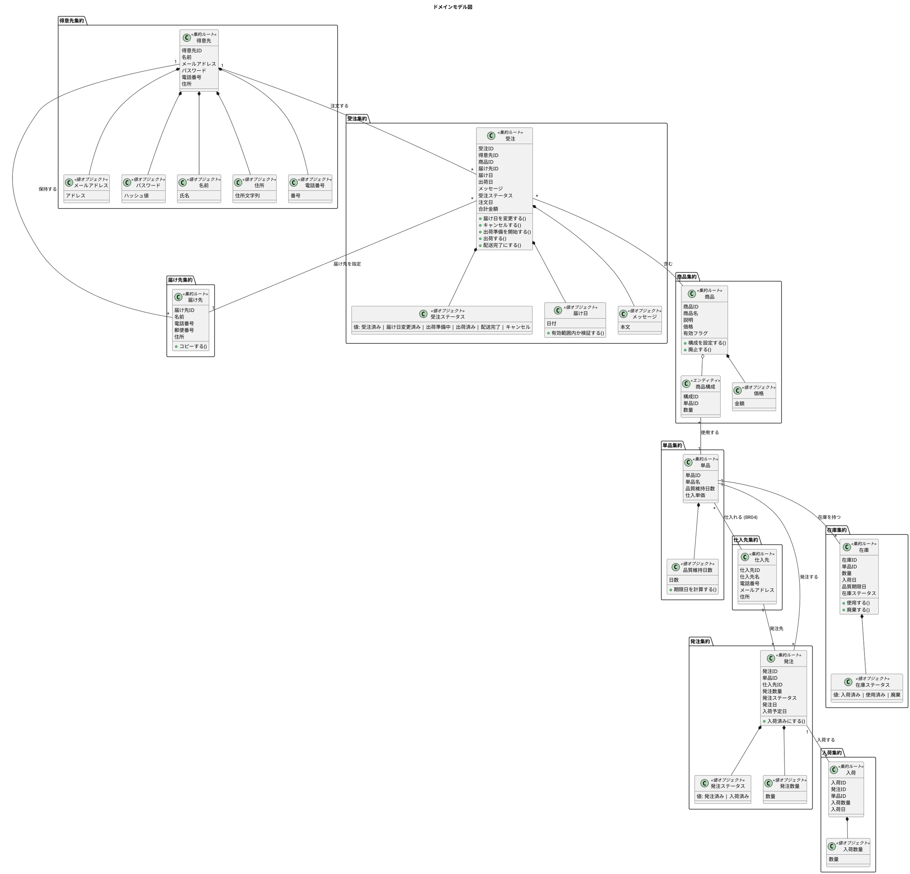
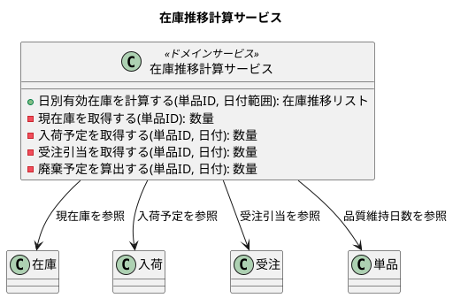
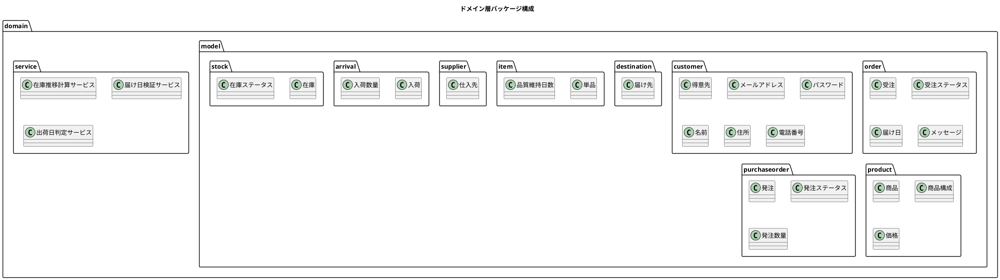

# ドメインモデル設計 - フレール・メモワール WEB ショップシステム

## 概要

DDD の戦術的設計パターンに基づき、要件定義の情報モデル・状態モデル・ビジネスルール（BR01-BR07）からドメインモデルを設計する。レイヤード3層アーキテクチャのドメインモデルとして配置する。

## ドメインモデル図

## 集約定義

### 受注集約（Order Aggregate）

- **集約ルート**: 受注
- **関連ユースケース**: UC002（WEB 受注）、UC007（届け日変更）、UC011（注文キャンセル）
- **ビジネスルール**: BR01（1 受注 = 1 届け先 = 1 商品）、BR02（出荷日 = 届け日 - 1日）
- **値オブジェクト**: 受注ステータス、届け日、メッセージ
- **不変条件**:
  - 1 受注に対して必ず 1 届け先と 1 商品が紐づく（BR01）
  - 出荷日は届け日の前日に自動設定される（BR02）
  - 届け日は有効範囲内であること（BR07）

### 得意先集約（Customer Aggregate）

- **集約ルート**: 得意先
- **関連ユースケース**: UC009（得意先管理）、UC010（会員登録・ログイン）
- **値オブジェクト**: メールアドレス、パスワード、名前、住所、電話番号

### 届け先集約（DeliveryDestination Aggregate）

- **集約ルート**: 届け先
- **関連ユースケース**: UC008（届け先コピー）
- **不変条件**: 必ず得意先に紐づく
- **関連方針**: 届け先は独立集約として得意先 ID を外部キー（FK）として保持する。得意先集約を直接包含しない

### 商品集約（Product Aggregate）

- **集約ルート**: 商品
- **関連ユースケース**: UC001（商品マスタ管理）
- **内部エンティティ**: 商品構成
- **値オブジェクト**: 価格
- **不変条件**: 商品構成は 1 つ以上の単品で構成される

### 単品集約（Item Aggregate）

- **集約ルート**: 単品
- **関連ユースケース**: UC001（商品マスタ管理）
- **値オブジェクト**: 品質維持日数
- **ビジネスルール**: BR04（単品ごとに特定の仕入先）、BR05（品質維持日数を考慮した在庫管理）

### 仕入先集約（Supplier Aggregate）

- **集約ルート**: 仕入先
- **関連ユースケース**: UC004（発注管理）
- **ビジネスルール**: BR04（単品ごとに特定の仕入先が決まっている）

### 発注集約（PurchaseOrder Aggregate）

- **集約ルート**: 発注
- **関連ユースケース**: UC004（発注管理）
- **値オブジェクト**: 発注ステータス、発注数量
- **ビジネスルール**: BR03（発注判断は人間が行う）

### 入荷集約（Arrival Aggregate）

- **集約ルート**: 入荷
- **関連ユースケース**: UC005（入荷管理）
- **値オブジェクト**: 入荷数量

### 在庫集約（Stock Aggregate）

- **集約ルート**: 在庫
- **関連ユースケース**: UC003（在庫推移）
- **値オブジェクト**: 在庫ステータス
- **ビジネスルール**: BR05（品質維持日数を考慮した在庫管理）、BR06（在庫推移計算ロジック）

## ドメインサービス

### 在庫推移計算サービス（InventoryTransitionService）

- **関連ビジネスルール**: BR06
- **責務**: 日別有効在庫を計算する
- **計算式**: `日別有効在庫 = 現在庫 + 入荷予定 - 受注引当 - 廃棄予定`
- **利用する集約**: 在庫、入荷、受注、単品
- **関連ユースケース**: UC003（在庫推移）

### 届け日検証サービス（DeliveryDateValidationService）

- **関連ビジネスルール**: BR07
- **責務**: 届け日が有効範囲内であることを検証する
- **検証ルール**:
  - 最短届け日: 注文日 + 3日
  - 最長届け日: 注文日 + 30日
  - 注文受付期限: 届け日の 3日前
- **関連ユースケース**: UC002（WEB 受注）、UC007（届け日変更）

### 出荷日判定サービス（ShippingDateDeterminationService）

- **関連ビジネスルール**: BR02
- **責務**: 届け日から出荷日を算出する
- **計算式**: `出荷日 = 届け日 - 1日`
- **関連ユースケース**: UC002（WEB 受注）、UC006（出荷管理）、UC007（届け日変更）

## ドメイン層のパッケージ構成

ドメインモデルのパッケージ構成を示す。集約ごとにサブパッケージを分割し、関連するエンティティ・値オブジェクトを同一パッケージに配置する。

### パッケージ分割方針

| パッケージ | 配置するクラス | 説明 |
|-----------|--------------|------|
| `domain/model/order/` | 受注、受注ステータス、届け日、メッセージ | 受注集約のエンティティ・値オブジェクト |
| `domain/model/customer/` | 得意先、メールアドレス、パスワード、名前、住所、電話番号 | 得意先集約のエンティティ・値オブジェクト |
| `domain/model/destination/` | 届け先 | 届け先集約のエンティティ |
| `domain/model/product/` | 商品、商品構成、価格 | 商品集約のエンティティ・値オブジェクト |
| `domain/model/item/` | 単品、品質維持日数 | 単品集約のエンティティ・値オブジェクト |
| `domain/model/supplier/` | 仕入先 | 仕入先集約のエンティティ |
| `domain/model/purchaseorder/` | 発注、発注ステータス、発注数量 | 発注集約のエンティティ・値オブジェクト |
| `domain/model/arrival/` | 入荷、入荷数量 | 入荷集約のエンティティ・値オブジェクト |
| `domain/model/stock/` | 在庫、在庫ステータス | 在庫集約のエンティティ・値オブジェクト |
| `domain/service/` | 在庫推移計算サービス、届け日検証サービス、出荷日判定サービス | 複数集約を跨ぐドメインサービス |

## ユビキタス言語

| 日本語用語 | 英語名 | 説明 |
|-----------|--------|------|
| 得意先 | Customer | 花束を注文する顧客 |
| 届け先 | DeliveryDestination | 花束の届け先。得意先が複数保持できる |
| 受注 | Order | 得意先からの注文。1 受注 = 1 届け先 = 1 商品（BR01） |
| 商品 | Product | 花束。単品の組合せで構成される |
| 商品構成 | ProductComposition | 商品を構成する単品と数量の組合せ |
| 単品 | Item | 花。品質維持日数を持ち、特定の仕入先から仕入れる |
| 仕入先 | Supplier | 単品を納品する業者 |
| 発注 | PurchaseOrder | 仕入先への発注。判断は人間が行う（BR03） |
| 入荷 | Arrival | 発注に対する実際の納品 |
| 在庫 | Stock | 単品の在庫。品質維持日数を考慮して管理する（BR05） |
| 届け日 | DeliveryDate | 花束を届ける日。有効範囲あり（BR07） |
| 出荷日 | ShippingDate | 届け日の前日（BR02） |
| 品質維持日数 | QualityRetentionDays | 単品の品質が維持される日数。入荷日を Day 0 として起算 |
| 在庫推移 | InventoryTransition | 日別の有効在庫の推移（BR06） |
| 受注ステータス | OrderStatus | 受注済み → 届け日変更済み / 出荷準備中 → 出荷済み → 配送完了（またはキャンセル） |
| 発注ステータス | PurchaseOrderStatus | 発注済み → 入荷済み |
| 在庫ステータス | StockStatus | 入荷済み → 使用済み or 廃棄 |
| 結束 | Bundling | 単品から花束（商品）を作る工程 |
| 引当 | Allocation | 受注確定時に届け日に対して単品単位で在庫を確保すること |
| 廃棄予定 | DisposalSchedule | 品質維持日数を超過した在庫の廃棄予定 |
