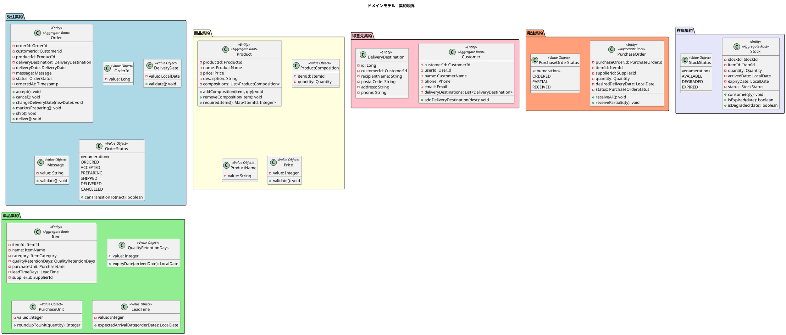
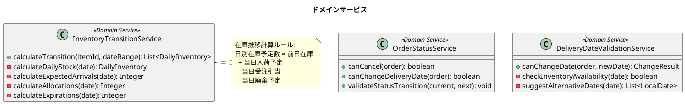

# ドメインモデル設計 - フレール・メモワール WEB ショップシステム

## ユビキタス言語

| 日本語 | 英語 | 説明 |
|:---|:---|:---|
| 得意先 | Customer | 花束を注文する個人顧客 |
| 届け先 | DeliveryDestination | 花束の届け先情報 |
| 商品（花束） | Product | 販売する花束。単品の組合せで構成される |
| 商品構成 | ProductComposition | 花束を構成する単品と数量の組合せ |
| 単品（花材） | Item | 花束を構成する個別の花材・資材 |
| 受注 | Order | 得意先からの注文 |
| 仕入先 | Supplier | 単品を供給するパートナー |
| 発注 | PurchaseOrder | 仕入先への花材発注 |
| 入荷 | Arrival | 仕入先からの花材入荷 |
| 在庫 | Stock | 入荷ロットごとの在庫情報 |
| 在庫推移 | InventoryTransition | 日別の在庫予定数推移 |
| 品質維持日数 | QualityRetentionDays | 花材が品質を維持できる日数 |
| リードタイム | LeadTime | 発注から入荷までの日数 |
| 購入単位 | PurchaseUnit | 仕入先への最小発注単位 |
| 結束 | Bundling | 花材から花束を組み立てる作業 |
| 出荷日 | ShippingDate | 届け日の前日 |

## 集約とエンティティ・値オブジェクト



## ドメインサービス



### 在庫推移計算サービス

在庫推移計算は複数の集約にまたがるため、ドメインサービスとして実装する。

```
日別在庫予定数 = 前日在庫 + 当日入荷予定 - 当日受注引当 - 当日廃棄予定
```

| 要素 | 算出方法 |
|:---|:---|
| 前日在庫 | Stock 集約の quantity 合計（品質維持期限内） |
| 当日入荷予定 | PurchaseOrder の希望納品日が当日のもの |
| 当日受注引当 | Order の出荷日（届け日 - 1 日）が当日のもの × ProductComposition の数量 |
| 当日廃棄予定 | Stock の expiry_date が当日のもの |

## 集約境界と不変条件

| 集約 | 不変条件 |
|:---|:---|
| Order | ステータス遷移は定義された順序のみ許可。「出荷準備中」以降はキャンセル・届け日変更不可 |
| Product | 商品構成は 1 つ以上の単品を含む。価格は 1〜999,999 円 |
| Item | 品質維持日数は 1〜30 日。リードタイムは 1〜14 日 |
| PurchaseOrder | 発注数量は購入単位の倍数。入荷合計が発注数量を超えない |
| Stock | 数量は 0 以上。消費により 0 になったら削除 |
| Customer | 1 つの User アカウントに紐づく |

## リポジトリインターフェース

| リポジトリ | 主要メソッド |
|:---|:---|
| OrderRepository | findById, findByStatus, findByDeliveryDate, save |
| ProductRepository | findById, findAll, findAllActive, save |
| ItemRepository | findById, findAll, findBySupplierId, save |
| CustomerRepository | findById, findByUserId, save |
| PurchaseOrderRepository | findById, findByStatus, findByItemId, save |
| StockRepository | findByItemId, findByExpiryDateBefore, save, delete |
| SupplierRepository | findById, findAll, save |

---

## 記入履歴

| 日付 | 更新内容 |
|------|----------|
| 2026-03-20 | 初版作成 |
