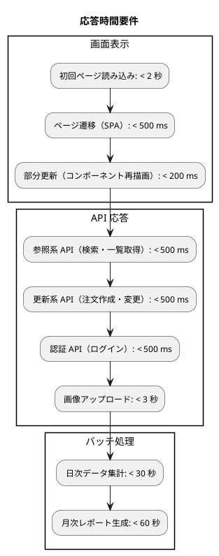
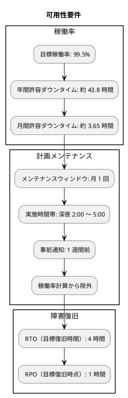
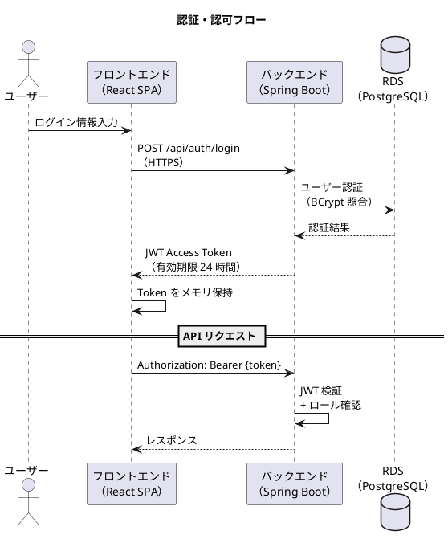
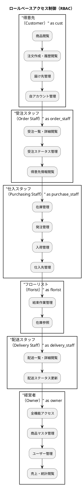
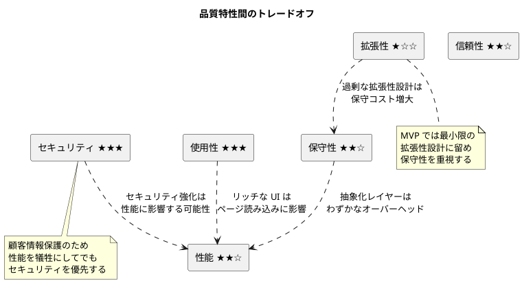

# 非機能要件定義 - フレール・メモワール WEB ショップシステム

## 概要

本ドキュメントは、フレール・メモワール WEB ショップシステムの非機能要件を定義します。ISO/IEC 25010 品質モデルに基づき、システムが満たすべき品質特性を定量的な目標値とともに定義し、測定方法を明確にします。

本システムは個人経営の花屋（1 店舗）を対象とした小規模 WEB ショップシステムであり、過剰な品質目標を避け、ビジネス規模に見合った現実的な品質水準を設定しています。

### 対象システム構成

| 項目 | 内容 |
|:---|:---|
| バックエンド | Java Spring Boot / PostgreSQL / Hexagonal Architecture |
| フロントエンド | React SPA / TypeScript |
| インフラ | AWS（ECS Fargate / RDS / S3 / CloudFront） |
| 画面数 | 約 15〜20 画面 |
| チーム規模 | 1〜2 名 |

### ユーザーロール

| ロール | 説明 |
|:---|:---|
| 得意先（Customer） | 花束を注文する個人顧客 |
| 受注スタッフ（Order Staff） | 受注管理を担当するスタッフ |
| 仕入スタッフ（Purchasing Staff） | 仕入・在庫管理を担当するスタッフ |
| フローリスト（Florist） | 花束の結束（制作）を担当するスタッフ |
| 配送スタッフ（Delivery Staff） | 配送を担当するスタッフ |
| 経営者（Owner） | 商品管理・顧客管理・経営判断を行うオーナー |

## 品質特性の全体像

```plantuml
@startuml

title 非機能要件 - 品質特性の全体像（ISO/IEC 25010）

rectangle "性能効率性" as perf {
  - 応答時間
  - スループット
  - 容量
}

rectangle "信頼性" as rel {
  - 可用性
  - 障害許容性
  - 回復性
}

rectangle "セキュリティ" as sec {
  - 認証・認可
  - データ保護
  - 監査
}

rectangle "使用性" as usa {
  - ブラウザ互換性
  - レスポンシブ
  - アクセシビリティ
}

rectangle "保守性" as mnt {
  - テスト容易性
  - コード品質
  - ドキュメント
}

rectangle "拡張性" as scl {
  - 水平スケーリング
  - モジュール性
}

perf -[hidden]right- rel
rel -[hidden]right- sec
usa -[hidden]right- mnt
mnt -[hidden]right- scl

@enduml
```

## 1. 性能要件（Performance Requirements）

### 1.1 応答時間要件



| 項目 | 目標値 | 測定方法 |
|:---|:---|:---|
| 初回ページ読み込み | < 2 秒 | Lighthouse Performance スコア、Web Vitals（LCP < 2.0s） |
| ページ遷移（SPA） | < 500 ms | React Profiler、Performance API `navigation` エントリ |
| 部分更新 | < 200 ms | React Profiler、`PerformanceObserver` |
| 参照系 API | < 500 ms（95 パーセンタイル） | Spring Boot Actuator（Micrometer）、CloudWatch メトリクス |
| 更新系 API | < 500 ms（95 パーセンタイル） | Spring Boot Actuator（Micrometer）、CloudWatch メトリクス |
| 認証 API | < 500 ms（95 パーセンタイル） | Spring Boot Actuator（Micrometer） |
| 画像アップロード | < 3 秒 | S3 アップロード完了時間の計測 |

### 1.2 スループット要件

| 項目 | 目標値 | 測定方法 |
|:---|:---|:---|
| 同時接続ユーザー数 | 50 名（通常時） | 負荷テスト（k6 / JMeter） |
| 同時接続ユーザー数（ピーク時） | 100 名 | 負荷テスト（k6 / JMeter） |
| 注文処理能力 | 10 件 / 分（ピーク時） | アプリケーションメトリクス |
| API リクエスト処理能力 | 100 リクエスト / 秒 | 負荷テスト（k6 / JMeter） |

### 1.3 容量要件

| 項目 | 目標値 | 測定方法 |
|:---|:---|:---|
| 年間注文データ | 10,000 件 / 年 | RDS ストレージ使用量監視 |
| データ保持期間 | 5 年間 | データライフサイクル管理ポリシー |
| 商品画像ストレージ | 50 GB（初期）、年間 10 GB 増加 | S3 ストレージメトリクス |
| データベース容量 | 20 GB（初期）、年間 5 GB 増加 | RDS CloudWatch メトリクス |

## 2. 可用性・信頼性要件（Availability & Reliability Requirements）

### 2.1 稼働率要件



| 項目 | 目標値 | 測定方法 |
|:---|:---|:---|
| 稼働率 | 99.5%（計画メンテナンス除外） | CloudWatch 外形監視、ALB ヘルスチェック |
| 年間許容ダウンタイム | 約 43.8 時間 | CloudWatch ダッシュボード |
| RTO（目標復旧時間） | 4 時間 | 障害復旧訓練の実施・記録 |
| RPO（目標復旧時点） | 1 時間 | RDS 自動バックアップ設定の確認 |
| 計画メンテナンス | 月 1 回、深夜帯（2:00〜5:00） | メンテナンススケジュール管理 |

### 2.2 バックアップ要件

| 項目 | 目標値 | 測定方法 |
|:---|:---|:---|
| RDS 自動バックアップ | 日次（7 日間保持） | AWS RDS バックアップ設定 |
| RDS スナップショット | 週次手動スナップショット | スナップショット作成ログ |
| S3 バケットバージョニング | 有効 | S3 バケット設定 |
| バックアップ復元テスト | 四半期に 1 回 | 復元テスト実施記録 |

### 2.3 障害許容性

| 項目 | 対策 | 測定方法 |
|:---|:---|:---|
| ECS タスク障害 | 自動再起動（ヘルスチェック失敗時） | ECS タスク起動イベントログ |
| RDS 障害 | マルチ AZ 構成による自動フェイルオーバー | RDS イベント通知 |
| ALB ヘルスチェック | `/actuator/health` エンドポイントで監視 | CloudWatch メトリクス |
| 障害検知 | CloudWatch Alarms による自動通知 | アラート発報履歴 |

## 3. セキュリティ要件（Security Requirements）

### 3.1 認証要件



| 項目 | 目標値 | 測定方法 |
|:---|:---|:---|
| 認証方式 | JWT Bearer Token | セキュリティ設定レビュー |
| Access Token 有効期限 | 24 時間 | JWT クレーム検証テスト |
| パスワードハッシュ | BCrypt（ストレングス 12） | セキュリティテスト |
| パスワード要件 | 8 文字以上、英数字混合 | バリデーションテスト |
| ログイン試行制限 | 5 回失敗でアカウントロック（30 分） | セキュリティテスト |

### 3.2 認可要件（RBAC）



| 項目 | 目標値 | 測定方法 |
|:---|:---|:---|
| 認可方式 | RBAC（6 ロール） | Spring Security 設定レビュー |
| API エンドポイント保護 | 全 API 認証必須（公開 API 除く） | セキュリティテスト（認証なしアクセスの 401 確認） |
| ロール別アクセス制御 | 権限外リソースへのアクセスは 403 | E2E テスト |

### 3.3 データ保護要件

| 項目 | 目標値 | 測定方法 |
|:---|:---|:---|
| 通信暗号化 | HTTPS（TLS 1.2 以上） | SSL Labs テスト（A 以上） |
| パスワード保存 | BCrypt ハッシュ化（平文保存禁止） | コードレビュー、セキュリティテスト |
| 個人情報暗号化 | 保存時暗号化（RDS 暗号化、AES-256） | RDS 暗号化設定確認 |
| シークレット管理 | AWS Secrets Manager で一元管理 | インフラ設定レビュー |
| CORS 設定 | 許可されたオリジンのみ | セキュリティテスト |

### 3.4 OWASP Top 10 対策

| # | 脅威カテゴリ | 対策 | 測定方法 |
|:---|:---|:---|:---|
| A01 | アクセス制御の不備 | RBAC による API エンドポイント保護、Spring Security `@PreAuthorize` | セキュリティテスト（権限外アクセスの 403 確認） |
| A02 | 暗号化の失敗 | HTTPS 強制（TLS 1.2+）、RDS 暗号化（AES-256）、BCrypt パスワードハッシュ | SSL Labs テスト、暗号化設定レビュー |
| A03 | インジェクション | JPA パラメータバインディング、入力バリデーション（Bean Validation） | SAST（SpotBugs）、セキュリティテスト |
| A04 | 安全でない設計 | 脅威モデリング、セキュリティレビュー、最小権限の原則 | 設計レビュー |
| A05 | セキュリティ設定ミス | Spring Security デフォルト設定活用、不要エンドポイント無効化、CORS 制限 | セキュリティ設定レビュー、Actuator エンドポイント制限確認 |
| A06 | 脆弱なコンポーネント | Dependabot による依存関係自動更新、OWASP Dependency-Check | GitHub Dependabot アラート、CI パイプライン |
| A07 | 認証の不備 | JWT トークン検証、アカウントロック（5 回失敗 / 30 分）、パスワード強度要件 | セキュリティテスト |
| A08 | ソフトウェアとデータの整合性の不備 | CI/CD パイプラインでの署名検証、Docker イメージの ECR スキャン | ECR イメージスキャン結果 |
| A09 | セキュリティログと監視の不備 | 全 API アクセスログ、操作監査ログ、CloudWatch Alarms | ログ出力検証、アラート動作確認 |
| A10 | SSRF（サーバーサイドリクエストフォージェリ） | 外部 URL 入力の制限、AWS WAF ルール適用 | WAF ルールレビュー |

### 3.5 監査要件

| 項目 | 目標値 | 測定方法 |
|:---|:---|:---|
| アクセスログ | 全 API リクエストを記録 | CloudWatch Logs 確認 |
| 操作履歴 | データ変更操作を記録（誰が・いつ・何を） | 監査ログテーブルの検証 |
| ログ保持期間 | 1 年間 | CloudWatch Logs 保持期間設定 |
| ログのタイムスタンプ | UTC で統一 | ログフォーマット検証 |

## 4. 使用性要件（Usability Requirements）

### 4.1 ブラウザ互換性

| ブラウザ | サポートバージョン | 測定方法 |
|:---|:---|:---|
| Google Chrome | 最新 2 バージョン | E2E テスト（Playwright） |
| Mozilla Firefox | 最新 2 バージョン | E2E テスト（Playwright） |
| Safari | 最新 2 バージョン | E2E テスト（Playwright） |
| Microsoft Edge | 最新 2 バージョン | E2E テスト（Playwright） |

### 4.2 レスポンシブデザイン

```plantuml
@startuml

title レスポンシブデザイン対応範囲

rectangle "デスクトップ（1280px 以上）" as desktop {
  - フル機能提供
  - 管理画面の主要利用環境
  - マルチカラムレイアウト
}

rectangle "タブレット（768px 以上）" as tablet {
  - フル機能提供
  - レイアウト調整（2 カラム → 1 カラム）
  - タッチ操作対応
}

rectangle "モバイル（768px 未満）" as mobile {
  - 対応不要（MVP）
  - 将来的に検討
}

desktop -[hidden]down- tablet
tablet -[hidden]down- mobile

@enduml
```

| 項目 | 目標値 | 測定方法 |
|:---|:---|:---|
| デスクトップ（1280px 以上） | フル機能対応 | ブラウザテスト |
| タブレット（768px 以上） | フル機能対応 | ブラウザテスト |
| モバイル（768px 未満） | MVP では対応不要 | - |

### 4.3 アクセシビリティ

| 項目 | 目標値 | 測定方法 |
|:---|:---|:---|
| WCAG 準拠レベル | WCAG 2.1 Level AA | axe-core による自動テスト |
| キーボード操作 | 主要機能をキーボードで操作可能 | 手動テスト |
| 代替テキスト | 全画像に alt 属性設定 | axe-core、Lighthouse |
| フォームラベル | 全入力フィールドにラベル関連付け | axe-core |
| カラーコントラスト | WCAG 2.1 Level AA 基準を満たす | Lighthouse Accessibility |

### 4.4 ユーザーエクスペリエンス

| 項目 | 目標値 | 測定方法 |
|:---|:---|:---|
| 注文完了時間（リピート顧客） | 3 分以内 | E2E テストによるフロー計測 |
| 主要機能到達 | 3 クリック以内 | 画面遷移図による検証 |
| エラーメッセージ | 日本語でユーザーが理解可能な表現 | UI レビュー |
| ローディング表示 | 500 ms 以上の処理にスピナー表示 | UI テスト |

## 5. 保守性要件（Maintainability Requirements）

### 5.1 テスト品質

| 項目 | 目標値 | 測定方法 |
|:---|:---|:---|
| テストカバレッジ（全体） | 80% 以上 | JaCoCo（バックエンド）、Istanbul（フロントエンド） |
| テストカバレッジ（ドメイン層） | 90% 以上 | JaCoCo（domain パッケージ） |
| ミューテーションテストスコア | 70% 以上（ドメイン層） | PIT Mutation Testing |
| E2E テストカバレッジ | 主要ユーザーフロー 100% | Playwright テストケース管理 |

### 5.2 コード品質

| 項目 | 目標値 | 測定方法 |
|:---|:---|:---|
| SonarQube Quality Gate | Pass | SonarQube 分析結果 |
| Cyclomatic Complexity | メソッドあたり 10 未満 | SonarQube |
| 重複コード | 3% 未満 | SonarQube |
| 技術的負債レーティング | A | SonarQube |
| フロントエンド Lint | エラー 0 件 | ESLint |
| バックエンド Lint | エラー 0 件 | Checkstyle / SpotBugs |

### 5.3 ドキュメント

| 項目 | 目標値 | 測定方法 |
|:---|:---|:---|
| API ドキュメント | OpenAPI 3.0 準拠、全エンドポイント記載 | OpenAPI Spec バリデーション |
| アーキテクチャ図 | C4 モデル準拠 | ドキュメントレビュー |
| ADR（Architecture Decision Records） | 主要な技術判断を記録 | ADR ディレクトリの確認 |
| ドキュメント更新 | コード変更と同時に更新 | PR レビュー |

### 5.4 デプロイ

| 項目 | 目標値 | 測定方法 |
|:---|:---|:---|
| デプロイ方式 | ゼロダウンタイム（ローリングアップデート） | ECS デプロイイベント監視 |
| デプロイ頻度 | 週 1 回以上（継続的デリバリー） | デプロイ履歴 |
| デプロイ所要時間 | 15 分以内 | CI/CD パイプライン実行時間 |
| ロールバック | 5 分以内に前バージョンへ復帰可能 | ロールバック手順テスト |

## 6. 拡張性要件（Scalability Requirements）

### 6.1 水平スケーリング

```plantuml
@startuml

title ECS Auto Scaling 構成

rectangle "ALB" as alb

rectangle "ECS Service" {
  rectangle "Task 1\n（最小構成）" as task1
  rectangle "Task 2\n（最小構成）" as task2
  rectangle "Task 3\n（スケールアウト時）" as task3
  rectangle "Task 4\n（最大構成）" as task4
}

rectangle "Auto Scaling Policy" as asp {
  - 最小タスク数: 2
  - 最大タスク数: 4
  - CPU 使用率 70% でスケールアウト
  - CPU 使用率 30% でスケールイン
}

alb --> task1
alb --> task2
alb --> task3
alb --> task4

@enduml
```

| 項目 | 目標値 | 測定方法 |
|:---|:---|:---|
| ECS タスク数（最小） | 2 タスク | ECS サービス設定 |
| ECS タスク数（最大） | 4 タスク | ECS Auto Scaling 設定 |
| スケールアウト条件 | CPU 使用率 70% 超過 | CloudWatch Alarms |
| スケールイン条件 | CPU 使用率 30% 未満 | CloudWatch Alarms |
| スケールアウト所要時間 | 5 分以内 | ECS イベントログ |

### 6.2 データベーススケーリング

| 項目 | 目標値 | 測定方法 |
|:---|:---|:---|
| RDS Read Replica | 対応可能な設計（MVP では未実装） | アーキテクチャレビュー |
| コネクションプール | 最大 20 コネクション / タスク | HikariCP 設定 |
| スロークエリ検出 | 1 秒以上のクエリを記録 | RDS Performance Insights |

### 6.3 モジュール性

| 項目 | 目標値 | 測定方法 |
|:---|:---|:---|
| アーキテクチャ | Hexagonal Architecture（ポートアダプタ） | アーキテクチャレビュー |
| パッケージ構成 | 機能ベースのモジュール構造 | パッケージ構成レビュー |
| 層間依存 | 依存方向の一貫性（外→内） | ArchUnit テスト |
| API バージョニング | URI バージョニング（/api/v1/） | API 設計レビュー |

## 7. 品質特性間のトレードオフ

品質特性間にはトレードオフの関係があります。本システムでは、ビジネス規模と開発リソースを考慮し、以下の優先順位で品質特性を取り扱います。

### 優先順位

| 優先度 | 品質特性 | 理由 |
|:---|:---|:---|
| 1（最優先） | セキュリティ | 顧客の個人情報・決済情報を扱うため妥協不可 |
| 2 | 使用性 | 顧客の注文体験が売上に直結する |
| 3 | 信頼性 | 注文の取りこぼしはビジネス損失に直結する |
| 4 | 保守性 | 1〜2 名の小規模チームで長期運用するため変更容易性が重要 |
| 5 | 性能 | 小規模システムのため過剰な最適化は不要 |
| 6 | 拡張性 | 現時点では 1 店舗運営、急激な成長は想定しない |

### トレードオフマトリクス



### トレードオフの判断基準

| トレードオフ | 判断 |
|:---|:---|
| セキュリティ vs 性能 | セキュリティを優先。BCrypt のコスト増加によるログイン遅延は許容する |
| 使用性 vs 性能 | 使用性を優先。SPA の初回読み込みが多少遅くなっても、操作体験を重視する |
| 保守性 vs 性能 | 保守性を優先。Hexagonal Architecture の抽象化レイヤーによるオーバーヘッドは許容する |
| 拡張性 vs 保守性 | 保守性を優先。MVP では Read Replica 等の拡張機能は実装せず、将来対応可能な設計に留める |

---

## 記入履歴

| 日付 | 更新内容 |
|:---|:---|
| 2026-03-20 | 初版作成 |
| 2026-03-20 | 応答時間要件を強化（画面表示 2 秒以内、API 500ms 以内）、WCAG 2.1 AA に引き上げ、OWASP Top 10 対策セクション追加 |
