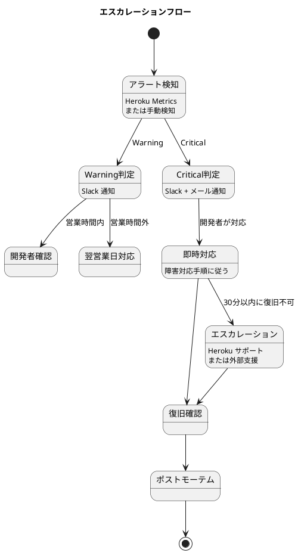
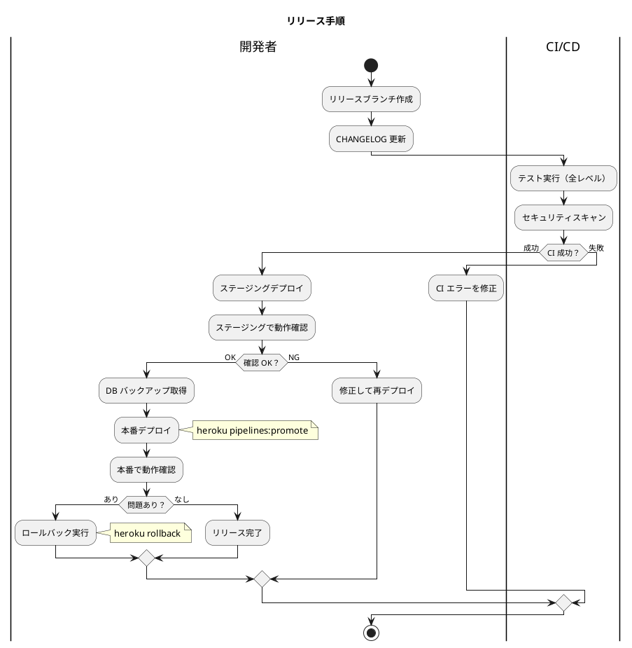

# 運用要件定義

## 前提

- インフラ: Heroku PaaS（マネージドサービス）
- チーム: 開発者 1-2 名が運用も兼務
- 稼働率目標: 99.5%、RTO: 4 時間、RPO: 24 時間

## 運用フロー

### 日次運用

| 作業 | 時間帯 | 方式 | 担当 |
|------|--------|------|------|
| ヘルスチェック確認 | 朝 | Heroku Metrics 確認 | 開発者 |
| エラーログ確認 | 朝 | `heroku logs --tail` | 開発者 |
| バックアップ状態確認 | 朝 | Heroku PGBackups | 自動（月 1 回手動確認） |

### 週次運用

| 作業 | 曜日 | 方式 | 担当 |
|------|------|------|------|
| パフォーマンスレビュー | 月曜 | Heroku Metrics ダッシュボード | 開発者 |
| gem セキュリティアップデート確認 | 月曜 | `bundle audit` | 開発者 |

### 月次運用

| 作業 | 方式 | 担当 |
|------|------|------|
| セキュリティパッチ適用 | `bundle update` + CI テスト | 開発者 |
| DB 容量確認 | Heroku Postgres Metrics | 開発者 |
| バックアップリストアテスト | ステージング環境で実施 | 開発者 |

## 監視設計

### 監視項目とアラート

| 監視対象 | 指標 | Warning 閾値 | Critical 閾値 | 通知先 |
|---------|------|-------------|--------------|--------|
| レスポンスタイム | p95 | 2,000ms | 5,000ms | Slack |
| メモリ使用量 | Dyno メモリ | 400MB (80%) | 450MB (90%) | Slack |
| エラー率 | 5xx / 全リクエスト | 1% | 5% | Slack + メール |
| DB 接続数 | アクティブ接続 | 16 (80%) | 18 (90%) | Slack |
| DB 容量 | 使用率 | 80% | 90% | Slack |

### エスカレーションフロー



## バックアップ設計

### バックアップ方式

| 対象 | 方式 | 頻度 | 保持 | 復旧時間 |
|------|------|------|------|---------|
| PostgreSQL | Heroku PGBackups | 日次自動 | 5 世代 | 約 30 分 |
| PostgreSQL | 手動バックアップ | リリース前 | 3 世代 | 約 30 分 |
| コード | GitHub | Push ごと | 無期限 | 即時 |
| 環境変数 | 暗号化ファイル | 変更時 | Git 管理外 | 即時 |

### リストア手順

```
1. heroku pg:backups:info でバックアップ一覧を確認
2. heroku pg:backups:restore <バックアップID> DATABASE_URL で復旧
3. heroku run rails db:migrate で最新のマイグレーションを適用
4. 動作確認（受注一覧、在庫推移が正しく表示されるか）
```

## 障害対応設計

### 障害パターンと復旧手順

| パターン | 検知方法 | 影響 | 復旧手順 | 目標復旧時間 |
|---------|---------|------|---------|-------------|
| アプリケーションエラー（500） | エラー率アラート | サービス利用不可 | ログ確認 → バグ修正 → デプロイ。修正困難な場合はロールバック | 1 時間 |
| Heroku プラットフォーム障害 | Heroku Status 確認 | サービス利用不可 | Heroku の復旧を待つ。長時間の場合は告知 | Heroku 依存 |
| DB 接続エラー | DB 接続数アラート | サービス利用不可 | Dyno 再起動 → 接続プール確認 | 30 分 |
| メモリ不足（R14） | メモリアラート | パフォーマンス低下 | Dyno 再起動 → メモリリーク調査 | 30 分 |
| マイグレーション失敗 | デプロイ時のエラー | デプロイ不可 | マイグレーションを修正して再デプロイ | 1 時間 |
| データ不整合 | 手動検知 | 業務影響 | バックアップからリストア、または手動修正 | 2 時間 |

### 連絡体制

| 重要度 | 対応時間帯 | 連絡先 | 対応内容 |
|--------|-----------|--------|---------|
| Critical | 営業時間内: 即時。営業時間外: 翌営業日朝（データ損失リスクがある場合のみ即時） | 開発者（メール + Slack） | 即時対応または翌営業日朝 |
| Warning | 営業時間内 | 開発者（Slack） | 翌営業日までに対応 |
| Info | 営業時間内 | 開発者（Slack） | 定期レビューで確認 |

## 変更管理設計

### リリース手順



### ロールバック手順

| ステップ | コマンド | 説明 |
|---------|---------|------|
| 1 | `heroku rollback` | 前のリリースに戻す |
| 2 | `heroku pg:backups:restore` | DB をバックアップから復旧（マイグレーションが不可逆の場合） |
| 3 | 動作確認 | 主要画面の表示・操作を確認 |

### 変更の分類と承認

| 変更種別 | 例 | 承認 | 手順 |
|---------|---|------|------|
| 通常変更 | 機能追加、バグ修正 | PR レビュー | CI → ステージング → 本番 |
| 緊急変更 | セキュリティ修正、重大バグ | 事後レビュー | CI → 本番直接デプロイ |
| 設定変更 | 環境変数の変更 | 開発者判断 | Heroku Config Vars で変更 |

## SLA/SLO 定義

| SLI（指標） | SLO（目標） | 測定方法 | 測定期間 |
|------------|------------|---------|---------|
| 可用性 | 99.5% | Heroku Router の正常レスポンス率 | 月次 |
| レスポンスタイム（p95） | 1,000ms 以内 | Heroku Metrics | 月次 |
| エラー率 | 1% 以下 | 5xx レスポンス / 全レスポンス | 月次 |
| デプロイ成功率 | 95% 以上 | 成功デプロイ / 全デプロイ | 月次 |
