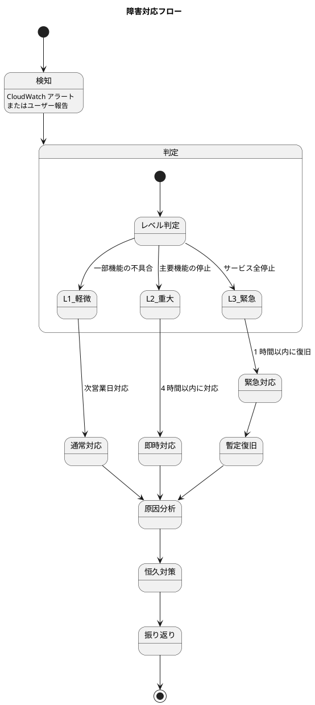

# 運用要件 - フレール・メモワール WEB ショップシステム

## 監視設計

### 監視項目

| カテゴリ | 監視項目 | ツール | アラート条件 |
| :--- | :--- | :--- | :--- |
| インフラ | ECS タスク CPU 使用率 | CloudWatch | 80% 超過（5 分間） |
| インフラ | ECS タスクメモリ使用率 | CloudWatch | 80% 超過（5 分間） |
| インフラ | RDS CPU 使用率 | CloudWatch | 70% 超過（5 分間） |
| インフラ | RDS ストレージ空き容量 | CloudWatch | 20% 以下 |
| アプリ | HTTP 5xx エラー率 | CloudWatch + ALB | 1% 超過（1 分間） |
| アプリ | レスポンスタイム | CloudWatch + ALB | p95 が 3 秒超過 |
| アプリ | ECS タスクヘルスチェック失敗 | CloudWatch | 連続 3 回失敗 |
| 業務 | 品質維持期限アラート | アプリ内 | 日次バッチで自動検出 |
| 業務 | メール送信失敗 | CloudWatch + SES | 送信失敗率 5% 超過 |

### アラート通知先

| 重要度 | 通知先 | 通知手段 |
| :--- | :--- | :--- |
| 緊急（サービス停止） | 開発チーム | メール + Slack |
| 警告（性能劣化） | 開発チーム | Slack |
| 情報（業務アラート） | スタッフ | アプリ内通知 |

## バックアップ

### バックアップ方針

| 対象 | 方式 | 保持期間 | RPO |
| :--- | :--- | :--- | :--- |
| RDS（データベース） | 自動バックアップ | 7 日間 | 1 時間 |
| RDS（スナップショット） | 手動（リリース前） | 30 日間 | リリース時点 |
| S3（商品画像） | バージョニング | 30 日間 | 即時 |
| アプリケーションコード | Git（GitHub） | 永続 | コミット時点 |

### リストア手順

1. RDS: スナップショットからの復元（推定 15 分）
2. ECS: Docker イメージの再デプロイ（推定 5 分）
3. S3: バージョニングによるロールバック（即時）

## 障害対応

### 障害レベルと対応フロー

| レベル | 定義 | RTO | 対応者 |
| :--- | :--- | :--- | :--- |
| L1（軽微） | 一部機能の表示崩れ等 | 次営業日 | 開発者 |
| L2（重大） | 注文機能の停止 | 4 時間 | 開発者 |
| L3（緊急） | サービス全体の停止 | 1 時間 | 開発者 + インフラ担当 |

## 変更管理

### デプロイ方式

| 環境 | 方式 | トリガー |
| :--- | :--- | :--- |
| ステージング | 自動デプロイ | main ブランチへの push |
| 本番 | 手動承認後デプロイ | リリースタグの作成 |

### ロールバック手順

1. ECS: 前バージョンの Docker イメージを指定してデプロイ（推定 5 分）
2. DB マイグレーション: Django の `migrate` で前バージョンに戻す（破壊的変更がない場合）
3. 破壊的マイグレーション: RDS スナップショットからの復元

### リリース前チェックリスト

- [ ] 全テスト通過（ユニット + 統合 + E2E）
- [ ] カバレッジ 70% 以上
- [ ] セキュリティスキャン（bandit + pip-audit）に問題なし
- [ ] ステージング環境での動作確認完了
- [ ] DB マイグレーションの確認（破壊的変更の有無）
- [ ] RDS スナップショットの取得

## 日次バッチ処理

| バッチ | 実行時刻 | 処理内容 |
| :--- | :--- | :--- |
| 受注ステータス更新 | 毎日 0:00 | 出荷日到来の受注を「出荷準備中」に自動遷移 |
| 品質維持期限チェック | 毎日 6:00 | 期限間近（残 2 日以内）の在庫ロットのステータスを更新 |
| 廃棄対象チェック | 毎日 6:00 | 品質維持日数超過の在庫ロットを「廃棄対象」に遷移 |

### バッチ実行方式

- Django management command として実装
- ECS Scheduled Task（CloudWatch Events）で定時実行
- 実行ログは CloudWatch Logs に出力

## ドキュメント管理

| ドキュメント | 管理場所 | 更新タイミング |
| :--- | :--- | :--- |
| 設計ドキュメント | Git（docs/） | 設計変更時 |
| API ドキュメント | DRF Spectacular（自動生成） | API 変更時（自動） |
| 運用手順書 | Git（docs/operation/） | 運用手順変更時 |
| 障害記録 | GitHub Issues | 障害発生時 |
| リリースノート | CHANGELOG.md | リリース時 |
