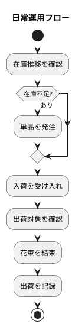

# 運用要件 - フレール・メモワール WEB ショップ

## 運用フロー

## 監視設計

| 監視対象 | 監視項目 | 閾値 | 通知先 |
| :--- | :--- | :--- | :--- |
| アプリケーション | レスポンスタイム | 500ms 超 | 開発者 |
| アプリケーション | エラー率 | 1% 超 | 開発者 |
| データベース | 接続数 | 80% 超 | 開発者 |
| データベース | ディスク使用率 | 80% 超 | 開発者 |
| ビジネス | 品質維持期限切れ在庫 | 毎日チェック | スタッフ |

## バックアップ

| 対象 | 方式 | 頻度 | 保持期間 |
| :--- | :--- | :--- | :--- |
| データベース | pg_dump | 日次（深夜 3:00） | 30 日 |
| アプリケーションログ | ファイルローテーション | 日次 | 90 日 |

## 障害対応

| レベル | 事象 | 対応 | 目標復旧時間 |
| :--- | :--- | :--- | :--- |
| 重大 | システム全体停止 | 開発者による即時対応 | 4 時間 |
| 高 | 受注機能停止 | 開発者による対応 | 8 時間 |
| 中 | 管理画面の一部機能停止 | 翌営業日対応 | 24 時間 |
| 低 | 表示崩れ等の軽微な不具合 | 次回リリースで対応 | 1 週間 |

## 変更管理

| 変更種別 | 手順 | 承認 |
| :--- | :--- | :--- |
| マスタデータ変更（商品・単品） | 管理画面から操作 | スタッフ |
| アプリケーション更新 | CI/CD パイプライン経由 | 開発者 |
| データベーススキーマ変更 | マイグレーションスクリプト | 開発者 |
| インフラ変更 | IaC（Docker Compose 更新） | 開発者 |

## 定期タスク

| タスク | 頻度 | 担当 |
| :--- | :--- | :--- |
| 品質維持期限切れ在庫の廃棄処理 | 日次 | スタッフ |
| データベースバックアップ確認 | 週次 | 開発者 |
| ログ確認・エラー傾向分析 | 週次 | 開発者 |
| セキュリティパッチ適用 | 月次 | 開発者 |
