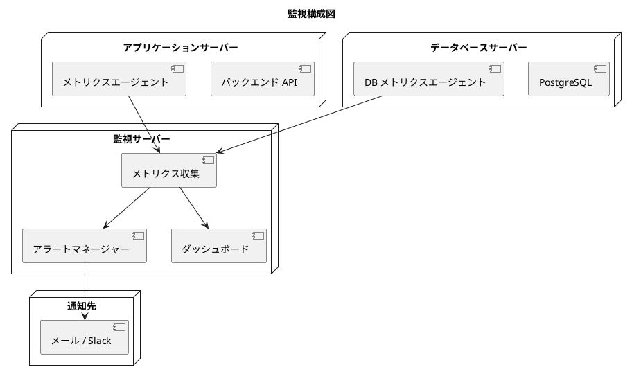
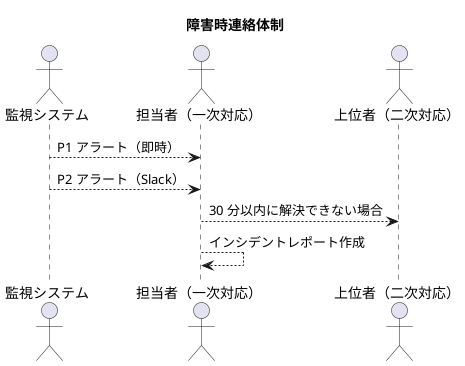
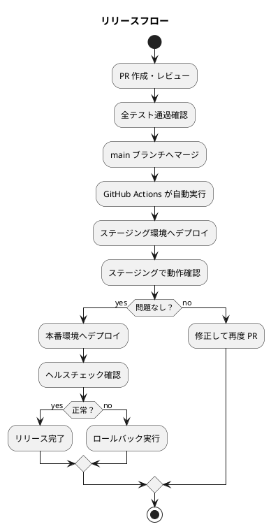

# 運用要件定義 - フレール・メモワール WEB ショップシステム

## 運用フロー設計

### 日次運用

| 作業 | 方式 | 時刻 | 担当 |
| :--- | :--- | :--- | :--- |
| ヘルスチェック確認 | 自動（監視ツール） | 常時 | 自動 |
| ログローテーション | 自動（logrotate） | 0:00 | 自動 |
| DB バックアップ | 自動（スクリプト） | 2:00 | 自動 |
| 在庫推移の確認 | 手動 | 業務開始時 | 仕入スタッフ |
| 出荷対象の確認 | 手動 | 業務開始時 | 受注スタッフ |

### 月次運用

| 作業 | 方式 | タイミング | 担当 |
| :--- | :--- | :--- | :--- |
| セキュリティパッチ適用 | 手動（変更管理フロー） | 月初 | 担当者 |
| ディスク使用量確認 | 自動レポート | 月末 | 担当者 |
| バックアップリストアテスト | 手動 | 月 1 回 | 担当者 |
| アクセスログ分析 | 手動 | 月末 | 担当者 |

### 年次運用

| 作業 | タイミング | 担当 |
| :--- | :--- | :--- |
| DR（障害復旧）訓練 | 年 1 回 | 担当者 |
| SSL 証明書更新 | 有効期限 30 日前 | 担当者 |
| 依存ライブラリの棚卸し | 年 1 回 | 開発者 |

## 監視設計

### 監視構成



### 監視項目と閾値

| 監視対象 | 指標 | 警告（P2） | 緊急（P1） | 確認間隔 |
| :--- | :--- | :--- | :--- | :--- |
| API レスポンスタイム | p95 | > 1s | > 3s | 1 分 |
| エラーレート | 5xx 率 | > 1% | > 5% | 1 分 |
| CPU 使用率 | 使用率 | > 70% | > 90% | 1 分 |
| メモリ使用率 | 使用率 | > 80% | > 95% | 1 分 |
| ディスク使用率 | 使用率 | > 70% | > 90% | 5 分 |
| DB 接続数 | 使用率 | > 70% | > 90% | 1 分 |
| ヘルスチェック | HTTP 200 | - | 失敗 | 30 秒 |

### エスカレーションフロー

```plantuml
@startuml

title アラートエスカレーションフロー

start
:アラート検知;

if (重要度？) then (P1: 緊急)
  :担当者へ即時通知（電話 / Slack）;
  :30 分以内に対応開始;
  if (30 分以内に対応開始できたか？) then (no)
    :上位者へエスカレーション;
  endif
else (P2: 警告)
  :担当者へ Slack 通知;
  :4 時間以内に確認;
else (P3: 情報)
  :ログ記録のみ;
  :翌営業日に確認;
endif

stop

@enduml
```

## バックアップ設計

### バックアップ方針

| 対象 | 方式 | 頻度 | 保持期間 | 保存先 |
| :--- | :--- | :--- | :--- | :--- |
| DB（フルバックアップ） | pg_dump | 毎日 2:00 | 30 日 | オブジェクトストレージ |
| DB（WAL アーカイブ） | PostgreSQL WAL | 継続的 | 7 日 | オブジェクトストレージ |
| アプリケーションログ | ファイルコピー | 毎日 | 90 日 | オブジェクトストレージ |
| 監査ログ | ファイルコピー | 毎日 | 1 年 | オブジェクトストレージ |

### リストア手順

**DB リストア手順（RTO: 4 時間以内）:**

1. バックアップファイルをオブジェクトストレージから取得する
2. PostgreSQL を停止する
3. `pg_restore` でバックアップを復元する
4. WAL アーカイブを適用して RPO 時点まで復旧する
5. アプリケーションを再起動してヘルスチェックを確認する

**リストアテスト:** 月 1 回、ステージング環境で実施する

## 障害対応設計

### 障害パターンと復旧手順

#### パターン 1: API サーバー障害

| 手順 | 内容 |
| :--- | :--- |
| 1. 検知 | ヘルスチェック失敗アラート |
| 2. 確認 | ログを確認してエラー原因を特定 |
| 3. 復旧 | コンテナ再起動（`docker restart backend`） |
| 4. 確認 | ヘルスチェック成功を確認 |
| 5. 報告 | インシデントレポートを作成 |

目標復旧時間: 30 分以内

#### パターン 2: DB 障害

| 手順 | 内容 |
| :--- | :--- |
| 1. 検知 | DB 接続エラーアラート |
| 2. 確認 | PostgreSQL ログを確認 |
| 3. 復旧（軽微） | PostgreSQL 再起動 |
| 3. 復旧（深刻） | バックアップからリストア |
| 4. 確認 | データ整合性を確認 |
| 5. 報告 | インシデントレポートを作成 |

目標復旧時間: 4 時間以内

#### パターン 3: ディスク容量不足

| 手順 | 内容 |
| :--- | :--- |
| 1. 検知 | ディスク使用率 70% 警告アラート |
| 2. 確認 | 大容量ファイルを特定（ログ等） |
| 3. 対処 | 古いログを削除 / ディスク拡張 |
| 4. 確認 | 使用率が正常範囲に戻ったことを確認 |

### 連絡体制



## 変更管理設計

### リリース手順



### ロールバック手順

**アプリケーションのロールバック:**

1. GitHub Actions で前バージョンのイメージタグを指定して再デプロイする
2. ヘルスチェックが成功することを確認する
3. 目標時間: 15 分以内

**DB マイグレーションのロールバック:**

1. `prisma migrate` のダウンマイグレーションを実行する
2. データ整合性を確認する
3. 注意: データ削除を伴うマイグレーションは事前にバックアップを取得する

### 変更承認フロー

| 変更種別 | 承認者 | 実施タイミング |
| :--- | :--- | :--- |
| 機能追加・バグ修正 | PR レビュー承認 | 随時（営業時間内） |
| DB スキーマ変更 | PR レビュー承認 + 事前バックアップ | 深夜メンテナンス時間帯 |
| インフラ変更 | 担当者承認 | 深夜メンテナンス時間帯 |
| 緊急パッチ | 事後報告可 | 随時 |

### デプロイ禁止期間

| 期間 | 理由 |
| :--- | :--- |
| 記念日シーズン（バレンタイン・母の日等）前後 3 日 | 受注ピーク期間 |
| 年末年始（12/28〜1/4） | 受注ピーク期間 |
