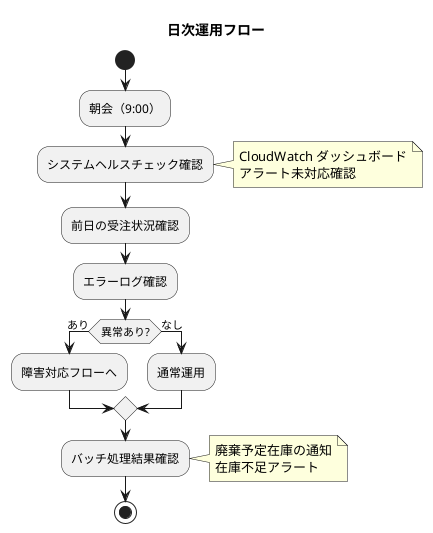
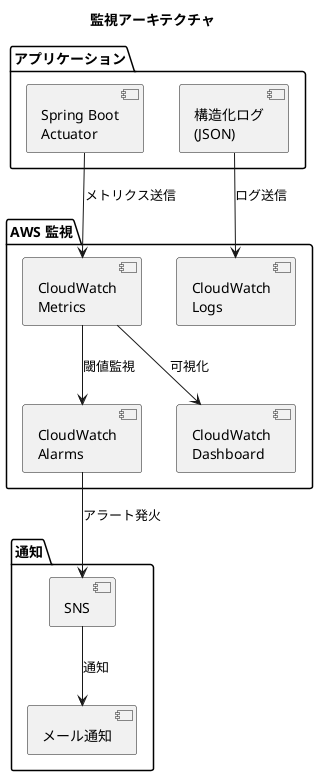
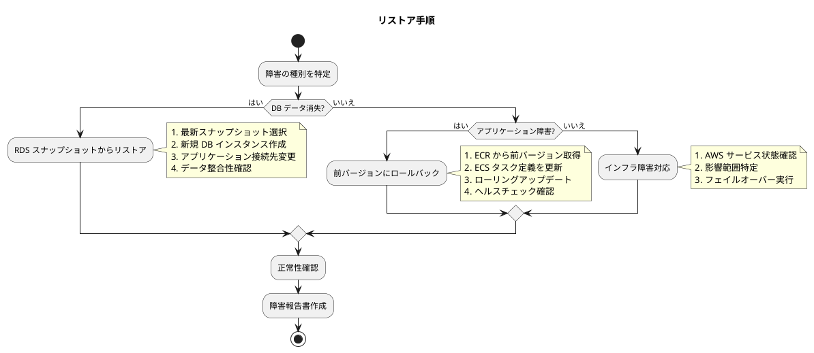
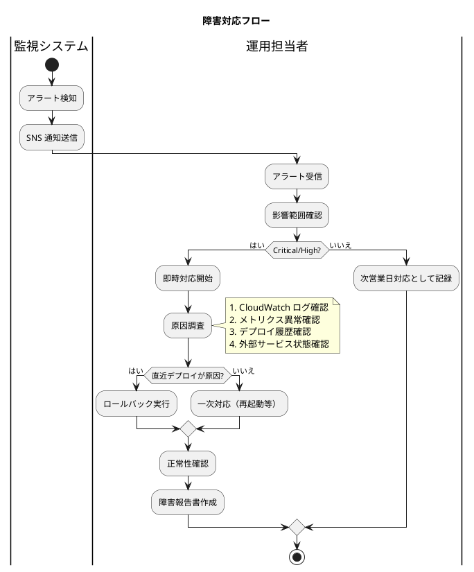
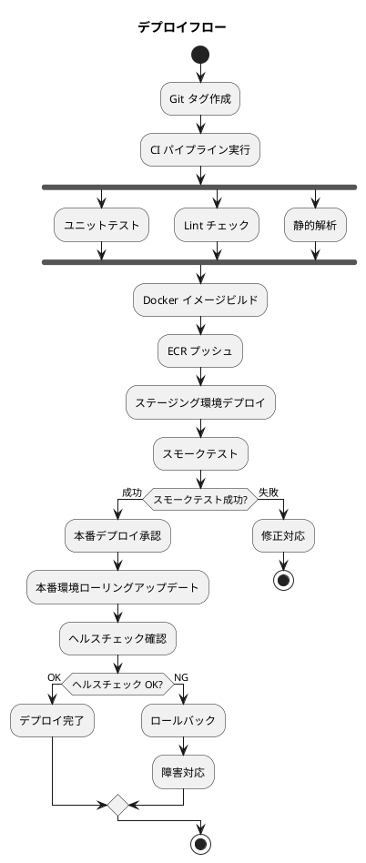

# 運用要件定義 - フレール・メモワール WEB ショップシステム

## 概要

本ドキュメントは、フレール・メモワール WEB ショップシステムの運用要件を定義します。小規模 WEB ショップの運用コスト・体制に見合った、現実的かつ必要十分な運用設計を行います。

### 前提条件

| 項目 | 内容 |
|:---|:---|
| 運用体制 | 1〜2 名（兼任） |
| 営業時間 | 9:00〜18:00（月〜土） |
| システム稼働 | 24 時間（注文受付は常時） |
| インフラ | AWS ECS Fargate / RDS PostgreSQL / S3 / CloudWatch |
| RTO | 4 時間以内 |
| RPO | 1 時間以内 |

## 運用フロー

### 日次運用



### 日次運用チェックリスト

| 時刻 | チェック項目 | 確認方法 |
|:---|:---|:---|
| 9:00 | システムヘルスチェック | CloudWatch ダッシュボード |
| 9:00 | 未対応アラート確認 | SNS 通知メール確認 |
| 9:15 | 前日エラーログ確認 | CloudWatch Logs Insights |
| 9:15 | 前日受注件数確認 | 管理画面 |
| 17:00 | 当日の受注処理状況確認 | 管理画面 |
| 17:00 | 在庫アラート確認 | 在庫推移画面 |

### 週次運用

| 項目 | 内容 | 実施日 |
|:---|:---|:---|
| パフォーマンスレビュー | レスポンスタイム、CPU/メモリ使用率の週次推移確認 | 月曜 |
| セキュリティアップデート確認 | 依存ライブラリの脆弱性情報確認 | 月曜 |
| RDS 手動スナップショット | 週次バックアップの取得 | 日曜深夜（自動） |
| ログローテーション確認 | CloudWatch Logs の保持期間確認 | 月曜 |

### 月次運用

| 項目 | 内容 | 実施日 |
|:---|:---|:---|
| コスト確認 | AWS Cost Explorer で月次コスト確認 | 月初 |
| セキュリティパッチ適用 | OS・ミドルウェアのセキュリティパッチ | 月次メンテナンス窓 |
| バックアップリストアテスト | RDS スナップショットからのリストア検証 | 四半期に 1 回 |
| キャパシティ確認 | ディスク使用量、DB 接続数の推移確認 | 月初 |

## 監視設計

### 監視アーキテクチャ



### 監視メトリクス

#### インフラメトリクス

| メトリクス | 閾値（Warning） | 閾値（Critical） | 対応 |
|:---|:---|:---|:---|
| CPU 使用率 | 70% | 90% | スケールアウト検討 |
| メモリ使用率 | 70% | 90% | タスクサイズ見直し |
| ディスク使用率 | 70% | 85% | ストレージ拡張 |
| DB コネクション数 | 80% of max | 90% of max | コネクションプール設定見直し |

#### アプリケーションメトリクス

| メトリクス | 閾値（Warning） | 閾値（Critical） | 対応 |
|:---|:---|:---|:---|
| API レスポンスタイム（p95） | 1 秒 | 3 秒 | ボトルネック調査 |
| エラー率（5xx） | 1% | 5% | 障害対応フロー発動 |
| ヘルスチェック失敗 | 1 回 | 3 回連続 | タスク再起動確認 |
| 受注処理遅延 | 5 分 | 15 分 | 処理状況確認 |

#### ビジネスメトリクス

| メトリクス | 目的 | 確認頻度 |
|:---|:---|:---|
| 日次受注件数 | 事業状況把握 | 日次 |
| 在庫不足アラート件数 | 発注判断支援 | 日次 |
| 廃棄予定在庫数 | 損失最小化 | 日次 |
| ログイン失敗回数 | セキュリティ監視 | 日次 |

### ログ管理

| ログ種別 | 出力先 | 保持期間 | フォーマット |
|:---|:---|:---|:---|
| アプリケーションログ | CloudWatch Logs | 30 日 | JSON（構造化ログ） |
| アクセスログ | CloudWatch Logs | 30 日 | CLF |
| エラーログ | CloudWatch Logs | 90 日 | JSON |
| 監査ログ（認証） | CloudWatch Logs | 90 日 | JSON |
| ALB アクセスログ | S3 | 90 日 | ALB 標準フォーマット |

#### ログフォーマット（アプリケーション）

```json
{
  "timestamp": "2026-03-20T09:00:00.000Z",
  "level": "INFO",
  "requestId": "uuid",
  "userId": "user-id",
  "action": "ORDER_CREATED",
  "message": "受注が作成されました",
  "metadata": {
    "orderId": "order-123",
    "productId": "product-456"
  }
}
```

## バックアップ・リストア

### バックアップ方針

| 対象 | 方式 | 頻度 | 保持期間 |
|:---|:---|:---|:---|
| RDS（自動バックアップ） | AWS 自動バックアップ | 日次 | 7 日間 |
| RDS（手動スナップショット） | 手動スナップショット | 週次 | 30 日間 |
| S3（静的アセット） | バージョニング有効 | リアルタイム | 30 日間 |
| アプリケーション設定 | Git リポジトリ | コミット毎 | 無期限 |

### リストア手順



### RPO/RTO 達成方法

| 指標 | 目標 | 達成方法 |
|:---|:---|:---|
| RPO（1 時間） | データ損失を 1 時間以内に抑える | RDS 自動バックアップ（日次） + ポイントインタイムリカバリ |
| RTO（4 時間） | 4 時間以内にサービス復旧 | スナップショットからの DB 復旧 + ECS タスク再デプロイ |

## 障害対応

### 障害レベル定義

| レベル | 定義 | 対応開始 | 復旧目標 |
|:---|:---|:---|:---|
| Critical | サービス全停止 | 即時 | 4 時間以内 |
| High | 主要機能が利用不可（注文不可等） | 30 分以内 | 8 時間以内 |
| Medium | 一部機能の性能低下 | 営業時間内 | 翌営業日 |
| Low | 軽微な UI 不具合等 | 次回リリースで対応 | 次回リリース |

### 障害対応フロー



### エスカレーション

| レベル | エスカレーション先 | 手段 |
|:---|:---|:---|
| Critical | プロジェクトオーナー | 電話 |
| High | 開発チーム | メール + チャット |
| Medium | 開発チーム | チャット |
| Low | 次回スプリントのバックログ | Issue 登録 |

## 変更管理

### デプロイメント管理

| 項目 | 方針 |
|:---|:---|
| デプロイ方式 | ECS ローリングアップデート |
| デプロイ頻度 | 週 1〜2 回（イテレーション完了時） |
| デプロイ窓 | 平日 10:00〜16:00（営業時間内） |
| ロールバック | 前バージョンの ECS タスク定義に切り戻し |

### デプロイ手順



### メンテナンスウィンドウ

| 種別 | 時間帯 | 頻度 | 事前通知 |
|:---|:---|:---|:---|
| 定期メンテナンス | 日曜 2:00〜6:00 | 月次 | 3 日前 |
| 緊急メンテナンス | 随時 | 必要時 | 可能な限り事前通知 |
| RDS メンテナンス | 日曜 3:00〜4:00 | AWS 指定 | AWS 通知に準拠 |

## セキュリティ運用

### セキュリティ監視

| 項目 | 方法 | 頻度 |
|:---|:---|:---|
| ログイン失敗監視 | CloudWatch Logs フィルター | リアルタイム |
| 依存ライブラリ脆弱性 | OWASP Dependency Check / Dependabot | 週次（CI） |
| AWS セキュリティ | AWS Security Hub | 日次 |
| アクセスパターン異常 | CloudWatch Anomaly Detection | リアルタイム |

### インシデント対応

1. **検知**: 監視ツールまたはユーザー報告
2. **分類**: 障害レベルに基づく影響度評価
3. **封じ込め**: 影響拡大の防止（アカウントロック、機能停止等）
4. **根本原因分析**: ログ・メトリクスに基づく原因特定
5. **復旧**: 修正適用またはロールバック
6. **振り返り**: インシデント報告書作成、再発防止策検討

## 災害復旧（DR）

### DR 戦略

**バックアップ & リストア方式**（コスト優先）

| 項目 | 内容 |
|:---|:---|
| DR 戦略 | バックアップ & リストア |
| DR サイト | 同一リージョン内の別 AZ（マルチ AZ 構成） |
| RTO | 4 時間 |
| RPO | 1 時間 |
| 切り替え方法 | RDS フェイルオーバー + ECS タスク再起動 |

### 想定障害シナリオ

| シナリオ | 影響 | 対応 |
|:---|:---|:---|
| 単一 AZ 障害 | 一部タスク停止 | ALB が正常 AZ へ自動振り分け |
| RDS 障害 | DB アクセス不可 | マルチ AZ フェイルオーバー（自動） |
| ECS タスク異常 | アプリケーション停止 | ECS が自動再起動 |
| リージョン障害 | 全サービス停止 | バックアップからの手動復旧（RTO: 24 時間） |

---

## 記入履歴

| 日付 | 更新内容 |
|------|----------|
| 2026-03-20 | 初版作成 |
