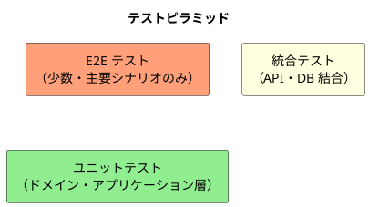
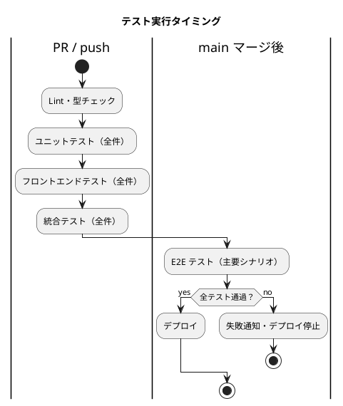

# テスト戦略 - フレール・メモワール WEB ショップシステム

## テスト形状の選択

### 選定結果: ピラミッド型

**選定理由:**

- レイヤードアーキテクチャを採用しており、ドメイン層（在庫推移計算・受注引当）にビジネスロジックが集中している
- 小規模チームのため、実行速度が速くメンテナンスコストの低いユニットテストを土台にする
- E2E テストは主要シナリオのみに絞り、実行時間を抑制する

### テスト比率目標

| テストレベル | 比率 | 実行時間目標 |
| :--- | :--- | :--- |
| ユニットテスト | 70% | < 30 秒 |
| 統合テスト | 20% | < 2 分 |
| E2E テスト | 10% | < 5 分 |

## テストレベル定義

### ユニットテスト

**対象:** ドメイン層・アプリケーション層の単一クラス/関数

**検証内容:**

- エンティティの不変条件（届け日バリデーション、ステータス遷移）
- 値オブジェクトのバリデーション（DeliveryDate、Money、Quantity 等）
- ドメインサービスのロジック（StockTransitionService の在庫推移計算）
- ユースケース（Service）の正常系・異常系

**方針:**

- 外部依存（DB、外部 API）はモック/スタブで置き換える
- TDD（Red → Green → Refactor）サイクルで実装する
- 1 テスト = 1 振る舞いを検証する

**ツール:** Vitest

### 統合テスト

**対象:** API エンドポイント + DB の結合

**検証内容:**

- REST API のリクエスト/レスポンス形式
- DB への正しいデータ永続化
- トランザクション整合性（受注登録時の在庫引当）
- エラーレスポンスの形式

**方針:**

- テスト用 DB（PostgreSQL）を使用する
- 各テスト前後でデータをリセットする
- API クライアントから HTTP リクエストを送信して検証する

**ツール:** Vitest + Supertest + Prisma（テスト DB）

### E2E テスト

**対象:** 主要ユーザーシナリオ

**検証内容（主要シナリオのみ）:**

- 花束を注文する（正常系）
- 在庫不足時に注文できないこと（異常系）
- 届け日を変更する（正常系）
- 出荷を登録する（正常系）

**方針:**

- CI/CD の最終ステージで実行する
- 失敗時はスクリーンショットを保存する
- フレイキーテストは即座に修正または削除する

**ツール:** Playwright

### フロントエンドテスト

**対象:** React コンポーネント

**検証内容:**

- コンポーネントのレンダリング（正常系・エラー状態・ローディング状態）
- ユーザー操作（フォーム入力・ボタンクリック）
- API レスポンスに応じた表示切り替え

**ツール:** Vitest + Testing Library

## カバレッジ目標

| 対象 | カバレッジ目標 | 測定ツール |
| :--- | :--- | :--- |
| ドメイン層（Entity / ValueObject / DomainService） | 90% 以上 | Vitest Coverage (c8) |
| アプリケーション層（Service / UseCase） | 80% 以上 | Vitest Coverage (c8) |
| インフラ層（Repository） | 統合テストで担保 | - |
| フロントエンド（コンポーネント） | 70% 以上 | Vitest Coverage (c8) |

## ユーザーストーリーとテストのマッピング

| US | ユーザーストーリー | ユニット | 統合 | E2E |
| :--- | :--- | :--- | :--- | :--- |
| US-01 | 商品一覧を見る | - | GET /api/products | - |
| US-02 | 花束を注文する | Order 集約、OrderAllocationService | POST /api/orders | ✓ |
| US-03 | 過去の届け先をコピーする | - | GET /api/customers/:id/addresses | - |
| US-04 | 届け日を変更する | Order.changeDeliveryDate() | PUT /api/orders/:id/delivery-date | ✓ |
| US-05 | 受注一覧を確認する | - | GET /api/orders | - |
| US-06 | 受注詳細を確認する | - | GET /api/orders/:id | - |
| US-07 | 在庫推移を確認する | StockTransitionService | GET /api/stock/transitions | - |
| US-08 | 仕入先に発注する | PurchaseOrder 集約 | POST /api/purchase-orders | - |
| US-09 | 入荷を登録する | PurchaseOrder.arrive() | POST /api/arrivals | - |
| US-10 | 出荷対象を確認する | - | GET /api/shipments/targets | - |
| US-11 | 出荷を登録する | Order.ship() | POST /api/shipments | ✓ |
| US-12 | 商品マスタを管理する | Product 集約 | POST/PUT /api/products | - |
| US-13 | 単品マスタを管理する | Item 集約 | POST/PUT /api/items | - |
| US-14 | 得意先を管理する | Customer 集約 | POST/PUT /api/customers | - |

## CI/CD との連携

### テスト失敗時の方針

| テストレベル | 失敗時の対応 |
| :--- | :--- |
| ユニットテスト | PR マージ不可。即座に修正する |
| 統合テスト | PR マージ不可。即座に修正する |
| E2E テスト | デプロイ停止。原因を調査して修正する |

## TDD 実践方針

XP のプラクティスに従い、TDD サイクルで開発する。

1. **Red** — 失敗するテストを先に書く（ユーザーストーリーの受入条件から導出）
2. **Green** — テストが通る最小限の実装をする
3. **Refactor** — テストを維持しながらコードを改善する

**優先順位:**

- ドメイン層から実装を始める（Outside-In ではなく Inside-Out）
- 在庫推移計算・受注引当など複雑なロジックは必ず TDD で実装する
- 単純な CRUD は統合テストで担保し、ユニットテストは省略可
