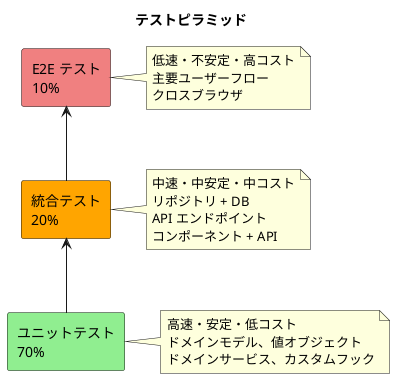
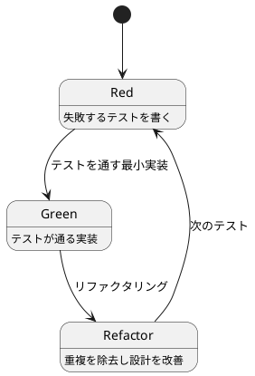
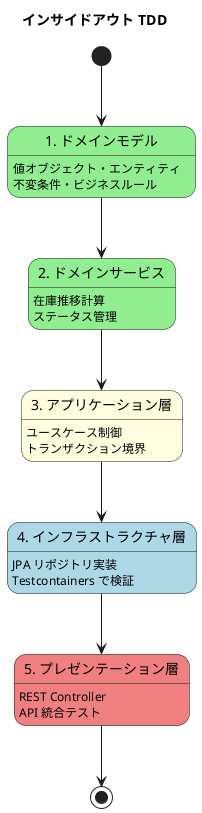
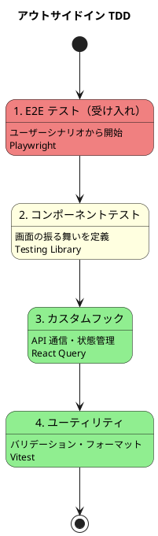
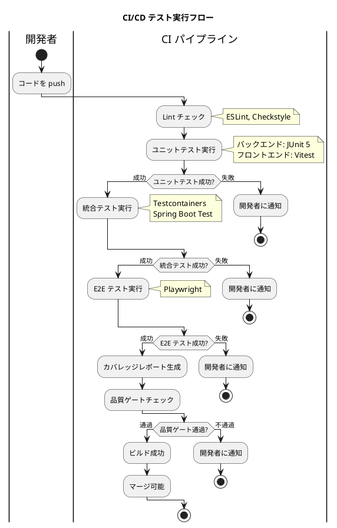

# テスト戦略 - フレール・メモワール WEB ショップシステム

## 概要

本ドキュメントは、フレール・メモワール WEB ショップシステムのテスト戦略を定義します。ドメインモデルパターン + ポートとアダプター（ヘキサゴナルアーキテクチャ）を採用しているため、**ピラミッド形テスト**を基本戦略とします。

### テスト戦略の目的

- **安全な変更**: 既存機能を破壊せず新機能を追加できる
- **設計の改善**: テスタブルなコードは良い設計の指標
- **実行可能な仕様書**: テストコードがシステムの振る舞いを文書化する
- **品質の保証**: バグの早期発見と予防

### 対象アーキテクチャ

| 項目 | 内容 |
|:---|:---|
| バックエンド | Java Spring Boot / ドメインモデルパターン / ヘキサゴナルアーキテクチャ |
| フロントエンド | React SPA / TypeScript / Container-Presentational パターン |
| インフラ | AWS ECS Fargate / RDS PostgreSQL |

## テストピラミッド設計

### ピラミッド形テスト

ドメインモデルパターンでは、ビジネスロジックがドメイン層に集約されるため、ユニットテストで多くのロジックを高速に検証できます。ピラミッド形テストが最も適しています。



### テスト比率と理由

| テスト種別 | 比率 | 理由 |
|:---|:---|:---|
| ユニットテスト | 70% | ドメインモデルに集約されたビジネスロジックを高速に検証。在庫推移計算・受注状態遷移・品質維持日数管理など |
| 統合テスト | 20% | リポジトリ実装の正確性、API レスポンスの整合性、コンポーネント間の連携を検証 |
| E2E テスト | 10% | 注文フロー・受注管理など主要ユーザーシナリオの端到端検証 |

## テスト種別定義

### バックエンドテスト

#### ユニットテスト

| 項目 | 内容 |
|:---|:---|
| スコープ | ドメインモデル、値オブジェクト、ドメインサービス、アプリケーションサービス |
| ツール | JUnit 5, Mockito, AssertJ |
| 実行タイミング | コード変更時（TDD サイクル内）、CI パイプライン |
| 実行時間目標 | 全体 30 秒以内 |

**テスト対象例**:

- 受注エンティティの状態遷移（注文受付 → 受付済み → 出荷準備中 → 出荷済み）
- 在庫推移計算サービス（`日別在庫予定数 = 前日在庫 + 当日入荷予定 - 当日受注引当 - 当日廃棄予定`）
- 品質維持日数に基づく廃棄予定計算
- 値オブジェクトの不変条件（価格の正値、届け日の範囲 翌日〜30 日後）
- 花束構成の整合性（単品と数量の組合せ）

```java
@Test
void 受注ステータスを受付済みに更新できる() {
    // Given
    Order order = Order.create(customerId, productId, deliveryDate, destination);
    assertThat(order.getStatus()).isEqualTo(OrderStatus.ORDER_RECEIVED);

    // When
    order.accept();

    // Then
    assertThat(order.getStatus()).isEqualTo(OrderStatus.ACCEPTED);
}

@Test
void 出荷準備中以降の受注はキャンセルできない() {
    // Given
    Order order = createShippingPreparationOrder();

    // When & Then
    assertThatThrownBy(() -> order.cancel())
        .isInstanceOf(IllegalOrderStateException.class);
}
```

#### 統合テスト

| 項目 | 内容 |
|:---|:---|
| スコープ | リポジトリ実装 + DB、ユースケース + 外部依存、API エンドポイント |
| ツール | JUnit 5, Spring Boot Test, Testcontainers（PostgreSQL） |
| 実行タイミング | CI パイプライン、プルリクエスト作成時 |
| 実行時間目標 | 全体 3 分以内 |

**テスト対象例**:

- JPA リポジトリの CRUD 操作
- トランザクション境界の正確性
- REST API エンドポイントのリクエスト/レスポンス検証
- 認証フィルター（JWT 検証）

```java
@SpringBootTest
@Testcontainers
class OrderRepositoryIntegrationTest {

    @Container
    static PostgreSQLContainer<?> postgres =
        new PostgreSQLContainer<>("postgres:15");

    @Autowired
    private OrderRepository orderRepository;

    @Test
    void 受注を保存して取得できる() {
        // Given
        Order order = Order.create(customerId, productId, deliveryDate, destination);

        // When
        orderRepository.save(order);
        Optional<Order> found = orderRepository.findById(order.getId());

        // Then
        assertThat(found).isPresent();
        assertThat(found.get().getStatus()).isEqualTo(OrderStatus.ORDER_RECEIVED);
    }
}
```

#### E2E テスト（API レベル）

| 項目 | 内容 |
|:---|:---|
| スコープ | API 統合テスト（認証 → 操作 → 結果確認） |
| ツール | Spring Boot Test, RestAssured |
| 実行タイミング | CI パイプライン（マージ前） |
| 実行時間目標 | 全体 5 分以内 |

### フロントエンドテスト

#### ユニットテスト

| 項目 | 内容 |
|:---|:---|
| スコープ | カスタムフック、ユーティリティ関数、型ガード |
| ツール | Vitest |
| 実行タイミング | コード変更時（TDD サイクル内）、CI パイプライン |
| 実行時間目標 | 全体 15 秒以内 |

**テスト対象例**:

- 日付バリデーション（届け日の範囲チェック）
- 金額フォーマット
- フィルター・ソートロジック

#### コンポーネントテスト

| 項目 | 内容 |
|:---|:---|
| スコープ | Presentational コンポーネント、Container コンポーネント |
| ツール | Vitest, React Testing Library |
| 実行タイミング | コード変更時、CI パイプライン |
| 実行時間目標 | 全体 30 秒以内 |

**テスト対象例**:

- 商品一覧の表示（データが正しくレンダリングされるか）
- 注文フォームのバリデーション表示
- ステータス更新ボタンの活性/非活性制御
- ロール別ナビゲーション表示

```typescript
describe('OrderListView', () => {
  it('受注一覧にステータスと商品名が表示される', () => {
    const orders = [
      { id: '1', status: '注文受付', productName: '春の花束', deliveryDate: '2026-04-01' },
    ];

    render(<OrderListView orders={orders} onSelect={vi.fn()} />);

    expect(screen.getByText('注文受付')).toBeInTheDocument();
    expect(screen.getByText('春の花束')).toBeInTheDocument();
  });
});
```

#### E2E テスト

| 項目 | 内容 |
|:---|:---|
| スコープ | 主要ユーザーフロー（ブラウザ操作） |
| ツール | Playwright |
| 実行タイミング | CI パイプライン（マージ前）、リリース前 |
| 実行時間目標 | 全体 10 分以内 |

**テスト対象シナリオ**:

| シナリオ | 概要 |
|:---|:---|
| 注文フロー | ログイン → 商品選択 → 注文入力 → 確認 → 完了 |
| 受注管理フロー | ログイン → 受注一覧 → 受注受付 → ステータス確認 |
| 在庫・発注フロー | ログイン → 在庫推移確認 → 発注 → 入荷登録 |

## TDD サイクル

### 基本サイクル



### TDD の 3 つの法則

1. **失敗する単体テストを書くまでプロダクションコードを書かない**
2. **コンパイルが通らない、または失敗する範囲を超えて単体テストを書かない**
3. **現在失敗している単体テストを通す以上にプロダクションコードを書かない**

### バックエンド: インサイドアウトアプローチ

ドメイン層（内側）からインフラストラクチャ層（外側）に向かって実装を進めます。



### フロントエンド: アウトサイドインアプローチ

ユーザーに近い画面（外側）からロジック（内側）に向かって実装を進めます。



## カバレッジ目標

### 目標値

| メトリクス | 目標値 | 測定ツール |
|:---|:---|:---|
| ラインカバレッジ | 80% 以上 | JaCoCo（バックエンド）、Istanbul/v8（フロントエンド） |
| ブランチカバレッジ | 70% 以上 | JaCoCo、Istanbul/v8 |
| ミューテーションスコア | 60% 以上 | PIT（バックエンド） |

### レイヤー別カバレッジ目標

| レイヤー | ラインカバレッジ目標 | 根拠 |
|:---|:---|:---|
| ドメイン層 | 90% 以上 | ビジネスロジックの中核。最も重要 |
| アプリケーション層 | 80% 以上 | ユースケースの網羅性を担保 |
| インフラストラクチャ層 | 70% 以上 | DB アクセスは統合テストで検証 |
| プレゼンテーション層 | 60% 以上 | Controller は薄く、統合テストで補完 |
| フロントエンド | 80% 以上 | コンポーネント + フックの動作を保証 |

### 除外対象

- 設定クラス（`@Configuration`）
- DTO / リクエスト・レスポンスクラス
- 自動生成コード
- main メソッド

## CI/CD 統合

### テスト実行パイプライン



### 品質ゲート

| ゲート項目 | 基準 | 失敗時の対応 |
|:---|:---|:---|
| ユニットテスト | 全件パス | マージブロック |
| 統合テスト | 全件パス | マージブロック |
| E2E テスト | 全件パス | マージブロック |
| ラインカバレッジ | 80% 以上 | マージブロック |
| ブランチカバレッジ | 70% 以上 | 警告 |
| Lint エラー | 0 件 | マージブロック |
| セキュリティスキャン | Critical/High 0 件 | マージブロック |

## テストデータ戦略

### テストデータの管理方針

| 種別 | 方針 | ツール |
|:---|:---|:---|
| ユニットテスト | テストコード内でファクトリメソッドを使用して生成 | テストフィクスチャ、Builder パターン |
| 統合テスト | テスト用 SQL スクリプトまたは Testcontainers で初期化 | Flyway、Testcontainers |
| E2E テスト | テスト用シードデータを API 経由で投入 | テストヘルパー |

### テストデータ例

| ドメイン | テストデータ |
|:---|:---|
| 商品 | 花束 3 種（春の花束、誕生日花束、お祝い花束） |
| 単品 | 花材 5 種（バラ、ガーベラ、カスミソウ、ユリ、チューリップ） |
| 得意先 | テスト顧客 2 名（通常顧客、リピーター） |
| 受注 | 各ステータスの受注データ（注文受付、受付済み、出荷準備中、出荷済み） |
| 在庫 | 初期在庫データ（品質維持日数別） |

## テストツール一覧

### バックエンド

| ツール | 用途 | バージョン |
|:---|:---|:---|
| JUnit 5 | テストフレームワーク | 5.10+ |
| Mockito | モックライブラリ | 5.x |
| AssertJ | アサーションライブラリ | 3.25+ |
| Testcontainers | DB 統合テスト用コンテナ | 1.19+ |
| JaCoCo | カバレッジ測定 | 0.8.11+ |
| PIT | ミューテーションテスト | 1.15+ |
| Spring Boot Test | Spring 統合テスト | 3.x |
| RestAssured | API テスト | 5.x |

### フロントエンド

| ツール | 用途 | バージョン |
|:---|:---|:---|
| Vitest | テストフレームワーク | 1.x |
| React Testing Library | コンポーネントテスト | 14.x |
| Playwright | E2E テスト | 1.40+ |
| MSW（Mock Service Worker） | API モック | 2.x |
| Istanbul/v8 | カバレッジ測定 | Vitest 内蔵 |

### 静的解析

| ツール | 用途 |
|:---|:---|
| ESLint | JavaScript/TypeScript Lint |
| Checkstyle | Java コーディング規約 |
| SonarQube | コード品質総合分析 |
| OWASP Dependency Check | 依存ライブラリ脆弱性チェック |

---

## 記入履歴

| 日付 | 更新内容 |
|------|----------|
| 2026-03-20 | 初版作成 |
