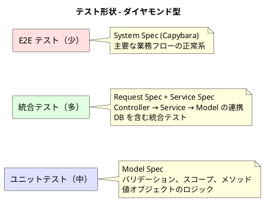
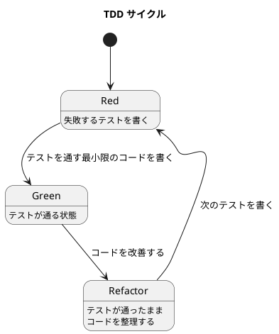
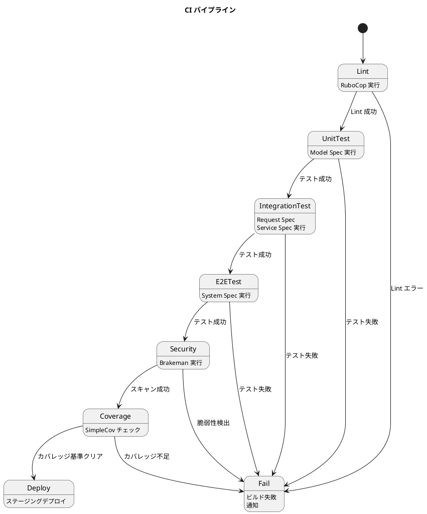

# テスト戦略

## テスト形状: ダイヤモンド型（統合テスト重視）

### 選定理由

| 判断基準 | 判定 | 根拠 |
|---------|------|------|
| アーキテクチャパターン | ActiveRecord | Model と DB が密結合。ユニットテスト単体では不十分 |
| ドメインの複雑さ | 中程度 | 在庫推移計算は複雑だが、大半は CRUD + ビジネスルール検証 |
| 外部連携 | なし | 外部 API 連携なし。DB のみ |
| チーム規模 | 小（1-2 名） | テストの実行速度とメンテナンスコストのバランスが重要 |

## テストレベル定義

### ユニットテスト（Model Spec）

| 項目 | 内容 |
|------|------|
| 対象 | ActiveRecord モデル、値オブジェクト（PORO） |
| 検証内容 | バリデーション、スコープ、インスタンスメソッド、状態遷移制約 |
| DB | 使用する（ActiveRecord パターンのため） |
| 外部依存 | なし |
| 実行速度 | 高速（1 テスト < 100ms） |

**テスト対象例**:

- `Order#shippable?` - 出荷可能判定
- `Order#cancel!` - 出荷済みの注文はキャンセル不可
- `Order#change_delivery_date` - 届け日変更
- `Item` - 品質維持日数・購入単位・リードタイムのバリデーション
- `Composition` - 数量の正値バリデーション
- `PurchaseOrder` - 発注数量が購入単位の整数倍

### 統合テスト（Request Spec + Service Spec）

| 項目 | 内容 |
|------|------|
| 対象 | Controller + Service Object + Model の連携 |
| 検証内容 | HTTP リクエスト/レスポンス、業務フロー、データ整合性 |
| DB | 使用する |
| 外部依存 | なし |
| 実行速度 | 中速（1 テスト < 500ms） |

**Service Spec テスト対象**:

| Service | 主要テストケース |
|---------|----------------|
| OrderService | 注文確定（受注作成）、キャンセル（引当解除） |
| StockForecastService | 日別在庫推移計算（品質維持日数考慮） |
| StockAllocationService | 在庫引当、引当解除 |
| ShippingService | 出荷処理（状態更新 + 在庫消費） |
| PurchaseOrderService | 発注確定（購入単位検証）、入荷処理（在庫作成） |

**Request Spec テスト対象**:

- 各 Controller の CRUD 操作
- 認証・認可（ロール別アクセス制御）
- バリデーションエラー時のレスポンス

### E2E テスト（System Spec）

| 項目 | 内容 |
|------|------|
| 対象 | 画面操作を通じた業務フロー全体 |
| 検証内容 | ユーザーストーリーの受け入れ基準 |
| DB | 使用する |
| ブラウザ | Headless Chrome |
| 実行速度 | 低速（1 テスト < 5s） |

**E2E テストシナリオ**:

| シナリオ | 対応ストーリー | 内容 |
|---------|--------------|------|
| 商品注文フロー | S04a, S04b | カタログ → 注文入力 → 確認 → 完了 |
| 届け先コピー | S06 | 過去の届け先を選択して注文 |
| 注文キャンセル | S14 | 注文履歴からキャンセル |
| 在庫推移確認 | S08 | 在庫推移画面の表示 |
| 発注・入荷フロー | S09, S10 | 発注 → 入荷受入 |
| 出荷フロー | S11, S12 | 出荷一覧 → 出荷処理 |

## カバレッジ目標

| テストレベル | ライン カバレッジ | ブランチ カバレッジ | 備考 |
|-------------|-----------------|-------------------|------|
| ユニットテスト | 80% 以上 | 70% 以上 | Model + 値オブジェクト |
| 統合テスト | 70% 以上 | 60% 以上 | Service + Controller |
| E2E テスト | - | - | 主要フローの正常系のみ |
| **全体** | **85% 以上** | **75% 以上** | simplecov で測定 |

## テストツール

| カテゴリ | ツール | 用途 |
|---------|--------|------|
| テストフレームワーク | RSpec | 全テストレベル |
| ブラウザテスト | Capybara + Selenium (Headless Chrome) | System Spec |
| テストデータ | FactoryBot | テストデータ生成 |
| DB クリーンアップ | DatabaseCleaner | テスト間のデータ初期化 |
| カバレッジ | SimpleCov | カバレッジ測定・レポート |
| Lint | RuboCop | コードスタイル・静的解析 |
| セキュリティ | Brakeman | Rails セキュリティスキャン |
| マッチャー | shoulda-matchers | バリデーション・関連のマッチャー |

## TDD サイクル

Red → Green → Refactor のサイクルに従う。

### バックエンド TDD（インサイドアウト）

1. Model Spec を書く（Red）
2. Model を実装する（Green）
3. リファクタリング（Refactor）
4. Service Spec を書く（Red）
5. Service を実装する（Green）
6. リファクタリング（Refactor）
7. Request Spec を書く（Red）
8. Controller を実装する（Green）
9. リファクタリング（Refactor）

### フロントエンド TDD（アウトサイドイン）

1. System Spec を書く（Red）
2. View + Controller を実装する（Green）
3. リファクタリング（Refactor）

## CI/CD 連携

| ステージ | 失敗時の振る舞い | 実行タイミング |
|---------|----------------|--------------|
| Lint | ビルド失敗。マージ不可 | 全 Push |
| ユニットテスト | ビルド失敗。マージ不可 | 全 Push |
| 統合テスト | ビルド失敗。マージ不可 | 全 Push |
| E2E テスト | ビルド失敗。マージ不可 | PR 作成時 + main マージ時 |
| セキュリティ | 警告表示。Critical は失敗 | 全 Push |
| カバレッジ | 基準未達で警告 | 全 Push |

## トレーサビリティ: ストーリー → テスト対応

| ストーリー | ユニットテスト | 統合テスト | E2E テスト |
|-----------|-------------|-----------|-----------|
| S01 商品登録 | Product Model Spec | Products Request Spec | - |
| S02 単品管理 | Item Model Spec | Items Request Spec | - |
| S03 花束構成 | Composition Model Spec | Compositions Request Spec | - |
| S04a 商品選択 | - | - | 商品注文フロー |
| S04b 注文確定 | Order Model Spec | OrderService Spec, Orders Request Spec | 商品注文フロー |
| S05 届け日変更 | Order#change_delivery_date | OrderService Spec | - |
| S06 届け先コピー | DeliveryAddress Model Spec | - | 届け先コピーフロー |
| S07 受注確認 | - | Orders Request Spec | - |
| S08 在庫推移 | - | StockForecastService Spec | 在庫推移確認フロー |
| S09 発注 | PurchaseOrder Model Spec | PurchaseOrderService Spec | 発注・入荷フロー |
| S10 入荷 | Arrival Model Spec | PurchaseOrderService Spec | 発注・入荷フロー |
| S11 出荷一覧 | - | Shipments Request Spec | 出荷フロー |
| S12 出荷処理 | - | ShippingService Spec | 出荷フロー |
| S13 得意先管理 | Customer Model Spec | Customers Request Spec | - |
| S14 キャンセル | Order#cancel! | OrderService Spec | キャンセルフロー |
