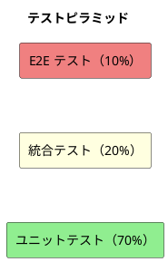
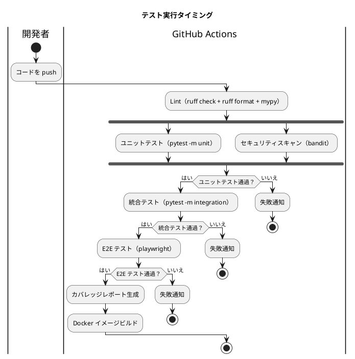

# テスト戦略 - フレール・メモワール WEB ショップシステム

## テスト形状の選択

### 選定結果: ピラミッド型（ユニット重視）



### 選定理由

- **アーキテクチャパターン**: 4 層レイヤード + ドメインモデルパターン。ドメイン層が厚く、ビジネスルール（在庫引当 FIFO、品質維持期限計算、届け日変更ルール等）が複雑
- **ドメイン層の独立性**: `domain/` ディレクトリに純粋な Python クラスとして分離されており、DB 接続なしで単体テスト可能
- **Repository インターフェース**: ABC で定義されており、インメモリ実装でテストダブルを注入可能
- **テスト実行速度**: ユニットテスト中心にすることで、TDD の Red-Green-Refactor サイクルを高速に回せる

## テストレベルの定義

### ユニットテスト（70%）

| 対象 | テスト内容 | モック対象 |
| :--- | :--- | :--- |
| 値オブジェクト | バリデーション、等価性、ビジネスルール | なし |
| エンティティ | 状態遷移、不変条件、ビジネスメソッド | なし |
| ドメインサービス | AllocationService（FIFO 引当）、StockForecastService | Repository（インメモリ実装） |
| アプリケーションサービス | ユースケースのオーケストレーション | Repository、外部サービス |

**値オブジェクトのテスト例**:

| 値オブジェクト | テストケース |
| :--- | :--- |
| ProductName | 0 文字(NG), 1 文字(OK), 100 文字(OK), 101 文字(NG) |
| Price | -1(NG), 0(OK), 1(OK) |
| QualityRetentionDays | 0(NG), 1(OK) |
| DeliveryDate | earliest-1(NG), earliest(OK), latest(OK), latest+1(NG) |
| Message | 200 文字(OK), 201 文字(NG) |
| ExpiryDate | arrived_at + retention_days - 1 の計算検証 |

**状態遷移のテスト**:

| エンティティ | 正常遷移 | 不正遷移（エラー） |
| :--- | :--- | :--- |
| OrderStatus | accepted→preparing→shipped, accepted→cancelled | preparing→accepted, shipped→cancelled |
| StockLotStatus | available→near_expiry→expired, available→depleted | expired→available, depleted→available |
| PurchaseOrderStatus | ordered→arrived, ordered→cancelled | arrived→ordered, cancelled→arrived |

### 統合テスト（20%）

| 対象 | テスト内容 | 使用ツール |
| :--- | :--- | :--- |
| API エンドポイント | REST API のリクエスト/レスポンス検証 | Django TestCase + DRF |
| DB アクセス | Repository 実装の CRUD 操作 | Django TransactionTestCase |
| トランザクション | 在庫引当の排他制御（SELECT FOR UPDATE） | TransactionTestCase + スレッド |
| 在庫推移 SQL | CTE クエリの結果と Python 実装の一致検証 | Django TestCase |

**排他制御テストシナリオ**:

```
Given 在庫ロット（バラ: 残 10 本）が存在する
When  2 つの受注（各 8 本）が同時に引当を要求する
Then  一方のみが成功し、他方は在庫不足エラーとなること
  And デッドロックが発生しないこと
```

### E2E テスト（10%）

| シナリオ | テスト内容 | 使用ツール |
| :--- | :--- | :--- |
| 注文フロー | 商品選択→届け日選択→届け先入力→注文確定 | Playwright |
| リピート注文 | 届け先コピー→注文確定 | Playwright |
| 管理画面 | 受注確認→出荷処理→通知 | Playwright |
| 在庫推移 | 在庫推移画面表示→発注登録 | Playwright |

## カバレッジ目標

| テストレベル | カバレッジ目標 | 測定対象 |
| :--- | :--- | :--- |
| ユニットテスト | 80% | ドメイン層（`domain/`）+ アプリケーション層（`services.py`） |
| 統合テスト | 60% | API エンドポイント + Repository 実装 |
| E2E テスト | 主要シナリオ 100% | 4 シナリオのパス |
| 全体 | 70% | 行カバレッジ（pytest-cov） |

## テストツール

| ツール | 用途 |
| :--- | :--- |
| pytest | テストフレームワーク |
| pytest-django | Django テスト統合 |
| pytest-cov | カバレッジ計測 |
| factory_boy | テストデータファクトリ |
| Ruff | リンター + フォーマッター（flake8, black, isort 統合） |
| mypy | 静的型チェック |
| tox | タスクランナー（テスト・Lint・型チェック一括実行） |
| Playwright | E2E テスト |
| axe-core | アクセシビリティテスト |
| bandit | セキュリティ静的解析 |

## テストデータ戦略

### Factory Boy によるテストデータ生成

依存チェーンが深い（最大 7 テーブル）ため、Factory Boy で各テーブルの Factory クラスを定義する。

| Factory | 生成対象 | 依存 |
| :--- | :--- | :--- |
| UserFactory | accounts_user | なし |
| CustomerFactory | customers_customer | UserFactory |
| SupplierFactory | products_supplier | なし |
| ItemFactory | products_item | SupplierFactory |
| ProductFactory | products_product | なし |
| CompositionFactory | products_composition | ProductFactory, ItemFactory |
| OrderFactory | orders_order | CustomerFactory, ProductFactory |
| StockLotFactory | inventory_stock_lot | ItemFactory |
| AllocationFactory | inventory_allocation | OrderFactory, StockLotFactory |

### ドメイン層のテストデータ

ドメイン層のユニットテストでは Factory Boy を使わず、エンティティの直接コンストラクトで済ませる。DB 接続不要。

## CI/CD 連携



| タイミング | 実行テスト | 失敗時 |
| :--- | :--- | :--- |
| ローカル（`uv run tox`） | Lint + 型チェック + ユニットテスト | 手動実行（push 前に推奨） |
| push（CI） | 全テスト（ユニット→統合→E2E） | PR マージ阻止 |
| デプロイ前 | E2E テスト（ステージング） | デプロイ阻止 |

## 日次バッチテスト

| バッチ | テストレベル | テスト内容 |
| :--- | :--- | :--- |
| 受注ステータス更新 | ユニット | 出荷日到来の受注のみステータス遷移すること |
| 品質維持期限チェック | ユニット | 残り 2 日以内のロットが near_expiry になること |
| 廃棄対象チェック | ユニット | 期限超過のロットが expired になること |
| 全バッチ共通 | 統合 | 冪等性の検証（2 回実行しても結果が同じ） |
| 全バッチ共通 | 統合 | 失敗時にメトリクスが記録されること |

## 負荷テスト

| 対象 | ツール | シナリオ | 目標 |
| :--- | :--- | :--- | :--- |
| 商品一覧 API | Locust | 同時 20 ユーザー、60 秒間 | p95 < 1 秒 |
| 注文確定 API | Locust | 同時 5 ユーザー、60 秒間 | p95 < 2 秒 |
| 在庫推移計算 | Locust | 同時 3 ユーザー、60 秒間 | p95 < 3 秒 |

- リリース前にステージング環境で実施
- 結果はレポートとして保存

## トレーサビリティ

| UC | ユーザーストーリー | テストレベル | テスト内容 |
| :--- | :--- | :--- | :--- |
| UC-001 | US-004, US-005 | ユニット: DeliveryDate, Price / 統合: POST /api/orders/ / E2E: 注文フロー | 届け日範囲、在庫引当、確認メール |
| UC-002 | US-006 | ユニット: DeliveryAddress / 統合: GET /api/delivery-addresses/ / E2E: リピート注文 | 届け先コピー、履歴参照 |
| UC-003 | US-013 | ユニット: OrderStatus遷移, DeliveryDate変更 / 統合: PATCH / E2E: - | 変更期限、在庫再引当 |
| UC-004 | US-014 | ユニット: OrderStatus遷移 / 統合: POST cancel / E2E: - | キャンセル期限、引当解除 |
| UC-007 | US-007 | ユニット: StockForecastService / 統合: SQL 結果一致 / E2E: 在庫推移画面 | 日別推移計算、品質期限アラート |
| UC-008 | US-008 | ユニット: PurchaseOrderStatus / 統合: POST /api/purchases/ | 発注登録、入荷予定反映 |
| UC-010 | US-001-003 | ユニット: ProductName, Composition / 統合: CRUD API | 商品・単品・構成の CRUD |
